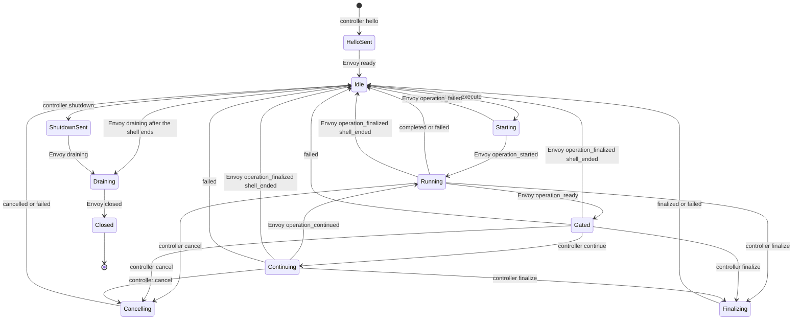

# OmegaFlow Envoy Protocol v1

## Status and scope

This document defines the first controller/workload contract for the
[OmegaFlow Workload Envoy](../future/omegaflow-envoy-design.md). The current
pre-release inspection amendment becomes frozen when the rebuilt design slice
is approved. It is an internal OmegaFlow release contract. Reploy provides the
private network, endpoint coordinates, bootstrap attachment, and authoritative
lifecycle; it does not transport or interpret these messages.

Version 1 covers:

- a full-duplex binary terminal channel;
- a bounded JSON Lines telemetry channel;
- the private NUL-framed Envoy-to-`awsh` descriptor protocol;
- bounded workload-side `file_exists` and `produces` inspection;
- state, ordering, resize, cancellation, shutdown, and failure rules;
- sender-stamped output marks carrying stream identity and timing;
- direct asciicast synthesis and exact raw-output retention; and
- the controlled Bash launch boundary.

It does not implement the Envoy process, PTY supervision, TCP listeners, runtime
mounting, or Reploy lifecycle integration. Delivery order is tracked in the
temporary [Reploy integration implementation
plan](../future/reploy-integration-implementation-plan.md).

## Implementation and build contract

The workload Envoy is a dependency-free Go executable:

- module: `github.com/omry/omegaflow/runtime/envoy`;
- minimum toolchain: Go 1.25.x, matching Reploy;
- supported targets: `linux/amd64` and `linux/arm64`;
- `CGO_ENABLED=0`;
- no third-party module dependencies;
- `-trimpath -buildvcs=false`; and
- linker flags `-s -w -buildid=`.

The eventual production command is built from `./cmd/omegaflow-envoy`. The
protocol-model slice does not add a placeholder command. Once the command
exists, the release build is equivalent to:

```text
CGO_ENABLED=0 GOOS=linux GOARCH=amd64 go build \
  -trimpath -buildvcs=false -ldflags='-s -w -buildid=' \
  -o omegaflow-envoy ./cmd/omegaflow-envoy
```

Release materialization records the source revision, Go version, target, file
size, and SHA-256 digest. Rebuilding the same source with the pinned Go patch
release and target must produce the same digest before the binary is added to
the runtime manifest.

## Connection establishment

The workload blueprint declares two lease-private TCP endpoints: terminal and
telemetry. The Envoy binds both listeners before starting Bash. It accepts one
connection on each listener and then closes both listeners.

The controller connects the terminal channel first and telemetry second. Its
first telemetry request is `hello`. The Envoy creates the PTY and persistent
Bash only after both connections and a valid `hello` exist. Its first event is
`ready`. Neither side sends another message before this exchange completes.

The channels have no application reconnect. EOF, reset, timeout, a second
connection, or traffic before the required handshake fails the capture.

## Global limits and timeouts

| Contract | Value |
| --- | ---: |
| Telemetry frame, including LF | 1,048,576 bytes |
| Private `awsh` frame | 1,048,576 bytes |
| Bash operation source | 1–786,432 UTF-8 bytes |
| Output-mark cadence | 10 milliseconds |
| Output marks per session | 1,000,000 |
| Session elapsed microseconds | 0 through `2^63-1` |
| Identifier | 1–64 ASCII identifier characters |
| Diagnostic message | 1–4,096 UTF-8 bytes |
| Reason | 1–256 UTF-8 bytes |
| Cwd | 1–4,096 UTF-8 bytes, absolute Linux path |
| Inspection specifications per operation | 0–64 |
| Inspection configured or resolved path | 1–4,096 UTF-8 bytes |
| Produced-output identifier | 1–64 ASCII identifier characters |
| Directory entries inspected per operation | 100,000 |
| Regular-file bytes hashed per operation | 16 GiB |
| Symlink target | 0–4,096 bytes |
| Sequence | 1 through `2^63-1` |
| Output offset | 0 through `2^63-1` |
| PID | 1 through `2^31-1` |
| Shell status | 0 through 255 |
| Terminal columns and rows | 1 through 1,000 |
| Connect deadline | 10 seconds |
| `hello`/`ready` deadline | 10 seconds |
| Individual control write | 5 seconds |
| Cancellation grace period | 5 seconds |
| Final drain | 5 seconds |

Operation duration is owned by the recording plan and is not a fixed Envoy
timeout. The controller converts an operation deadline into a typed `cancel`.

Every field limit is additionally constrained by the enclosing telemetry or
private-frame limit. Reaching an individual field maximum does not guarantee
that the field can be combined with every other maximum-sized field. Encoders
must validate the complete encoded frame before writing it, and receivers
reject an otherwise field-valid frame that exceeds its enclosing limit.

Identifiers match `[A-Za-z0-9][A-Za-z0-9._-]{0,63}`. Diagnostic codes match
`[a-z][a-z0-9-]{0,63}`. Strings reject NUL. Cwd values are lexical evidence
from Bash; the controller does not resolve them on its own filesystem.

## Terminal channel

The terminal connection is binary and full duplex:

- controller to Envoy: exact input bytes;
- Envoy to controller: exact post-line-discipline PTY-master bytes for an
  attached operation, or Envoy-ordered stdout/stderr pipe bytes for a
  split-stream operation.

It has no record framing, JSON, lifecycle messages, presentation markers, or
shell-status markers. `^C` is byte `0x03`. The terminal line discipline and
foreground process group give it normal terminal behavior. Resize travels on
telemetry because it is a structured PTY-master operation.

Because the channel carries no framing, it carries no operation identity either,
so the binding between input and operation is a contract rule rather than a
field. Every terminal byte the controller writes is authored against one
operation: there is no person at a keyboard, so there is no type-ahead the
recording must preserve. The Envoy therefore discards terminal input that
arrives while the session is idle, and when an operation ends it drains input
the line discipline has queued but the workload has not consumed. Input a gated
operation is still entitled to receive is unaffected, since such an operation
has not ended, and so is anything the workload already read.

Those two rules govern bytes the Envoy already holds, which is not enough on its
own: terminal and telemetry are separate connections and nothing orders one
against the other, so input written for an operation can still be in flight when
that operation's result is sent, and would arrive after the next one had already
started. `execute` therefore carries `input_through`, the running count of
terminal bytes the controller has written since the session began, and the Envoy
does not start the operation until its own terminal read count reaches that
value. Whatever arrives while it waits belongs to an operation that has ended
and is discarded under the rule above. The count is a barrier rather than
framing, so the channel stays exact bytes with no record structure, and it needs
no acknowledgement round trip because the controller is the only writer and the
Envoy the only reader.

The controller appends every received output byte to a private raw log before
using it anywhere else. A zero-based monotonically increasing offset is the
number of bytes durably appended. The raw log, not the asciicast, is canonical
for output ranges and diagnostics.

## Telemetry framing

Each telemetry message is one UTF-8 JSON object followed by one LF. Outgoing
frames use compact JSON and field order shown by the golden fixtures. Receivers
reject:

- missing LF, CRLF, embedded LF, NUL, or invalid UTF-8;
- invalid JSON, a non-object top level, duplicate fields, or non-finite numbers;
- unknown or missing fields;
- an unsupported `schema` or `type`;
- values outside the declared type or bounds; and
- frames over the byte limit, including an unterminated buffered frame.

Every message has `schema: "omegaflow-envoy-telemetry-v1"`, `type`, and a
positive `seq`. Controller and Envoy sequence spaces are independent, begin at
1, and increase by exactly one. A gap, duplicate, or regression is fatal.
Version 1 has no alternative-version offer: the `hello` schema selects v1 and
the `ready` schema confirms it. Any other schema fails the handshake instead of
being downgraded.

### Controller requests

| Type | Additional required fields |
| --- | --- |
| `hello` | `session_id` |
| `execute` | `operation_id`, `source`, `execution_shape`, `timing`, `publication`, `observation`, `inspections`, `input_through` |
| `continue` | `operation_id`, `gate_id` |
| `cancel` | `operation_id`, `reason` |
| `finalize` | `operation_id`, `reason` |
| `resize` | `columns`, `rows` |
| `shutdown` | `reason` |

Operation source is trusted recording-plan Bash source. It is delivered on the
private control path and is not typed into the PTY.

The compiled execution policy uses these closed enums:

- `execution_shape`: `pty` or `split`;
- `timing`: `realtime` or `presentation`;
- `publication`: `real`, `suppress`, or `replace`; and
- `observation`: `shared` or `exclusive`.

`input_through` is not part of that policy: it is the terminal-input barrier
defined under Terminal channel, and the Envoy holds the operation in its
starting state until its terminal read count reaches it.

Realtime timing requires PTY execution and real publication. Presentation
timing requires split execution and exclusive observation. Suppressed and
replaced output require exclusive observation.

Presentation timing needs the exclusive requirement because a surviving writer
and a compressed schedule cannot both be honoured. Late bytes from an earlier
unchecked `real` operation publish at their own mark times, an authored schedule
starts at the last committed absolute time, and the writer never rewinds, so a
background byte arriving twenty seconds in would force the buffered presentation
output to start no earlier than twenty seconds and expose exactly the duration
presentation timing exists to discard. Retiming those bytes onto the authored
schedule would falsify output that belongs to no operation, so the design
forbids the combination instead: exclusive observation already requires the
supervised writer set to be empty before the operation starts. Replacement text
and authored presentation delays stay controller-private and are not sent to the
Envoy.

`inspections` is an array, including when empty. Each entry is an exact object
with a unique `inspection_id`, a `kind`, and a configured `path`. `kind` is
`file_exists` or `produces`. A `file_exists` entry has no other fields. A
`produces` entry additionally requires `producer_id` and `output_id`; both are
identifiers. Paths are trusted recording-plan values, not shell output, but
remain bounded and reject NUL. An operation with inspections requires
`exclusive` observation so resolution and hashing run only after every tracked
descendant owned by that operation has been closed and reaped.

Controller OmegaFlow assigns inspection IDs deterministically in request order
as `inspection-1`, `inspection-2`, and so on. It retains that compilation map
with the operation. Results remain in request order and repeat the ID;
`produces` results additionally retain the authored producer and output IDs.

### Envoy events

| Type | Additional required fields |
| --- | --- |
| `ready` | `envoy_pid`, `shell_pid`, `cwd`, `columns`, `rows`, `elapsed_us` |
| `operation_started` | `operation_id`, `output_start` |
| `operation_ready` | `operation_id`, `gate_id`, `output_through` |
| `operation_continued` | `operation_id`, `gate_id`, `output_through` |
| `output_mark` | `offset`, `stream`, `elapsed_us` |
| `operation_completed` | `operation_id`, `status`, `cwd`, `output_start`, `output_through`, `inspection_results` |
| `operation_cancelled` | `operation_id`, `status`, `cwd`, `output_start`, `output_through`, `reason`; no inspection results |
| `operation_finalized` | `operation_id`, `cwd`, `output_start`, `output_through`, `reason`, `inspection_results`; no status |
| `operation_failed` | `operation_id`, `output_start`, `output_through`, `code`, `message`, `cwd` |
| `resize_applied` | `columns`, `rows`, `elapsed_us` |
| `diagnostic` | `severity`, `code`, `message`; optional `operation_id` |
| `draining` | `reason`, `output_through` |
| `closed` | `reason`, `output_through` |

Diagnostic severity is `info`, `warning`, `error`, or `fatal`. Codes are open
for forward-compatible diagnostics; code shape and message size remain bounded.
An unknown diagnostic code is retained, not reclassified as a protocol error.

`output_mark` attributes raw output to a logical stream and to sender time. It
is session-scoped rather than operation-scoped, because output can arrive
between operations. `offset` is the raw-log offset at which the attribution
begins, `stream` is `pty`, `stdout`, `stderr`, or `echo`, and `elapsed_us` is
the Envoy's monotonic microseconds since the session epoch established by
`ready`. A mark attributes every byte from its `offset` until the next mark's
`offset`.

`echo` covers the raw-log span produced by the Envoy's own write of authored
controller input. The workload owns its terminal modes, so an echo-disabled
termios reading taken before the write is a check-then-write race rather than
provenance for the bytes that follow. The Envoy therefore marks `echo`
immediately before each authored write and marks `pty` again only once two
things hold: the line discipline has processed the input, which is what places
any echo on the master's read side, and the Envoy has since drained the master
to empty. The second conjunct is what makes the span an output-side boundary. A
mark attributes raw-log offsets, so closing on input consumption alone would put
both marks at the same offset whenever the drain had not yet run, and the echo
arriving afterwards would be attributed `pty`. Draining is an observable the
Envoy owns because it is the master's only reader, and closing at the offset
that drain reached puts kernel echo, including newline echo, inside the span by
construction rather than by timing, whatever the terminal mode was. A span that
closes at the offset it opened at is legal and attributes nothing, which is the
right answer when no echo occurred; it is only trustworthy because the close
required a drain, since without that requirement the same two same-offset marks
could equally have meant that the echo had not been drained yet. An `echo` span
belongs to no logical stream, so it is never assertion evidence, while its bytes
remain in the raw log. It is an attribution over that log rather than a separate
published stream: the span publishes with its operation, under that operation's
policy and presentation schedule and never on a clock of its own, so it neither
exposes command wall time nor flushes decoder state at its boundaries. An
application in a non-canonical mode may begin answering before the span closes,
so those bytes are excluded with the echo; the exclusion can therefore fail an
assertion but never satisfy one. An Envoy that cannot close the span fails the
operation.

The Envoy emits a mark when the stream identity changes, when at least the
mark cadence has elapsed and new bytes exist, and immediately before any event
carrying `output_start` or `output_through`. Marking both range-opening and
range-closing events is what supplies the offset anchors above without a
separate timestamp field. It coalesces otherwise. The mark budget is
session-wide rather than per-operation, because a mark carries no
`operation_id` and output surviving from an earlier operation can arrive while
the session is idle or while a later operation runs; neither endpoint could
charge such a mark to an operation. Exhausting the session budget is a session
failure, not a partial success. Marks never regress in
`offset` or `elapsed_us`, and a mark's `offset` never exceeds the bytes already
written to the terminal socket, so a mark is never visible before the bytes it
describes. A split-stream operation therefore carries `stdout` and `stderr`
marks over its interleaved terminal range; a PTY operation carries `pty` marks
and, around authored input, `echo` marks, its `pty`-marked bytes are logical
stdout, and logical stderr is empty.

Logical stdout and logical stderr are slices of the controller's raw log
selected by stream attribution. The Envoy sends no copy of workload output on
telemetry, so assertion evidence is the complete retained output rather than a
bounded excerpt.

A split-stream operation's stdout and stderr pipes are Envoy-owned, and an
unchecked `real` operation may leave a supervised background writer holding
them. The Envoy therefore keeps those pipe readers open past the operation's
completion rather than closing them at the typed boundary, which would either
block on the surviving writer or deliver `SIGPIPE` to a process a later step
expects to use, matching the shell behaviour a recording reproduces.

Only an unchecked `real` operation can leave such a writer, because `suppress`
and `replace` require exclusive observation and exclusive observation requires
the supervised writer set to be empty before the operation starts. Late bytes
therefore never carry suppressed or replaced content and need no operation
attribution. They are ordinary real terminal output: they stay outside every
operation's range, belong to no operation's logical stdout or stderr, publish at
their own mark times, and are drained at a later barrier or the final drain.

After natural completion or planned finalization, output assertions consume
logical stdout followed by logical stderr. They never consume temporal terminal
order or infer stream identity from PTY bytes. Cancellation and failure discard
partial assertion evidence instead of evaluating it.

### Workload inspection

`inspection_results` is an array in request order, including when empty. Each
result repeats `inspection_id` and `kind`, and contains an absolute
`resolved_path` and `path_kind`. `path_kind` is `file`, `directory`, or `other`.
A `file_exists` result has no digest or producer fields. A `produces` result
allows only `file` or `directory`, repeats `producer_id` and `output_id`, and
contains `sha256`, a 64-character lowercase SHA-256 digest.

After Bash returns or a planned finalization closes the operation, `awsh`
resolves configured paths using the persistent Bash process's resulting cwd and
exported environment. It sends only the resolved plan to the Envoy over the
private descriptor. The controller never resolves a workload path, starts a
probe operation, or infers filesystem state from terminal output.

Resolution preserves the current native runner's successful path behavior. It
expands `$NAME` and `${NAME}` from the exported environment when the name is
defined and leaves an undefined or malformed reference literal. A leading `~`
uses `HOME` when set and otherwise the workload's user database for the current
effective identity; a leading `~user` uses that database when the named user
exists. An unresolved home expression remains literal and will ordinarily fail
the subsequent existence check. Resolution performs no command substitution,
arithmetic expansion, word splitting, or globbing. The expanded relative path
is anchored at the resulting cwd. After existence is established, the Envoy
reports the absolute canonical path.

Inspection is the final part of an exclusive operation boundary. The Envoy
first receives the Awsh result and resolved plan, terminates and reaps every
tracked descendant created by the operation, proves the descendant and
supervised-writer sets empty, and drains output through the operation's closing
offset. Only then may it inspect or hash workload paths. Cleanup or drain
failure emits no inspection results. The Envoy emits
`operation_completed` or `operation_finalized` only after inspection succeeds;
its `output_through` is therefore already stable when results become visible.
This closes races from cooperative operation-created background processes; it
does not make hashes tamper-proof against another process already running under
the same workload identity.

The Envoy rejects a missing `file_exists` path. A `produces` path must exist and
resolve to a regular file or directory. A regular-file digest covers its exact
bytes. A directory digest begins with `directory\0` and traverses entries in
sorted relative POSIX-path order. It adds `link\0PATH\0TARGET\0` for a symlink,
`dir\0PATH\0` for a directory, and `file\0PATH\0CONTENTS\0` for a regular file,
then returns the lowercase SHA-256 digest. Paths and symlink targets must be
UTF-8. As in the native runner, a special entry nested inside a produced
directory is omitted from the digest; a symlink is always recorded as a link
and is not followed. A top-level produced path of a special type still fails
with `inspection-type`. The amended canonical fixtures freeze representative
encodings, including nested special entries. File contents never travel over
telemetry.

Resolution, unsupported file type, traversal, read, or hashing failure emits
`operation_failed` with `inspection-resolution`, `inspection-missing`,
`inspection-type`, `inspection-limit`, or `inspection-read`. Cancellation and
ordinary failure produce no inspection results. The Envoy enforces bounded
entry and byte budgets from the global limits plus the operation deadline;
exceeding one is an inspection failure rather than a partial success.

Absolute resolved paths and digests are private run evidence. They are not
presentation or publication data and must not enter a published bundle unless a
separately specified publication contract explicitly selects and sanitizes
them.

## Session state machine

Only one top-level operation is active. Controller and Envoy messages jointly
advance this state machine:



`resize` is allowed in idle, starting, running, or gated states. Only one
resize may be outstanding, and it must be matched by `resize_applied` with the
same dimensions before another resize or shutdown. A bounded diagnostic is
allowed after `hello` and before `closed`. Every operation and gate event must
match the active identifiers. The shell-end transitions are entered by the Envoy
rather than by a controller message: an operation whose `completed` arrived from
the driver's exit trap reaches `Idle` normally, one whose control descriptor
reached EOF without that `closed` reaches `Idle` through
`operation_finalized shell_ended`, and `Idle --> Draining` follows either.

One request is accepted in a state that has no transition for it. A `cancel` or
`finalize` naming an operation whose terminal result the Envoy has already sent
is a legitimate crossing rather than an error: TCP ordering is directional, so
the controller can still consider an operation active while its
`operation_completed` is in flight. The Envoy accepts and discards such a
request while it is still the most recent operation, and the next `execute`
supersedes it. The controller resolves its own request when the terminal result
arrives and does not additionally wait for `operation_cancelled` or
`operation_finalized`. Any other transition fails closed.

## Output ordering barrier

`output_start` snapshots the raw-log offset at `operation_started`. An operation
that fails before `operation_started` has no such snapshot, so its
`operation_failed` sets both `output_start` and `output_through` to the offset
observed when the Envoy accepted the `execute`, producing an empty range that
satisfies `output_start <= output_through` without claiming output the operation
never produced. A pre-start failure is the only case in which an operation
reports a range it did not open.
`output_through` is an exclusive raw-output offset. Before emitting an event
that contains `output_through`, the Envoy:

1. observes the corresponding `awsh` result;
2. drains all PTY bytes, or split stdout/stderr pipe bytes, whose writes
   happened before that result write;
3. writes those bytes to the terminal socket in order; and
4. snapshots the resulting output offset for the telemetry event.

Because terminal and telemetry use different TCP connections, telemetry can be
received first. The controller does not act on the barrier until its raw log
has reached `output_through`. Offsets never regress. Completion ranges satisfy
`output_start <= output_through` and repeat the operation's original start.

For split execution the Envoy emits the marks covering an operation's range
before the terminal result. Marks carry offsets and stream identity rather than
output bytes, so the terminal connection remains the only path workload output
travels. The completion barrier remains the cross-channel authority: the
controller does not evaluate a mark until its raw log has reached that mark's
offset.

Output from a surviving background job after a completion barrier is outside
that completed operation's range. It remains in the exact terminal stream and
is covered by a later barrier or final drain.

## Planned prompt and command presentation

Prompts and displayed commands are controller presentation, not workload
output. Before sending `execute`, the controller commits these events in order:

1. planned prompt;
2. typing-start timeline event;
3. displayed-command characters with planned timing;
4. displayed newline; and
5. typing-end timeline event.

It then sends `execute`. It synthesizes a following prompt only after the
completion event's output barrier is satisfied. Synthesized events carry
controller-presentation provenance and never enter the private raw-output log
or its byte offsets.

The direct writer produces asciicast v3 JSON Lines. Its first line is compact
JSON with `version: 3` and `term: {"cols": C, "rows": R}` using the initial
applied dimensions. Existing optional OmegaFlow header metadata such as title
is copied under its existing schema; the Envoy path adds no new public header
field. Later lines are compact three-item arrays:

```text
[DELTA_SECONDS,"o",TEXT]
[DELTA_SECONDS,"r","COLUMNSxROWS"]
```

`DELTA_SECONDS` is non-negative elapsed time since the preceding cast event,
with at most six decimal places. One controller-owned serialized writer assigns
the total order, but for realtime-timed output it does not assign the times.
Realtime workload output takes the `elapsed_us` of the mark covering its offset,
and an accepted resize takes the `elapsed_us` of its `resize_applied`. Each
written delta is the difference between consecutive absolute microsecond values,
so rounding error cannot accumulate across a long recording.

Presentation-timed operations are the deliberate exception. Their whole purpose
is to discard real command duration, so their published output takes the
authored presentation schedule rather than mark time, and marks supply only
stream attribution and relative order within the operation. Mark `elapsed_us`
values inside such an operation are retained as private evidence and are not
published as cast times.

The two clocks meet through one signed running offset, re-anchored at every
return from an authored schedule to sender time. A session has two authored
schedules: the controller's synthesized prompt and typing presentation, and a
presentation-timed operation's compiled schedule. Both commit events at times
they choose, and each is mapped onto the session timeline starting at the last
committed absolute time. The offset is then set from the first Envoy-stamped
operation boundary after the span, not from whatever sender-timed event happens
to arrive next. For a prompt and typing span that boundary is the mark preceding
`operation_started`, or, when the operation fails before it starts, the mark
preceding the `operation_failed` that replaces it; for a presentation-timed
operation it is the mark preceding its own terminal event. Every one of those
events carries `output_start` or `output_through`, so the mark rule below
guarantees the boundary exists. The offset becomes that boundary's sender time
minus the last absolute time the span committed, and every later event publishes
at its source time minus that offset until the next re-anchor.

Anchoring on a stamped boundary rather than on the next event is what keeps a
slow command honest. `sleep 5; echo done` produces its first output five seconds
after the operation starts; anchoring on that output would map it to the end of
the authored span and erase the five seconds, while anchoring on the start
leaves the delay after the anchor, where it survives at its real length. The
transport delay between the controller committing the typing schedule and the
Envoy starting the operation falls before the anchor and is absorbed, which is
the intended treatment for controller and transport time.

Re-anchoring after every authored span, rather than only when a presentation
operation ends, is what makes the sender-assigned claim true. Mapping the
authored span alone places it correctly but leaves the session clock running at
real time, so the next sender-timed event would land a full span later: after a
compressed command that reopens exactly the pause the operation exists to
remove, and after an authored prompt it turns however long the controller was
descheduled into a cast pause. The offset is signed for the inverse case: an
authored schedule that advances faster than real time pushes later events
forward instead of letting the monotonicity rule collapse them onto one instant.
Every real gap between sender-timed events keeps its length, and `elapsed_us`
and the private raw log keep the real clock untouched throughout.

Because a session can therefore mix authored-schedule times with mark times, the
writer enforces one monotonicity rule over the merged stream: an event whose
source time, after the running offset is applied, precedes the last committed
absolute time is committed at that last time instead. The only event
retimed rather than clamped is a resize applied during a presentation-timed
operation, which is placed on that operation's authored schedule as described
under Resize; nothing else is retimed. Sender-stamped realtime output never
triggers this, since marks are already non-decreasing; it exists so that
surviving `pty` output published inside a presentation-timed operation's range
cannot rewind the cast.

Timing is therefore sender-assigned. Transport delay, controller scheduling,
and controller backpressure cannot deform the recorded timeline, and only the
Envoy must stamp promptly. Wall-clock changes cannot affect event timing on
either side. Planned prompt and displayed-command output uses the authored
typing schedule on that same timeline and is committed before `execute`. Events
sharing an absolute time retain writer queue order. The writer emits a resize
event only after accepting the matching `resize_applied`, using `columns`
followed by `x` and `rows`. Terminal input does not create an asciicast input
event; ordinary PTY echo, if any, returns as output.

Terminal bytes are decoded for asciicast output using an incremental UTF-8
decoder with replacement (`U+FFFD`) for invalid input and an EOF flush. Decoder
state spans TCP reads, so splitting a valid multi-byte character does not alter
it. Decoder state is scoped to one published logical stream under one
publication policy, and is flushed at every policy or stream boundary, so bytes
never combine across a suppressed, replaced, or differently ordered range. A
sequence left incomplete at such a boundary decodes as replacement rather than
joining the next range. Text completed by a later read uses that later read's
timestamp; an EOF replacement uses the final-drain timestamp. Empty decoded
chunks are omitted. The exact undecoded bytes remain in the private raw log.

For `realtime` plus `real`, the controller publishes decoded PTY reads
incrementally as they arrive, so a live view stays responsive. Arrival time
drives only that live view; the recorded timeline uses mark times, so the
artifact is identical whether or not anyone watched it and whether or not the
controller kept up. Presentation-timed `real` operations retain the operation's
raw range while the command runs; after completion, the output-through barrier,
and the logical post-enter pause, the controller publishes logical stdout
followed by logical stderr.
Command wall time and raw arrival timestamps do not advance that presentation
schedule. `suppress` publishes no observed bytes. `replace` publishes no
observed bytes and commits controller-owned replacement text at the same
buffered publication point. None of these choices changes raw-log retention.

An unchecked `real` operation may leave a permitted supervised background
writer, so `pty` bytes from that earlier operation can land inside a later
operation's raw range. Those bytes are not that operation's output and are not
published by its policy. Because only an unchecked `real` operation can leave
such a writer, they are ordinary real terminal output: they belong to no
operation's logical stream and publish at their own mark times, which is why
marks are session-scoped rather than operation-scoped. A presentation-timed
operation therefore publishes only its own logical stdout and stderr on the
authored schedule, while surviving marks inside its range publish separately in
session order. Suppressed and replaced operations are unaffected, because
exclusive observation requires the supervised writer set to be empty before they
start.

## Action gates

The trusted operation source may call the `awsh` gate helper. `operation_ready`
is emitted only after its output barrier is established. Browser or controller
actions may then run. A matching `continue` releases only the current gate, and
`operation_continued` confirms release. Gate IDs cannot be reused within an
operation. Terminal input remains available while gated.

## Cancellation

`cancel` names the active operation and a bounded reason. The corresponding
`operation_cancelled.reason` must match it exactly. The Envoy sends
`SIGINT` to the PTY foreground process group and starts the five-second grace
period. If the persistent driver returns, the Envoy drains output and emits
`operation_cancelled` with the shell status, normally 130. If it does not
return, the Envoy terminates the persistent process group and emits
`operation_failed` with a stable code. A cancelled operation never emits
`operation_completed`.

A `cancel` that crosses its operation's own terminal result is not a failure.
The Envoy may send `operation_completed` and return to idle while the
controller, which has not yet seen it, sends `cancel` or `finalize` for that
operation; the request is accepted and discarded, and the terminal result the
controller is already about to receive resolves it.

Connection loss and controller-session cancellation use the same process-group
cleanup but fail the capture even if Bash later returns successfully.

## Planned recording-end finalization

`finalize` is distinct from cancellation. It names an intentionally open
running, gated, or continuing operation and a bounded reason. The Envoy
terminates the operation tree according to the compiled lifetime policy,
drains its final output, emits any remaining split-stream evidence, and emits
`operation_finalized` with the matching reason and closed output range.

`operation_finalized` deliberately has no status. Its synthetic termination
outcome cannot satisfy or fail an authored exit-code assertion. The controller
may evaluate non-exit assertions over the complete range and logical stream
evidence. The tree intentionally terminated by finalization is not a
surviving-writer violation; any writer that remains after cleanup fails the
operation. Failure or user cancellation invalidates assertions instead.

The Envoy emits the same event without a `finalize` request when the shell ends
without reporting, with reason `shell_ended` rather than a controller-supplied
one. Its reason is exactly `shell_ended`, with the shell's wait status carried
in a separate bounded `diagnostic` rather than encoded into that reason. It has
no compiled lifetime policy behind it, so it differs in three further ways.

Its `cwd` is the last one the driver reported rather than one observed at
termination, and its range and non-exit assertions behave exactly as for planned
finalization.

Whatever holds the terminal afterwards is not a writer-cleanup violation, but
only for an unchecked `real` operation, which is already the only kind permitted
to leave a supervised writer. For `suppress`, `replace`, or a checked `real`
operation the ordinary rule stands and a writer surviving cleanup fails the
operation. Exempting those would publish, as ordinary real output, exactly the
bytes their compiled policy required suppressing or replacing: an `exec` inside
such an operation can leave a descendant that writes to the terminal after the
shell is gone, and nothing downstream could attribute those bytes back to the
policy that governed them.

It carries no inspection results, because resolving an inspection plan needs the
control descriptor that has just closed. `shell_ended` is therefore a
non-failure only for an operation that declared no inspections. When one
declared any, the Envoy emits `operation_failed` instead, because an authored
`file_exists` or produced-output gate that cannot be evaluated must not be
recorded as a pass. That failure then discards the operation's assertion
evidence under the ordinary rule, so non-exit assertions do not run either; the
state machine needs no new edge, because a failing operation already reaches
`Idle` from running, gated, and continuing.

## Resize

The controller sends the complete target `columns` and `rows`. The Envoy applies
`TIOCSWINSZ` to the PTY master and emits `resize_applied` only after success,
stamped with the `elapsed_us` at which it was applied so the cast orders resizes
against output by sender time. A resize applied while a presentation-timed
operation is running is the exception: publishing it at its own `elapsed_us`
would advance the cast clock by the command's real duration and expose exactly
the wall time presentation timing discards. Such a resize is retimed onto that
operation's authored schedule and published at its position within it, and the
operation's own output continues to follow the authored schedule unchanged.
The kernel delivers `SIGWINCH` normally. A failed resize emits a fatal
diagnostic and fails the operation or session; it is never acknowledged with
different dimensions.

## Shutdown and drain

`shutdown` remains valid only while idle, after any planned finalization has
returned the session to idle. The following `draining.reason` must match
the shutdown reason exactly. The Envoy asks `awsh` to close, supervises
the persistent process group, drains the PTY to EOF, and emits `draining` with
the current barrier. It then half-closes terminal output and emits `closed`
with the final exclusive offset. The controller waits for both the raw log to
reach that offset and terminal EOF before finalizing its cast.

An early EOF or reset on either channel is a distinct failure. A telemetry EOF
between complete frames is not success until a valid `closed` was accepted.

## Private Envoy-to-`awsh` protocol

The private descriptor protocol uses UTF-8 fields separated and terminated by
NUL. Every frame starts with `awsh-v1` and a message type. Field arity is fixed
by type; NUL cannot appear in source or other values.

Requests:

```text awsh-v1, execute, OPERATION_ID, EXECUTION_SHAPE, OBSERVATION,
INSPECTIONS_JSON, BASH_SOURCE awsh-v1, continue, OPERATION_ID, GATE_ID awsh-v1,
cancel, OPERATION_ID, REASON awsh-v1, finalize, OPERATION_ID, REASON awsh-v1,
shutdown ```

Results:

```text
awsh-v1, ready, SHELL_PID, CWD
awsh-v1, started, OPERATION_ID
awsh-v1, gate_ready, OPERATION_ID, GATE_ID
awsh-v1, gate_continued, OPERATION_ID, GATE_ID
awsh-v1, completed, OPERATION_ID, STATUS, CWD, RESOLVED_INSPECTIONS_JSON
awsh-v1, protocol_error, CODE, MESSAGE
awsh-v1, closed, REASON, CWD
```

The Envoy validates and bounds a complete request before forwarding it. Partial
fields, unsupported types, invalid UTF-8, invalid arity, and EOF in the middle
of a frame are protocol failures.

EOF between frames is typed by what preceded it and by whether the shell
survived, because a recording reproduces a shell the workload is allowed to end.
Operation source may end it with `exit 7`, with an `errexit` failure, or by
replacing the image through `exec`, and none of those is a driver fault. The
driver therefore installs an exit trap that emits the operation's `completed`
with the shell's real status and then `closed` with reason `shell_exit` before
the descriptor closes, so an authored exit-code assertion over such an operation
still sees its status.

`exec` is the one case the trap cannot cover, because it replaces the image
without running it. The control descriptor is close-on-exec, so it reaches EOF
with no preceding `closed`, exactly as a crashed shell would. The Envoy does not
try to tell the two apart. Every candidate observation is racy or undecidable —
a short replacement such as `exec /bin/true` can exit before the EOF is even
processed, so child liveness answers by how long the replacement happened to run
— and a terminal cannot distinguish them either. EOF between frames with no
preceding `closed` is therefore one typed outcome, whatever the child's state:
the shell ended without reporting.

The Envoy emits `operation_finalized` with reason exactly `shell_ended` and
records the shell's wait status in a bounded `diagnostic` with code
`shell_wait_status` naming that operation. The reason stays a stable
discriminator a strict encoder and the golden fixtures can match, while a crash
remains diagnosable even though the typed outcome is shared.
`operation_finalized` already means what this case needs: no status, an outcome
that can neither satisfy nor fail an authored exit-code assertion, and a
complete closed range over which the controller may evaluate non-exit
assertions. Nothing here is a failure, so nothing discards that evidence —
unless the operation declared inspections, which cannot be resolved once the
descriptor has closed, and an unevaluated authored gate is reported as
`operation_failed` rather than passed. The Envoy keeps reading the PTY, since
whatever holds the terminal now owns it. For an unchecked `real` operation those
bytes are ordinary real terminal output; for `suppress`, `replace`, or a checked
`real` operation a writer surviving the shell fails the operation instead,
because publishing its bytes would leak content that operation's policy required
withholding. No further operation can be executed without a control descriptor,
so the session moves to its terminal state and finalizes at the drain. A plan
with a later beat therefore still fails, because that beat cannot run. EOF after
the Envoy has requested shutdown remains clean.

`INSPECTIONS_JSON` is the compact JSON encoding of the already validated public
inspection array. `RESOLVED_INSPECTIONS_JSON` retains each inspection's
identifiers and kind, replaces `path` with the absolute `resolved_path`, and
does not contain filesystem results. Both are one NUL-free bounded field. Awsh
uses the persistent shell state only to resolve the plan; the Envoy owns all
filesystem access, type checks, hashing, and public result construction.

`cancel` or `finalize` is recorded on the descriptor when the driver is waiting
at a gate. While Bash is executing, signal delivery is authoritative and the
eventual driver result is translated according to the Envoy's public
cancelling or finalizing phase. The driver does not invent a natural exit
status for planned finalization. The Envoy ignores the driver status while
finalizing, but uses the returned cwd and resolved inspection plan after the
operation tree is closed.

## Controlled Bash launch

The production executable is fixed at `/bin/bash` and begins with
`--noprofile --norc`. It does not honor `AWSH_BASH`. Before launch, OmegaFlow
removes these delegated application variables:

```text
AWSH_BASH BASH_COMPAT BASHOPTS BASH_ENV BASH_XTRACEFD CDPATH ENV
GLOBIGNORE POSIXLY_CORRECT PROMPT_COMMAND PS0 PS1 PS2 PS3 PS4
SHELLOPTS TMOUT
```

It also removes every name beginning with `BASH_FUNC_`. Environment names must
be non-empty, contain neither `=` nor NUL, and values cannot contain NUL. Other
application values, including `PATH`, are delegated unchanged after this
control-plane baseline.

The Envoy owns the TCP sockets with close-on-exec. Bash receives the PTY slave,
dedicated private request/result descriptors, and, for split execution,
operation-scoped stdout/stderr descriptors. The Awsh alignment slice must
prevent ordinary operation children from inheriting the driver descriptors.
Split-stream descriptors are inherited only as required by the evaluated
command tree and are supervised and closed at its typed boundary.

## Failure mapping

Malformed, oversized, out-of-sequence, out-of-state, wrong-operation, and
regressing-offset messages fail closed. When possible, the side detecting a
failure records a bounded diagnostic before closing; diagnostic delivery is
best effort and never converts failure to success.

The controller retains partial raw output, cast, timeline, accepted telemetry,
and the structured local cause, then asks Reploy to terminate. Envoy success
never overrides a failed Reploy lifecycle or cleanup result.

## Conformance fixtures

The canonical corpus is under `tests/fixtures/envoy-protocol-v1`. Delivery
slice B1 updates it for this amendment. Until that slice is accepted, the
checked-in files represent the approved pre-amendment baseline and are not
evidence of compatibility with the amended v1 contract. The amended corpus
contains:

- `controller.jsonl`: exact controller request encodings;
- `envoy.jsonl`: exact Envoy event encodings, including output marks covering
  stream identity and sender timing, workload inspection results, and planned
  finalization; and
- `awsh-frames.json`: exact private frames represented as hexadecimal bytes.

The inspection corpus covers defined and undefined environment references,
`~` and `~user`, relative paths after `cd`, files, directories, symlinks,
nested special entries, missing and unsupported top-level paths, deterministic
request/result correlation, cleanup-and-drain-before-hash ordering, every
inspection budget, and complete public and private frames near and beyond their
aggregate byte limits. File and directory digest cases are also evaluated by a
compatibility test against the native runner algorithm before that runner is
retired.

The Go protocol implementation consumes these files as its canonical wire
corpus. Future controller implementations, including Python integration, must
consume the same corpus before they are accepted as v1-compatible. Schema
changes after this pre-release inspection amendment is approved require a new
version and fixture directory; accepted v1 fixtures are never silently
rewritten to represent a different contract.
