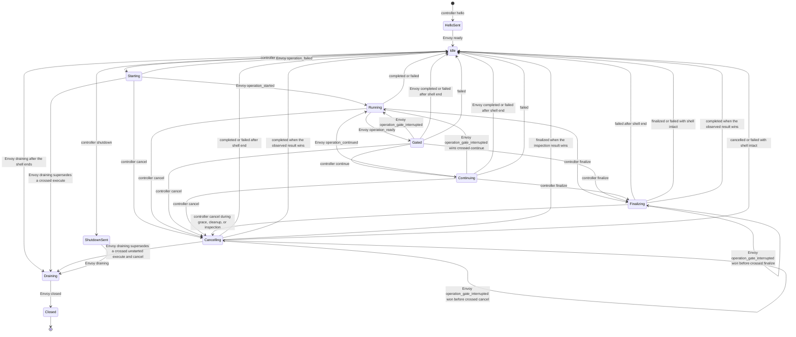

# OmegaFlow Envoy Protocol v1

## Status and scope

This document defines the first controller/workload contract for the
[OmegaFlow Workload Envoy](omegaflow-envoy-design.md). The complete current
protocol, including the pre-release inspection and external-Awsh-supervisor
amendments, becomes frozen only when implementation-plan gate A2 is approved
and its required design attestations bind to these exact bytes. It is an
internal OmegaFlow release contract. Reploy provides the
private network, endpoint coordinates, bootstrap attachment, and authoritative
lifecycle; it does not transport or interpret these messages.

Version 1 covers:

- a full-duplex binary terminal channel;
- a bounded JSON Lines telemetry channel;
- the private NUL-framed Envoy-to-external-`awsh` descriptor protocol;
- bounded workload-side `file_exists` and `produces` inspection;
- state, ordering, resize, cancellation, shutdown, and failure rules;
- sender-stamped output marks carrying stream identity and timing;
- direct asciicast synthesis and exact raw-output retention; and
- the controlled Bash launch boundary.

It does not implement the Envoy process, PTY supervision, TCP listeners, runtime
mounting, or Reploy lifecycle integration. A dependent implementation-plan
slice tracks delivery order.

The external-supervisor amendment preserves every controller request shape. Its
public vocabulary additions are the pre-start `operation_failed` codes
`source-invalid` and `source-unsupported`, required to represent Bash source
that Awsh rejects without starting or damaging the persistent shell, and the
`operation_gate_interrupted` event, required to close a gate released by
terminal Ctrl-C without reclassifying terminal input as lifecycle cancellation.
Process identity and source-submission changes otherwise stay inside the private
Envoy-to-Awsh contract.

## Implementation and build contract

The workload Envoy and external Awsh supervisor are dependency-free Go
executables built from one runtime module:

- module: `github.com/omry/omegaflow/runtime/envoy`;
- minimum toolchain: Go 1.25.x, matching Reploy;
- supported targets: `linux/amd64` and `linux/arm64`;
- `CGO_ENABLED=0`;
- no third-party module dependencies;
- `-trimpath -buildvcs=false`; and
- linker flags `-s -w -buildid=`.

The production commands are built from `./cmd/omegaflow-envoy` and
`./cmd/omegaflow-awsh`. The protocol-model slice does not add placeholder
commands. Once both commands exist, each release build uses the same fixed
settings, for example:

```text
CGO_ENABLED=0 GOOS=linux GOARCH=amd64 go build \
  -trimpath -buildvcs=false -ldflags='-s -w -buildid=' \
  -o omegaflow-envoy ./cmd/omegaflow-envoy
```

The corresponding Awsh build changes the output and package to `awsh` and
`./cmd/omegaflow-awsh`. Release materialization records the
source revision, Go version, target, file size, and SHA-256 digest for both
binaries. Rebuilding the same source with the pinned Go patch release and target
must reproduce each digest before either binary is added to the runtime
manifest.

## Connection establishment

The workload blueprint declares two lease-private TCP endpoints: terminal and
telemetry. The Envoy binds both listeners before starting Bash. It accepts one
connection on each listener and then closes both listeners, so a later attempt
is refused by the kernel without the Envoy observing it and has no effect on the
capture.

The controller connects the terminal channel first and telemetry second. Its
first telemetry request is `hello`. Envoy creates the PTY and starts external
Awsh only after both connections and a valid `hello` exist; Awsh then directly
starts persistent Bash on the slave. Envoy emits public `ready` only after the
private Awsh `ready` identifies both Awsh and Bash and Envoy validates that
topology. The public event remains shell-neutral and does not expose
`awsh_pid`. Neither controller endpoint sends another message before this
exchange completes.

Controller OmegaFlow generates a fresh 128-bit random lowercase hexadecimal
`session_id` after Reploy reports the opened session and before it launches the
Envoy. It passes that value to the Envoy through the trusted bootstrap command's
`--session-id` argument and sends the same value in `hello.session_id`. The
Envoy requires an exact match before creating Bash. The identifier binds the
two application channels to the exact Envoy invocation and gives retained
diagnostics a correlation key; it is not an authentication credential and
cannot authorize a Reploy operation or override Reploy lifecycle truth.

The channels have no application reconnect. EOF, reset, timeout, a second
connection completed while a listener is still open, or traffic before the
required handshake fails the capture.

## Global limits and timeouts

| Contract | Value |
| --- | ---: |
| Telemetry frame, including LF | 1,048,576 bytes |
| Private `awsh` frame | 1,048,576 bytes |
| Bash-helper packet | 65,536 bytes |
| Exported-environment entries in one helper report | 0–1,024 |
| Encoded exported-environment array in one helper report | 49,152 bytes |
| Operation source (Bash in v1) | 1–491,520 UTF-8 bytes |
| Generated Bash-capsule bytes other than the two source copies | 0–32,768 bytes |
| Private FIFO path | 1–4,096 UTF-8 bytes, absolute Linux path |
| Output-mark cadence | 10 milliseconds |
| Output marks per session | 1,000,000 |
| Session elapsed microseconds | 0 through `2^63-1` |
| Identifier | 1–64 ASCII identifier characters |
| Diagnostic message | 1–4,096 UTF-8 bytes |
| Reason | 1–256 UTF-8 bytes |
| Cwd | 1–4,096 UTF-8 bytes, absolute Linux path |
| Inspection specifications per operation | 0–64 |
| Inspection configured or resolved path | 1–4,096 UTF-8 bytes |
| Produced-output identifier | 1–64 ASCII identifier characters |
| Directory entries inspected per operation | 100,000 |
| Regular-file bytes hashed per operation | 16 GiB |
| Symlink target | 0–4,096 bytes |
| Sequence | 1 through `2^63-1` |
| Output offset | 0 through `2^63-1` |
| Terminal input watermark | 0 through `2^63-1`, non-decreasing |
| Terminal input barrier wait | 5 seconds |
| Raw output per session | 8 GiB |
| PID | 1 through `2^31-1` |
| Shell status | 0 through 255 |
| Terminal columns and rows | 1 through 1,000 |
| Connect deadline | 10 seconds |
| `hello`/`ready` deadline | 10 seconds |
| Individual control write | 5 seconds |
| Bash-helper non-blocking exchange | 5 seconds |
| Operation start | 5 seconds |
| Cancellation grace period | 5 seconds |
| Operation cleanup | 5 seconds |
| Final drain | 5 seconds |

Operation duration is owned by the recording plan and is not a fixed Envoy
timeout. The controller converts an operation deadline into a typed `cancel`.

The timeout values above have the following normative ownership. Every timer
uses its owner's monotonic clock, is scoped to one session, and does not reset
on partial progress.

| Deadline | Owner and epoch | Covered work | Timeout result |
| --- | --- | --- | --- |
| Controller connect | Controller; starts after the complete bootstrap `exec` command and newline have been written | Resolve the two already-opened coordinates and complete the terminal connection followed by the telemetry connection within one shared 10-second budget | Fail the capture and ask Reploy to terminate |
| Envoy accept | Envoy; starts after both listeners are bound | Accept the one terminal connection and one telemetry connection within one shared 10-second budget | Emit a best-effort fatal diagnostic, close both listeners and accepted sockets, and exit nonzero |
| Envoy `hello` | Envoy; starts after both connections are accepted | Read and validate one complete `hello` frame, including the exact `session_id`, within 10 seconds | Fail the handshake and exit nonzero |
| Controller `ready` | Controller; starts after the complete `hello` frame is written | Read and validate one complete `ready` frame within 10 seconds | Fail the capture and ask Reploy to terminate |
| Individual control write | Sender; starts with the first attempted transport write of one already-encoded frame | Write every byte of one telemetry JSON Lines frame or one private Awsh frame within 5 seconds; terminal input and workload-output bytes are excluded | Fail the session; delivery of a partial frame never becomes success |
| Bash-helper non-blocking exchange | Helper or Awsh; starts with connect for a helper and accept for Awsh | Connect, transfer each permitted complete packet and its applicable non-blocking acknowledgment, and close within 5 seconds; intentional `start` and `gate` decision waits are excluded and use their owning lifecycle timer | Helper emits or Awsh maps fatal `adapter-state`; startup, operation-start, running, or final-drain ownership determines the public failure path |
| Envoy operation start | Envoy; starts when the terminal-input barrier is satisfied and Envoy begins the private `execute` write | Complete Awsh source validation and framing, receive `submit`, drain legitimate pre-submission PTY output, write the complete terminal submission, suppress its echo/redraw, and accept matching `started` within 5 seconds | Emit a best-effort fatal `operation-start-timeout` diagnostic, close the session channels, terminate and reap the selected-shell tree, and exit nonzero; no `operation_started` or terminal operation result is emitted, and the controller retains partial artifacts and asks Reploy to terminate |
| Envoy resize transaction | Envoy; starts when it begins the private `resize_prepare` write | Let Awsh reserve a termios-safe slot, close the output frontier, apply `TIOCSWINSZ` through matching `resize_apply`, and accept matching `resized` within 5 seconds | Emit best-effort fatal `resize-failed`, close the session channels, terminate the controlled subtree, and exit nonzero; no `resize_applied` or terminal operation result is emitted, and the controller retains partial artifacts and asks Reploy to terminate |
| Envoy operation cleanup | Envoy; starts when it begins mandatory cleanup after an Awsh result, cancellation or finalization adapter return, or explicit `shell_exit` | Census, terminate, reap, reach operation-stream EOF, and drain all operation-created processes and output within 5 seconds | Emit a best-effort fatal `operation-cleanup` diagnostic, close the Envoy-owned operation descriptors and session channels, and exit nonzero; no terminal operation result is emitted, and the controller fails the capture and asks Reploy to terminate |
| Envoy inspection cancellation | Envoy; starts when it accepts `cancel` while the operation's inspection worker is live | Stop and reap the worker within the five-second cancellation grace period | Emit a best-effort fatal `inspection-cancel-timeout` diagnostic, close the session channels, and exit nonzero; no terminal operation result is emitted, and the controller records the cause and asks Reploy to terminate |
| Envoy final drain | Envoy; starts when it accepts `shutdown` or enters an Envoy-initiated drain | Close Awsh, supervise the persistent Awsh session and subtree, drain terminal output, and emit `closed` within 5 seconds | Emit a best-effort fatal diagnostic and exit nonzero |
| Controller final drain | Controller; starts when it accepts `draining` | Receive `closed`, retain raw output through its final offset, and observe terminal EOF within 5 seconds | Fail the capture and ask Reploy to terminate |

The two connect timers and the two handshake timers are intentionally
independent actor-local bounds. A timeout on either side is sufficient to fail
the session; neither side extends its timer because the other side made partial
progress.

Every field limit is additionally constrained by the enclosing telemetry or
private-frame limit. Reaching an individual field maximum does not guarantee
that the field can be combined with every other maximum-sized field. Encoders
must validate the complete encoded frame before writing it, and receivers
reject an otherwise field-valid frame that exceeds its enclosing limit.

Identifiers match `[A-Za-z0-9][A-Za-z0-9._-]{0,63}`. Diagnostic codes match
`[a-z][a-z0-9-]{0,63}`. Strings reject NUL. Cwd values are lexical evidence
from Bash; the controller does not resolve them on its own filesystem.

## Terminal channel

The terminal connection is binary and full duplex:

- controller to Envoy: exact input bytes;
- Envoy to controller: exact post-line-discipline PTY-master bytes for an
  attached operation, or Envoy-ordered PTY-master and stdout/stderr pipe bytes
  for a split-stream operation.

It has no record framing, JSON, lifecycle messages, presentation markers, or
shell-status markers. `^C` is byte `0x03`. The terminal line discipline and
foreground process group give it normal terminal behavior. Resize travels on
telemetry because it is a structured PTY-master operation.

Envoy is the only PTY-master writer. It serializes bytes read from this
controller channel with an Awsh-requested backend submission and never lets the
two interleave. Bash source-submission bytes are private runtime mechanics, not
controller input: they do not increment `input_through`. Before writing the
first submission byte, Envoy drains the PTY master through `EAGAIN` and retains,
forwards, and marks every byte from that preceding interval. It then opens one
submission-discard interval, writes the complete bracketed-paste unit, and
consumes without retaining or forwarding the resulting terminal echo and
Readline redraw. While the `PS0` helper is blocked and after accepting matching
`started`, Envoy drains through `EAGAIN` once more and closes the discard
interval. Discarded bytes never enter the raw log, terminal socket, output
offset, or output mark. No operation-created process exists during this
serialized interval, so every PTY byte in it is adapter submission presentation
rather than operation output. The controller sends authored operation input
only after `operation_started`.

Because the channel carries no framing, it carries no operation identity either,
so the binding between input and operation is a contract rule rather than a
field. Every terminal byte the controller writes is authored against one
operation: there is no person at a keyboard, so there is no type-ahead the
recording must preserve. The Envoy therefore discards terminal input that
arrives while the session is idle, and when an operation ends it drains input
the line discipline has queued but the workload has not consumed. Input a gated
operation is still entitled to receive is unaffected, since such an operation
has not ended, and so is anything the workload already read.

Those two rules govern bytes the Envoy already holds, which is not enough on its
own: terminal and telemetry are separate connections and nothing orders one
against the other, so input can still be in flight when a telemetry request that
depends on it arrives. `execute` and `continue` therefore carry
`input_through`, the running count of terminal bytes the controller has written
since the session began. The Envoy does not start an operation or release its
gate until its own terminal read count reaches that request's value. Input that
arrives while `execute` waits belongs to an operation that has ended and is
discarded under the rule above; input that arrives while `continue` waits still
belongs to the gated operation and remains available to it after release. The
count is a barrier rather than framing, so the channel stays exact bytes with no
record structure, and it needs no acknowledgement round trip because the
controller is the only writer to this connection and Envoy its only reader.

The controller appends every received output byte to a private raw log before
using it anywhere else. A zero-based monotonically increasing offset is the
number of bytes durably appended. The raw log, not the asciicast, is canonical
for output ranges and diagnostics.

Lossless retention needs a volume bound, because the operation timeouts bound
duration rather than output and mark coalescing keeps the mark budget almost
unchanged under a flood. A command such as `yes` would otherwise fill the
controller's disk and take the recording host with it. The raw log is therefore
capped per session, and reaching the cap is a typed session failure: the
controller stops appending, emits a bounded diagnostic, and fails the capture
rather than truncating a log whose whole contract is that it is exact.

## Telemetry framing

Each telemetry message is one UTF-8 JSON object followed by one LF. Outgoing
frames use compact JSON and field order shown by the golden fixtures. Receivers
reject:

- missing LF, CRLF, embedded LF, NUL, or invalid UTF-8;
- invalid JSON, a non-object top level, duplicate fields, or non-finite numbers;
- unknown or missing fields;
- an unsupported `schema` or `type`;
- values outside the declared type or bounds; and
- frames over the byte limit, including an unterminated buffered frame.

Every message has `schema: "omegaflow-envoy-telemetry-v1"`, `type`, and a
positive `seq`. Controller and Envoy sequence spaces are independent, begin at
1, and increase by exactly one. A gap, duplicate, or regression is fatal.
Version 1 has no alternative-version offer: the `hello` schema selects v1 and
the `ready` schema confirms it. Any other schema fails the handshake instead of
being downgraded.

### Controller requests

| Type | Additional required fields |
| --- | --- |
| `hello` | `session_id` |
| `execute` | `operation_id`, `source`, `execution_shape`, `timing`, `publication`, `observation`, `inspections`, `input_through` |
| `continue` | `operation_id`, `gate_id`, `input_through` |
| `cancel` | `operation_id`, `reason` |
| `finalize` | `operation_id`, `reason` |
| `resize` | `columns`, `rows` |
| `shutdown` | `reason` |

Operation source is trusted recording-plan source, with Bash semantics in v1.
Envoy forwards it privately to Awsh for backend validation and framing. Awsh
returns a private `submit` result, and Envoy writes that backend submission to
the PTY master under the start barrier. These runtime bytes are distinct from
controller terminal input and are discarded before retained operation output.

The compiled execution policy uses these closed enums:

- `execution_shape`: `pty` or `split`;
- `timing`: `realtime` or `presentation`;
- `publication`: `real`, `suppress`, or `replace`; and
- `observation`: `shared` or `exclusive`.

`input_through` is not part of that policy: it is the terminal-input barrier
defined under Terminal channel. The Envoy holds an operation in `Starting`, or
a gate in `Continuing`, until its terminal read count reaches the request's
watermark. It is a non-negative 64-bit count under the global limits and never
decreases across a session. The Envoy rejects a value outside that type or below
the previous watermark, which is the whole of what it can check: it cannot know
what the controller has written, only what it has read. A watermark that is
merely never reached is therefore not a validation failure but a wait, and the
terminal input barrier wait bounds it. Expiry while `execute` is in `Starting`
fails the not-yet-started operation with `input-barrier-timeout`. Expiry while
`continue` is in `Continuing` is fatal to the session: the operation is still
blocked inside its gate, so no ordinary terminal operation result or later
operation is possible.

Realtime timing requires PTY execution and real publication. Presentation
timing requires split execution and exclusive observation. Suppressed and
replaced output require exclusive observation.

Protocol v1 has one process-lifetime rule rather than a configurable field.
When the submitted Bash source returns to Awsh, Envoy terminates every remaining
process created by that operation and supervises its owner or adopted parent
through reap before it reports a terminal
operation result. This rule applies to every publication, timing, and
observation mode; `observation` does not select process lifetime. `nohup`,
`disown`, `setsid`, daemonization, and double-forking do not make an operation
process session-lived. One operation is one submitted Bash source; several shell
statements within that source share this one cleanup boundary. A service that
must outlive an operation is workload setup and must start outside the
controlled Envoy/Awsh process tree. Session-lifetime subprocess support may be
added in a later protocol version if a compelling use case cannot be handled by
setup; v1 does not provide it.

Presentation timing still requires exclusive observation because its authored
schedule needs a closed operation range and an output-through drain boundary
before the terminal result becomes visible. Replacement text and authored
presentation delays stay controller-private and are not sent to the Envoy.

`inspections` is an array, including when empty. Each entry is an exact object
with a unique `inspection_id`, a `kind`, and a configured `path`. `kind` is
`file_exists` or `produces`. A `file_exists` entry has no other fields. A
`produces` entry additionally requires `producer_id` and `output_id`; both are
identifiers. Paths are trusted recording-plan values, not shell output, but
remain bounded and reject NUL. An operation with inspections requires
`exclusive` observation. Resolution and hashing run only after the universal
operation cleanup has closed and reaped every remaining operation process.

Controller OmegaFlow assigns inspection IDs deterministically in request order
as `inspection-1`, `inspection-2`, and so on. It retains that compilation map
with the operation. Results remain in request order and repeat the ID;
`produces` results additionally retain the authored producer and output IDs.

### Envoy events

| Type | Additional required fields |
| --- | --- |
| `ready` | `envoy_pid`, `shell_pid`, `cwd`, `columns`, `rows`, `elapsed_us` |
| `operation_started` | `operation_id`, `output_start` |
| `operation_ready` | `operation_id`, `gate_id`, `output_through` |
| `operation_continued` | `operation_id`, `gate_id`, `output_through` |
| `operation_gate_interrupted` | `operation_id`, `gate_id`, `output_through` |
| `output_mark` | `offset`, `stream`, `elapsed_us` |
| `operation_completed` | `operation_id`, `status`, `cwd`, `output_start`, `output_through`, `inspection_results`, and `shell_ended`, boolean `true`, present only when the operation's shell did not survive it |
| `operation_cancelled` | `operation_id`, `cwd`, `output_start`, `output_through`, `reason`, and `status` unless the operation was cancelled before it started; no inspection results |
| `operation_finalized` | `operation_id`, `cwd`, `output_start`, `output_through`, `reason`, `inspection_results`; no status |
| `operation_failed` | `operation_id`, `output_start`, `output_through`, `code`, `message`, `cwd`, and `shell_ended`, boolean `true`, present only when the operation's shell did not survive it |
| `resize_applied` | `columns`, `rows`, `elapsed_us`, `output_through` |
| `diagnostic` | `severity`, `code`, `message`; optional `operation_id` |
| `draining` | `reason`, `output_through` |
| `closed` | `reason`, `output_through` |

Diagnostic severity is `info`, `warning`, `error`, or `fatal`. Codes are open
for forward-compatible diagnostics; code shape and message size remain bounded.
An unknown diagnostic code is retained, not reclassified as a protocol error.

`output_mark` attributes raw output to a logical stream and to sender time. It
is session-scoped rather than operation-scoped, because output can arrive
between operations. `offset` is the raw-log offset at which the attribution
begins, `stream` is `pty`, `stdout`, or `stderr`, and `elapsed_us` is the
Envoy's monotonic microseconds since the session epoch established by
`ready`; `ready` itself carries `elapsed_us` 0, the instant it is stamped. A
mark attributes every byte from its `offset` until the next mark's `offset`.

The current mark stream is deterministic even when a required boundary mark
attributes no bytes. Before any output source has selected a stream, the
current stream for a boundary-only mark is `pty`; this initialization does not
emit an extra mark at `ready`. A mark that precedes actual bytes selects their
real source, including `stdout` or `stderr` for the first bytes of a split
operation. A required boundary mark with no newly attributed bytes repeats the
current stream. Equal-offset marks are legal: the earlier mark then attributes
nothing, so the first split-stream source can replace an initial or repeated
`pty` boundary mark at the same offset before writing its first byte. The first
output-free PTY or split operation, and a first operation that fails or is
cancelled before starting, therefore use `pty` for every otherwise-ambiguous
boundary mark without claiming that the operation executed through the PTY.

All output read from a PTY master is attributed `pty`, including terminal echo
caused by controller-authored input. The workload owns its terminal modes
outside the temporary source-submission capsule, whose exact pre-Readline state
is restored before authored source executes. Linux exposes no reliable boundary
that proves an authored write has completed
line-discipline processing and that all resulting echo has reached the master.
The protocol therefore does not attempt to distinguish echo from application
output.

OmegaFlow rejects `output_contains` and `output_regex` before `execute` when an
operation, including any of its continuations, sends authored bytes through a
`text`, `key`, or `control` input step. `wait_for` and `pause` send no bytes
and do not trigger that restriction. `wait_for` matches the visible terminal
transcript, including echo, and is only a sequencing mechanism; it is not
assertion evidence. Exit-status assertions and workload inspections remain
valid for operations that send input. A later non-interactive operation can
perform output or content verification when an interactive operation needs it.

The Envoy emits a mark when the stream identity changes, when at least the mark
cadence has elapsed and new bytes exist, and immediately before any event
carrying `output_start` or `output_through`. Marking both range-opening and
range-closing events is what supplies the timeline anchors the asciicast writer
re-anchors on, without a separate timestamp field. It coalesces otherwise. The
mark budget is session-wide rather than per-operation, because a mark carries no
`operation_id` and output surviving from an earlier operation can arrive while
the session is idle or while a later operation runs; neither endpoint could
charge such a mark to an operation. Exhausting the session budget is a session
failure, not a partial success. Marks never regress in `offset` or `elapsed_us`,
and a mark's `offset` never exceeds the bytes already written to the terminal
socket, so a mark is never visible before the bytes it describes. A split-stream
operation therefore carries `stdout` and `stderr` marks and may also carry
`pty` marks over its interleaved terminal range. Its logical stdout is the
raw-offset-ordered sequence of bytes attributed either `stdout` or `pty`; its
logical stderr contains the bytes attributed `stderr`. A PTY operation carries
`pty` marks, its PTY bytes are logical stdout, and logical stderr is empty.

Logical stdout and logical stderr are slices of the controller's raw log
selected by that execution-shape rule. The Envoy sends no copy of workload
output on telemetry, so assertion evidence is the complete retained output
rather than a bounded excerpt.

During a split-stream operation the PTY master and both Envoy-owned stdout and
stderr pipes are active output sources in one Envoy pump. The Envoy continuously
drains the master as well as both pipe readers, attributes master bytes `pty`,
and retains their sender order with the pipe bytes. During cleanup it drains the
master through the result boundary, keeps both pipe readers open through their
EOF boundaries, and closes the pipes before the typed terminal result. No
operation-owned pipe or writer survives that result, and terminal output cannot
remain unread or cross the operation boundary merely because fd 1 and fd 2 were
redirected.

Awsh reports that the submitted source returned; it does not own process
cleanup. Envoy is Awsh's direct parent and the Linux subreaper; Awsh is the
persistent shell's direct parent and reaps that shell. Envoy tracks live
descendants with pidfds and `/proc`, terminates every operation descendant of
the persistent shell, and reaps every non-shell child it adopts when an
intermediate parent exits. Awsh and Bash remain responsible for reaping their
own direct children while alive. Envoy repeats census, termination, adopted
reaping, stream EOF, and drain until external Awsh and persistent Bash are the
only processes left in the controlled tree. The operation-cleanup deadline
covers that whole sequence on one monotonic timer and does not reset when a
process exits or output advances. If
the boundary is not clean before the deadline, the Envoy takes the fatal
session-failure path defined in the timeout table; it does not emit a terminal
operation result or accept another `execute`. Because v1 never retains a
process from an earlier operation, an adopted
non-shell child cannot be an earlier permitted service: it belongs to the
operation being closed. The next `execute` is not accepted until this boundary
passes. Failure to acquire a required pidfd, complete a census, terminate or
reap a process, observe EOF, or retain the state needed for cleanup is a fatal
session failure taking that same no-terminal-result path; the Envoy never
continues with a partially cleaned tree.

Tracking has no protocol-level numeric admission limit. Host or container
PID/fd exhaustion may surface first and is a failed Reploy lifecycle, not a
typed claim that the Envoy rejected a particular fork. A future deterministic
ceiling remains a Reploy-owned kernel-enforced workload/session process domain,
such as a cgroup PIDs limit with stated overhead and cleanup semantics.
Per-operation process admission is not part of protocol v1.

After natural completion or planned finalization, permitted output assertions
consume logical stdout followed by logical stderr. An operation that sent
authored terminal input cannot have such an assertion, as specified above. Each
physical `pty`, `stdout`, or `stderr` source is decoded with its own UTF-8
replacement decoder, flushed at the end of that source. For split execution,
decoded `pty` and `stdout` chunks retain raw-offset order to form logical stdout,
then decoded logical stderr is appended. Decoding after concatenation would let
a truncated sequence at the end of stdout join a continuation byte at the start
of stderr into a character neither stream contains: stdout ending `0xC3` and
stderr beginning `0xA9` must read as two replacement characters, as the native
runner produces them, not as `é`. This is the assertion decoder, separate from
the asciicast decoder specified later, which serves a different stream. Output
assertions never infer whether `pty` bytes came from terminal echo or an
application write. Cancellation and failure discard partial assertion evidence
instead of evaluating it.

### Workload inspection

`inspection_results` is an array in request order, including when empty. Each
result repeats `inspection_id` and `kind`, and contains an absolute
`resolved_path` and `path_kind`. `path_kind` is `file`, `directory`, or `other`.
A `file_exists` result has no digest or producer fields. A `produces` result
allows only `file` or `directory`, repeats `producer_id` and `output_id`, and
contains `sha256`, a 64-character lowercase SHA-256 digest. A `directory` result
also carries `digest_algorithm`, the tag that domain-separated the hash input —
`directory-v2` for anything this protocol produces, `directory` for a record the
native runner made. The tag is not recoverable from the digest, so without it a
retained record could not say which algorithm produced it, and the promise that
a recording stays identifiable under its own tag would not survive migration.
Downstream retained records carry it with the digest.

After Bash returns or a planned finalization closes the operation, `awsh`
resolves configured paths using the persistent Bash process's resulting cwd and
exported environment. It sends only the resolved plan to the Envoy over the
private descriptor. The controller never resolves a workload path, starts a
probe operation, or infers filesystem state from terminal output.

Resolution preserves the current native runner's successful path behavior. It
expands `$NAME` and `${NAME}` from the exported environment when the name is
defined and leaves an undefined or malformed reference literal. A leading `~`
uses `HOME` when set and otherwise the workload's user database for the current
effective identity; a leading `~user` uses that database when the named user
exists. An unresolved home expression remains literal and will ordinarily fail
the subsequent existence check. Resolution performs no command substitution,
arithmetic expansion, word splitting, or globbing. The expanded relative path
is anchored at the resulting cwd. After existence is established, the Envoy
reports the absolute canonical path.

Inspection is the final part of an exclusive operation boundary. The Envoy
first receives the Awsh result and resolved plan, completes the universal
operation cleanup, proves that only the persistent shell remains in its
controlled tree, and drains output through the operation's closing offset. Only
then may it inspect or hash workload paths. It runs the complete resolved plan
in one short-lived, Envoy-supervised worker process. The worker is a restricted
mode of the Envoy executable, not another service or protocol peer; it inherits
no terminal, telemetry, Awsh, or Reploy channel and returns only the bounded
inspection result over an Envoy-owned pipe. This process boundary makes a
filesystem read that blocks in the kernel independently supervised: the parent
can request termination and bound how long it waits to reap, while the fatal
fallback below prevents unreaped work from overlapping another operation.
Cleanup or drain failure emits no inspection results. The Envoy emits
`operation_completed` or `operation_finalized` only after inspection succeeds;
its `output_through` is therefore already stable when results become visible.
This closes races from cooperative operation-created background processes; it
does not make hashes tamper-proof against another process already running under
the same workload identity.

A `produces` inspection additionally accepts a digest only from one observed
stable source state. Starting at a descriptor for `/`, the worker resolves the
canonical selected path through a retained no-follow descriptor chain and
records the identity of every path component. It records the selected object's
kind, device and inode identity, mode, size, and nanosecond modification and
change times from its descriptor. For a selected directory, it then traverses
descriptor-relative and records a complete first snapshot in sorted
relative-path order with those same fields for every descendant and, for a
symlink, its exact target. Special entries participate in stability comparison
even though the directory digest omits them.

A selected top-level regular file is read from its retained descriptor. Every
regular file below a selected directory is opened descriptor-relative without
following a symlink. In both cases, `fstat` before reading must match the first
snapshot, the worker hashes exactly the recorded size followed by an EOF check,
and `fstat` afterwards must still match the snapshot and the pre-read result. A
short, long, or otherwise inconsistent read is instability, not a digest.

After every selected regular file is hashed, the worker performs a fresh
descriptor-relative traversal when the selection is a directory and records
the same complete sorted snapshot. The two snapshots must match exactly,
including directory membership and every recorded identity, kind, metadata
value, and symlink target. The worker also resolves the canonical selected path
again from `/`; every path component must retain its first identity, the
selected entry must still name the retained top-level descriptor, and that
descriptor's metadata must match its first snapshot. A filesystem that cannot
supply these stable identities and nanosecond metadata cannot establish this
contract. Any observed change or inability to establish stability emits
`operation_failed` with `inspection-unstable` and no digest or inspection
result. This algorithm detects observed concurrent mutation by ordinary setup
services; within the documented same-identity trust boundary it remains
correctness evidence rather than tamper-proof security evidence.

The Envoy rejects a missing `file_exists` path. A `produces` path must exist and
resolve to a regular file or directory. A regular-file digest covers its exact
bytes. A directory digest traverses entries in sorted relative POSIX-path order
and hashes fixed-size framing rather than delimited text, because delimiters are
not injective over arbitrary file bytes: one file whose contents happen to
contain the delimiter and a following entry's framing would otherwise hash
identically to two files, giving distinct trees the same digest without any
SHA-256 collision. Each entry contributes a one-byte kind tag — ASCII `f` for a
regular file, `d` for a directory, `l` for a symlink, and no other value — the
SHA-256 of its path, and the SHA-256 of its payload — the target for a symlink,
the exact bytes for a regular file, and the empty string for a directory — so
every entry occupies the same 65 bytes whatever it contains. The digest is the
lowercase SHA-256 over the literal `directory-v2` tag followed by those entries
in order. The tag is versioned because this is a deliberate break: the native
runner's encoding, tagged `directory`, is the delimited form whose ambiguity
this replaces, so the two disagree on every directory including the empty one,
and a digest is an identity that must not change silently with the runner that
produced it. Paths and symlink targets must be UTF-8. As in the native runner, a
special entry nested inside a produced directory is omitted from the digest; a
symlink is always recorded as a link and is not followed. A top-level produced
path of a special type still fails with `inspection-type`. The amended canonical
fixtures freeze representative encodings, including nested special entries. File
contents never travel over telemetry.

Resolution, unsupported file type, traversal, instability, read, or hashing
failure emits `operation_failed` with `inspection-resolution`, `inspection-missing`,
`inspection-type`, `inspection-limit`, `inspection-unstable`, or
`inspection-read`. Cancellation and ordinary failure produce no inspection
results. The Envoy applies the global entry limit independently to each complete
snapshot and the byte limit to the intervening regular-file reads; exceeding
either is an inspection failure rather than a partial success. The operation
deadline stays controller-owned and reaches a long-running inspection, when it
expires, as a typed `cancel`.

Absolute resolved paths and digests are private run evidence. They are not
presentation or publication data and must not enter a published bundle unless a
separately specified publication contract explicitly selects and sanitizes
them.

## Session state machine

Only one top-level operation is active. Controller and Envoy messages jointly
advance this state machine:



`operation_gate_interrupted` is the typed result of terminal Ctrl-C reaching a
waiting gate helper. From `Gated` it reopens the running operation; from
`Continuing` it resolves a crossed `continue` instead of
`operation_continued`. If the controller has already entered `Cancelling` or
`Finalizing` by sending its request but Envoy accepted the gate-interrupt
proposal first, the event is a legal self-transition: the lifecycle request
remains live and is then applied to the now-running operation. A crossed
`continue` is satisfied by the gate-interrupted event and is not forwarded or
acknowledged separately. A crossed cancellation or finalization is never
discarded merely because terminal Ctrl-C won the gate.

`resize` is allowed in idle, starting, running, gated, or continuing states;
continuing is included because it is running-equivalent for the PTY, so a
controller may pipeline `continue` and `resize` without waiting for
`operation_continued`. Only one resize may be outstanding. It must be matched
by `resize_applied` with the same
dimensions before another resize or controller-requested shutdown, unless an
Envoy-initiated `draining` resolves it first. On that drain the controller
clears the outstanding resize without publishing it. A bounded diagnostic is
allowed after `hello` and before `closed`. Every operation and gate event must
match the active identifiers. The shell-end transitions are entered by Envoy
rather than by a controller message. External Awsh explicitly reports
`shell_exit` with the active operation ID or an empty ID, the status it reaped,
and the last valid cwd. An active operation reaches `Idle` through
`operation_completed` carrying that status — unless it declared inspections or
still holds an unresolved gate, which the ended shell can no longer resolve, in which
case it reaches `Idle` through `operation_failed` instead, because an authored
requirement that cannot be evaluated must not be reported as met; that
`operation_failed` carries `shell_ended` exactly as the completion does, so the
controller still learns the shell is gone. Any operation terminal result carrying
`shell_ended`, including a cancellation or finalization timeout, is followed by
`Idle --> Draining`; no prompt is synthesized and no later operation starts.
That drain is Envoy-initiated, so no request supplies its reason: `draining` and
`closed` both carry reason `shell_ended` on this path, exactly as they carry the
controller's shutdown reason on the requested one, which is what lets the golden
fixtures freeze one shell-exit sequence. A `shell_exit` that arrives while the
session is idle — a workload killed between operations — takes the same drain path with
the same reasons; there is no operation to report. Because these transitions are
Envoy-initiated, a controller request already in flight when the shell ends —
the next `execute`, a `cancel` derived from that crossed execute, a `resize`, or
`shutdown` — can arrive after them; it is accepted and discarded exactly like a
request that crossed its own terminal result, and a recording with a beat left
to run still fails from that beat being unrunnable rather than from the
crossing.

Shutdown uses the same observed-result-wins rule at idle. If Envoy accepts an
Awsh `shell_exit` before it accepts `shutdown`, the
Envoy-initiated `shell_ended` drain is authoritative. A controller that has
already sent the request and entered `ShutdownSent` accepts that reason and
treats the crossed shutdown as resolved; the request is discarded if it later
reaches the draining Envoy. If the Envoy accepts `shutdown` first, the requested
shutdown reason remains authoritative and a later `shell_exit` is clean under
that requested drain. Thus transport ordering cannot turn either clean outcome
into a protocol failure.

`Starting` has two bounded portions. While the terminal-input barrier holds, an
accepted `cancel` abandons the wait, discards the input it was waiting through
as belonging to an ended operation, and reports `operation_cancelled` with an
empty range and no `status`. After the barrier is satisfied, the five-second
operation-start transaction begins. Before Envoy writes the first submission
byte, an accepted cancel sends private `cancel`, waits for matching
`disposition(cancel, disarmed)`, and takes the same empty-range result without a
PTY signal. The disposition exchange remains inside the original non-resetting
operation-start deadline; a missing or different response is fatal rather than
an unacknowledged public cancellation. The first submission
byte is the start commit point: from there through matching `started`, Envoy
finishes the non-interruptible bounded submission transaction. A complete
cancel received on telemetry during that interval is queued but not accepted;
after Envoy emits `operation_started`, it immediately accepts that cancel and
takes the ordinary running cancellation path. A controller already in
`Cancelling` therefore accepts the crossed `operation_started` without leaving
`Cancelling`; the later terminal result resolves its request. This rule avoids
leaving a partial Readline unit in persistent Bash while still bounding the
crossing. No shell ran on the true pre-start path, so no status is invented;
this is the only case in which `operation_cancelled.status` is absent, and it
parallels status-free pre-start finalization. The terminal-input and
operation-start deadlines are independent and neither resets on progress.

If cancellation has moved a started operation to `Cancelling` but Awsh's
explicit `shell_exit` is accepted before a cancellation result is committed,
the observed shell end wins. Envoy emits the same `operation_completed` or
`operation_failed` carrying `shell_ended` that it would have emitted from a
running state, then enters the Envoy-initiated drain. It does not conceal the
dead shell behind `operation_cancelled`, and the controller treats that terminal
result as resolving its crossed cancel request.

Two crossing families are accepted in states that have no transition for them,
because TCP ordering is directional and the controller can act on a state the
Envoy has already left. A `cancel` or `finalize` naming an operation whose
terminal result the Envoy has already sent is accepted and discarded while it is
still the most recent operation, and the next `execute` supersedes it; the
controller resolves its own request when the terminal result arrives and does
not additionally wait for `operation_cancelled` or `operation_finalized`. And
any request already in flight when the shell ends — the next `execute`, a
`cancel` derived from that crossed execute, or a `resize` — is accepted and
discarded after the Envoy-initiated drain begins, as
the shell-end rules above describe. Receipt of that `draining` resolves a
controller's outstanding resize; the discarded request produces no
`resize_applied` and no resize event in the recording. If the Envoy applies the
resize first, its `resize_applied` precedes `draining` and resolves the request
normally. The `Starting --> Draining` edge exists because a controller that sent
that `execute` has already left `Idle` when the `draining` it crossed arrives.
If its deadline also sent `cancel` before that drain arrived, the controller has
instead reached `Cancelling`; the corresponding `Cancelling --> Draining` edge
resolves both requests. The Envoy accepts and discards whichever of the crossed
`execute` and `cancel` arrive after draining begins. Because the operation never
started, it emits no terminal operation result, and the recording still fails
from the planned beat being unrunnable rather than from either crossing.
Any other transition fails closed.

## Output ordering barrier

An exclusive operation has an additional barrier while it is in `Starting`.
The preceding operation has already completed universal process cleanup and
closed its split-stream pipes. Immediately before opening the submission-
discard interval, Envoy nevertheless takes a fresh PTY drain boundary, writes
every preceding byte to the terminal socket, and emits the covering output
mark. After terminal submission, matching `started`, and the discard interval's
closing drain through `EAGAIN`, it snapshots `output_start`, emits
`operation_started`, and acknowledges Awsh's `started` result so the Bash
adapter can evaluate the new source. Thus “every preceding byte” means every
byte before the explicitly excluded submission interval, not the private source
echo/redraw inside it. Failure to drain or write the legitimate preceding bytes
fails the operation before it opens a range; failure to complete submission and
reach `started` takes fatal `operation-start-timeout` instead.

`output_start` snapshots the raw-log offset at `operation_started`, and the
snapshot happens before Bash is released rather than after. Awsh's `started`
result is a barrier, not a notification: if Envoy snapshotted after releasing
it, a fast command could already have written and the pump already appended
before the snapshot, putting the operation's first bytes outside its own range — missed by
assertions, and for `suppress` or `replace` published as session-scoped output
the policy was supposed to withhold. The Bash `PS0` hook blocks, Awsh writes
`started`, and Awsh waits for Envoy's `started_ack` before releasing the hook.
Envoy takes the offset before sending that acknowledgement, so no byte of the
operation can precede its own start. An
operation that fails before `operation_started` has no such snapshot, so its
`operation_failed` sets both `output_start` and `output_through` to the offset
observed at the failure, not the one observed when the `execute` was accepted.
Either gives an empty range satisfying `output_start <= output_through` without
claiming output the operation never produced. Taking the later offset also
respects the non-regressing rule when terminal output or a resize advances the
session offset while the operation waits in `Starting`. A pre-start failure is
the only case in which an operation reports a range it did not open.
`output_through` is an exclusive raw-output offset. Before emitting an event
that contains `output_through`, the Envoy:

1. observes the corresponding `awsh` result;
2. drains all PTY-master bytes and, for split execution, stdout/stderr pipe
   bytes whose writes happened before that result write;
3. writes those bytes to the terminal socket in order; and
4. snapshots the resulting output offset for the telemetry event.

An operation whose shell ended uses Awsh's explicit `shell_exit` instead of an
ordinary completion result. Awsh writes that frame only after it reaps the
selected shell; Envoy then drains every byte whose write happened before that
exit, writes them in order, and snapshots the offset. The reap is a real
happens-before boundary — the kernel does not report the child until it has
gone — so output written immediately before `exit 7` is still inside the range.
Every other step is unchanged.

A pre-start terminal event — the `operation_failed` or `operation_cancelled` of
an operation that never started — has no result to observe either, and none will
ever exist. The Envoy drains and writes the bytes the pump already holds, then
snapshots the offset at the event for both ends of the empty range, which is the
same offset the pre-start failure rule above already requires. Its `cwd` is the
most recent one reported — by the previous operation's result, or by `ready`
when none has completed — since the operation itself exchanged nothing with the
adapter.

A resize is linearized by Envoy in the output pump's order and completed by one
private Awsh prepare/apply transaction. Envoy first obtains matching
`resize_ready`, which reserves Awsh's termios lane without applying the ioctl.
The pump then closes the finite prefix
already admitted from every output source it orders — the PTY master and each
active split stdout/stderr pipe — appends and writes those bytes,
and emits their covering marks. It snapshots `output_through`, sends matching
`resize_apply`, and emits `resize_applied` only after Awsh reports `resized`.
A source
chunk admitted by the pump after that boundary is ordered after the resize even
if the workload write raced it; this is the Envoy's observable sender order,
not a claim about syscall wall-clock order. Continuous output cannot starve the
resize because the barrier closes the prefix already admitted when the resize
is linearized rather than waiting for every source to become empty.

Because terminal and telemetry use different TCP connections, telemetry can be
received first. The controller does not act on the barrier until its raw log
has reached `output_through`. Offsets never regress. Completion ranges satisfy
`output_start <= output_through` and repeat the operation's original start.

For split execution the Envoy emits the marks covering an operation's range
before the terminal result. Marks carry offsets and stream identity rather than
output bytes, so the terminal connection remains the only path workload output
travels. The completion barrier remains the cross-channel authority: the
controller does not evaluate a mark until its raw log has reached that mark's
offset.

An operation terminal result closes all output from that operation. No
operation-owned process or pipe can add bytes after its completion barrier.

## Planned prompt and command presentation

Prompts and displayed commands are controller presentation, not workload
output. Before sending `execute`, the controller commits these events in order:

1. planned prompt;
2. typing-start timeline event;
3. displayed-command characters with planned timing;
4. displayed newline; and
5. typing-end timeline event.

It then sends `execute`. It synthesizes a following prompt only after the
completion event's output barrier is satisfied, and never after a terminal event
carrying `shell_ended`, since no shell remains to prompt. Synthesized events
carry controller-presentation provenance and never enter the private raw-output
log or its byte offsets.

The direct writer produces asciicast v3 JSON Lines. Its first line is compact
JSON with `version: 3` and `term: {"cols": C, "rows": R}` using the initial
applied dimensions. Existing optional OmegaFlow header metadata such as title
is copied under its existing schema; the Envoy path adds no new public header
field. Later lines are compact three-item arrays:

```text
[DELTA_SECONDS,"o",TEXT]
[DELTA_SECONDS,"r","COLUMNSxROWS"]
```

`DELTA_SECONDS` is non-negative elapsed time since the preceding cast event,
with at most six decimal places. One controller-owned serialized writer assigns
the total order, but for realtime-timed output it does not assign the times.
Realtime workload output takes the `elapsed_us` of the mark covering its offset,
and an accepted resize takes the `elapsed_us` of its `resize_applied` except for
the authored-schedule rule under Resize. Each written delta is the difference
between consecutive absolute microsecond values, so rounding error cannot
accumulate across a long recording.

Presentation-timed operations are the deliberate exception. Their whole purpose
is to discard real command duration, so their published output takes the
authored presentation schedule rather than mark time, and marks supply only
stream attribution and relative order within the operation. Mark `elapsed_us`
values inside such an operation are retained as private evidence and are not
published as cast times.

The two clocks meet through one signed running offset, re-anchored at every
return from an authored schedule to sender time. A session has two authored
schedules: the controller's synthesized prompt and typing presentation, and a
presentation-timed operation's compiled schedule. Both commit events at times
they choose, and each is mapped onto the session timeline starting at the last
committed absolute time. The offset is then set from the first Envoy-stamped
operation boundary after the span, not from whatever sender-timed event happens
to arrive next. For a prompt and typing span that boundary is the mark preceding
`operation_started`, or, when the operation never starts, the mark preceding the
`operation_failed`, `operation_cancelled`, or `draining` event that replaces the
start; for a presentation-timed operation it is the mark preceding its own
terminal event. Every one of those events carries `output_start` or
`output_through`, so the mark rule below guarantees the boundary exists. The
offset becomes that boundary's sender time minus the last absolute time the span
committed, and every later event publishes at its source time minus that offset
until the next re-anchor.

The controller publishes its received frontier before it begins an authored
prompt and typing span. Universal operation cleanup and the closing drain mean
no workload byte from the preceding operation can race that span.

Anchoring on a stamped boundary rather than on the next event is what keeps a
slow command honest. `sleep 5; echo done` produces its first output five seconds
after the operation starts; anchoring on that output would map it to the end of
the authored span and erase the five seconds, while anchoring on the start
leaves the delay after the anchor, where it survives at its real length. The
transport delay between the controller committing the typing schedule and the
Envoy starting the operation falls before the anchor and is absorbed, which is
the intended treatment for controller and transport time.

Re-anchoring after every authored span, rather than only when a presentation
operation ends, is what makes the sender-assigned claim true. Mapping the
authored span alone places it correctly but leaves the session clock running at
real time, so the next sender-timed event would land a full span later: after a
compressed command that reopens exactly the pause the operation exists to
remove, and after an authored prompt it turns however long the controller was
descheduled into a cast pause. The offset is signed for the inverse case: an
authored schedule that advances faster than real time pushes later events
forward instead of letting the monotonicity rule collapse them onto one instant.
Every real gap between sender-timed events keeps its length, and `elapsed_us`
and the private raw log keep the real clock untouched throughout.

Because a session can therefore mix authored-schedule times with mark times, the
writer enforces one monotonicity rule over the merged stream: an event whose
source time, after the running offset is applied, precedes the last committed
absolute time is committed at that last time instead. The only event retimed
rather than clamped is a resize belonging to an authored span, including one
accepted while `execute` remains in `Starting` before the prompt-and-typing
span's closing boundary, or during a presentation-timed operation before
schedule commitment begins. It is placed as described under Resize; nothing
else is retimed. Sender-stamped realtime output never triggers this, since marks
are already non-decreasing. The rule guards the seam where an authored schedule
hands back to sender time, which is the only place the two clocks meet.

Timing is therefore sender-assigned. Transport delay, controller scheduling,
and controller backpressure cannot deform the recorded timeline, and only the
Envoy must stamp promptly. Wall-clock changes cannot affect event timing on
either side. Planned prompt and displayed-command output uses the authored
typing schedule on that same timeline and is committed before `execute`. Events
sharing an absolute time retain writer queue order. The writer emits a resize
event only after accepting the matching `resize_applied`, using `columns`
followed by `x` and `rows`. Terminal input does not create an asciicast input
event; ordinary PTY echo, if any, returns as output.

Terminal bytes are decoded for asciicast output using an incremental UTF-8
decoder with replacement (`U+FFFD`) for invalid input and an EOF flush. Decoder
state spans TCP reads, so splitting a valid multi-byte character does not alter
it. Decoder state is scoped to one published logical stream under one
publication policy, and is flushed at every policy or published-stream boundary,
so bytes never combine across a suppressed, replaced, or differently ordered
range. A sequence left incomplete at such a boundary decodes as
replacement rather than joining the next range. Text completed by a later read
uses that later read's timestamp; an EOF replacement uses the final-drain
timestamp. Empty decoded chunks are omitted. The exact undecoded bytes remain in
the private raw log.

For `realtime` plus `real`, the controller publishes decoded PTY reads
incrementally as they arrive, so a live view stays responsive. Arrival time
drives only that live view; the recorded timeline uses mark times, so the
artifact is identical whether or not anyone watched it and whether or not the
controller kept up. Presentation-timed `real` operations retain the operation's
raw range while the command runs; after completion, the output-through barrier,
and the logical post-enter pause, the controller publishes logical stdout
followed by logical stderr.
Command wall time and raw arrival timestamps do not advance that presentation
schedule. `suppress` publishes no observed bytes. `replace` publishes no
observed bytes and commits controller-owned replacement text at the same
buffered publication point. None of these choices changes raw-log retention.

Marks remain session-scoped because they describe one continuous raw terminal
log and carry no `operation_id`; operation boundaries select ranges from that
log. Universal cleanup guarantees that a later operation's range cannot contain
bytes from a process left by an earlier operation.

## Action gates

The trusted operation source may call the `awsh` gate helper. `operation_ready`
is emitted only after its output barrier is established. Browser or controller
actions may then run. A matching `continue` names the controller's current
terminal-input watermark. The Envoy releases only the current gate after its
terminal read count reaches that watermark, and `operation_continued` confirms
release. Gate IDs cannot be reused within an operation. Terminal input remains
available while gated. If the watermark is not reached within five seconds,
the gate remains closed. The Envoy emits a best-effort fatal
`input-barrier-timeout` diagnostic, closes the session channels, and exits
nonzero without a terminal operation result. The controller retains partial
artifacts, records a bounded user-facing explanation, asks Reploy to terminate
the environment, and logs the termination request and result. This path does
not release or add an abort operation to the private gate protocol.

Terminal Ctrl-C is a separate gate outcome, not an implicit `continue` request
and not lifecycle cancellation. When a waiting helper receives terminal
`SIGINT`, Awsh reports a private matching `gate_interrupt` proposal but keeps
the helper and Bash blocked. Envoy is the sole gate-decision arbiter: its event
loop orders that proposal against acceptance of a matching public `continue`,
`cancel`, or `finalize`. If the proposal wins, Envoy first closes the current
multi-source output frontier, emits `operation_gate_interrupted` with that
`output_through`, completes the event write, and only then sends the private
`gate_interrupt_ack`. Awsh may then return `cancel` to the helper, whose gate
function returns status 130, and Bash may resume the authored source. The
ordering guarantees that no post-gate source execution or terminal operation
result can overtake the controller's transition out of `Gated`.

If `continue` wins, the ordinary `operation_continued` path releases the gate.
If `cancel` or `finalize` wins, the existing lifecycle disposition path releases
it. Awsh suppresses a helper-interrupt proposal after another gate decision is
committed. A proposal that already crossed a private request is harmless: Envoy
retains its earlier decision and does not publish or acknowledge the losing
proposal. If the proposal wins while a controller request is crossing in the
opposite direction, the state-machine rules above resolve the crossed
`continue` or preserve the crossed lifecycle request. If terminal settings do
not turn byte `0x03` into `SIGINT`, no helper proposal and no
`operation_gate_interrupted` event occur; the byte remains ordinary terminal
input.

A planned browser handoff for a still-running operation requires one such
operation-scoped gate named by the compiled plan. The trusted source invokes it
in the intended service's launch path only after that operation has obtained
its application-specific readiness evidence. Controller OmegaFlow treats the
matching `operation_ready` as the causal evidence for the handoff, then probes
the plan-selected endpoint as a health check while that same operation remains
gated. A pre-`execute` failed endpoint probe remains a stale-listener guard, but
an unready-to-ready endpoint transition is never operation provenance by
itself. If the authored launch path cannot supply the gate, a running-operation
browser handoff is unsupported and fails plan validation; ordinary sequencing
must wait for structured operation completion instead. The gate remains generic
protocol machinery and carries no browser destination or navigation intent.

## Cancellation

`cancel` names the active operation and a bounded reason. The corresponding
`operation_cancelled.reason` must match it exactly. An operation still held at
the terminal-input barrier has not started, so cancelling it sends no signal and
reports no status, as described under the session state machine; everything
below concerns an operation that is running. Envoy serializes acceptance of the
complete public request against private Awsh results already accepted by its
event loop. If the result wins, the crossed cancel is discarded under the
observed-result rule. If cancel wins, Envoy starts the five-second grace period,
writes the matching private `cancel`, and waits for Awsh's matching
`disposition` result before choosing an interruption. Awsh returns `disarmed`
before the source commit point, including when a crossed pre-start `rejected`
frame is retained; `signal` while it still classifies the
operation as source execution, `gate-cancelled` after returning exactly one
`cancel` reply to a blocked authored gate helper, `settled` after accepting
prompt state/readiness, writing the operation result, or observing that the
already-selected foreground group vanished before signal delivery, and
`already-interrupted` after an earlier accepted finalization/cancellation has
already chosen the one interruption. For `signal`, Awsh reads the PTY foreground
process group through its retained control-only slave descriptor and sends
exactly one `SIGINT` to that group inside the same serialized action that
classifies source execution; it writes the `signal` disposition only after the
interrupt succeeds. If signaling that exact selected group fails with `ESRCH`,
Awsh instead writes `settled`, records that it sent no interruption, and accepts
the pending helper or shell result under the existing crossed-completion rule.
It performs no second foreground-group lookup and never signals a later group;
the ordinary grace timeout still owns a source that does not then return. Every
other lookup or signal failure is fatal. Envoy never performs a later
foreground-group lookup.
Every other disposition performs no PTY signal. This private round trip and any
signal remain inside the original grace period, which never resets on progress.

Awsh retains the most recently written operation result and its operation ID
until the next `execute` or `shutdown` (or until `shutdown` for `shell_exit`), so
a cancel that wins at Envoy but
crosses that result on the two unidirectional pipes is still valid and receives
`settled` rather than an out-of-state failure. Envoy buffers a crossed
`rejected`, `completed`, or `shell_exit` frame until the required disposition
arrives, then
maps the outcome from its already-serialized public phase. Awsh emits no private
cancelled result. A malformed, mismatched, missing, or failed disposition
exchange fails the session rather than leaving Envoy and Awsh with different
intent. If the
persistent Bash adapter returns through Awsh, Envoy completes the same universal process
cleanup required by normal completion before anything is reported; a cleanup
failure takes the fatal session-failure path instead. The Envoy then drains
output and emits `operation_cancelled` with the shell status, normally 130. If
the adapter does not return, Envoy terminates the selected-shell process group,
Awsh reaps and reports Bash, and Envoy completes mandatory descendant
termination, adopted reap, and final output drain, and
emits `operation_failed` with `cancel-timeout` and `shell_ended` set to `true`.
Its `cwd` is the last one the adapter reported before the timed-out operation,
and it has no inspection results. The Envoy then enters the Envoy-initiated
`shell_ended` drain. An operation for which cancellation wins never emits
`operation_completed`; the shell-end race above is an observed-shell-exit
outcome instead.

A `cancel` can also arrive after the Awsh completion result, while Envoy is
completing mandatory operation cleanup or later resolving the inspection plan.
There is nothing to signal in either phase: persistent Bash has already returned
to its request loop. During cleanup, the Envoy records the cancellation and
finishes the already-started cleanup under its existing non-resetting five-second
deadline; it neither signals Bash nor starts another grace period. Cleanup
failure still takes the fatal session-failure path and emits no terminal
operation result. After successful cleanup, the Envoy skips inspection and
emits `operation_cancelled` with the status Awsh returned, the matching
request reason, and no inspection results.

Worker completion and `cancel` acceptance are serialized by the Envoy. If the
Envoy accepts the complete worker result first, it commits the normal operation
result and a crossed cancel is discarded; a controller already in `Cancelling`
accepts that ordinary completion or planned finalization and returns to `Idle`.
If it accepts `cancel` first, it discards any worker result, requests worker
shutdown, terminates it if needed, and waits only the existing five-second
cancellation grace period. Successful
reap emits `operation_cancelled` with the status Awsh returned, the
matching request reason, and no inspection results. This preserves the rule
that cancellation invalidates assertions rather than evaluating them: without
it, an operation the controller had bounded could keep hashing up to 16 GiB
after its deadline had passed.

If the inspection worker is not stopped and reaped before that deadline, the
Envoy emits the best-effort fatal diagnostic `inspection-cancel-timeout`, closes
the session channels, and exits nonzero without a terminal operation result. No
later operation can start. The controller retains partial artifacts and a
structured cause, writes a user-facing explanation that inspection for the
named operation did not stop within five seconds and therefore produced no
normal result, asks Reploy to terminate the environment, and logs the
termination request and result. That explanation does not expose a resolved
private path or digest.

A `cancel` that crosses its operation's own terminal result is not a failure.
The Envoy may send `operation_completed` and return to idle while the
controller, which has not yet seen it, sends `cancel` or `finalize` for that
operation; the request is accepted and discarded, and the terminal result the
controller is already about to receive resolves it.

Connection loss and controller-session cancellation use the same operation
cleanup but fail the capture even if Bash later returns successfully.

## Planned recording-end finalization

`finalize` is distinct from cancellation. It names an intentionally open
running, gated, or continuing operation and a bounded reason. An operation
still in `Starting` is never finalized: a recording that ends while the
terminal-input barrier holds cancels it instead, taking the pre-start
cancellation path, which sends no signal and reports no status. The controller's
recording plan — which operation is intentionally open and when recording ends
it — stays on the controller side and reaches the Envoy
only as this typed request. Process lifetime is still fixed by v1: finalization
ends the running operation and then uses the same mandatory operation cleanup
as natural return or cancellation. Envoy serializes result-versus-request in the
same way as cancellation. When finalization wins, Envoy starts the grace period,
writes private `finalize`, and waits for the matching disposition. `signal`
confirms Awsh performed the one foreground-group `SIGINT`; `gate-cancelled` means Awsh released
the blocked helper with `cancel`; and `settled` or `already-interrupted` causes
no signal. The private round trip and any selected interruption are part of the
same grace period. Envoy then waits for the adapter result and terminates every
remaining operation-created process, supervises reap, drains final output,
emits any remaining split-stream evidence,
and emits `operation_finalized` with the matching reason and closed output
range. If the adapter does not return within the grace period and no later
`cancel` has been accepted, Envoy terminates the selected-shell process group,
Awsh reaps and reports Bash, and Envoy completes mandatory descendant
termination, adopted reap, and final output drain, and
emits `operation_failed` with
`finalize-timeout` and `shell_ended` set to `true`. As on cancellation timeout,
its `cwd` is the last adapter-reported value and it has no inspection results.
The Envoy then enters the Envoy-initiated `shell_ended` drain rather than
returning to an operable idle shell. Failure of that mandatory cleanup takes the
existing fatal no-terminal-result session path instead.

After the Envoy accepts `finalize`, the controller-owned operation deadline may
still send `cancel` throughout the unobservable finalization grace, cleanup, and
inspection phases. The controller moves from `Finalizing` to `Cancelling`. If
Envoy accepts `cancel` while it is still waiting for the adapter result, it
completes one private `cancel` write so Awsh updates the recorded disposition,
waits for matching `disposition(cancel, already-interrupted)`, sends no second
signal, causes no second gate reply, and does not reset the existing five-second
grace timer. A different or missing disposition is fatal.
An Awsh completion before that timer expires takes mandatory cleanup, skips inspection
after successful cleanup, and emits `operation_cancelled` with the returned
status and cancellation reason. If the same timer expires first, the Envoy
terminates the selected-shell process group, waits for Awsh's explicit
`shell_exit`, completes mandatory descendant cleanup and output drain, emits
`operation_failed` with `cancel-timeout` and `shell_ended: true`,
and enters the `shell_ended` drain. During mandatory cleanup, the Envoy likewise
records the cancellation, finishes cleanup under its existing non-resetting
deadline, and, after successful cleanup, skips inspection and emits
`operation_cancelled` with the status Awsh returned from finalization and
no inspection results. Cleanup failure remains fatal with no terminal operation
result. Once an inspection worker is running, the same serialized
inspection-cancellation rules apply: a worker result accepted first commits
`operation_finalized` and resolves the crossed cancel; a cancel accepted first
stops and reaps the worker and emits the same `operation_cancelled`. Failure to
reap within the existing five-second grace remains fatal
`inspection-cancel-timeout` with no terminal operation result. If a finalization
result is committed before the Envoy accepts `cancel`, that result wins and the
crossed cancel is discarded.

A `finalize` can arrive after Awsh has returned a completion, during mandatory cleanup
or inspection. From the Awsh result through terminal-result commitment, the
observed result wins. During cleanup the Envoy neither signals the now-idle
persistent Bash nor starts another grace period; it finishes the existing
cleanup deadline, takes the ordinary fatal no-result path if cleanup fails, and
otherwise continues through inspection and normal completion. During inspection
it likewise leaves the worker running. The operation completes with the status
Awsh actually returned — the `Finalizing --> Idle` completion edge exists
for exactly this race — and the finalize is discarded like any other request
that crossed its own terminal result. Synthesizing a status-free finalization
instead would throw away a real exit status and leave an authored exit-code
assertion with nothing to evaluate, when the command it describes had already
finished normally.

`operation_finalized` deliberately has no status. Its synthetic termination
outcome cannot satisfy or fail an authored exit-code assertion. The controller
may evaluate non-exit assertions over the complete range and logical stream
evidence. Failure of the mandatory cleanup, including any process that remains
after its bounded census, termination, reap, and drain sequence, takes the fatal
session-failure path without a terminal operation result. Failure or user
cancellation invalidates assertions instead.

Finalization is always controller-requested. An operation whose shell simply
ends completes instead, with the status Awsh reaps, as described under the
private protocol.

## Resize

The controller sends the complete target `columns` and `rows`. Envoy begins one
private resize transaction by sending `resize_prepare`. Awsh serializes that
request with all prompt-state, Readline-entry, submission-capsule, and other
termios work; if one is active, it defers readiness until that transaction
closes. It reserves the termios lane and returns matching `resize_ready` without
applying the ioctl. Envoy then uses the output-pump barrier above to close
`output_through` and sends matching `resize_apply`. Awsh applies `TIOCSWINSZ` to
its retained control-only PTY slave, releases the reservation, and returns
matching `resized` only after success. Envoy emits `resize_applied`, stamped
with the `elapsed_us` at which it accepts that result. The controller waits until the private raw
log reaches `output_through` before giving the accepted resize to the serialized
writer, so terminal and telemetry connection latency cannot place output the
pump ordered earlier after it. The cast then orders the resize against output by
sender time. A resize belonging to any authored span is the exception. For
synthesized prompt and typing, the controller classifies a resize when it sends
the request. A request sent while the authored schedule is active belongs to
that span and retains the classification through its matching `resize_applied`
and publication. If the acknowledgement is dequeued before the span closes,
the serialized writer assigns it to the then-current frontier; if it arrives
after commitment, the writer assigns it to the final prompt-and-typing
frontier. Every resize accepted after the controller sends `execute` and before
it leaves `Starting` belongs to that span's closing seam, regardless of the
operation's timing mode. The controller retains that classification if
cancellation moves it from
`Starting` to `Cancelling`. It buffers a matching `resize_applied` through the
operation boundary that closes the unstarted interval — `operation_started`, a
pre-start `operation_failed` or `operation_cancelled`, or `draining` that
supersedes the unstarted execute — and publishes the resize at the final
prompt-and-typing frontier. If `draining`
instead resolves the still-outstanding resize, the controller publishes no
resize event under the existing shell-end rule. This absorbs
terminal-input-barrier and transport delay instead of committing either delay
to the cast. For a presentation-timed operation, the controller then classifies
every resize accepted from
`operation_started` through the operation's terminal event as part of that
operation's authored span, even when the writer dequeues it before compiled
publication begins. The controller buffers each such resize until the
operation's authored schedule is known. Its `output_through` defines the
covered prefix of each published logical stream. In authored order, the writer
places the resize immediately after the latest authored output event derived
from any covered prefix. If the frontier covers no authored output byte, the
resize uses the pre-span absolute time. For one PTY stream, this also leaves
every uncovered output event after the resize. For a split-stream operation
published as stdout followed by stderr, that authored stream order is
authoritative: once the frontier covers a stderr event, every stdout event
precedes the resize, including stdout observed after the raw frontier, while
uncovered stderr remains after it. This is the deterministic mapping when raw
interleaving and authored stream order disagree, and the resize never precedes
an authored event derived from a covered byte.

Publishing any of these resizes at its own `elapsed_us` would expose discarded
command duration or controller scheduling. The writer therefore publishes it
at exactly the selected authored frontier; it does not interpolate toward the
next authored event, use sender time, or move authored events. Events already
assigned to the frontier precede it, and later queued events at the same
absolute time follow it. Multiple resizes at one frontier retain queue order,
including in zero-duration authored spans. On the supported Linux PTY path, a
successful size-changing `TIOCSWINSZ` already delivers `SIGWINCH` to the PTY's
foreground process group. Awsh and Envoy do not send a second signal. Bash's
own `SIGWINCH` trap disposition is a reserved default adapter invariant, so a
shell trap cannot mutate termios between an adapter snapshot and comparison;
trusted Bash source may install one transiently only if it restores the default
before a gate or return, and foreground applications may handle the kernel
signal normally. A non-default Bash `SIGWINCH` trap is unsupported persistent state
under the same launch, gate-refusal, and reached-boundary rules as `SIGCHLD`.
`resize_applied` requires the ioctl to succeed. If it fails, Envoy emits the
best-effort fatal diagnostic `resize-failed`, closes the session channels, and
exits nonzero. It emits no
`resize_applied` and no terminal operation result, whether the accepted resize
was idle or an operation was active. The controller retains partial artifacts
and the structured cause, gives the user a bounded explanation, asks Reploy to
terminate the environment, and logs the termination request and result. A
failed resize is never acknowledged with different dimensions.

## Shutdown and drain

`shutdown` remains valid only while idle, after any planned finalization has
returned the session to idle. After the Envoy accepts it, the following
`draining.reason` must match the shutdown reason exactly. The sole crossing
case is an idle shell exit that the Envoy observed first: a controller already
in `ShutdownSent` accepts `shell_ended` and resolves its request, as specified
by the session state machine. The private `shutdown` request carries no reason,
so Awsh's `closed` result answers it with the fixed reason `shutdown` and the
selected shell's reaped status;
the controller-facing telemetry reasons are not derived from that constant. The
Envoy asks `awsh` to close, supervises the persistent Awsh session and subtree,
drains the PTY to EOF, and emits `draining` with the current barrier. It then
half-closes terminal output and emits `closed` with the final exclusive offset
and the same reason it drained under. The controller waits for both the raw log
to reach that offset and terminal EOF before finalizing its cast.

An early EOF or reset on either channel is a distinct failure. A telemetry EOF
between complete frames is not success until a valid `closed` was accepted.

## Private Envoy-to-`awsh` protocol

Envoy starts one external Awsh process with separate unidirectional control and
result descriptors. Envoy creates both pipes and the PTY with close-on-exec set.
In the forked Awsh child only, it duplicates the control read end, result write
end, and PTY slave onto three declared child descriptors without close-on-exec,
closes every original and unused end, and execs the fixed Awsh binary. Those are
the only descriptors intentionally carried through that one exec. Awsh sets
close-on-exec on all three immediately on entry, before it can start Bash or a
helper. It retains the slave as a close-on-exec, control-only descriptor through
the selected Bash's lifetime and closes it only after Bash is reaped, so every
later cancellation or finalization can perform its required foreground-group
action. Awsh acquires that slave as its controlling terminal before it forks
Bash, as specified below; retaining an unrelated slave descriptor would not
authorize `tcgetpgrp` or terminal-mode operations. Envoy's parent ends, the PTY
master, and every controller or Reploy socket remain close-on-exec and are
never duplicated into the child. Bash and ordinary descendants receive neither
private Envoy-to-Awsh descriptor.

The private descriptor protocol uses UTF-8 fields separated and terminated by
NUL. Every frame starts with `awsh-v1` and a message type. Field arity is fixed
by type; NUL cannot appear in source or other values.

Requests:

```text
awsh-v1, execute, OPERATION_ID, EXECUTION_SHAPE, OBSERVATION, INSPECTIONS_JSON, STDOUT_FIFO_OR_EMPTY, STDERR_FIFO_OR_EMPTY, SOURCE
awsh-v1, continue, OPERATION_ID, GATE_ID
awsh-v1, gate_interrupt_ack, OPERATION_ID, GATE_ID
awsh-v1, cancel, OPERATION_ID, REASON
awsh-v1, finalize, OPERATION_ID, REASON
awsh-v1, started_ack, OPERATION_ID
awsh-v1, resize_prepare, COLUMNS, ROWS
awsh-v1, resize_apply, COLUMNS, ROWS
awsh-v1, shutdown
```

Results:

```text
awsh-v1, ready, AWSH_PID, SHELL_PID, CWD
awsh-v1, submit, OPERATION_ID, TERMINAL_SUBMISSION
awsh-v1, started, OPERATION_ID
awsh-v1, gate_ready, OPERATION_ID, GATE_ID
awsh-v1, gate_continued, OPERATION_ID, GATE_ID
awsh-v1, gate_interrupt, OPERATION_ID, GATE_ID
awsh-v1, disposition, OPERATION_ID, REQUEST_KIND, PHASE
awsh-v1, completed, OPERATION_ID, STATUS, CWD, RESOLVED_INSPECTIONS_JSON
awsh-v1, rejected, OPERATION_ID, CODE, MESSAGE, CWD
awsh-v1, shell_exit, OPERATION_ID_OR_EMPTY, STATUS, CWD
awsh-v1, resize_ready, COLUMNS, ROWS
awsh-v1, resized, COLUMNS, ROWS
awsh-v1, protocol_error, CODE, MESSAGE
awsh-v1, closed, REASON, STATUS, CWD
```

The Envoy validates and bounds a complete request before forwarding it. Partial
fields, unsupported types, invalid UTF-8, invalid arity, and EOF in the middle
of a frame are protocol failures.

`REQUEST_KIND` is exactly `cancel` or `finalize`. `PHASE` is exactly
`disarmed`, `signal`, `gate-cancelled`, `settled`, or `already-interrupted`.
Every accepted private cancel/finalize request produces exactly one matching
`disposition` before a later private request for that operation is accepted.
The result acknowledges Awsh's completed classified action; it is not an
instruction for Envoy to select or signal a process group and is not an
operation terminal result.

`gate_interrupt` is a proposal, not a completed gate decision. Awsh may write it
only after accepting the matching helper packet, and it keeps that helper
blocked. Envoy serializes acceptance of the proposal with acceptance of public
`continue`, `cancel`, and `finalize`. When the proposal wins, Envoy completes
the matching public `operation_gate_interrupted` write before it sends
`gate_interrupt_ack`; the acknowledgement produces no additional private
result. When another request wins, Envoy sends that ordinary private request,
does not publish the crossed proposal, and sends no interrupt acknowledgement.
Exactly one of `gate_interrupt_ack`, `continue`, `cancel`, or `finalize`
therefore commits the waiting gate's outcome. A mismatched or duplicate
proposal or acknowledgement is fatal private protocol failure.

Each private `resize_prepare` produces exactly one matching `resize_ready`, then
accepts exactly one matching `resize_apply` and produces exactly one `resized`
before Awsh accepts another private resize transaction. Lifecycle requests may
cross it and retain their existing ordering; resize does not weaken cancellation
or finalization. Awsh serializes prepare with helper-connection state and every
termios transaction. If prompt-state capture, the blocking
`prompt_ready`/Readline-entry handshake, submission setup or restoration, or
fatal termios cleanup is active, Awsh retains prepare until that transaction
reaches its typed boundary. It then reserves the lane through the matching
apply, performs `TIOCSWINSZ` on the retained control-only slave, and releases
the lane before writing `resized`. A dimension mismatch, duplicate,
out-of-sequence phase, ioctl failure, or failure to finish under the Envoy's non-resetting
resize deadline is fatal private failure, never `resized`. If selected-shell end
or drain wins before the ioctl, its existing `shell_exit` or `closed` result
supersedes the private request and Envoy's public `draining` resolves the
outstanding resize without `resize_applied`.

Awsh serializes request classification with helper-connection state and its
single result writer. For `signal` it records the request, reads the current
foreground group through its control-only PTY slave descriptor, sends that
exact group one `SIGINT`, and writes the disposition before accepting a later
helper packet. `ESRCH` from signaling that exact selected group is the sole
non-fatal signal error: it proves the selected group vanished in the syscall
race, so Awsh writes `settled` without a signal and accepts the crossed helper or
shell result. It neither repeats `tcgetpgrp` nor retries against a later group.
Every failed lookup and every other signal failure is fatal private failure,
never a successful disposition or a retry. If `gate_interrupt_ack` commits the
gate outcome, Awsh returns exactly one helper `cancel` reply and accepts no
later private continue for that gate. For `gate-cancelled` it
commits exactly one helper `cancel` reply, writes the disposition, and only then
accepts prompt-state/readiness traffic. For `settled` or `disarmed` it retains
any already-written operation frame; result-pipe order may therefore place that
frame before the disposition, which is why Envoy buffers it. This lock/order is
the private linearization point; a foreground-process-group observation alone
is never used to classify backend phase. If a helper proposal crosses a gate
decision that Envoy already selected, Awsh applies the selected private request
and does not require a missing acknowledgement; if Awsh already wrote the
proposal, Envoy validates and discards it as the losing crossed proposal.

Awsh's initial `ready` must arrive within the existing `hello`/`ready` budget.
The uppercase tokens in the frame form above denote the conceptual
`awsh_pid` and `shell_pid` fields used throughout the prose. Envoy requires
`awsh_pid` to equal the child it launched, requires `shell_pid`
to identify Awsh's direct child in the controlled tree, and retains both for
diagnostics and process policy. Public `ready` continues to expose only
`envoy_pid` and `shell_pid`; controller behavior does not depend on Awsh
identity.

### Private Bash-helper IPC

The initial Bash backend uses short-lived modes of the same manifested Awsh
binary; no helper is a resident request loop. Envoy creates one fresh
mode-0700 session directory below `/run/omegaflow` without following symlinks
and passes its path to Awsh. Awsh creates a mode-0700 `bash` subdirectory and a
mode-0600 Unix `SOCK_SEQPACKET` listener named `helper.sock`. The immutable Bash
hooks invoke `/omegaflow-runtime/bin/awsh` in a fixed helper mode with that
literal socket path. Each invocation opens a new connection and receives
exactly one bounded final reply. Non-gate modes send exactly one bounded packet.
Gate mode sends its initial `gate` packet and may send one additional bounded
`gate_interrupt` packet on the same connection if terminal `SIGINT` arrives
while it waits; it sends no other packet. Bash and
ordinary operation descendants inherit no listener or connected helper
descriptor; knowledge of the pathname is not treated as a security boundary.
Awsh and each helper configure and verify Linux socket buffers sufficient for
one maximum-size packet before use; inability to carry 65,536 bytes fails shell
launch rather than reducing the protocol limit.

Packets use NUL-separated, NUL-terminated UTF-8 fields and preserve one complete
packet as one frame. Their exact forms are:

```text
# helper -> Awsh
awsh-helper-v1, start
awsh-helper-v1, prompt_state, STATUS, HISTEXPAND, PHYSICAL_CWD, LOGICAL_CWD_OR_EMPTY, EXPORTED_ENV_JSON
awsh-helper-v1, prompt_ready
awsh-helper-v1, gate, GATE_ID
awsh-helper-v1, gate_interrupt, GATE_ID
awsh-helper-v1, fatal, CODE, MESSAGE

# Awsh -> helper
awsh-helper-v1, accepted
awsh-helper-v1, start
awsh-helper-v1, continue
awsh-helper-v1, cancel
awsh-helper-v1, fatal, CODE
```

`EXPORTED_ENV_JSON` is compact JSON containing an array of two-string
`[name,value]` entries sorted by UTF-8 name bytes. Names are unique, non-empty,
and contain neither `=` nor NUL; names and values must be valid UTF-8 and values
cannot contain NUL. The array has at most 1,024 entries and at most 49,152
encoded bytes, and the complete packet has at most 65,536 bytes. Physical and
logical cwd use the ordinary cwd limit; the logical value is present only when
absolute and resolves to the reported physical cwd. `HISTEXPAND` is exactly
`on` or `off` and records the workload-visible `histexpand` setting captured at
that boundary. A helper that cannot encode
valid bounded state sends the small `fatal` form instead. Awsh maps invalid,
oversized, truncated, duplicate, or out-of-state helper traffic to fatal private
`protocol_error` code `adapter-state`; it never truncates environment state.

After capturing the status that the boundary must report, the immutable Bash
adapter first requires `xtrace` to be disabled, the `SIGCHLD` disposition to be
the Bash default, the Bash `SIGWINCH` trap disposition to be default, and the
`DEBUG` and `RETURN` trap definitions to be empty. It
checks the shell option flag directly and redirects the Bash
`trap -p` builtin for each reserved trap to pre-created adapter-private files,
without command substitution or another child, and requires every file to
remain empty. A mismatch is unsupported persistent state: it fails initial
launch, makes a gate return status 125 without spawning its requested helper,
or is fatal `adapter-state` at the next reached prompt boundary. Status 125 is
an adapter refusal, never `gate_ready` or cancellation evidence. The
fatal-report path may temporarily ignore and then restore an invalid `SIGCHLD`
or `SIGWINCH` disposition only to deliver its bounded diagnostic; it never
saves, suppresses,
or restores a `DEBUG`/`RETURN` trap, and it never evaluates a workload-controlled
`PS4` to make `xtrace` safe. Because Bash can trace a boundary command before
that command checks the option, an invalid `xtrace` or trap state may emit
output, run `PS4` substitutions, or prevent the check or report; that unsupported
path has no adapter-transparency promise and the owning deadline path applies.
No later source or prompt readiness is claimed. V1 reserves `SIGCHLD` because a
short-lived adapter-helper exit is otherwise indistinguishable from a workload
child exit to a user `SIGCHLD` trap. Suppressing all such traps would silently
discard genuine workload-child events. It separately reserves Bash's
`SIGWINCH` trap at the default disposition so the kernel-generated resize
signal cannot run workload shell code inside or immediately after a termios
transaction; a foreground application remains free to install its own handler.

The adapter then validates every key and value in the special `BASH_ALIASES`
associative array before sending the startup or later `prompt_state`.
V1 supports only a non-empty *simple alias expansion* matching
`WORD([ \t]+WORD)*[ \t]*`, where each `WORD` contains only
ASCII letters, digits, or `_ . / : @ % + , - = ~`; the first `WORD` contains
no `=` and is not a Bash reserved word. The closed reserved-word set is `if`,
`then`, `elif`, `else`, `fi`, `time`, `for`, `in`, `until`, `while`, `do`,
`done`, `case`, `esac`, `coproc`, `select`, and `function`. Optional trailing
blank retains Bash's ordinary next-word alias expansion. This admits command
and argument aliases such as `ll='ls -l'` while excluding control operators,
grouping, redirection, quoting, substitution, comments, newlines, and other
grammar-bearing expansion. A missing or non-associative `BASH_ALIASES`, or any
alias outside this grammar, is unsupported persistent state. The exact adapter
condition name `__awsh_restore_input_state` is also forbidden as an alias key, so
the persistent parser cannot replace the first command of a generated frame.
Startup fails
before private `ready`, and a later transition is fatal `adapter-state` at the
reached prompt boundary without silently deleting or rewriting the alias. On
that failure the immutable path sends the helper's bounded `fatal` packet with
code `adapter-state` instead of `prompt_state`; inability to deliver that fatal
packet follows the already owning startup or operation-boundary failure path.

The same immutable path validates Readline framing before that startup or later
`prompt_state`. It invokes the Bash `bind` builtin directly, captures its
machine-reusable output without emitting it to the PTY, and requires all five
fixed-build facts: `bind -v` contains exactly
`set enable-bracketed-paste on`, and `bind -m KEYMAP -p` contains exactly
`"\e[200~": bracketed-paste-begin` and `"\C-j": accept-line` for each
`KEYMAP` in the closed set `emacs-standard`, `vi-insert`. Awsh always terminates
its submission with byte `LF` (`0a`), so `C-J` is the sole reserved acceptance
key; `C-M` remains ordinary state. Extra non-conflicting bindings remain
ordinary persistent Readline state; only those five facts are reserved. An
invalid initial state fails before private `ready`, and a later invalid state
sends the bounded `fatal` packet with code `adapter-state` at the reached prompt
boundary instead of `prompt_state`. The adapter never repairs a binding silently.

After capturing `STATUS` and `HISTEXPAND`, validating aliases and Readline, and
successfully sending `prompt_state`, the immutable parent-shell prompt path
temporarily disables `histexpand` before it sends `prompt_ready`. Failure to
disable it sends bounded fatal `adapter-state` instead. Bash therefore reads
and parses the next adapter frame without applying history substitution. The
captured value remains the workload's persistent setting; this temporary input
state is part of the submission capsule, not a reported user-state change.

`prompt_ready` begins a blocking Readline-entry handshake; the packet alone is
not readiness evidence. The helper waits for Awsh's `accepted` reply. While
that helper still prevents Bash from leaving the prompt hook, Awsh requires the
current complete termios state to equal the workload snapshot captured with
`prompt_state`, derives `ENTRY_SENTINEL` by setting `ICANON` and `ECHO` in that
snapshot without changing any other field, applies it with
`tcsetattr(TCSANOW)`, and verifies an exact read-back. Only then does Awsh reply
`accepted`. After the helper exits, Bash can enter Readline. Envoy writes no PTY
input and Awsh accepts no `execute` until `tcgetattr` observes both sentinel bits
cleared, as the fixed Bash/Readline build is required to do on entry, and
captures that complete state as `READLINE_ACTIVE`. This sentinel transition,
not terminal output or helper closure, proves that Bash is blocked in Readline.
The non-resetting five-second Readline-entry deadline begins when Awsh accepts
the `prompt_ready` packet and covers sentinel apply/read-back, acknowledgement,
helper closure, and transition observation. Failure is `shell-launch` initially
or fatal `adapter-state` later; the outer startup or operation deadline may
expire first.

Awsh has at most one armed or active operation, so it supplies operation
correlation rather than trusting an operation ID from Bash. `start` is accepted
only for that armed operation and blocks for `start` until Envoy's matching
`started_ack`; `gate` is accepted only for the active operation and authored
gate and blocks for `continue` or `cancel`. `gate_interrupt` is accepted at most
once and only from that same waiting gate connection. Awsh serializes the helper
packet against private `continue`, `cancel`, and `finalize`. If another decision
has already committed, it suppresses the proposal and applies that decision. If
the helper packet wins locally, Awsh writes the matching private
`gate_interrupt` proposal and keeps the helper blocked until Envoy selects a
decision. A matching `gate_interrupt_ack` makes Awsh return `cancel` so the
helper returns status 130; it emits no `gate_continued` because the public
`operation_gate_interrupted` event already closed the gate. A private
`continue`, `cancel`, or `finalize` crossing the proposal instead commits its
ordinary outcome, and Envoy discards the losing proposal when that request had
already won there. Terminal Ctrl-C never manufactures a public cancellation
request.
`prompt_state` captures status, `histexpand`, and
state before another hook can alter them. When it accepts that packet, Awsh also
captures the complete workload-visible Linux termios state from its control-only
slave while Bash is outside Readline. `prompt_ready` proves history expansion
is disabled and starts the sentinel handshake above; only the observed
`READLINE_ACTIVE` transition proves input readiness. Awsh acknowledges each
accepted state packet before the helper exits. It validates the Unix peer as
the configured workload uid and
a current Bash descendant, while retaining the documented same-identity,
cooperative threat boundary.

Every immutable Bash hook invokes its external helper inside one signal-safe
adapter critical section. Before spawning the helper, Bash saves the exact user
`SIGINT` and `SIGQUIT` trap definitions, temporarily ignores those two signals,
and requires `xtrace` to be disabled and both `DEBUG` and `RETURN` traps to be
unset. V1 does not attempt to suppress tracing from inside an adapter function,
because `xtrace` or a `DEBUG` trap can act before that function's first check.
The reserved-disabled `xtrace`, reserved-unset `DEBUG`/`RETURN`, and
reserved-default `SIGCHLD`/`SIGWINCH` checks occur before every normal helper
spawn, so a
supported boundary's internal command or child exit cannot invoke workload
tracing code. An exec'd
non-gate helper inherits and verifies the ignored dispositions before it
exchanges a packet. A gate helper inherits the safe launch state, installs its
`SIGINT` handler before sending `gate`, and translates one such signal into the
optional `gate_interrupt`. If the signal is recorded before the initial packet
write completes, the helper sends `gate` first and `gate_interrupt` immediately
after it on the same connection. Awsh therefore writes `gate_ready` before any
matching private interrupt proposal, and Envoy publishes `operation_ready`
before it can publish `operation_gate_interrupted`; the initial gate reply is
never used to bypass that public ordering. After the helper has closed,
Bash restores the exact user signal traps before accepting operation source or
prompt input. A signal that
arrives just before the critical section retains normal interactive-Bash
behavior; once the section starts, a late operation `SIGINT` cannot kill a
start, gate, prompt-state, or prompt-readiness helper or erase its report, and
terminal Ctrl-C at a steady gate still makes the gate function return 130.
Failure to establish, verify, or restore this critical section is fatal
`adapter-state`. `SIGWINCH` retains its reserved default Bash and helper
disposition and is not substituted for a lifecycle interruption.

Connect, packet write, packet read, and non-blocking acknowledgement work use a
five-second monotonic exchange bound that does not reset on progress. Intentional
`start` and `gate` reply waits instead remain under their owning operation-start,
operation-duration, cancellation, or finalization timer. Startup helper work is
inside the existing `hello`/`ready` budget. Awsh closes the listener and every
accepted helper connection before reporting `closed`; an unexpected disconnect
or helper failure takes `adapter-state`, operation-start timeout, or the owning
lifecycle failure path rather than becoming an operation result.

For Bash, Awsh rejects `SOURCE` containing the exact six-byte Readline
bracketed-paste terminator `ESC [ 2 0 1 ~` (`1b 5b 32 30 31 7e`) before arming
or constructing a submission. That reserved byte sequence is invalid even when
it occurs inside a comment, quote, or heredoc because Readline, not Bash's
parser, would consume it as framing; this condition produces `rejected` with
`source-invalid`. Awsh then fresh-parses `SOURCE` with the fixed backend. Every
fresh-parser rejection produces `source-unsupported`: from source bytes and the
fixed parser alone Awsh cannot distinguish genuinely malformed source from
source whose grammar depends on unsupported persistent parser state, and it
does not import aliases, transfer parser state, or probe the persistent shell to
guess. Supported aliases need no alias-aware preflight because their validated
expansions contain only parser-neutral command and argument words; a
grammar-bearing alias cannot survive a successful prompt boundary to affect a
later submission. The same preflight parses the generated conditional frame
described below, so source that cannot form both non-empty brace branches, such
as whitespace- or comment-only source, is `source-unsupported`. Both rejection
codes map to an empty-range public `operation_failed` before
`operation_started`, and Bash remains available.

The complete v1 submission capsule begins after preflight. Awsh first requires
the current complete termios state to equal `READLINE_ACTIVE`, then derives a
temporary injection state without changing output flags or control characters.
It clears the Linux input flags `IGNBRK`, `BRKINT`, `IGNPAR`, `PARMRK`, `INPCK`,
`ISTRIP`, `INLCR`, `IGNCR`, `ICRNL`, `IUCLC`, `IXON`, `IXOFF`, and `IXANY`;
clears the local flags `ISIG`, `ICANON`, and `IEXTEN`; clears `CSIZE` and
`PARENB`; and sets `CS8` and `CREAD`. It applies that state with
`tcsetattr(TCSANOW)` and requires an exact read-back before returning `submit`.
This prevents the line discipline from rewriting, withholding, or interpreting
any source or framing byte. Failure to snapshot, apply, or verify the capsule
is fatal `adapter-framing` before any submission byte is written.

Before arming the immutable Bash hooks, Awsh constructs
`TERMINAL_SUBMISSION` as exactly the six-byte bracketed-paste begin sequence
`ESC [ 2 0 0 ~`, one NUL-free UTF-8 conditional frame, the six-byte
bracketed-paste terminator, and one `LF` byte. The frame has this grammar, with
the two `SOURCE` fields byte-identical and the two optional split-stream
`REDIRECTIONS` fields identical:

```text
if __awsh_restore_input_state HISTEXPAND STATUS; then
    { SOURCE
    } REDIRECTIONS
else
    { SOURCE
    } REDIRECTIONS
fi
```

The complete generated submission excluding those two source copies is at most
32,768 bytes, including both copies of bounded redirection text. Therefore the
491,520-byte source maximum makes `TERMINAL_SUBMISSION` at most 1,015,808 bytes.
With a 64-byte operation ID and every NUL separator, its complete private
`submit` frame is at most 1,015,889 bytes, below the 1,048,576-byte private-frame
limit. Awsh verifies both generated bounds before arming; exceeding either is
fatal `adapter-framing` because protocol-valid inputs cannot cause it. Only
after those checks does it require the operation-correlated frame-entry path to
be absent and arm the hooks. Envoy rejects source above the declared maximum as
`source-invalid` before forwarding `execute`, so an accepted source cannot fail
later merely because the conditional frame contains two copies.

The immutable readonly `__awsh_restore_input_state` function accepts only the
literal validated `HISTEXPAND` and decimal `STATUS` values supplied by Awsh,
restores the workload's history-expansion setting, and returns exactly
`STATUS`. The preceding prompt boundary requires `DEBUG` and `RETURN` traps to
be unset and `xtrace` to be disabled before this generated function can be
dispatched; the function does not claim that it can suppress tracing before its
own invocation. Its exact name is the forbidden alias key above. Running it as
the `if` condition prevents a
nonzero saved status from invoking `errexit`; Bash
then selects exactly one authored branch, whose first command observes that
unchanged condition status. The selected branch is not an `errexit`-exempt
condition. Authored source is never escaped, reparsed, or rewritten, and the
unselected byte-identical copy is parsed but never expanded or executed.

After Readline has delivered and Bash has parsed that complete frame but before
Bash executes its first command, expanding the immutable `PS0` enters the
adapter critical section with `xtrace` still disabled and the reserved `DEBUG`
and `RETURN` traps still unset. Its frame-entry
path first runs the marker's redirection-only creation in a subshell with the
Bash builtin `umask 077`, then opens the `start` helper exchange. The parent
shell's exact umask is therefore unchanged, while the absent marker is
atomically created as one mode-0600 regular file in Awsh's private Bash runtime
directory before the helper sends `start`. Readline has returned by this point.
Awsh accepts that `start` only after validating the marker's type, owner, and
mode and requiring the complete current termios state to equal
`ENTRY_SENTINEL`, which proves that Readline returned through its normal
terminal-depreparation path.
Awsh then restores the complete workload termios snapshot captured with the
preceding `prompt_state` using `tcsetattr(TCSANOW)` and requires an exact
read-back before it reports `started`. The marker is not a telemetry report and
source receives no path contract.

Envoy drains legitimate preceding PTY output, opens the submission-discard
interval, writes the complete sequence, and waits for Awsh's `started`. The Bash
`PS0` path has already created the valid marker when its helper sends `start`,
and that helper blocks through Awsh until `started_ack`. After accepting
`started`, Envoy drains the remaining redraw through `EAGAIN`, closes the
discard interval, commits `output_start`, emits `operation_started`, and
acknowledges Awsh before the source runs. After `started_ack`, Awsh releases the
`PS0` helper, the immutable frame condition restores `HISTEXPAND` and returns
`STATUS`, and only then can the selected authored branch execute. If Readline
never returns normally, Awsh restores the captured workload termios snapshot
only for fatal cleanup; capsule termios state is never workload-visible. A
missing or duplicate frame-entry marker, termios mismatch, or restoration
failure is fatal `protocol_error` code `adapter-framing`; no partial Bash
command becomes a terminal operation result.
Awsh removes the marker at the operation boundary.

For PTY execution both FIFO fields are empty. For split execution Envoy creates
one private mode-0700 operation directory below `/run/omegaflow`, creates and
validates mode-0600 stdout and stderr FIFOs there, and opens its readers and
writer keepalives before sending `execute`. Awsh adds those fixed paths as the
identical stdout/stderr redirections on both authored brace branches while
stdin remains the slave PTY.
Envoy continues draining the PTY master throughout split execution; bytes
written through the controlling terminal, including line-discipline echo, are
retained and marked `pty` and join FIFO stdout in logical stdout by raw offset.
After an Awsh result, Envoy performs mandatory descendant cleanup, drains the
PTY master through the result boundary, closes its keepers, drains both FIFO
readers through EOF, removes the operation directory, and only then emits the
public terminal result. An exec'd child receives only the standard descriptors
required by its execution shape; no FIFO descriptor or path remains in a later
operation. These paths are correctness mechanics under the cooperative
same-identity contract, not hostile-workload isolation.

EOF on either private descriptor before a valid `closed` is an Awsh-supervisor
failure, never evidence that Bash exited. Envoy emits best-effort fatal
`awsh-failed`, terminates the selected-shell tree, performs bounded final drain,
and exits nonzero without inventing an operation result. Bash exit is always
reported explicitly by `shell_exit`, including when no operation is active.
Operation source may end it with `exit 7`, with an `errexit` failure, by
replacing the image through `exec`, or by signal termination.

After reaping Bash outside an already accepted private `shutdown`, Awsh sends
exactly one `shell_exit`, closes and removes its helper endpoint and remaining
backend paths, and enters `shell-ended`. It keeps only the private control/result
descriptors and the last valid cwd/status. In that state it accepts `shutdown`
and one matching cancel/finalize request that crossed the retained active-
operation `shell_exit`; the latter produces `settled` and changes no shell-end
outcome. Any other complete request is a private protocol error. Envoy enters
its shell-ended drain and sends that `shutdown` within the existing final-drain
deadline. Awsh replies `closed` with reason `shell_ended`, the same reaped
status, and the last valid cwd, then closes the result descriptor and exits
zero. This required close handshake means private EOF after `shell_exit` but
before `closed` remains `awsh-failed`, not an implicit success.

After accepting an idle `shutdown`, Awsh commits infrastructure teardown and
accepts no later private request. No operation or helper is active and mandatory
operation cleanup has already removed every operation-created process, so Awsh
sends exactly one uncatchable `SIGKILL` to the known selected-shell process group
`-shell_pid` without another foreground-group lookup. It then reaps its direct
Bash child, closes the helper endpoint and control-only slave, writes `closed`
with reason `shutdown`, status 137, and the last valid cwd, closes its result
descriptor, and exits zero. This is an orderly protocol shutdown but
deliberately not a workload-visible Bash `exit`: no `EXIT` or signal trap runs,
no terminal submission is synthesized, and no operation result is emitted. The
complete signal, reap, resource close, frame, and Awsh exit remain inside the
existing final-drain deadline.

If Bash exits after shutdown is accepted but before the group signal, `ESRCH` is
the sole non-fatal signal result: Awsh reaps the child and preserves that actual
status in `closed(shutdown,...)` rather than substituting 137. Every other signal
failure is fatal. Envoy waits for both the frame and Awsh process exit and drains
the final PTY output/EOF. A missing frame, nonzero Awsh exit, unreaped Bash,
remaining selected-shell process, or expired deadline takes the fatal final-drain
path.

The only private `closed.REASON` values are therefore `shutdown` and
`shell_ended`; controller-authored shutdown reasons remain public Envoy state
and are never copied into this private field. If Bash exits after Awsh has
accepted private `shutdown`, Awsh folds that reap directly into
`closed(shutdown,...)` and emits no intervening `shell_exit`.

The status comes from a boundary that operation source cannot reach. Awsh is
the shell's parent, so it learns the exit status by reaping the child, and no
`EXIT` trap is involved: source that writes its own trap, as in `trap cleanup
EXIT; exit 7`, keeps that trap and its behaviour, and the status still arrives.
An earlier draft of this contract had the Bash driver install the trap itself,
which source could replace, silently costing the operation its status.

Reaping also removes the need to tell `exec` from a crash. Every candidate
observation for that was racy or undecidable — a short replacement such as `exec
/bin/true` can exit before any indirect observation is processed — and a
terminal does not distinguish them either. It no longer matters: `exit 7` reaps 7, an `errexit`
failure reaps its status, `exec /bin/true` reaps the replacement's, and a
termination by signal N reaps `128 + N`, the same value a shell reports for a
signalled child. That conversion is the only one: `status` is bounded 0 through
255, signal numbers stay well below 128, and naming the shell convention leaves
an exit-code assertion one value to compare instead of two implementations
disagreeing about how to spell a signal. Each is what that terminal would have
shown, so all of them are one outcome carrying a real status.

Envoy applies the same mandatory operation cleanup to the remaining controlled
tree, drains final output, and only then emits `operation_completed` carrying
Awsh's reaped status, so an authored exit-code
assertion sees it and the ordinary completion rules apply unchanged. It also
sets `shell_ended` to boolean `true`. That is the field's
only value, and it is absent from every ordinary completion rather than present
and false, so a strict decoder has one representation to accept instead of a
discriminator whose spelling two implementations could choose differently. The
status alone would not tell the controller that Bash is gone, and a controller
that could not tell would synthesize the configured following prompt for a shell
that no longer exists, or start the next operation before learning otherwise
from `draining`. Its `cwd` is the last one the adapter reported, since none can
be observed after the shell is gone. Nothing here is a failure, so nothing
discards the operation's evidence — unless it declared inspections, which cannot
be resolved once the shell has closed, and an unevaluated authored gate is
reported as `operation_failed` rather than passed. No operation-created process
survives this boundary in any output or assertion mode. No further operation
can be executed without a selected shell, so the session moves to its
terminal state and finalizes at the drain. A plan with a later beat therefore
still fails, because
that beat cannot run. A `shell_exit` after Envoy has requested shutdown is
folded into the matching `closed` result rather than starting a shell-ended
drain.

`INSPECTIONS_JSON` is the compact JSON encoding of the already validated public
inspection array. `RESOLVED_INSPECTIONS_JSON` retains each inspection's
identifiers and kind, replaces `path` with the absolute `resolved_path`, and
does not contain filesystem results. Both are one NUL-free bounded field. Awsh
uses the persistent shell state only to resolve the plan; the Envoy owns all
filesystem access, type checks, hashing, and public result construction.

Every accepted started-operation `cancel` or `finalize` is recorded on the
private descriptor and acknowledged by one matching `disposition`. For
executing source, `signal` confirms Awsh's atomic one foreground-group `SIGINT`; for
a blocked gate, `gate-cancelled` confirms Awsh returned one `cancel` reply and
Envoy sends no PTY signal. `settled` protects prompt/completion helper work and
`already-interrupted` prevents a crossed request from repeating the action.
Awsh then waits for the next helper report or shell reap and emits only the
ordinary `completed` or `shell_exit` outcome.
Envoy's serialized public cancelling or finalizing phase decides how to map it.
A later cancel crossing accepted finalization records the private request and
returns `already-interrupted` without a second signal, gate reply, or timer.
Awsh does not invent a natural
exit status for planned finalization. Envoy ignores the returned status while
finalizing, but uses the returned cwd and resolved inspection plan after the
operation tree is closed.

## Controlled Awsh and Bash launch

The supervisor executable is fixed at `/omegaflow-runtime/bin/awsh`. Its initial
backend executable is fixed at `/bin/bash` and begins with
`--noprofile --rcfile /omegaflow-runtime/etc/awsh-bashrc -i`. The explicit
manifested rcfile replaces the default interactive rc file; Bash reads no user
profile or `~/.bashrc`. OmegaFlow ships one versioned Bash-build table generated
into both host preparation code and Envoy from the same canonical source. It is
keyed by the lowercase SHA-256 digest of the resolved regular `/bin/bash` and
records that build's compiled system-wide interactive rc path or `none`, plus
its deterministic startup-export transformation. Preparation hashes the image
binary and requires one exact entry. Envoy re-hashes `/bin/bash`, selects the
same entry, and, when it names a system rc path, requires that path to be absent.
An unknown or mismatched build or a present system rc file fails before Bash
starts. Thus no system rc runs before the manifested adapter. Neither path
honors `AWSH_BASH`. Before launching
Awsh, OmegaFlow removes these delegated application variables:

```text
AWSH_BASH BASH_COMPAT BASHOPTS BASH_ENV BASH_XTRACEFD CDPATH ENV
GLOBIGNORE HISTFILE INPUTRC LANG LANGUAGE LOCPATH MAIL MAILCHECK MAILPATH
POSIXLY_CORRECT PROMPT_COMMAND PS0 PS1 PS2 PS3 PS4 SHELLOPTS TERM TERMINFO
TERMINFO_DIRS TMOUT
```

It also removes every name beginning with `BASH_FUNC_`, `LD_`, `LC_`, or
`AWSH_`; the `AWSH_` prefix belongs to the launch contract. Loader variables go
because the dynamic loader consumes them before Awsh or Bash reads a single
flag, which would run application-controlled libraries inside the process that holds the
private descriptors. Blueprint validation already rejects every exact
application name and prefixed family removed by this launch filter — the
normative effective-environment enumeration the Reploy environment design owns
— before anything is deployed.

After filtering, Envoy delegates every other permitted application value,
including `PATH`, and then installs these sole reserved final values. Awsh
passes the resulting environment to Bash:

```text
HISTFILE=
INPUTRC=/omegaflow-runtime/etc/inputrc
TERM=xterm-256color
TERMINFO=/omegaflow-runtime/share/terminfo
TERMINFO_DIRS=/omegaflow-runtime/share/terminfo
LC_ALL=C.UTF-8
LANG=C.UTF-8
LOCPATH=/omegaflow-runtime/lib/locale
```

Before deployment, workload preparation derives the exact exported environment
that the first controlled-Bash `prompt_state` will report from this final launch
environment, the selected working directory, the selected table entry's
startup-export transformation, and the fixed rcfile. It encodes that set with the protocol's canonical compact
JSON encoder and rejects preparation unless it has at most 1,024 entries and at
most 49,152 encoded bytes. If the exact startup set cannot be proven,
preparation fails. Later operation source may still exceed a bound; that remains
fatal `adapter-state` rather than truncation.

Before starting Awsh, Envoy validates the mounted runtime manifest and the
actual read-only assets. `/omegaflow-runtime/etc/awsh-bashrc` must be a readable
regular file whose exact digest matches the manifest and whose fixed content
installs only the immutable adapter functions and hooks defined here; it does
not source another file or resolve a command through `PATH`. `INPUTRC` must be
an empty readable regular file whose digest matches the manifest. The exact
`xterm-256color` terminal entry must be a readable regular file whose digest
matches the manifest. The complete selected `C.UTF-8` locale tree must have
exactly the manifest's relative-path inventory, and every entry must be a
readable regular file whose digest matches. A missing, unreadable, non-regular,
unmanifested, or hash-mismatched required asset is a fatal shell-launch failure;
Envoy starts neither Awsh nor Bash and exits nonzero. Neither bootstrap shell nor Bash can therefore open
application-selected history,
Readline, terminal-database, locale-database, or mailbox configuration before
accepting OmegaFlow input. A workload whose commands need a filtered value sets
it inside operation source, where persistent Bash carries it to operation
children as ordinary shell state without restarting the persistent Awsh
supervisor. Awsh's short-lived Bash-hook modes are statically linked parts of
the manifested `CGO_ENABLED=0` binary; they treat the inherited exported
environment as state to report rather than as launch configuration. Environment
names must be non-empty, contain neither `=` nor NUL, and
values cannot contain NUL.

Before forking Bash, Awsh creates and listens on the helper endpoint. The
manifested rcfile installs the signal-safe helper wrappers, `PS0`, `PS1`, `PS2`,
`PROMPT_COMMAND`, the `PS0` frame-entry path,
`__awsh_restore_input_state`, and the gate hook, then makes the adapter-owned
names readonly without reading terminal input or any application file. At
Bash's first prompt,
that installed hook must send exactly one startup `prompt_state` followed by one
startup `prompt_ready`. Awsh accepts those two packets only in that order while
no operation is armed, acknowledges each normally, records the initial cwd,
exported environment, `histexpand`, and pre-Readline termios state, and rejects
any other startup helper packet as fatal `adapter-state`. The adapter disables
history expansion before startup `prompt_ready`. While that second helper is
blocked, Awsh applies and verifies `ENTRY_SENTINEL`; after acknowledging it,
Awsh observes and records the `READLINE_ACTIVE` sentinel transition. Only then
does it perform the parentage and controlling-terminal checks below and emit
private `ready`. The existing `hello`/`ready` deadline covers rcfile execution,
both helper exchanges, the Readline-entry handshake, and those checks; Bash
output during startup is ordinary retained PTY output, never readiness evidence.

Fresh-Bash syntax preflight maps every parse rejection to `source-unsupported`,
including genuinely malformed source and syntax that depends on persistent
parser state such as a previously enabled `extglob`; this conservative mapping
is the complete v1 source classification mechanism. Separately, the immutable
prompt-state path enforces the simple-alias grammar before Bash becomes ready
for another submission, so alias expansion cannot add parser grammar that the
fresh parser did not see. Readline bracketed-paste framing and the
bracketed-paste terminator bytes in source are reserved separately. Before the
startup or any later `prompt_ready`, the immutable prompt-state path applies
the fixed-build `bind` checks above. An invalid initial state fails before
private `ready`; an invalid later state is fatal `adapter-state` at the reached
prompt boundary, before another submission. The same boundary captures and
temporarily disables `histexpand`. Awsh therefore submits only while the paste
unit protects authored bytes from ordinary Readline key bindings, `C-J`
deterministically accepts the unit, Bash history expansion is inactive, and
the observed `ENTRY_SENTINEL` -> `READLINE_ACTIVE` transition proves Bash is
actually reading, and the temporary termios delta makes the PTY input path
byte-transparent. The
immutable `PS0` frame-entry path and its redirection-only marker remain an
independent fail-closed check before `start`: a missing or duplicate valid
marker, failed Readline termios restoration, or state-restoration failure is
fatal `adapter-framing` and Envoy ends the session without an operation result.

Awsh first calls `setsid`, verifies that its session and process-group IDs equal
`awsh_pid`, and acquires the passed slave as that session's controlling terminal
with `TIOCSCTTY`. It keeps `SIGTTOU` ignored for its own terminal-control ioctls
so remaining in the background supervisor group cannot stop a `tcsetattr` or
`tcsetpgrp`; this disposition is supervisor-private. Awsh then forks the
selected Bash child behind a private launch barrier. The child creates the
distinct process group `shell_pid`, resets `SIGTTOU`, `SIGTTIN`, and `SIGTSTP`
to default, duplicates the slave onto file descriptors 0, 1, and 2, and closes
every descriptor except those three and its two barrier ends. It reports that
setup through the barrier and waits.
Awsh makes `shell_pid` the PTY foreground group with `tcsetpgrp`, verifies
`tcgetsid(slave) == awsh_pid` and `tcgetpgrp(slave) == shell_pid`, then releases
the child to exec interactive Bash; the barrier descriptors are closed before
exec. Bash is therefore the initial foreground process-group leader inside the
Awsh-owned controlling-terminal session and can perform normal job control.
After the immutable bootstrap reaches prompt readiness, Awsh validates Bash as
its direct child and repeats those session and foreground-group checks before
sending private `ready`. It retains one close-on-exec, control-only slave
descriptor until Bash is reaped; because Awsh owns the controlling-terminal
session, that descriptor legally supports the documented identity checks,
termios capsule operations, and atomic cancellation lookup.
Failure at any step closes the helper endpoint and slave, terminates and reaps
any Bash child or group already created, reports bounded `shell-launch` failure
when possible, and exits nonzero. Envoy never publishes `ready` for a partial
launch.

Envoy owns the TCP sockets with close-on-exec. External Awsh receives only the
one-exec PTY-slave/control/result handoff described above and never receives a
TCP socket or PTY master. Bash receives only the slave as file descriptors 0,
1, and 2; Awsh has already marked its private descriptors close-on-exec. In
split execution only the selected authored brace branch's stdout and stderr
replace fd 1 and fd 2 with the selected operation-scoped FIFO opens. Ordinary
exec'd descendants inherit no extra reader, keeper, helper, control, or operation
descriptor, no FIFO pathname contract, and no operation descriptor or path
survives into a later operation.

### Initial Bash state matrix

The matrix below is the complete v1 persistence classification. “Preserved”
means the state remains in the one Bash process across PTY and split operations;
it does not override normal Bash consequences such as `errexit` ending the
selected shell.

| Bash state family | V1 classification and boundary |
| --- | --- |
| Physical cwd and validated logical `PWD` | Preserved and reported after every prompt return. An invalid logical value is omitted; physical cwd remains authoritative. |
| Ordinary scalar variables, export attributes, and exported environment | Preserved. The helper reports the complete bounded UTF-8 exported environment; overflow or an invalid entry is fatal `adapter-state`, never truncation. |
| Indexed and associative arrays, functions, aliases, and positional parameters | Arrays, functions, and positional parameters are preserved for ordinary expansion and execution. Aliases are preserved only while every `BASH_ALIASES` value satisfies the closed simple-alias grammar: one or more parser-neutral command/argument words, with an optional trailing blank. Grammar-bearing aliases are unsupported persistent state; an invalid initial table fails launch and a later invalid transition is fatal `adapter-state` at the reached prompt boundary, never silently reset. Fresh-Bash preflight remains alias-blind because every supported alias expansion is parser-neutral. Functions retain their Bash execution effect. Source rejected in preflight never reaches persistent Bash. |
| Process file-creation mask (`umask`) | Preserved with normal Bash semantics. The `PS0` frame-entry path performs its pre-`start` mode-0600 marker creation in an adapter subshell with the Bash builtin `umask 077`; it neither reads nor changes the parent shell's mask. |
| User traps | `EXIT`, `ERR`, and ordinary signal traps other than `SIGCHLD` and `SIGWINCH` are preserved. Both `SIGCHLD` and Bash's `SIGWINCH` trap must remain default, and `DEBUG` and `RETURN` must remain unset at every adapter boundary. Trusted source may install a Bash `SIGWINCH`, `DEBUG`, or `RETURN` trap transiently only if it restores the required state before calling a gate or returning; a remaining trap is unsupported persistent state. A foreground application receives the one kernel-generated resize signal and may install its own handler. Startup mismatch fails launch, a gate refuses its helper with status 125, and a reached prompt boundary is fatal `adapter-state` with no terminal operation result. Because `DEBUG` runs before a simple command, a violating trap may observe or disrupt boundary entry before the adapter can report the violation; that unsupported path has no transparency or preservation promise and may instead end the shell. Immutable helpers temporarily ignore `SIGINT`/`SIGQUIT` inside their signal-safe critical section and restore those exact user definitions before operation source or prompt input. `EXIT` remains workload-owned and shell status still comes from Awsh's reap. |
| `$?` | The operation status is captured before any prompt helper runs and reported to Awsh. The immutable submission condition restores history state and returns that exact status from `if`'s `errexit`-exempt test; the first command of the selected authored branch therefore observes it unchanged. Capsule setup does not replace it. |
| `PIPESTATUS`, `BASH_COMMAND`, `FUNCNAME`, `BASH_LINENO`, and `$_` | Transient Bash execution state; helper execution may change it and v1 makes no cross-operation value promise. It is never used as protocol evidence. |
| `$!`, job table, and process substitutions | Not persistent session state. Mandatory operation cleanup ends every operation-created process; a remaining numeric `$!` value is stale and is not evidence that a process survived. |
| `set -o` execution options | `allexport`, `braceexpand`, `emacs`/`vi`, `errexit`, `errtrace`, `functrace`, `hashall`, `history`, `ignoreeof`, `keyword`, `noclobber`, `noglob`, `nolog`, `notify`, `nounset`, `physical`, `pipefail`, and `verbose` retain their Bash values and normal effects. `histexpand` also retains its workload-visible value, but the submission capsule temporarily disables it while Bash reads and parses the top-level generated frame and restores it before authored source executes. Consequently top-level authored `!` text is byte-exact and is not history-expanded; parsing explicitly requested later by workload code observes the restored value. `xtrace` is reserved disabled at every adapter boundary: trusted source may use it transiently only if it runs `set +x` before calling a gate or returning. An enabled value is unsupported persistent state and follows the same launch, gate-status-125, reached-boundary fatal, or boundary-interception outcomes as a reserved trap; the adapter never silently clears it or evaluates a workload-controlled `PS4` on a supported path. `monitor` and `interactive-comments` are reserved enabled adapter invariants. `noexec`, `onecmd`, `posix`, and `privileged` are unsupported persistent modes: a changed value that reaches a boundary is fatal `adapter-state` or explicit `shell_exit`, never silently reset or reported as preserved. |
| `shopt` options | The supported preserved inventory is `autocd`, `assoc_expand_once`, `cdable_vars`, `cdspell`, `checkhash`, `checkjobs`, `checkwinsize`, `cmdhist`, `compat31`, `compat32`, `compat40`, `compat41`, `compat42`, `compat43`, `compat44`, `complete_fullquote`, `direxpand`, `dirspell`, `dotglob`, `execfail`, `expand_aliases`, `extglob`, `extquote`, `failglob`, `force_fignore`, `globasciiranges`, `globskipdots`, `globstar`, `gnu_errfmt`, `histappend`, `histreedit`, `histverify`, `hostcomplete`, `huponexit`, `inherit_errexit`, `lastpipe`, `lithist`, `localvar_inherit`, `localvar_unset`, `mailwarn`, `no_empty_cmd_completion`, `nocaseglob`, `nocasematch`, `noexpand_translation`, `nullglob`, `patsub_replacement`, `progcomp`, `progcomp_alias`, `shift_verbose`, `sourcepath`, `varredir_close`, and `xpg_echo`. `promptvars` and `interactive_comments` are reserved enabled; `login_shell`, `restricted_shell`, and `extdebug` are reserved disabled. Source whose grammar is rejected by the fixed-profile fresh parser, including source requiring a previously enabled `extglob`, is `source-unsupported`. Enabling `extdebug` is an unsupported persistent transition: an enabled value that reaches an adapter boundary is fatal `adapter-state`, never silently reset or reported as preserved. |
| In-memory history and history controls | Bash-owned and preserved according to the options above. `HISTFILE` is forced empty only at controlled launch; source may deliberately change it afterward. History text is not operation-boundary evidence. The capsule's top-level history-expansion suppression is the one explicit adapter exception. |
| Readline editing mode and bindings | Emacs and vi modes and non-conflicting bindings persist. `enable-bracketed-paste`, the exact begin-sequence mapping to `bracketed-paste-begin`, and `C-J` mapped to `accept-line` in both `emacs-standard` and `vi-insert` are reserved adapter invariants. The immutable prompt-state path validates them at startup and every reached prompt boundary. An invalid initial state fails launch; a later invalid transition is fatal `adapter-state` before readiness, never silently reset. `C-M` is not reserved. The independent frame-entry marker remains a fatal `adapter-framing` backstop. |
| Terminal modes | The workload-visible Linux termios state is preserved. At each `prompt_state`, Awsh snapshots it, applies and verifies `ENTRY_SENTINEL` while the blocking `prompt_ready` helper prevents Readline entry, and acknowledges that helper only afterward. Clearing both sentinel bits proves actual Readline entry and defines `READLINE_ACTIVE`; no input or `execute` is accepted sooner. Injection requires that exact active state and applies the closed byte-transparent delta. Normal Readline return must restore `ENTRY_SENTINEL`, after which Awsh restores and verifies the workload snapshot before accepting `start`. A mismatch is fatal `adapter-framing`; no adapter mode reaches authored source. |
| Adapter hooks and helper identity | `PS0`, `PS1`, `PS2`, `PROMPT_COMMAND`, the frame-entry, input-state-restoration, and gate functions, fixed helper executable/modes, and literal helper socket argument are immutable/reserved. An attempted direct mutation fails as readonly; indirect corruption or a missing hook report is fatal. |

At launch Awsh compares Bash's complete `set -o` and `shopt` inventories with
these lists before publishing `ready`. The B2 corpus proves every listed initial
value, permitted transition, reserved value, and unsupported transition. A
missing or newly exposed option is an unsupported Bash build and fails
`shell-launch` until this matrix and corpus are amended and reviewed; it is not
silently treated as preserved.

A source that leaves `xtrace` enabled or a `DEBUG` or `RETURN` trap installed
may run tracing before the immutable prompt-boundary check, including `PS4`
substitutions or a trap before the helper that would report completion. Awsh
retains the operation as active when it receives no completion evidence. The
recording deadline still sends ordinary
cancellation; if the unsupported shell state prevents the adapter from
returning, the existing `cancel-timeout` session failure applies. Envoy never
emits `operation_completed` or claims post-operation shell state for that
unsupported transition. The B2 corpus covers initially non-default reserved
trap or `xtrace` state, gate refusal, reached-boundary fatal reporting, a
`DEBUG` trap that suppresses the boundary, and `xtrace` with a side-effecting
`PS4` that intercepts it, including cancellation timeout. `extdebug` remains
independently reserved disabled and is tested at launch and reached boundaries.

V1 selects Bash in trusted runtime configuration, not in a controller message.
A future selected backend may replace source validation, terminal-submission,
start, gate, and completion mechanics behind Awsh while retaining `SOURCE`, the
private lifecycle outcomes, and every controller-facing request and event
shape. Such a backend requires its own conformance evidence; v1 does not provide
dynamic adapter discovery or claim that one exists.

## Failure mapping

Malformed, oversized, out-of-sequence, out-of-state, wrong-operation, and
regressing-offset messages fail closed. When possible, the side detecting a
failure records a bounded diagnostic before closing; diagnostic delivery is
best effort and never converts failure to success.

`operation_failed` carries one of a closed v1 code set: the six inspection
codes above; `source-invalid` and `source-unsupported` for Bash source rejected
before start; `input-barrier-timeout` for a pre-start `execute` barrier wait
that exceeds its bound; `cancel-timeout` and `finalize-timeout` for an active
adapter operation that does not return within the grace period;
`shell-ended-unresolved` for a shell end leaving declared inspections or an
authored gate unevaluable.
Codes keep the diagnostic shape, and adding one is a schema change under the
versioning rule.

A `continue` barrier timeout uses the same `input-barrier-timeout` code as a
fatal diagnostic rather than an `operation_failed` result. Awsh is still
blocked inside the unreleased gate, so Envoy cannot reach the adapter result
and cleanup boundary required to close a terminal operation range. It closes
the session and delegates final environment termination to Reploy instead of
inventing a normal result.

Awsh exit, private-channel failure, or malformed/out-of-state Awsh traffic emits
best-effort fatal `awsh-failed`. Submission-capsule setup/read-back failure,
missing or duplicate frame-entry evidence, failure of Readline to restore the
exact entry sentinel, failure to restore the workload termios snapshot, or
input-state condition failure emits
fatal `adapter-framing`. Invalid reserved Readline or history state detected by
the immutable prompt path, enabled boundary `xtrace`, a non-default `SIGCHLD` or
Bash `SIGWINCH` disposition, or failure to observe actual Readline entry emits
fatal `adapter-state`. These take the
no-terminal-result session-failure path, terminate the controlled subtree, and
prevent another operation.

Failure to census, terminate, reap, reach EOF, or drain operation-created
processes at any operation boundary instead emits the best-effort fatal
diagnostic code `operation-cleanup` and takes the no-terminal-result session
failure defined by the operation-cleanup deadline. A partially open output
range cannot be represented as a completed `operation_failed` range.

Failure to stop and reap the isolated inspection worker after an accepted
`cancel` similarly emits the best-effort fatal diagnostic code
`inspection-cancel-timeout` and takes the no-terminal-result session failure
defined by the inspection-cancellation deadline. It is a session diagnostic,
not another `operation_failed` code.

The controller retains partial raw output, cast, timeline, accepted telemetry,
and the structured local cause, then asks Reploy to terminate. Envoy success
never overrides a failed Reploy lifecycle or cleanup result.

## Conformance fixtures

Delivery slice B1 creates the canonical corpus under
`tests/fixtures/envoy-protocol-v1`; that directory does not exist in this design
revision. Its authoritative raw material is the exact schemas, field order,
state rules, and wire examples in this document. Historical fixtures from the
former implementation stack may be consulted as untrusted extraction material,
but there is no approved pre-amendment fixture baseline to update. The B1 corpus
contains:

- `controller.jsonl`: exact controller request encodings;
- `envoy.jsonl`: exact Envoy event encodings, including output marks covering
  stream identity and sender timing, workload inspection results, and planned
  finalization; and
- `awsh-frames.json`: exact private frames represented as hexadecimal bytes.

The inspection corpus covers defined and undefined environment references, `~`
and `~user`, relative paths after `cd`, files, directories, symlinks, nested
special entries, missing and unsupported top-level paths, deterministic
request/result correlation, cleanup-and-drain-before-hash ordering, every
inspection budget, and complete public and private frames near and beyond their
aggregate byte limits. File digest cases are also evaluated by a compatibility
test against the native runner algorithm before that runner is retired.
Directory digests deliberately do not match it: the corpus freezes both the
native `directory` encoding and the framed `directory-v2` encoding this protocol
requires, and the gate is that a recording made under either is identifiable
under its own tag, not that the two agree.

Private-protocol cases prove the exact Envoy -> external Awsh -> Bash parent
chain; the one-exec descriptor handoff and restoration of close-on-exec;
Awsh-owned `setsid`/`TIOCSCTTY` session setup, the barriered Bash foreground
process-group launch, default job-control signals in Bash, and legal
`tcgetsid`/`tcgetpgrp`/termios operations from the supervisor; private `ready`
identity validation; retention of Awsh's close-on-exec control-only PTY slave
through Bash reap and its close during shell-end cleanup; manifested-rcfile
launch and the exact startup
`prompt_state`/`prompt_ready` sequence, including captured `HISTEXPAND` and
workload termios plus the blocking entry-sentinel handshake and observed
`READLINE_ACTIVE` transition before private `ready`;
`submit`/`started`/`started_ack` ordering; the five-second
operation-start deadline; every `disposition` request-kind/phase combination,
including a completed frame crossing its disposition on the result pipe;
`gate_interrupt`/`gate_interrupt_ack` ordering, its public
`operation_gate_interrupted` output barrier, and both winners against crossed
continue, cancel, and finalize requests;
explicit active and idle `shell_exit`; the
shell-ended `shutdown`/`closed` handshake; distinct Awsh-first failure; and
idle shutdown's exact process-group `SIGKILL`, status-137 result, `ESRCH` reap
race, and trap-free `closed` ordering. Bash and an exec'd
child expose neither Envoy TCP sockets nor Envoy-to-Awsh descriptors.

Bash-helper cases freeze every packet and limit, peer/state rejection, complete
environment transfer and overflow failure, one final reply per connection,
single-packet non-gate modes, the optional same-connection helper
`gate_interrupt`, the still-blocked helper while its private proposal and public
event are ordered, start and gate blocking replies, prompt-state-before-prompt-ready
ordering, exact save/ignore/verify/restore behavior for user `SIGINT`/`SIGQUIT`
traps, reserved-disabled `xtrace`, reserved-unset `DEBUG`/`RETURN`, default
`SIGCHLD` and Bash `SIGWINCH` validation before every normal helper spawn,
initial and later invalid reserved tracing state, late
Ctrl-C during each helper mode, endpoint
cleanup, and absence of inherited helper descriptors. They
also prove that source echo/redraw inside the submission-discard interval never
enters the raw log, socket, offsets, or marks while legitimate bytes on both
sides of that interval retain exact order.

Source-submission cases cover multiline source, comments, quoting, heredocs,
the conservative `source-unsupported` result for both genuinely malformed and
parser-state-dependent fresh-parser rejections, and `source-invalid` rejection
of the exact bracketed-paste terminator before arming when it appears in each
Bash lexical context. They freeze the exact begin/frame/end/`LF` submission
bytes and independently exercise every capsule termios flag, exact read-back,
entry-sentinel installation before `prompt_ready` acknowledgement, rejection of
input or `execute` before the observed Readline transition, exact active-state
preflight, normal Readline restoration to the sentinel, workload-state restore,
and fatal setup or restoration mismatch. With persistent `histexpand` both on and off, authored
`!!`, `!$`, and `!` inside relevant quoting and multiline contexts must reach
the parser unchanged, while the captured setting and prior `$?` are restored
before the first authored command. The corpus freezes the two byte-identical
conditional branches and proves both status paths, including saved status 1
with `errexit` enabled after `! true`; only the selected branch executes and
authored failures retain normal `errexit` behavior. Whitespace- and comment-only
source is rejected before start. Alias cases cover common command-and-argument
expansions,
optional trailing-blank chaining, every allowed simple-alias byte class, every
reserved first word, and rejection at launch and reached prompt boundaries for
operators, grouping, redirection, quoting, substitution, comments, newlines,
empty values, assignment first words, the reserved
`__awsh_restore_input_state` key, and corrupted `BASH_ALIASES`. Remaining
persistent-state cases cover cwd/environment/arrays/functions/aliases/
positional parameters/options/traps, PTY-to-split state continuity, every
`set -o` and `shopt` matrix entry, `$?` restoration, explicitly unpromised
transient special parameters, history controls, ordinary Emacs and vi Readline
modes, and non-conflicting binding changes. They cover immutable hooks, Ctrl-C,
`exit`, `exec`, and `errexit`. A parser-state-dependent `extglob` unit is
rejected before start, unsupported or reserved option changes fail as specified,
and independently mutate `enable-bracketed-paste`, the exact begin binding, and
the `C-J` `accept-line` binding in each supported line-entry keymap. Each
initial mutation must fail launch and each later mutation must fail at the
reached prompt boundary before another submission. A changed `C-M` binding and
ordinary non-conflicting key macros persist but must not alter or prevent the
fixed paste-plus-`C-J` unit.
Missing or duplicate frame-entry evidence remains fatal `adapter-framing`.

Split-operation cases prove stdin remains the PTY; stdout and stderr stream
before completion; direct `/dev/tty` output and terminal echo are continuously
drained, marked `pty`, retained inside the operation range, and folded into
logical stdout in raw-offset order without blocking or leaking into a later
operation; per-source UTF-8 decoder state never joins bytes across PTY, stdout,
or stderr; background writers are terminated before dual FIFO EOF; only the
selected FIFO-backed fd 1 and fd 2 reach a split exec'd child; no extra FIFO
reader, keeper, helper, control descriptor, or pathname contract reaches it;
and no operation descriptor or path reaches a later operation. Frame-entry
cases vary inherited and operation-mutated umasks and prove the marker is an
owned mode-0600 regular file while the exact parent-shell umask persists. Gates,
cancellation, finalization, and resize preserve the shell, and workload bytes
resembling private or public telemetry remain data. Cancellation/finalization
cases freeze every private request/disposition phase, the one atomic signal
performed only for `signal`, typed gate cancellation without a signal, the
selected-group-exit race in which `killpg` returns `ESRCH` and Awsh emits
`settled` without a second lookup or signal, crossed completion-helper/result
ordering, both serialized result winners, the grace-timeout outcome when source
continues after that `ESRCH`, and the no-second-interruption crossed-cancel rule.

Stability cases mutate a selected regular file and each traversed entry class
from a permitted setup service before reading, while reading, and between the
first and second snapshots. They cover byte and length changes, replacement at
the same path, metadata-only changes, directory insertion, removal and rename,
symlink-target changes, and a backing filesystem that cannot provide required
identity or nanosecond metadata. Every observed change produces
`inspection-unstable`, no accepted digest or inspection result, and no partial
success; an unchanged source produces the frozen digest.

Inspection-cancellation cases cover both serialized winners. A worker result
accepted first produces the normal terminal result, returns a controller in
`Cancelling` to `Idle`, and discards a crossed cancel, including when that
normal result is `operation_finalized`. A cancel accepted first discards
inspection output and, when the worker stops and is reaped within five seconds,
produces `operation_cancelled` with Awsh's status and no inspection
results. Planned-finalization cases also accept cancellation during the original
adapter grace period without another signal or timer reset: an Awsh result takes
cleanup and `operation_cancelled`, while expiry takes `cancel-timeout` and the
shell-ended drain. Cancellation during mandatory cleanup finishes the existing
cleanup deadline, skips inspection after successful cleanup, and produces that
same cancellation result. A worker that remains
blocked past that deadline produces `inspection-cancel-timeout`, no terminal
operation result, no later operation, a bounded user-facing controller
explanation, and a logged Reploy termination request and result.

Gate-continuation cases send terminal input immediately before `continue` and
delay it independently of telemetry. The gate remains closed until the
`continue.input_through` watermark is reached, then the resumed command observes
the authored bytes. A watermark that misses the five-second bound leaves the
gate closed and takes the fatal `input-barrier-timeout` path with no terminal
operation result, no later operation, a bounded user-facing explanation, and a
logged Reploy termination request and result.

The corpus also covers pre-deployment rejection of every exact launch-control
application environment name, including application-provided `HISTFILE` and
`INPUTRC`, `TERM`, `TERMINFO`, `TERMINFO_DIRS`, `LANG`, `LANGUAGE`, `LOCPATH`,
mail controls, and every `LC_*` name; enforcement of the fixed history,
Readline, terminal, and locale values for both shell launches; hostile
`$HOME/.inputrc` and `$HOME/.terminfo` data; and failure before controlled Bash
for each missing, unreadable, non-regular, unmanifested, or mismatched trusted
asset. It also covers a matching and mismatching handshake `session_id`, every
startup and control-write deadline epoch, and resize placement before, between,
and after authored events,
including multiple resizes at one frontier and zero-duration spans. A delayed
`execute.input_through` case accepts a resize while `execute` remains in
`Starting` and proves that successful start and pre-start failure or
cancellation place a matching applied resize at the final prompt-and-typing
frontier without exposing the wait. The superseding shell-ended-drain case
proves both allowed outcomes: an earlier `resize_applied` receives that same
placement, while a still-outstanding resize produces no cast event.
Presentation cases include a resize accepted while a long operation runs before
its authored schedule is committed, with placement by the accepted resize's
`output_through` frontier. Operation-boundary cases cover ordinary background
jobs,
`disown`, `nohup`, `setsid`, and rapid double-fork daemonization; each must be
terminated, reaped, and drained before the terminal operation result, while a
service launched during environment setup outside the controlled Envoy/Awsh
tree remains unaffected. They also cover an unkillable descendant exhausting
the one monotonic operation-cleanup deadline without a terminal operation
result, and cancellation racing a command that ends the persistent shell, with
the shell-ended result winning and retaining its reaped status. They also cover
cancel/finalize while source returns into each helper phase, a result
already written before the request crosses the other private pipe, and a gate
accepted immediately after `signal`; every case proves that Awsh's classified
foreground lookup and signal are one serialized action and preserves one
interruption, one disposition, the captured state, and the original
non-resetting timer.
Resize races cover private prepare/ready/apply crossing each phase of
prompt-state capture, the blocking Readline-entry handshake, submission
setup/restoration, and fatal termios cleanup; the output frontier and ioctl occur
only after that transaction closes and Awsh reserves the lane. They also
cover initial and later non-default Bash `SIGWINCH` traps, one foreground
transient Bash trap restored before the boundary, one foreground application
handler receiving the kernel-generated signal, no duplicate signal,
private dimension/result mismatch, and resize timeout. Both shell-end outcomes
remain covered: `resize_applied` resolves a resize
that wins before the drain, while `draining` resolves an outstanding resize that
the shell end supersedes without publishing a resize event. A failed
`TIOCSWINSZ` in either idle or active-operation state produces fatal
`resize-failed`, no
`resize_applied`, no terminal operation result, no later operation, a bounded
user-facing explanation, and a logged Reploy termination request and result. A
shell-ended drain crossing both an unstarted `execute` and its deadline-derived
`cancel` resolves both requests without a terminal operation result; the planned
beat fails as unrunnable.

The B1 Go protocol implementation consumes these files as its canonical wire
corpus. Future controller implementations, including Python integration, must
consume the same corpus before they are accepted as v1-compatible. Schema
changes after A2 approves the complete current protocol require a new version
and fixture directory; accepted v1 fixtures are never silently rewritten to
represent a different contract.
