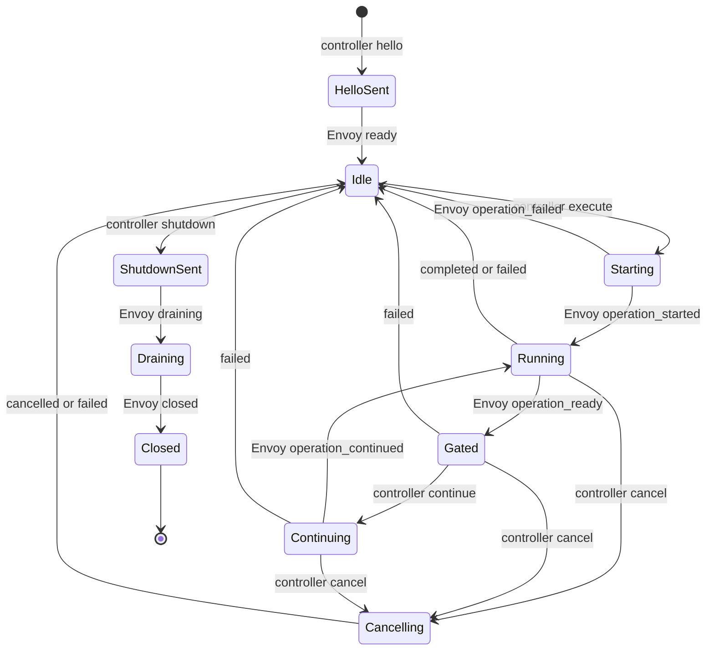

# OmegaFlow Envoy Protocol v1

## Status and scope

This document freezes the first controller/workload contract for the
[OmegaFlow Workload Envoy](../future/omegaflow-envoy-design.md). It is an
internal OmegaFlow release contract. Reploy provides the private network,
endpoint coordinates, bootstrap attachment, and authoritative lifecycle; it
does not transport or interpret these messages.

Version 1 covers:

- a full-duplex binary terminal channel;
- a bounded JSON Lines telemetry channel;
- the private NUL-framed Envoy-to-`awsh` descriptor protocol;
- state, ordering, resize, cancellation, shutdown, and failure rules;
- direct asciicast synthesis and exact raw-output retention; and
- the controlled Bash launch boundary.

It does not implement the Envoy process, PTY supervision, TCP listeners,
runtime mounting, or Reploy lifecycle integration. Those are later slices.

## Implementation and build contract

The workload Envoy is a dependency-free Go executable:

- module: `github.com/omry/omegaflow/runtime/envoy`;
- minimum toolchain: Go 1.25.x, matching Reploy;
- supported targets: `linux/amd64` and `linux/arm64`;
- `CGO_ENABLED=0`;
- no third-party module dependencies;
- `-trimpath -buildvcs=false`; and
- linker flags `-s -w -buildid=`.

The eventual production command is built from `./cmd/omegaflow-envoy`. Slice 1
does not add a placeholder command. Once the command exists, the release build
is equivalent to:

```text
CGO_ENABLED=0 GOOS=linux GOARCH=amd64 go build \
  -trimpath -buildvcs=false -ldflags='-s -w -buildid=' \
  -o omegaflow-envoy ./cmd/omegaflow-envoy
```

Release materialization records the source revision, Go version, target, file
size, and SHA-256 digest. Rebuilding the same source with the pinned Go patch
release and target must produce the same digest before the binary is added to
the runtime manifest.

## Connection establishment

The workload blueprint declares two lease-private TCP endpoints: terminal and
telemetry. The Envoy binds both listeners before starting Bash. It accepts one
connection on each listener and then closes both listeners.

The controller connects the terminal channel first and telemetry second. Its
first telemetry request is `hello`. The Envoy creates the PTY and persistent
Bash only after both connections and a valid `hello` exist. Its first event is
`ready`. Neither side sends another message before this exchange completes.

The channels have no application reconnect. EOF, reset, timeout, a second
connection, or traffic before the required handshake fails the capture.

## Global limits and timeouts

| Contract | Value |
| --- | ---: |
| Telemetry frame, including LF | 1,048,576 bytes |
| Private `awsh` frame | 1,048,576 bytes |
| Bash operation source | 786,432 UTF-8 bytes |
| Identifier | 1–64 ASCII identifier characters |
| Diagnostic message | 4,096 UTF-8 bytes |
| Reason | 256 UTF-8 bytes |
| Cwd | 4,096 UTF-8 bytes, absolute Linux path |
| Sequence and output offset | 1 through or 0 through `2^63-1`, respectively |
| PID | 1 through `2^31-1` |
| Terminal columns and rows | 1 through 1,000 |
| Connect deadline | 10 seconds |
| `hello`/`ready` deadline | 10 seconds |
| Individual control write | 5 seconds |
| Cancellation grace period | 5 seconds |
| Final drain | 5 seconds |

Operation duration is owned by the recording plan and is not a fixed Envoy
timeout. The controller converts an operation deadline into a typed `cancel`.

Identifiers match `[A-Za-z0-9][A-Za-z0-9._-]{0,63}`. Diagnostic codes match
`[a-z][a-z0-9-]{0,63}`. Strings reject NUL. Cwd values are lexical evidence
from Bash; the controller does not resolve them on its own filesystem.

## Terminal channel

The terminal connection is binary and full duplex:

- controller to Envoy: exact input bytes;
- Envoy to controller: exact PTY-master output bytes.

It has no record framing, JSON, lifecycle messages, presentation markers, or
shell-status markers. `^C` is byte `0x03`. The terminal line discipline and
foreground process group give it normal terminal behavior. Resize travels on
telemetry because it is a structured PTY-master operation.

The controller appends every received output byte to a private raw log before
using it anywhere else. A zero-based monotonically increasing offset is the
number of bytes durably appended. The raw log, not the asciicast, is canonical
for output ranges and diagnostics.

## Telemetry framing

Each telemetry message is one UTF-8 JSON object followed by one LF. Outgoing
frames use compact JSON and field order shown by the golden fixtures. Receivers
reject:

- missing LF, CRLF, embedded LF, NUL, or invalid UTF-8;
- invalid JSON, a non-object top level, duplicate fields, or non-finite numbers;
- unknown or missing fields;
- an unsupported `schema` or `type`;
- values outside the declared type or bounds; and
- frames over the byte limit, including an unterminated buffered frame.

Every message has `schema: "omegaflow-envoy-telemetry-v1"`, `type`, and a
positive `seq`. Controller and Envoy sequence spaces are independent, begin at
1, and increase by exactly one. A gap, duplicate, or regression is fatal.
Version 1 has no alternative-version offer: the `hello` schema selects v1 and
the `ready` schema confirms it. Any other schema fails the handshake instead of
being downgraded.

### Controller requests

| Type | Additional required fields |
| --- | --- |
| `hello` | `session_id` |
| `execute` | `operation_id`, `source` |
| `continue` | `operation_id`, `gate_id` |
| `cancel` | `operation_id`, `reason` |
| `resize` | `columns`, `rows` |
| `shutdown` | `reason` |

Operation source is trusted recording-plan Bash source. It is delivered on the
private control path and is not typed into the PTY.

### Envoy events

| Type | Additional required fields |
| --- | --- |
| `ready` | `envoy_pid`, `shell_pid`, `cwd`, `columns`, `rows` |
| `operation_started` | `operation_id`, `output_start` |
| `operation_ready` | `operation_id`, `gate_id`, `output_through` |
| `operation_continued` | `operation_id`, `gate_id`, `output_through` |
| `operation_completed` | `operation_id`, `status`, `cwd`, `output_start`, `output_through` |
| `operation_cancelled` | completion fields plus `reason` |
| `operation_failed` | range fields plus `code`, `message`, `cwd` |
| `resize_applied` | `columns`, `rows` |
| `diagnostic` | `severity`, `code`, `message`; optional `operation_id` |
| `draining` | `reason`, `output_through` |
| `closed` | `reason`, `output_through` |

Diagnostic severity is `info`, `warning`, `error`, or `fatal`. Codes are open
for forward-compatible diagnostics; code shape and message size remain bounded.
An unknown diagnostic code is retained, not reclassified as a protocol error.

## Session state machine

Only one top-level operation is active. Controller and Envoy messages jointly
advance this state machine:



`resize` is allowed in idle, starting, running, or gated states. Only one
resize may be outstanding, and it must be matched by `resize_applied` with the
same dimensions before another resize or shutdown. A bounded diagnostic is
allowed after `hello` and before `closed`. Every operation and gate event must
match the active identifiers. Any other transition fails closed.

## Output ordering barrier

`output_start` snapshots the raw-log offset at `operation_started`.
`output_through` is an exclusive raw-output offset. Before emitting an event
that contains `output_through`, the Envoy:

1. observes the corresponding `awsh` result;
2. drains all PTY bytes whose slave writes happened before that result write;
3. writes those bytes to the terminal socket in order; and
4. snapshots the resulting output offset for the telemetry event.

Because terminal and telemetry use different TCP connections, telemetry can be
received first. The controller does not act on the barrier until its raw log
has reached `output_through`. Offsets never regress. Completion ranges satisfy
`output_start <= output_through` and repeat the operation's original start.

Output from a surviving background job after a completion barrier is outside
that completed operation's range. It remains in the exact terminal stream and
is covered by a later barrier or final drain.

## Planned prompt and command presentation

Prompts and displayed commands are controller presentation, not workload
output. Before sending `execute`, the controller commits these events in order:

1. planned prompt;
2. typing-start timeline event;
3. displayed-command characters with planned timing;
4. displayed newline; and
5. typing-end timeline event.

It then sends `execute`. It synthesizes a following prompt only after the
completion event's output barrier is satisfied. Synthesized events carry
controller-presentation provenance and never enter the private raw-output log
or its byte offsets.

The direct writer produces asciicast v3 JSON Lines. Its first line is compact
JSON with `version: 3` and `term: {"cols": C, "rows": R}` using the initial
applied dimensions. Existing optional OmegaFlow header metadata such as title
is copied under its existing schema; the Envoy path adds no new public header
field. Later lines are compact three-item arrays:

```text
[DELTA_SECONDS,"o",TEXT]
[DELTA_SECONDS,"r","COLUMNSxROWS"]
```

`DELTA_SECONDS` is non-negative elapsed time since the preceding cast event,
with at most six decimal places. One controller-owned serialized writer assigns
the total order. It samples a monotonic clock for terminal reads and accepted
`resize_applied` events, clamps each sample to the last committed event time,
and quantizes the resulting absolute elapsed time to integer microseconds. Each
written delta is the difference between consecutive quantized absolute values,
so rounding error cannot accumulate across a long recording. Wall-clock
changes cannot affect event timing. Planned prompt and displayed-command output
uses the authored typing schedule on that same monotonic timeline and is
committed before `execute`. Equal-time events retain writer queue order. The
writer emits a resize event only after accepting the matching
`resize_applied`, using `columns` followed by `x` and `rows`. Terminal input
does not create an asciicast input event; ordinary PTY echo, if any, returns as
output.

Terminal bytes are decoded for asciicast output using one incremental UTF-8
decoder with replacement (`U+FFFD`) for invalid input and an EOF flush. Decoder
state spans TCP reads, so splitting a valid multi-byte character does not alter
it. Text completed by a later read uses that later read's timestamp; an EOF
replacement uses the final-drain timestamp. Empty decoded chunks are omitted.
The exact undecoded bytes remain in the private raw log.

## Action gates

The trusted operation source may call the `awsh` gate helper. `operation_ready`
is emitted only after its output barrier is established. Browser or controller
actions may then run. A matching `continue` releases only the current gate, and
`operation_continued` confirms release. Gate IDs cannot be reused within an
operation. Terminal input remains available while gated.

## Cancellation

`cancel` names the active operation and a bounded reason. The corresponding
`operation_cancelled.reason` must match it exactly. The Envoy sends
`SIGINT` to the PTY foreground process group and starts the five-second grace
period. If the persistent driver returns, the Envoy drains output and emits
`operation_cancelled` with the shell status, normally 130. If it does not
return, the Envoy terminates the persistent process group and emits
`operation_failed` with a stable code. A cancelled operation never emits
`operation_completed`.

Connection loss and controller-session cancellation use the same process-group
cleanup but fail the capture even if Bash later returns successfully.

## Resize

The controller sends the complete target `columns` and `rows`. The Envoy applies
`TIOCSWINSZ` to the PTY master and emits `resize_applied` only after success.
The kernel delivers `SIGWINCH` normally. A failed resize emits a fatal
diagnostic and fails the operation or session; it is never acknowledged with
different dimensions.

## Shutdown and drain

`shutdown` is valid only while idle. The following `draining.reason` must match
the shutdown reason exactly. The Envoy asks `awsh` to close, supervises
the persistent process group, drains the PTY to EOF, and emits `draining` with
the current barrier. It then half-closes terminal output and emits `closed`
with the final exclusive offset. The controller waits for both the raw log to
reach that offset and terminal EOF before finalizing its cast.

An early EOF or reset on either channel is a distinct failure. A telemetry EOF
between complete frames is not success until a valid `closed` was accepted.

## Private Envoy-to-`awsh` protocol

The private descriptor protocol uses UTF-8 fields separated and terminated by
NUL. Every frame starts with `awsh-v1` and a message type. Field arity is fixed
by type; NUL cannot appear in source or other values.

Requests:

```text
awsh-v1, execute, OPERATION_ID, BASH_SOURCE
awsh-v1, continue, OPERATION_ID, GATE_ID
awsh-v1, cancel, OPERATION_ID, REASON
awsh-v1, shutdown
```

Results:

```text
awsh-v1, ready, SHELL_PID, CWD
awsh-v1, started, OPERATION_ID
awsh-v1, gate_ready, OPERATION_ID, GATE_ID
awsh-v1, gate_continued, OPERATION_ID, GATE_ID
awsh-v1, completed, OPERATION_ID, STATUS, CWD
awsh-v1, protocol_error, CODE, MESSAGE
awsh-v1, closed, REASON, CWD
```

The Envoy validates and bounds a complete request before forwarding it. Partial
fields, unsupported types, invalid UTF-8, invalid arity, and premature EOF are
protocol failures. EOF with no partial field between frames is clean only after
the Envoy has requested shutdown; at any other time it is an unexpected shell
failure.

`cancel` is recorded on the descriptor when the driver is waiting at a gate.
While Bash is executing, signal delivery is authoritative and the eventual
driver result is translated into the public cancellation event.

## Controlled Bash launch

The production executable is fixed at `/bin/bash` and begins with
`--noprofile --norc`. It does not honor `AWSH_BASH`. Before launch, OmegaFlow
removes these delegated application variables:

```text
AWSH_BASH BASH_COMPAT BASHOPTS BASH_ENV BASH_XTRACEFD CDPATH ENV
GLOBIGNORE POSIXLY_CORRECT PROMPT_COMMAND PS0 PS1 PS2 PS3 PS4
SHELLOPTS TMOUT
```

It also removes every name beginning with `BASH_FUNC_`. Environment names must
be non-empty, contain neither `=` nor NUL, and values cannot contain NUL. Other
application values, including `PATH`, are delegated unchanged after this
control-plane baseline.

The Envoy owns the TCP sockets with close-on-exec. Bash receives only the PTY
slave and dedicated private request/result descriptors. Slice 2 must prevent
ordinary operation children from inheriting those driver descriptors.

## Failure mapping

Malformed, oversized, out-of-sequence, out-of-state, wrong-operation, and
regressing-offset messages fail closed. When possible, the side detecting a
failure records a bounded diagnostic before closing; diagnostic delivery is
best effort and never converts failure to success.

The controller retains partial raw output, cast, timeline, accepted telemetry,
and the structured local cause, then asks Reploy to terminate. Envoy success
never overrides a failed Reploy lifecycle or cleanup result.

## Conformance fixtures

The canonical corpus is under `tests/fixtures/envoy-protocol-v1`:

- `controller.jsonl`: exact controller request encodings;
- `envoy.jsonl`: exact Envoy event encodings; and
- `awsh-frames.json`: exact private frames represented as hexadecimal bytes.

Python controller tests and Go workload tests consume the same files. Schema
changes require a new version and new fixture directory; v1 fixtures are never
silently rewritten to represent a different contract.
