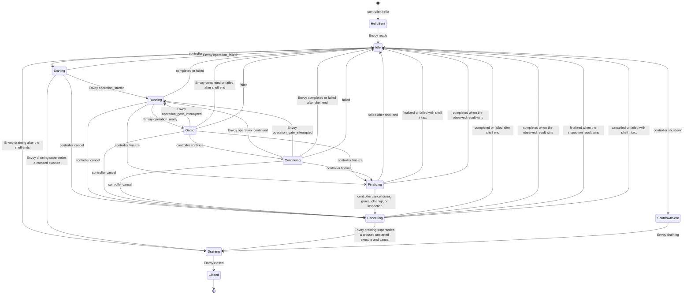

# OmegaFlow Envoy Protocol v1

## Status and scope

This document defines the first controller/workload contract for the
[OmegaFlow Workload Envoy](omegaflow-envoy-design.md). The current pre-release
inspection and external-Awsh amendments become frozen only after their design
slices are approved. It is an internal OmegaFlow release contract. Reploy
provides the private network, endpoint coordinates, bootstrap attachment, and
authoritative lifecycle; it does not transport or interpret these messages.

Version 1 covers:

- a full-duplex binary terminal channel;
- a bounded JSON Lines telemetry channel;
- the private shell-neutral Envoy-to-external-Awsh lifecycle protocol;
- bounded workload-side `file_exists` and `produces` inspection;
- state, ordering, resize, cancellation, shutdown, and failure rules;
- sender-stamped output marks carrying stream identity and timing;
- direct asciicast synthesis and exact raw-output retention; and
- the controlled external-Awsh and initial Bash launch boundary.

It does not implement the Envoy process, PTY supervision, TCP listeners, runtime
mounting, or Reploy lifecycle integration. A dependent implementation-plan
slice tracks delivery order.

The external-supervisor amendment preserves every controller request shape. It
adds only the public pre-start failure codes `source-invalid` and
`source-unsupported`, plus `operation_gate_interrupted` for terminal Ctrl-C
that releases a waiting gate without becoming lifecycle cancellation. All
other supervisor and source-submission changes remain private to Envoy and
Awsh.

## Implementation and build contract

The workload Envoy and external Awsh supervisor are dependency-free Go
executables built from one runtime module:

- module: `github.com/omry/omegaflow/runtime/envoy`;
- minimum toolchain: Go 1.25.x, matching Reploy;
- supported targets: `linux/amd64` and `linux/arm64`;
- `CGO_ENABLED=0`;
- no third-party module dependencies;
- `-trimpath -buildvcs=false`; and
- linker flags `-s -w -buildid=`.

The production commands are built from `./cmd/omegaflow-envoy` and
`./cmd/omegaflow-awsh`. This protocol slice adds neither placeholder. Once the
commands exist, the Envoy release build is equivalent to:

```text
CGO_ENABLED=0 GOOS=linux GOARCH=amd64 go build \
  -trimpath -buildvcs=false -ldflags='-s -w -buildid=' \
  -o omegaflow-envoy ./cmd/omegaflow-envoy
```

The corresponding Awsh build changes the output and package to `awsh` and
`./cmd/omegaflow-awsh`. Release materialization records the source revision,
Go version, target, file size, and SHA-256 digest for both binaries. Rebuilding
the same source with the pinned Go patch release and target must reproduce each
digest before either binary is added to the runtime manifest.

## Connection establishment

The workload blueprint declares two lease-private TCP endpoints: terminal and
telemetry. Envoy binds both listeners before starting Awsh. It accepts one
connection on each listener and then closes both listeners, so a later attempt
is refused by the kernel without the Envoy observing it and has no effect on the
capture.

The controller connects the terminal channel first and telemetry second. Its
first telemetry request is `hello`. Envoy creates the PTY and starts external
Awsh only after both connections and a valid `hello` exist; Awsh then directly
starts persistent Bash on the slave. Envoy emits public `ready` only after the
private Awsh readiness result identifies both processes and Envoy validates
their parent/child topology. Public `ready` remains shell-neutral and does not
expose the Awsh PID. Neither controller endpoint sends another message before
this exchange completes.

Controller OmegaFlow generates a fresh 128-bit random lowercase hexadecimal
`session_id` after Reploy reports the opened session and before it launches the
Envoy. It passes that value to the Envoy through the trusted bootstrap command's
`--session-id` argument and sends the same value in `hello.session_id`. The
Envoy requires an exact match before creating Awsh. The identifier binds the
two application channels to the exact Envoy invocation and gives retained
diagnostics a correlation key; it is not an authentication credential and
cannot authorize a Reploy operation or override Reploy lifecycle truth.

The channels have no application reconnect. EOF, reset, timeout, a second
connection completed while a listener is still open, or traffic before the
required handshake fails the capture.

## Global limits and timeouts

| Contract | Value |
| --- | ---: |
| Telemetry frame, including LF | 1,048,576 bytes |
| Private `awsh` frame | 1,048,576 bytes |
| Operation source (Bash in v1) | 1–786,432 UTF-8 bytes |
| Output-mark cadence | 10 milliseconds |
| Output marks per session | 1,000,000 |
| Session elapsed microseconds | 0 through `2^63-1` |
| Identifier | 1–64 ASCII identifier characters |
| Diagnostic message | 1–4,096 UTF-8 bytes |
| Reason | 1–256 UTF-8 bytes |
| Cwd | 1–4,096 UTF-8 bytes, absolute Linux path |
| Inspection specifications per operation | 0–64 |
| Inspection configured or resolved path | 1–4,096 UTF-8 bytes |
| Produced-output identifier | 1–64 ASCII identifier characters |
| Directory entries inspected per operation | 100,000 |
| Regular-file bytes hashed per operation | 16 GiB |
| Symlink target | 0–4,096 bytes |
| Sequence | 1 through `2^63-1` |
| Output offset | 0 through `2^63-1` |
| Terminal input watermark | 0 through `2^63-1`, non-decreasing |
| Terminal input barrier wait | 5 seconds |
| Raw output per session | 8 GiB |
| PID | 1 through `2^31-1` |
| Shell status | 0 through 255 |
| Terminal columns and rows | 1 through 1,000 |
| Connect deadline | 10 seconds |
| `hello`/`ready` deadline | 10 seconds |
| Individual control write | 5 seconds |
| Cancellation grace period | 5 seconds |
| Operation cleanup | 5 seconds |
| Final drain | 5 seconds |

Operation duration is owned by the recording plan and is not a fixed Envoy
timeout. The controller converts an operation deadline into a typed `cancel`.

The timeout values above have the following normative ownership. Every timer
uses its owner's monotonic clock, is scoped to one session, and does not reset
on partial progress.

| Deadline | Owner and epoch | Covered work | Timeout result |
| --- | --- | --- | --- |
| Controller connect | Controller; starts after the complete bootstrap `exec` command and newline have been written | Resolve the two already-opened coordinates and complete the terminal connection followed by the telemetry connection within one shared 10-second budget | Fail the capture and ask Reploy to terminate |
| Envoy accept | Envoy; starts after both listeners are bound | Accept the one terminal connection and one telemetry connection within one shared 10-second budget | Emit a best-effort fatal diagnostic, close both listeners and accepted sockets, and exit nonzero |
| Envoy `hello` | Envoy; starts after both connections are accepted | Read and validate one complete `hello` frame, including the exact `session_id`, within 10 seconds | Fail the handshake and exit nonzero |
| Controller `ready` | Controller; starts after the complete `hello` frame is written | Read and validate one complete `ready` frame within 10 seconds | Fail the capture and ask Reploy to terminate |
| Individual control write | Sender; starts with the first attempted transport write of one already-encoded frame | Write every byte of one telemetry JSON Lines frame or one private Awsh frame within 5 seconds; terminal input and workload-output bytes are excluded | Fail the session; delivery of a partial frame never becomes success |
| Envoy operation cleanup | Envoy; starts when it begins mandatory cleanup after an Awsh completion, cancellation, finalization, or shell-exit result | Census, terminate, reap, reach operation-pipe EOF, and drain all operation-created processes and output within 5 seconds | Emit a best-effort fatal `operation-cleanup` diagnostic, close the Envoy-owned operation descriptors and session channels, and exit nonzero; no terminal operation result is emitted, and the controller fails the capture and asks Reploy to terminate |
| Envoy inspection cancellation | Envoy; starts when it accepts `cancel` while the operation's inspection worker is live | Stop and reap the worker within the five-second cancellation grace period | Emit a best-effort fatal `inspection-cancel-timeout` diagnostic, close the session channels, and exit nonzero; no terminal operation result is emitted, and the controller records the cause and asks Reploy to terminate |
| Envoy final drain | Envoy; starts when it accepts `shutdown` or enters an Envoy-initiated drain | Close Awsh, supervise the persistent Awsh process and selected-shell tree, drain terminal output, and emit `closed` within 5 seconds | Emit a best-effort fatal diagnostic and exit nonzero |
| Controller final drain | Controller; starts when it accepts `draining` | Receive `closed`, retain raw output through its final offset, and observe terminal EOF within 5 seconds | Fail the capture and ask Reploy to terminate |

The two connect timers and the two handshake timers are intentionally
independent actor-local bounds. A timeout on either side is sufficient to fail
the session; neither side extends its timer because the other side made partial
progress.

Every field limit is additionally constrained by the enclosing telemetry or
private-frame limit. Reaching an individual field maximum does not guarantee
that the field can be combined with every other maximum-sized field. Encoders
must validate the complete encoded frame before writing it, and receivers
reject an otherwise field-valid frame that exceeds its enclosing limit.

Identifiers match `[A-Za-z0-9][A-Za-z0-9._-]{0,63}`. Diagnostic codes match
`[a-z][a-z0-9-]{0,63}`. Strings reject NUL. Cwd values are lexical evidence
from Bash; the controller does not resolve them on its own filesystem.

## Terminal channel

The terminal connection is binary and full duplex:

- controller to Envoy: exact input bytes;
- Envoy to controller: exact post-line-discipline PTY-master bytes for an
  attached operation, or Envoy-ordered stdout/stderr pipe bytes for a
  split-stream operation.

It has no record framing, JSON, lifecycle messages, presentation markers, or
shell-status markers. `^C` is byte `0x03`. The terminal line discipline and
foreground process group give it normal terminal behavior. Resize travels on
telemetry because it is a structured PTY-master operation.

Because the channel carries no framing, it carries no operation identity either,
so the binding between input and operation is a contract rule rather than a
field. Every terminal byte the controller writes is authored against one
operation: there is no person at a keyboard, so there is no type-ahead the
recording must preserve. The Envoy therefore discards terminal input that
arrives while the session is idle, and when an operation ends it drains input
the line discipline has queued but the workload has not consumed. Input a gated
operation is still entitled to receive is unaffected, since such an operation
has not ended, and so is anything the workload already read.

Those two rules govern bytes the Envoy already holds, which is not enough on its
own: terminal and telemetry are separate connections and nothing orders one
against the other, so input can still be in flight when a telemetry request that
depends on it arrives. `execute` and `continue` therefore carry
`input_through`, the running count of terminal bytes the controller has written
since the session began. The Envoy does not start an operation or release its
gate until its own terminal read count reaches that request's value. Input that
arrives while `execute` waits belongs to an operation that has ended and is
discarded under the rule above; input that arrives while `continue` waits still
belongs to the gated operation and remains available to it after release. The
count is a barrier rather than framing, so the channel stays exact bytes with no
record structure, and it needs no acknowledgement round trip because the
controller is the only writer and the Envoy the only reader.

The controller appends every received output byte to a private raw log before
using it anywhere else. A zero-based monotonically increasing offset is the
number of bytes durably appended. The raw log, not the asciicast, is canonical
for output ranges and diagnostics.

Lossless retention needs a volume bound, because the operation timeouts bound
duration rather than output and mark coalescing keeps the mark budget almost
unchanged under a flood. A command such as `yes` would otherwise fill the
controller's disk and take the recording host with it. The raw log is therefore
capped per session, and reaching the cap is a typed session failure: the
controller stops appending, emits a bounded diagnostic, and fails the capture
rather than truncating a log whose whole contract is that it is exact.

## Telemetry framing

Each telemetry message is one UTF-8 JSON object followed by one LF. Outgoing
frames use compact JSON and field order shown by the golden fixtures. Receivers
reject:

- missing LF, CRLF, embedded LF, NUL, or invalid UTF-8;
- invalid JSON, a non-object top level, duplicate fields, or non-finite numbers;
- unknown or missing fields;
- an unsupported `schema` or `type`;
- values outside the declared type or bounds; and
- frames over the byte limit, including an unterminated buffered frame.

Every message has `schema: "omegaflow-envoy-telemetry-v1"`, `type`, and a
positive `seq`. Controller and Envoy sequence spaces are independent, begin at
1, and increase by exactly one. A gap, duplicate, or regression is fatal.
Version 1 has no alternative-version offer: the `hello` schema selects v1 and
the `ready` schema confirms it. Any other schema fails the handshake instead of
being downgraded.

### Controller requests

| Type | Additional required fields |
| --- | --- |
| `hello` | `session_id` |
| `execute` | `operation_id`, `source`, `execution_shape`, `timing`, `publication`, `observation`, `inspections`, `input_through` |
| `continue` | `operation_id`, `gate_id`, `input_through` |
| `cancel` | `operation_id`, `reason` |
| `finalize` | `operation_id`, `reason` |
| `resize` | `columns`, `rows` |
| `shutdown` | `reason` |

Operation source is trusted recording-plan Bash source. It is delivered on the
private control path and is not typed into the PTY.

The compiled execution policy uses these closed enums:

- `execution_shape`: `pty` or `split`;
- `timing`: `realtime` or `presentation`;
- `publication`: `real`, `suppress`, or `replace`; and
- `observation`: `shared` or `exclusive`.

`input_through` is not part of that policy: it is the terminal-input barrier
defined under Terminal channel. The Envoy holds an operation in `Starting`, or
a gate in `Continuing`, until its terminal read count reaches the request's
watermark. It is a non-negative 64-bit count under the global limits and never
decreases across a session. The Envoy rejects a value outside that type or below
the previous watermark, which is the whole of what it can check: it cannot know
what the controller has written, only what it has read. A watermark that is
merely never reached is therefore not a validation failure but a wait, and the
terminal input barrier wait bounds it. Expiry while `execute` is in `Starting`
fails the not-yet-started operation with `input-barrier-timeout`. Expiry while
`continue` is in `Continuing` is fatal to the session: the operation is still
blocked inside its gate, so no ordinary terminal operation result or later
operation is possible.

Realtime timing requires PTY execution and real publication. Presentation
timing requires split execution and exclusive observation. Suppressed and
replaced output require exclusive observation.

Protocol v1 has one process-lifetime rule rather than a configurable field.
When the submitted Bash source returns to Awsh, the Envoy terminates and reaps
every remaining process created by that operation before it reports a terminal
operation result. This rule applies to every publication, timing, and
observation mode; `observation` does not select process lifetime. `nohup`,
`disown`, `setsid`, daemonization, and double-forking do not make an operation
process session-lived. One operation is one submitted Bash source; several shell
statements within that source share this one cleanup boundary. A service that
must outlive an operation is workload setup and must start outside the
controlled Envoy/Awsh process tree. Session-lifetime subprocess support may be
added in a later protocol version if a compelling use case cannot be handled by
setup; v1 does not provide it.

Presentation timing still requires exclusive observation because its authored
schedule needs a closed operation range and an output-through drain boundary
before the terminal result becomes visible. Replacement text and authored
presentation delays stay controller-private and are not sent to the Envoy.

`inspections` is an array, including when empty. Each entry is an exact object
with a unique `inspection_id`, a `kind`, and a configured `path`. `kind` is
`file_exists` or `produces`. A `file_exists` entry has no other fields. A
`produces` entry additionally requires `producer_id` and `output_id`; both are
identifiers. Paths are trusted recording-plan values, not shell output, but
remain bounded and reject NUL. An operation with inspections requires
`exclusive` observation. Resolution and hashing run only after the universal
operation cleanup has closed and reaped every remaining operation process.

Controller OmegaFlow assigns inspection IDs deterministically in request order
as `inspection-1`, `inspection-2`, and so on. It retains that compilation map
with the operation. Results remain in request order and repeat the ID;
`produces` results additionally retain the authored producer and output IDs.

### Envoy events

| Type | Additional required fields |
| --- | --- |
| `ready` | `envoy_pid`, `shell_pid`, `cwd`, `columns`, `rows`, `elapsed_us` |
| `operation_started` | `operation_id`, `output_start` |
| `operation_ready` | `operation_id`, `gate_id`, `output_through` |
| `operation_continued` | `operation_id`, `gate_id`, `output_through` |
| `operation_gate_interrupted` | `operation_id`, `gate_id`, `output_through` |
| `output_mark` | `offset`, `stream`, `elapsed_us` |
| `operation_completed` | `operation_id`, `status`, `cwd`, `output_start`, `output_through`, `inspection_results`, and `shell_ended`, boolean `true`, present only when the operation's shell did not survive it |
| `operation_cancelled` | `operation_id`, `cwd`, `output_start`, `output_through`, `reason`, and `status` unless the operation was cancelled before it started; no inspection results |
| `operation_finalized` | `operation_id`, `cwd`, `output_start`, `output_through`, `reason`, `inspection_results`; no status |
| `operation_failed` | `operation_id`, `output_start`, `output_through`, `code`, `message`, `cwd`, and `shell_ended`, boolean `true`, present only when the operation's shell did not survive it |
| `resize_applied` | `columns`, `rows`, `elapsed_us`, `output_through` |
| `diagnostic` | `severity`, `code`, `message`; optional `operation_id` |
| `draining` | `reason`, `output_through` |
| `closed` | `reason`, `output_through` |

Diagnostic severity is `info`, `warning`, `error`, or `fatal`. Codes are open
for forward-compatible diagnostics; code shape and message size remain bounded.
An unknown diagnostic code is retained, not reclassified as a protocol error.

`output_mark` attributes raw output to a logical stream and to sender time. It
is session-scoped rather than operation-scoped, because output can arrive
between operations. `offset` is the raw-log offset at which the attribution
begins, `stream` is `pty`, `stdout`, or `stderr`, and `elapsed_us` is the
Envoy's monotonic microseconds since the session epoch established by
`ready`; `ready` itself carries `elapsed_us` 0, the instant it is stamped. A
mark attributes every byte from its `offset` until the next mark's `offset`.

The current mark stream is deterministic even when a required boundary mark
attributes no bytes. Before any output source has selected a stream, the
current stream for a boundary-only mark is `pty`; this initialization does not
emit an extra mark at `ready`. A mark that precedes actual bytes selects their
real source, including `stdout` or `stderr` for the first bytes of a split
operation. A required boundary mark with no newly attributed bytes repeats the
current stream. Equal-offset marks are legal: the earlier mark then attributes
nothing, so the first split-stream source can replace an initial or repeated
`pty` boundary mark at the same offset before writing its first byte. The first
output-free PTY or split operation, and a first operation that fails or is
cancelled before starting, therefore use `pty` for every otherwise-ambiguous
boundary mark without claiming that the operation executed through the PTY.

All output read from a PTY master is attributed `pty`, including terminal echo
caused by controller-authored input. The workload owns its terminal modes, and
Linux exposes no reliable boundary that proves an authored write has completed
line-discipline processing and that all resulting echo has reached the master.
The protocol therefore does not attempt to distinguish echo from application
output.

OmegaFlow rejects `output_contains` and `output_regex` before `execute` when a
PTY operation, including any of its continuations, sends authored bytes through
a `text`, `key`, or `control` input step. `wait_for` and `pause` send no bytes
and do not trigger that restriction. `wait_for` matches the visible terminal
transcript, including echo, and is only a sequencing mechanism; it is not
assertion evidence. Exit-status assertions and workload inspections remain
valid for operations that send input. A later non-interactive operation can
perform output or content verification when an interactive operation needs it.

The Envoy emits a mark when the stream identity changes, when at least the mark
cadence has elapsed and new bytes exist, and immediately before any event
carrying `output_start` or `output_through`. Marking both range-opening and
range-closing events is what supplies the timeline anchors the asciicast writer
re-anchors on, without a separate timestamp field. It coalesces otherwise. The
mark budget is session-wide rather than per-operation, because a mark carries no
`operation_id` and output surviving from an earlier operation can arrive while
the session is idle or while a later operation runs; neither endpoint could
charge such a mark to an operation. Exhausting the session budget is a session
failure, not a partial success. Marks never regress in `offset` or `elapsed_us`,
and a mark's `offset` never exceeds the bytes already written to the terminal
socket, so a mark is never visible before the bytes it describes. A split-stream
operation therefore carries `stdout` and `stderr` marks over its interleaved
terminal range; a PTY operation carries `pty` marks, its PTY bytes are logical
stdout, and logical stderr is empty.

Logical stdout and logical stderr are slices of the controller's raw log
selected by stream attribution. The Envoy sends no copy of workload output on
telemetry, so assertion evidence is the complete retained output rather than a
bounded excerpt.

A split-stream operation's stdout and stderr pipes are Envoy-owned. The Envoy
keeps both readers open while it cleans up the operation, drains every byte
through their EOF boundaries, and closes them before the typed terminal result.
No operation-owned pipe or writer survives that result.

Awsh reports that the submitted source returned; Envoy retains process-tree
policy and the decision that cleanup is complete. Envoy is Awsh's direct parent
and the Linux subreaper; Awsh is the selected shell's direct parent and reaps
that shell. Envoy tracks live descendants with pidfds and `/proc`, terminates
operation descendants of the selected shell, and reaps non-shell children it
adopts when an intermediate parent exits. Awsh and the selected shell remain
responsible for their own direct children while alive. Envoy repeats census,
termination, adopted-child reaping, pipe EOF, and drain until external Awsh and
the selected shell are the only processes left in the controlled tree. The
operation-cleanup deadline covers that whole sequence on one
monotonic timer and does not reset when a process exits or output advances. If
the boundary is not clean before the deadline, the Envoy takes the fatal
session-failure path defined in the timeout table; it does not emit a terminal
operation result or accept another `execute`. Because v1 never retains a
process from an earlier operation, an adopted
non-shell child cannot be an earlier permitted service: it belongs to the
operation being closed. The next `execute` is not accepted until this boundary
passes. Failure to acquire a required pidfd, complete a census, terminate or
reap a process, observe EOF, or retain the state needed for cleanup is a fatal
session failure taking that same no-terminal-result path; the Envoy never
continues with a partially cleaned tree.

Tracking has no protocol-level numeric admission limit. Host or container
PID/fd exhaustion may surface first and is a failed Reploy lifecycle, not a
typed claim that the Envoy rejected a particular fork. A future deterministic
ceiling remains a Reploy-owned kernel-enforced workload/session process domain,
such as a cgroup PIDs limit with stated overhead and cleanup semantics.
Per-operation process admission is not part of protocol v1.

After natural completion or planned finalization, permitted output assertions
consume logical stdout followed by logical stderr. A PTY operation that sent
authored input cannot have such an assertion, as specified above. Each stream
is decoded on its own —
UTF-8 with replacement, and the decoder flushed at the end of that stream — and
the decoded texts are then concatenated. Decoding after concatenation would let
a truncated sequence at the end of stdout join a continuation byte at the start
of stderr into a character neither stream contains: stdout ending `0xC3` and
stderr beginning `0xA9` must read as two replacement characters, as the native
runner produces them, not as `é`. This is the assertion decoder, separate from
the asciicast decoder specified later, which serves a different stream. Output
assertions never consume temporal terminal order or infer stream identity from
PTY bytes. Cancellation and failure discard partial assertion evidence instead
of evaluating it.

### Workload inspection

`inspection_results` is an array in request order, including when empty. Each
result repeats `inspection_id` and `kind`, and contains an absolute
`resolved_path` and `path_kind`. `path_kind` is `file`, `directory`, or `other`.
A `file_exists` result has no digest or producer fields. A `produces` result
allows only `file` or `directory`, repeats `producer_id` and `output_id`, and
contains `sha256`, a 64-character lowercase SHA-256 digest. A `directory` result
also carries `digest_algorithm`, the tag that domain-separated the hash input —
`directory-v2` for anything this protocol produces, `directory` for a record the
native runner made. The tag is not recoverable from the digest, so without it a
retained record could not say which algorithm produced it, and the promise that
a recording stays identifiable under its own tag would not survive migration.
Downstream retained records carry it with the digest.

After Bash returns or a planned finalization closes the operation, `awsh`
resolves configured paths using the persistent Bash process's resulting cwd and
exported environment. It sends only the resolved plan to the Envoy over the
private descriptor. The controller never resolves a workload path, starts a
probe operation, or infers filesystem state from terminal output.

Resolution preserves the current native runner's successful path behavior. It
expands `$NAME` and `${NAME}` from the exported environment when the name is
defined and leaves an undefined or malformed reference literal. A leading `~`
uses `HOME` when set and otherwise the workload's user database for the current
effective identity; a leading `~user` uses that database when the named user
exists. An unresolved home expression remains literal and will ordinarily fail
the subsequent existence check. Resolution performs no command substitution,
arithmetic expansion, word splitting, or globbing. The expanded relative path
is anchored at the resulting cwd. After existence is established, the Envoy
reports the absolute canonical path.

Inspection is the final part of an exclusive operation boundary. The Envoy
first receives the Awsh result and resolved plan, completes the universal
operation cleanup, proves that only the persistent shell remains in its
controlled tree, and drains output through the operation's closing offset. Only
then may it inspect or hash workload paths. It runs the complete resolved plan
in one short-lived, Envoy-supervised worker process. The worker is a restricted
mode of the Envoy executable, not another service or protocol peer; it inherits
no terminal, telemetry, Awsh, or Reploy channel and returns only the bounded
inspection result over an Envoy-owned pipe. This process boundary makes a
filesystem read that blocks in the kernel independently supervised: the parent
can request termination and bound how long it waits to reap, while the fatal
fallback below prevents unreaped work from overlapping another operation.
Cleanup or drain failure emits no inspection results. The Envoy emits
`operation_completed` or `operation_finalized` only after inspection succeeds;
its `output_through` is therefore already stable when results become visible.
This closes races from cooperative operation-created background processes; it
does not make hashes tamper-proof against another process already running under
the same workload identity.

A `produces` inspection additionally accepts a digest only from one observed
stable source state. Starting at a descriptor for `/`, the worker resolves the
canonical selected path through a retained no-follow descriptor chain and
records the identity of every path component. It records the selected object's
kind, device and inode identity, mode, size, and nanosecond modification and
change times from its descriptor. For a selected directory, it then traverses
descriptor-relative and records a complete first snapshot in sorted
relative-path order with those same fields for every descendant and, for a
symlink, its exact target. Special entries participate in stability comparison
even though the directory digest omits them.

A selected top-level regular file is read from its retained descriptor. Every
regular file below a selected directory is opened descriptor-relative without
following a symlink. In both cases, `fstat` before reading must match the first
snapshot, the worker hashes exactly the recorded size followed by an EOF check,
and `fstat` afterwards must still match the snapshot and the pre-read result. A
short, long, or otherwise inconsistent read is instability, not a digest.

After every selected regular file is hashed, the worker performs a fresh
descriptor-relative traversal when the selection is a directory and records
the same complete sorted snapshot. The two snapshots must match exactly,
including directory membership and every recorded identity, kind, metadata
value, and symlink target. The worker also resolves the canonical selected path
again from `/`; every path component must retain its first identity, the
selected entry must still name the retained top-level descriptor, and that
descriptor's metadata must match its first snapshot. A filesystem that cannot
supply these stable identities and nanosecond metadata cannot establish this
contract. Any observed change or inability to establish stability emits
`operation_failed` with `inspection-unstable` and no digest or inspection
result. This algorithm detects observed concurrent mutation by ordinary setup
services; within the documented same-identity trust boundary it remains
correctness evidence rather than tamper-proof security evidence.

The Envoy rejects a missing `file_exists` path. A `produces` path must exist and
resolve to a regular file or directory. A regular-file digest covers its exact
bytes. A directory digest traverses entries in sorted relative POSIX-path order
and hashes fixed-size framing rather than delimited text, because delimiters are
not injective over arbitrary file bytes: one file whose contents happen to
contain the delimiter and a following entry's framing would otherwise hash
identically to two files, giving distinct trees the same digest without any
SHA-256 collision. Each entry contributes a one-byte kind tag — ASCII `f` for a
regular file, `d` for a directory, `l` for a symlink, and no other value — the
SHA-256 of its path, and the SHA-256 of its payload — the target for a symlink,
the exact bytes for a regular file, and the empty string for a directory — so
every entry occupies the same 65 bytes whatever it contains. The digest is the
lowercase SHA-256 over the literal `directory-v2` tag followed by those entries
in order. The tag is versioned because this is a deliberate break: the native
runner's encoding, tagged `directory`, is the delimited form whose ambiguity
this replaces, so the two disagree on every directory including the empty one,
and a digest is an identity that must not change silently with the runner that
produced it. Paths and symlink targets must be UTF-8. As in the native runner, a
special entry nested inside a produced directory is omitted from the digest; a
symlink is always recorded as a link and is not followed. A top-level produced
path of a special type still fails with `inspection-type`. The amended canonical
fixtures freeze representative encodings, including nested special entries. File
contents never travel over telemetry.

Resolution, unsupported file type, traversal, instability, read, or hashing
failure emits `operation_failed` with `inspection-resolution`, `inspection-missing`,
`inspection-type`, `inspection-limit`, `inspection-unstable`, or
`inspection-read`. Cancellation and ordinary failure produce no inspection
results. The Envoy applies the global entry limit independently to each complete
snapshot and the byte limit to the intervening regular-file reads; exceeding
either is an inspection failure rather than a partial success. The operation
deadline stays controller-owned and reaches a long-running inspection, when it
expires, as a typed `cancel`.

Absolute resolved paths and digests are private run evidence. They are not
presentation or publication data and must not enter a published bundle unless a
separately specified publication contract explicitly selects and sanitizes
them.

## Session state machine

Only one top-level operation is active. Controller and Envoy messages jointly
advance this state machine:



`resize` is allowed in idle, starting, running, gated, or continuing states;
continuing is included because it is running-equivalent for the PTY, so a
controller may pipeline `continue` and `resize` without waiting for
`operation_continued`. Only one resize may be outstanding. It must be matched
by `resize_applied` with the same dimensions before another resize or
controller-requested shutdown, unless an
Envoy-initiated `draining` resolves it first. On that drain the controller
clears the outstanding resize without publishing it. A bounded diagnostic is
allowed after `hello` and before `closed`. Every operation and gate event must
match the active identifiers. The shell-end transitions are entered by Envoy
rather than by a controller message. External Awsh explicitly reports
`shell_exit` with the active operation ID or an empty ID, the status it reaped,
and the last valid cwd. An active operation reaches `Idle` through
`operation_completed` carrying that status — unless it declared inspections or
still holds an unresolved gate, which the ended shell can no longer resolve, in which
case it reaches `Idle` through `operation_failed` instead, because an authored
requirement that cannot be evaluated must not be reported as met; that
`operation_failed` carries `shell_ended` exactly as the completion does, so the
controller still learns the shell is gone. Any operation terminal result carrying
`shell_ended`, including a cancellation or finalization timeout, is followed by
`Idle --> Draining`; no prompt is synthesized and no later operation starts.
That drain is Envoy-initiated, so no request supplies its reason: `draining` and
`closed` both carry reason `shell_ended` on this path, exactly as they carry the
controller's shutdown reason on the requested one, which is what lets the golden
fixtures freeze one shell-exit sequence. A `shell_exit` that arrives while the
session is idle — a workload killed between operations — takes the same drain
path with the same reasons; there is no operation to report. Because these transitions are
Envoy-initiated, a controller request already in flight when the shell ends —
the next `execute`, a `cancel` derived from that crossed execute, a `resize`, or
`shutdown` — can arrive after them; it is accepted and discarded exactly like a
request that crossed its own terminal result, and a recording with a beat left
to run still fails from that beat being unrunnable rather than from the
crossing.

Shutdown uses the same observed-result-wins rule at idle. If Envoy accepts an
Awsh `shell_exit` before it accepts `shutdown`, the
Envoy-initiated `shell_ended` drain is authoritative. A controller that has
already sent the request and entered `ShutdownSent` accepts that reason and
treats the crossed shutdown as resolved; the request is discarded if it later
reaches the draining Envoy. If the Envoy accepts `shutdown` first, the requested
shutdown reason remains authoritative and a later `shell_exit` is clean under
that requested drain. Thus transport ordering cannot turn either clean outcome
into a protocol failure.

`Starting` can last as long as the terminal-input barrier makes it last, so it
accepts `cancel` like the running states do. A cancel there needs no signal,
because the operation has not begun: the Envoy abandons the wait, discards the
input it was waiting through as belonging to an ended operation, and reports
`operation_cancelled` with an empty range and no `status`. No shell ran, so
there is no status to report and none is invented; this is the only case in
which that field is absent, and it parallels `operation_finalized`, which has no
status for the same reason. The wait is bounded anyway: the barrier only waits
for bytes the controller has already written, so exceeding the terminal input
barrier wait means they are never arriving, and the Envoy fails the operation
rather than holding the session.

If cancellation has moved a started operation to `Cancelling` but Awsh's
`shell_exit` is accepted before a cancellation result is committed, the
observed shell end wins. Envoy emits the same `operation_completed` or
`operation_failed` carrying `shell_ended` that it would have emitted from a
running state, then enters the Envoy-initiated drain. It does not conceal the
dead shell behind `operation_cancelled`, and the controller treats that terminal
result as resolving its crossed cancel request.

Two crossing families are accepted in states that have no transition for them,
because TCP ordering is directional and the controller can act on a state the
Envoy has already left. A `cancel` or `finalize` naming an operation whose
terminal result the Envoy has already sent is accepted and discarded while it is
still the most recent operation, and the next `execute` supersedes it; the
controller resolves its own request when the terminal result arrives and does
not additionally wait for `operation_cancelled` or `operation_finalized`. And
any request already in flight when the shell ends — the next `execute`, a
`cancel` derived from that crossed execute, or a `resize` — is accepted and
discarded after the Envoy-initiated drain begins, as
the shell-end rules above describe. Receipt of that `draining` resolves a
controller's outstanding resize; the discarded request produces no
`resize_applied` and no resize event in the recording. If the Envoy applies the
resize first, its `resize_applied` precedes `draining` and resolves the request
normally. The `Starting --> Draining` edge exists because a controller that sent
that `execute` has already left `Idle` when the `draining` it crossed arrives.
If its deadline also sent `cancel` before that drain arrived, the controller has
instead reached `Cancelling`; the corresponding `Cancelling --> Draining` edge
resolves both requests. The Envoy accepts and discards whichever of the crossed
`execute` and `cancel` arrive after draining begins. Because the operation never
started, it emits no terminal operation result, and the recording still fails
from the planned beat being unrunnable rather than from either crossing.
Any other transition fails closed.

## Output ordering barrier

An exclusive operation has an additional barrier while it is in `Starting`.
The preceding operation has already completed universal process cleanup and
closed its split-stream pipes. The Envoy nevertheless takes a fresh PTY drain
boundary, writes every preceding byte to the terminal socket, and emits the
covering output mark. Only after that drain may it snapshot `output_start`,
emit `operation_started`, and acknowledge Awsh's `started` result so Awsh can
release Bash to evaluate the new source. Failure to drain or write the preceding bytes
fails the operation before it opens a range.

`output_start` snapshots the raw-log offset at `operation_started`, and the
snapshot happens before Bash is released rather than after. If Envoy
snapshotted on receiving `started`, a fast
command could already have written and the pump already appended before the
snapshot, putting the operation's first bytes outside its own range — missed by
assertions, and for `suppress` or `replace` published as session-scoped output
the policy was supposed to withhold. Awsh therefore writes `started` and waits
for Envoy's `started_ack`; only then does it release Bash. Envoy takes the
offset before sending that acknowledgement, so no byte of the operation can
precede its own start. An
operation that fails before `operation_started` has no such snapshot, so its
`operation_failed` sets both `output_start` and `output_through` to the offset
observed at the failure, not the one observed when the `execute` was accepted.
Either gives an empty range satisfying `output_start <= output_through` without
claiming output the operation never produced. Taking the later offset also
respects the non-regressing rule when terminal output or a resize advances the
session offset while the operation waits in `Starting`. A pre-start failure is
the only case in which an operation reports a range it did not open.
`output_through` is an exclusive raw-output offset. Before emitting an event
that contains `output_through`, the Envoy:

1. observes the corresponding `awsh` result;
2. drains all PTY bytes, or split stdout/stderr pipe bytes, whose writes
   happened before that result write;
3. writes those bytes to the terminal socket in order; and
4. snapshots the resulting output offset for the telemetry event.

An operation whose shell ended observes Awsh's `shell_exit` result. Awsh writes
it only after reaping the selected shell, so the reap remains a real
happens-before boundary: output written immediately before `exit 7` is inside
the range. Envoy then performs the same drain, write, and offset snapshot as for
another Awsh terminal result.

A pre-start terminal event — the `operation_failed` or `operation_cancelled` of
an operation that never started — has no result to observe either, and none will
ever exist. The Envoy drains and writes the bytes the pump already holds, then
snapshots the offset at the event for both ends of the empty range, which is the
same offset the pre-start failure rule above already requires. Its `cwd` is the
most recent one reported — by the previous operation's result, or by `ready`
when none has completed — since the operation itself exchanged nothing with the
Awsh backend.

A resize has a private Awsh transaction rather than an operation result. Envoy
linearizes every accepted resize in the output pump's order and asks Awsh to
reserve the shell-side terminal lane. The pump closes the finite prefix already
admitted from every output source it orders — the PTY master and each active
split stdout/stderr pipe — appends and writes those bytes, and emits their
covering marks. Envoy then snapshots `output_through` and asks Awsh to apply the
dimensions. It emits `resize_applied` only after Awsh reports success. A source
chunk admitted by the pump after that boundary is ordered after the resize even
if the workload write raced it; this is the Envoy's observable sender order,
not a claim about syscall wall-clock order. Continuous output cannot starve the
resize because the barrier closes the prefix already admitted when the resize
is linearized rather than waiting for every source to become empty.

Because terminal and telemetry use different TCP connections, telemetry can be
received first. The controller does not act on the barrier until its raw log
has reached `output_through`. Offsets never regress. Completion ranges satisfy
`output_start <= output_through` and repeat the operation's original start.

For split execution the Envoy emits the marks covering an operation's range
before the terminal result. Marks carry offsets and stream identity rather than
output bytes, so the terminal connection remains the only path workload output
travels. The completion barrier remains the cross-channel authority: the
controller does not evaluate a mark until its raw log has reached that mark's
offset.

An operation terminal result closes all output from that operation. No
operation-owned process or pipe can add bytes after its completion barrier.

## Planned prompt and command presentation

Prompts and displayed commands are controller presentation, not workload
output. Before sending `execute`, the controller commits these events in order:

1. planned prompt;
2. typing-start timeline event;
3. displayed-command characters with planned timing;
4. displayed newline; and
5. typing-end timeline event.

It then sends `execute`. It synthesizes a following prompt only after the
completion event's output barrier is satisfied, and never after a terminal event
carrying `shell_ended`, since no shell remains to prompt. Synthesized events
carry controller-presentation provenance and never enter the private raw-output
log or its byte offsets.

The direct writer produces asciicast v3 JSON Lines. Its first line is compact
JSON with `version: 3` and `term: {"cols": C, "rows": R}` using the initial
applied dimensions. Existing optional OmegaFlow header metadata such as title
is copied under its existing schema; the Envoy path adds no new public header
field. Later lines are compact three-item arrays:

```text
[DELTA_SECONDS,"o",TEXT]
[DELTA_SECONDS,"r","COLUMNSxROWS"]
```

`DELTA_SECONDS` is non-negative elapsed time since the preceding cast event,
with at most six decimal places. One controller-owned serialized writer assigns
the total order, but for realtime-timed output it does not assign the times.
Realtime workload output takes the `elapsed_us` of the mark covering its offset,
and an accepted resize takes the `elapsed_us` of its `resize_applied` except for
the authored-schedule rule under Resize. Each written delta is the difference
between consecutive absolute microsecond values, so rounding error cannot
accumulate across a long recording.

Presentation-timed operations are the deliberate exception. Their whole purpose
is to discard real command duration, so their published output takes the
authored presentation schedule rather than mark time, and marks supply only
stream attribution and relative order within the operation. Mark `elapsed_us`
values inside such an operation are retained as private evidence and are not
published as cast times.

The two clocks meet through one signed running offset, re-anchored at every
return from an authored schedule to sender time. A session has two authored
schedules: the controller's synthesized prompt and typing presentation, and a
presentation-timed operation's compiled schedule. Both commit events at times
they choose, and each is mapped onto the session timeline starting at the last
committed absolute time. The offset is then set from the first Envoy-stamped
operation boundary after the span, not from whatever sender-timed event happens
to arrive next. For a prompt and typing span that boundary is the mark preceding
`operation_started`, or, when the operation never starts, the mark preceding the
`operation_failed`, `operation_cancelled`, or `draining` event that replaces the
start; for a presentation-timed operation it is the mark preceding its own
terminal event. Every one of those events carries `output_start` or
`output_through`, so the mark rule below guarantees the boundary exists. The
offset becomes that boundary's sender time minus the last absolute time the span
committed, and every later event publishes at its source time minus that offset
until the next re-anchor.

The controller publishes its received frontier before it begins an authored
prompt and typing span. Universal operation cleanup and the closing drain mean
no workload byte from the preceding operation can race that span.

Anchoring on a stamped boundary rather than on the next event is what keeps a
slow command honest. `sleep 5; echo done` produces its first output five seconds
after the operation starts; anchoring on that output would map it to the end of
the authored span and erase the five seconds, while anchoring on the start
leaves the delay after the anchor, where it survives at its real length. The
transport delay between the controller committing the typing schedule and the
Envoy starting the operation falls before the anchor and is absorbed, which is
the intended treatment for controller and transport time.

Re-anchoring after every authored span, rather than only when a presentation
operation ends, is what makes the sender-assigned claim true. Mapping the
authored span alone places it correctly but leaves the session clock running at
real time, so the next sender-timed event would land a full span later: after a
compressed command that reopens exactly the pause the operation exists to
remove, and after an authored prompt it turns however long the controller was
descheduled into a cast pause. The offset is signed for the inverse case: an
authored schedule that advances faster than real time pushes later events
forward instead of letting the monotonicity rule collapse them onto one instant.
Every real gap between sender-timed events keeps its length, and `elapsed_us`
and the private raw log keep the real clock untouched throughout.

Because a session can therefore mix authored-schedule times with mark times, the
writer enforces one monotonicity rule over the merged stream: an event whose
source time, after the running offset is applied, precedes the last committed
absolute time is committed at that last time instead. The only event retimed
rather than clamped is a resize belonging to an authored span, including one
accepted while `execute` remains in `Starting` before the prompt-and-typing
span's closing boundary, or during a presentation-timed operation before
schedule commitment begins. It is placed as described under Resize; nothing
else is retimed. Sender-stamped realtime output never triggers this, since marks
are already non-decreasing. The rule guards the seam where an authored schedule
hands back to sender time, which is the only place the two clocks meet.

Timing is therefore sender-assigned. Transport delay, controller scheduling,
and controller backpressure cannot deform the recorded timeline, and only the
Envoy must stamp promptly. Wall-clock changes cannot affect event timing on
either side. Planned prompt and displayed-command output uses the authored
typing schedule on that same timeline and is committed before `execute`. Events
sharing an absolute time retain writer queue order. The writer emits a resize
event only after accepting the matching `resize_applied`, using `columns`
followed by `x` and `rows`. Terminal input does not create an asciicast input
event; ordinary PTY echo, if any, returns as output.

Terminal bytes are decoded for asciicast output using an incremental UTF-8
decoder with replacement (`U+FFFD`) for invalid input and an EOF flush. Decoder
state spans TCP reads, so splitting a valid multi-byte character does not alter
it. Decoder state is scoped to one published logical stream under one
publication policy, and is flushed at every policy or published-stream boundary,
so bytes never combine across a suppressed, replaced, or differently ordered
range. A sequence left incomplete at such a boundary decodes as
replacement rather than joining the next range. Text completed by a later read
uses that later read's timestamp; an EOF replacement uses the final-drain
timestamp. Empty decoded chunks are omitted. The exact undecoded bytes remain in
the private raw log.

For `realtime` plus `real`, the controller publishes decoded PTY reads
incrementally as they arrive, so a live view stays responsive. Arrival time
drives only that live view; the recorded timeline uses mark times, so the
artifact is identical whether or not anyone watched it and whether or not the
controller kept up. Presentation-timed `real` operations retain the operation's
raw range while the command runs; after completion, the output-through barrier,
and the logical post-enter pause, the controller publishes logical stdout
followed by logical stderr.
Command wall time and raw arrival timestamps do not advance that presentation
schedule. `suppress` publishes no observed bytes. `replace` publishes no
observed bytes and commits controller-owned replacement text at the same
buffered publication point. None of these choices changes raw-log retention.

Marks remain session-scoped because they describe one continuous raw terminal
log and carry no `operation_id`; operation boundaries select ranges from that
log. Universal cleanup guarantees that a later operation's range cannot contain
bytes from a process left by an earlier operation.

## Action gates

The trusted operation source may call the `awsh` gate helper. `operation_ready`
is emitted only after its output barrier is established. Browser or controller
actions may then run. A matching `continue` names the controller's current
terminal-input watermark. The Envoy releases only the current gate after its
terminal read count reaches that watermark, and `operation_continued` confirms
release. Gate IDs cannot be reused within an operation. Terminal input remains
available while gated. If the watermark is not reached within five seconds,
the gate remains closed. The Envoy emits a best-effort fatal
`input-barrier-timeout` diagnostic, closes the session channels, and exits
nonzero without a terminal operation result. The controller retains partial
artifacts, records a bounded user-facing explanation, asks Reploy to terminate
the environment, and logs the termination request and result. This path does
not release or add an abort operation to the private gate protocol.

Terminal Ctrl-C may independently interrupt the waiting gate helper. Awsh
reports `gate_interrupt`; after Envoy commits
`operation_gate_interrupted`, it sends `gate_interrupt_ack` and the operation
continues running. This event is a terminal-input outcome, not lifecycle
cancellation, and carries no cancellation reason or terminal status. The
lifecycle-race slice specifies how it is serialized with crossed `continue`,
`cancel`, and `finalize` requests.

A planned browser handoff for a still-running operation requires one such
operation-scoped gate named by the compiled plan. The trusted source invokes it
in the intended service's launch path only after that operation has obtained
its application-specific readiness evidence. Controller OmegaFlow treats the
matching `operation_ready` as the causal evidence for the handoff, then probes
the plan-selected endpoint as a health check while that same operation remains
gated. A pre-`execute` failed endpoint probe remains a stale-listener guard, but
an unready-to-ready endpoint transition is never operation provenance by
itself. If the authored launch path cannot supply the gate, a running-operation
browser handoff is unsupported and fails plan validation; ordinary sequencing
must wait for structured operation completion instead. The gate remains generic
protocol machinery and carries no browser destination or navigation intent.

## Cancellation

`cancel` names the active operation and a bounded reason. The corresponding
`operation_cancelled.reason` must match it exactly. An operation still held at
the terminal-input barrier has not started, so cancelling it sends no signal and
reports no status, as described under the session state machine; everything
below concerns an operation that is running. Envoy forwards the request to Awsh;
Awsh signals the PTY foreground process group and Envoy starts the five-second
grace period. If the selected shell returns to its backend boundary, Envoy
completes the same universal process cleanup required by normal completion
before anything is reported; a cleanup failure takes the fatal session-failure
path instead. Envoy then drains
output and emits `operation_cancelled` with the shell status, normally 130. If
the selected shell does not return, Envoy terminates the selected-shell tree,
completes mandatory descendant termination, reap, and final output drain, and
emits `operation_failed` with `cancel-timeout` and `shell_ended` set to `true`.
Its `cwd` is the last one Awsh reported before the timed-out operation,
and it has no inspection results. The Envoy then enters the Envoy-initiated
`shell_ended` drain. An operation for which cancellation wins never emits
`operation_completed`; the shell-end race above is an observed-shell-exit
outcome instead.

A `cancel` can also arrive after Awsh has reported return, while Envoy is
completing mandatory operation cleanup or later resolving the inspection plan.
There is nothing to signal in either phase: Awsh has already observed persistent
Bash return to its backend boundary. During cleanup, Envoy records the cancellation and
finishes the already-started cleanup under its existing non-resetting five-second
deadline; it neither signals Bash nor starts another grace period. Cleanup
failure still takes the fatal session-failure path and emits no terminal
operation result. After successful cleanup, the Envoy skips inspection and
emits `operation_cancelled` with the status Awsh reported, the matching
request reason, and no inspection results.

Worker completion and `cancel` acceptance are serialized by the Envoy. If the
Envoy accepts the complete worker result first, it commits the normal operation
result and a crossed cancel is discarded; a controller already in `Cancelling`
accepts that ordinary completion or planned finalization and returns to `Idle`.
If it accepts `cancel` first, it discards any worker result, requests worker
shutdown, terminates it if needed, and waits only the existing five-second
cancellation grace period. Successful
reap emits `operation_cancelled` with the status Awsh reported, the
matching request reason, and no inspection results. This preserves the rule
that cancellation invalidates assertions rather than evaluating them: without
it, an operation the controller had bounded could keep hashing up to 16 GiB
after its deadline had passed.

If the inspection worker is not stopped and reaped before that deadline, the
Envoy emits the best-effort fatal diagnostic `inspection-cancel-timeout`, closes
the session channels, and exits nonzero without a terminal operation result. No
later operation can start. The controller retains partial artifacts and a
structured cause, writes a user-facing explanation that inspection for the
named operation did not stop within five seconds and therefore produced no
normal result, asks Reploy to terminate the environment, and logs the
termination request and result. That explanation does not expose a resolved
private path or digest.

A `cancel` that crosses its operation's own terminal result is not a failure.
The Envoy may send `operation_completed` and return to idle while the
controller, which has not yet seen it, sends `cancel` or `finalize` for that
operation; the request is accepted and discarded, and the terminal result the
controller is already about to receive resolves it.

Connection loss and controller-session cancellation use the same operation
cleanup but fail the capture even if Bash later returns successfully.

## Planned recording-end finalization

`finalize` is distinct from cancellation. It names an intentionally open
running, gated, or continuing operation and a bounded reason. An operation
still in `Starting` is never finalized: a recording that ends while the
terminal-input barrier holds cancels it instead, taking the pre-start
cancellation path, which sends no signal and reports no status. The controller's
recording plan — which operation is intentionally open and when recording ends
it — stays on the controller side and reaches the Envoy
only as this typed request. Process lifetime is still fixed by v1: finalization
ends the running operation and then uses the same mandatory operation cleanup
as natural return or cancellation. Envoy forwards the lifecycle request to
Awsh, which delivers `SIGINT` to the PTY foreground process group, and waits the
cancellation grace period for the selected shell to return to its backend
boundary. Envoy then terminates and reaps every remaining operation-created
process, drains the final output, emits any remaining split-stream evidence,
and emits `operation_finalized` with the matching reason and closed output
range. If the selected shell does not return within the grace period and no later
`cancel` has been accepted, Envoy terminates the selected-shell tree,
completes mandatory descendant termination, reap, and final output drain, and
emits `operation_failed` with
`finalize-timeout` and `shell_ended` set to `true`. As on cancellation timeout,
its `cwd` is the last Awsh-reported value and it has no inspection results.
The Envoy then enters the Envoy-initiated `shell_ended` drain rather than
returning to an operable idle shell. Failure of that mandatory cleanup takes the
existing fatal no-terminal-result session path instead.

After the Envoy accepts `finalize`, the controller-owned operation deadline may
still send `cancel` throughout the unobservable finalization grace, cleanup, and
inspection phases. The controller moves from `Finalizing` to `Cancelling`. If
Envoy accepts `cancel` while it is still waiting for Awsh's completion result,
it sends no second signal and does not reset the existing five-second grace
timer. A completion result before that timer expires takes mandatory cleanup, skips inspection
after successful cleanup, and emits `operation_cancelled` with the returned
status and cancellation reason. If the same timer expires first, Envoy
terminates the selected-shell tree, completes mandatory descendant cleanup and
output drain, emits `operation_failed` with `cancel-timeout` and `shell_ended: true`,
and enters the `shell_ended` drain. During mandatory cleanup, the Envoy likewise
records the cancellation, finishes cleanup under its existing non-resetting
deadline, and, after successful cleanup, skips inspection and emits
`operation_cancelled` with the status Awsh reported from finalization and
no inspection results. Cleanup failure remains fatal with no terminal operation
result. Once an inspection worker is running, the same serialized
inspection-cancellation rules apply: a worker result accepted first commits
`operation_finalized` and resolves the crossed cancel; a cancel accepted first
stops and reaps the worker and emits the same `operation_cancelled`. Failure to
reap within the existing five-second grace remains fatal
`inspection-cancel-timeout` with no terminal operation result. If a finalization
result is committed before the Envoy accepts `cancel`, that result wins and the
crossed cancel is discarded.

A `finalize` can arrive after Awsh has reported completion, during mandatory
cleanup or inspection. From the Awsh result through terminal-result commitment, the
observed result wins. During cleanup the Envoy neither signals the now-idle
persistent Bash nor starts another grace period; it finishes the existing
cleanup deadline, takes the ordinary fatal no-result path if cleanup fails, and
otherwise continues through inspection and normal completion. During inspection
it likewise leaves the worker running. The operation completes with the status
Awsh actually reported — the `Finalizing --> Idle` completion edge exists
for exactly this race — and the finalize is discarded like any other request
that crossed its own terminal result. Synthesizing a status-free finalization
instead would throw away a real exit status and leave an authored exit-code
assertion with nothing to evaluate, when the command it describes had already
finished normally.

`operation_finalized` deliberately has no status. Its synthetic termination
outcome cannot satisfy or fail an authored exit-code assertion. The controller
may evaluate non-exit assertions over the complete range and logical stream
evidence. Failure of the mandatory cleanup, including any process that remains
after its bounded census, termination, reap, and drain sequence, takes the fatal
session-failure path without a terminal operation result. Failure or user
cancellation invalidates assertions instead.

Finalization is always controller-requested. An operation whose shell simply
ends completes instead, with the status Awsh reaps, as described under the
private protocol.

## Resize

The controller sends the complete target `columns` and `rows`. Envoy uses the
output-pump barrier above to close `output_through` and coordinates the private
`resize_prepare` / `resize_apply` transaction. Awsh applies `TIOCSWINSZ` through
its retained PTY slave and reports `resized`; only then does Envoy emit
`resize_applied`, stamped with the `elapsed_us` at which it was applied. The
controller waits until the private raw
log reaches `output_through` before giving the accepted resize to the serialized
writer, so terminal and telemetry connection latency cannot place output the
pump ordered earlier after it. The cast then orders the resize against output by
sender time. A resize belonging to any authored span is the exception. For
synthesized prompt and typing, the controller classifies a resize when it sends
the request. A request sent while the authored schedule is active belongs to
that span and retains the classification through its matching `resize_applied`
and publication. If the acknowledgement is dequeued before the span closes,
the serialized writer assigns it to the then-current frontier; if it arrives
after commitment, the writer assigns it to the final prompt-and-typing
frontier. Every resize accepted after the controller sends `execute` and before
it leaves `Starting` belongs to that span's closing seam, regardless of the
operation's timing mode. The controller retains that classification if
cancellation moves it from
`Starting` to `Cancelling`. It buffers a matching `resize_applied` through the
operation boundary that closes the unstarted interval — `operation_started`, a
pre-start `operation_failed` or `operation_cancelled`, or `draining` that
supersedes the unstarted execute — and publishes the resize at the final
prompt-and-typing frontier. If `draining`
instead resolves the still-outstanding resize, the controller publishes no
resize event under the existing shell-end rule. This absorbs
terminal-input-barrier and transport delay instead of committing either delay
to the cast. For a presentation-timed operation, the controller then classifies
every resize accepted from
`operation_started` through the operation's terminal event as part of that
operation's authored span, even when the writer dequeues it before compiled
publication begins. The controller buffers each such resize until the
operation's authored schedule is known. Its `output_through` defines the
covered prefix of each published logical stream. In authored order, the writer
places the resize immediately after the latest authored output event derived
from any covered prefix. If the frontier covers no authored output byte, the
resize uses the pre-span absolute time. For one PTY stream, this also leaves
every uncovered output event after the resize. For a split-stream operation
published as stdout followed by stderr, that authored stream order is
authoritative: once the frontier covers a stderr event, every stdout event
precedes the resize, including stdout observed after the raw frontier, while
uncovered stderr remains after it. This is the deterministic mapping when raw
interleaving and authored stream order disagree, and the resize never precedes
an authored event derived from a covered byte.

Publishing any of these resizes at its own `elapsed_us` would expose discarded
command duration or controller scheduling. The writer therefore publishes it
at exactly the selected authored frontier; it does not interpolate toward the
next authored event, use sender time, or move authored events. Events already
assigned to the frontier precede it, and later queued events at the same
absolute time follow it. Multiple resizes at one frontier retain queue order,
including in zero-duration authored spans. The kernel delivers `SIGWINCH`
normally. If
`TIOCSWINSZ` fails, Awsh reports a fatal private failure and Envoy emits the
best-effort fatal diagnostic
`resize-failed`, closes the session channels, and exits nonzero. It emits no
`resize_applied` and no terminal operation result, whether the accepted resize
was idle or an operation was active. The controller retains partial artifacts
and the structured cause, gives the user a bounded explanation, asks Reploy to
terminate the environment, and logs the termination request and result. A
failed resize is never acknowledged with different dimensions.

## Shutdown and drain

`shutdown` remains valid only while idle, after any planned finalization has
returned the session to idle. After the Envoy accepts it, the following
`draining.reason` must match the shutdown reason exactly. The sole crossing
case is an idle shell exit that the Envoy observed first: a controller already
in `ShutdownSent` accepts `shell_ended` and resolves its request, as specified
by the session state machine. The private `shutdown` request carries no reason,
so Awsh's `closed` result answers it with the fixed reason `shutdown` and the
selected shell's reaped status; the controller-facing telemetry reasons are not
derived from that constant. Envoy asks Awsh to close the selected shell,
supervises the persistent Awsh process and its subtree, drains the PTY to EOF,
and emits `draining` with the current barrier. It then half-closes
terminal output and emits `closed` with the final exclusive offset and the same
reason it drained under. The controller waits for both the raw log to reach that
offset and terminal EOF before finalizing its cast.

An early EOF or reset on either channel is a distinct failure. A telemetry EOF
between complete frames is not success until a valid `closed` was accepted.

## Private Envoy-to-`awsh` protocol

Envoy starts one external Awsh process with separate unidirectional control and
result descriptors and gives it the PTY slave. Awsh is Envoy's direct child and
the selected shell's direct parent. Envoy retains the PTY master, controller
connections, public state machine, process-tree policy, and final result
commitment. Awsh owns selected-shell launch and reaping plus the private,
shell-neutral lifecycle described here. Neither the selected shell nor an
ordinary descendant receives an Envoy connection or Envoy-to-Awsh descriptor.
The exact descriptor setup and Bash-helper transport belong to the following
launch slice.

The private descriptor protocol uses bounded UTF-8 fields separated and
terminated by NUL. Every frame starts with `awsh-v1` and a message type; NUL
cannot appear in source or another value. This slice freezes the message
vocabulary and ownership boundary. The Bash-launch, submission, and lifecycle
race slices freeze exact field arity and phase-specific handshakes before the
protocol is stamped.

| Envoy request | Purpose |
| --- | --- |
| `execute` | Offer one validated operation and its shell-neutral metadata. |
| `continue` | Release the named action gate. |
| `gate_interrupt_ack` | Commit Awsh's proposed terminal interruption of the named gate. |
| `cancel` | Ask Awsh to classify and act on cancellation for the active operation. |
| `finalize` | Ask Awsh to close the active operation for planned recording end. |
| `start_release` / `started_ack` | Complete the private start barrier around the public `operation_started` event. |
| `input_closed` | Confirm Envoy has permanently closed operation input and completed its cleanup side of ordinary return. |
| `resize_prepare` / `resize_apply` | Reserve the shell-side terminal lane, then apply the named dimensions. |
| `shutdown` | Close and reap the selected shell. |

| Awsh result | Purpose |
| --- | --- |
| `ready` | Identify Awsh, its direct selected-shell child, and the initial cwd. |
| `submit` | Return backend-framed source for Envoy's sole PTY-master writer to submit. |
| `start_prepared` / `started` | Report that source is prepared and then held at the backend start boundary. |
| `gate_ready` / `gate_continued` | Report the selected backend's gate lifecycle. |
| `gate_interrupt` | Propose that terminal Ctrl-C interrupted the waiting gate. |
| `disposition` | Confirm Awsh's classified action for one cancel or finalize request. |
| `input_close` | Propose the ordinary-return input and cleanup boundary. |
| `completed` | Report returned source status, cwd, and the resolved inspection plan. |
| `rejected` | Reject source before execution without damaging the persistent shell. |
| `shell_exit` | Report the selected shell's parent-observed status, last cwd, and active operation, if any. |
| `resize_ready` / `resized` | Acknowledge the two private resize phases. |
| `protocol_error` | Report a bounded fatal private-protocol failure. |
| `closed` | Report orderly selected-shell shutdown, reaped status, and final cwd. |

The Envoy validates and bounds a complete request before forwarding it. Partial
fields, unsupported types, invalid UTF-8, invalid arity, and EOF in the middle
of a frame are protocol failures.

Private EOF is never a substitute for a result. EOF in a frame is a protocol
failure. EOF between frames before `closed` is a fatal Awsh failure, even if the
selected shell also disappears; Envoy terminates the remaining controlled tree,
drains bounded output, and invents neither shell status nor an operation result.

The selected shell is allowed to end through `exit`, `errexit`, `exec`, or a
signal. Awsh, as its direct parent, reaps it and emits exactly one `shell_exit`
or shutdown `closed` carrying the real status. No shell trap supplies that
status. A signal N maps to `128 + N`, matching shell convention; the status is
otherwise unchanged and remains bounded from 0 through 255. The protocol does
not attempt to distinguish `exec` from another shell exit.

Envoy accepts `shell_exit` only from the Awsh child it launched and validates
the reported shell as Awsh's direct child. It then applies its mandatory
descendant cleanup and output drain before committing the public terminal
result. An active operation ordinarily becomes `operation_completed` carrying
the reaped status and `shell_ended: true`. It becomes `operation_failed` instead
when a declared inspection or unresolved gate can no longer be evaluated. No
later operation starts, and the session enters the `shell_ended` drain. An idle
shell exit enters that drain without fabricating an operation result.

`INSPECTIONS_JSON` is the compact JSON encoding of the already validated public
inspection array. `RESOLVED_INSPECTIONS_JSON` retains each inspection's
identifiers and kind, replaces `path` with the absolute `resolved_path`, and
does not contain filesystem results. Both are one NUL-free bounded field. Awsh
uses selected-shell state only to resolve the plan; Envoy owns all
filesystem access, type checks, hashing, and public result construction.

Only one operation is active. `execute` may produce either `rejected` before
the selected shell starts the source, or the ordered start sequence `submit`,
`start_prepared`, `started`, and the public `operation_started` commitment.
`rejected` maps to a typed public pre-start failure and leaves the shell ready
for another operation. Once started, `completed`, `shell_exit`, cancellation,
or finalization closes the operation; no later `execute` is accepted before
Envoy completes cleanup, output drain, and the public terminal result.

For cancellation and finalization, Awsh classifies the selected backend's
current phase and emits one `disposition`; Envoy retains the public lifecycle
state and timeout. Awsh performs shell-side signaling or gate release but does
not decide the public terminal result. Planned finalization invents no natural
status. The exact winning rules for crossed completion, shell exit, gate, and
lifecycle messages belong to the lifecycle-race slice.

Resize remains publicly owned by Envoy. The private prepare/apply exchange
exists only to serialize the PTY ioctl with shell-side terminal-state work;
`resize_applied` is not published until Awsh reports `resized`. The exact
termios transaction belongs to the Bash-launch slice.

Every private frame is bounded and state-checked. Partial fields, unsupported
types, invalid UTF-8, invalid arity, wrong identifiers, duplicate terminal
results, and EOF in a frame fail the session. Awsh failure never becomes a
shell status, successful operation result, or Reploy lifecycle result.

## Controlled Awsh and Bash launch

The production Awsh executable is fixed at `/omegaflow-runtime/bin/awsh` and
starts `/bin/bash` as its direct selected-shell child. The initial Bash command
begins with `--noprofile --norc`. The launch path does not honor `AWSH_BASH`.
Before Envoy starts Awsh, OmegaFlow removes these delegated application
variables:

```text
AWSH_BASH BASH_COMPAT BASHOPTS BASH_ENV BASH_XTRACEFD CDPATH ENV
GLOBIGNORE HISTFILE INPUTRC LANG LANGUAGE LOCPATH MAIL MAILCHECK MAILPATH
POSIXLY_CORRECT PROMPT_COMMAND PS0 PS1 PS2 PS3 PS4 SHELLOPTS TERM TERMINFO
TERMINFO_DIRS TMOUT
```

It also removes every name beginning with `BASH_FUNC_`, `LD_`, `LC_`, or
`AWSH_`; the `AWSH_` prefix belongs to the launch contract. Loader variables go
because the dynamic loader consumes them before Bash reads a single flag, which
would run application-controlled libraries inside the process that holds the
private descriptors. Blueprint validation already rejects every exact
application name and prefixed family removed by this launch filter — the
normative effective-environment enumeration the Reploy environment design owns
— before anything is deployed.

After filtering, the Envoy delegates every other permitted application value,
including `PATH`, and then installs these sole reserved final values:

```text
HISTFILE=
INPUTRC=/omegaflow-runtime/etc/inputrc
TERM=xterm-256color
TERMINFO=/omegaflow-runtime/share/terminfo
TERMINFO_DIRS=/omegaflow-runtime/share/terminfo
LC_ALL=C.UTF-8
LANG=C.UTF-8
LOCPATH=/omegaflow-runtime/lib/locale
```

Before starting Awsh, Envoy validates the mounted runtime manifest and the
actual read-only assets. `INPUTRC` must be an empty readable regular file whose
digest matches the manifest. The exact `xterm-256color` terminal entry must be
a readable regular file whose digest matches the manifest. The complete
selected `C.UTF-8` locale tree must have exactly the manifest's relative-path
inventory, and every entry must be a readable regular file whose digest
matches. A missing, unreadable, non-regular, unmanifested, or hash-mismatched
required asset is a fatal shell-launch failure; Envoy starts no Awsh and exits
nonzero. The selected shell cannot therefore open application-selected history,
Readline, terminal-database, locale-database, or mailbox configuration before
accepting OmegaFlow input. A workload whose commands need a filtered value sets
it inside operation source, where persistent Bash carries it to operation
children as ordinary shell state. Environment names must be non-empty, contain
neither `=` nor NUL, and values cannot contain NUL.

Envoy owns the TCP sockets with close-on-exec. External Awsh receives the PTY
slave and dedicated private request/result descriptors; Bash receives neither
those descriptors nor an Envoy socket. For split execution, only the selected
stdout/stderr descriptors reach the evaluated command tree, and Envoy
supervises and closes them at the typed operation boundary. The next launch
slice freezes the descriptor transfer and Bash-helper mechanism.

## Failure mapping

Malformed, oversized, out-of-sequence, out-of-state, wrong-operation, and
regressing-offset messages fail closed. When possible, the side detecting a
failure records a bounded diagnostic before closing; diagnostic delivery is
best effort and never converts failure to success.

`operation_failed` carries one of a closed v1 code set: the six inspection
codes above; `input-barrier-timeout` for a pre-start `execute` barrier wait that
exceeds its bound; `source-invalid` and `source-unsupported` for source Awsh
rejects before start without damaging the selected shell; `cancel-timeout` and
`finalize-timeout` for a selected shell that does not return to its backend
boundary within the grace period; and `shell-ended-unresolved` for a shell end
leaving declared inspections or an authored gate unevaluable.
Codes keep the diagnostic shape, and adding one is a schema change under the
versioning rule.

A `continue` barrier timeout uses the same `input-barrier-timeout` code as a
fatal diagnostic rather than an `operation_failed` result. Awsh is still
blocked inside the unreleased gate, so Envoy cannot reach the Awsh result
and cleanup boundary required to close a terminal operation range. It closes
the session and delegates final environment termination to Reploy instead of
inventing a normal result.

Failure to census, terminate, reap, reach EOF, or drain operation-created
processes at any operation boundary instead emits the best-effort fatal
diagnostic code `operation-cleanup` and takes the no-terminal-result session
failure defined by the operation-cleanup deadline. A partially open output
range cannot be represented as a completed `operation_failed` range.

Failure to stop and reap the isolated inspection worker after an accepted
`cancel` similarly emits the best-effort fatal diagnostic code
`inspection-cancel-timeout` and takes the no-terminal-result session failure
defined by the inspection-cancellation deadline. It is a session diagnostic,
not another `operation_failed` code.

The controller retains partial raw output, cast, timeline, accepted telemetry,
and the structured local cause, then asks Reploy to terminate. Envoy success
never overrides a failed Reploy lifecycle or cleanup result.

## Conformance fixtures

Delivery slice B1 creates the canonical corpus under
`tests/fixtures/envoy-protocol-v1`; that directory does not exist in this design
revision. The Bash-launch, submission, and lifecycle-race design slices must
first freeze the exact private schemas and field order. The resulting protocol
text, state rules, and wire examples are the fixture corpus's authoritative raw
material. Historical fixtures from the former implementation stack may be
consulted as untrusted extraction material, but there is no approved
pre-amendment fixture baseline to update. The B1 corpus contains:

- `controller.jsonl`: exact controller request encodings;
- `envoy.jsonl`: exact Envoy event encodings, including output marks covering
  stream identity and sender timing, workload inspection results, and planned
  finalization; and
- `awsh-frames.json`: exact private frames represented as hexadecimal bytes.

The inspection corpus covers defined and undefined environment references, `~`
and `~user`, relative paths after `cd`, files, directories, symlinks, nested
special entries, missing and unsupported top-level paths, deterministic
request/result correlation, cleanup-and-drain-before-hash ordering, every
inspection budget, and complete public and private frames near and beyond their
aggregate byte limits. File digest cases are also evaluated by a compatibility
test against the native runner algorithm before that runner is retired.
Directory digests deliberately do not match it: the corpus freezes both the
native `directory` encoding and the framed `directory-v2` encoding this protocol
requires, and the gate is that a recording made under either is identifiable
under its own tag, not that the two agree.

Stability cases mutate a selected regular file and each traversed entry class
from a permitted setup service before reading, while reading, and between the
first and second snapshots. They cover byte and length changes, replacement at
the same path, metadata-only changes, directory insertion, removal and rename,
symlink-target changes, and a backing filesystem that cannot provide required
identity or nanosecond metadata. Every observed change produces
`inspection-unstable`, no accepted digest or inspection result, and no partial
success; an unchanged source produces the frozen digest.

Inspection-cancellation cases cover both serialized winners. A worker result
accepted first produces the normal terminal result, returns a controller in
`Cancelling` to `Idle`, and discards a crossed cancel, including when that
normal result is `operation_finalized`. A cancel accepted first discards
inspection output and, when the worker stops and is reaped within five seconds,
produces `operation_cancelled` with the status Awsh reported and no inspection
results. Planned-finalization cases also accept cancellation during the original
Awsh completion grace period without another signal or timer reset: an Awsh
completion result takes
cleanup and `operation_cancelled`, while expiry takes `cancel-timeout` and the
shell-ended drain. Cancellation during mandatory cleanup finishes the existing
cleanup deadline, skips inspection after successful cleanup, and produces that
same cancellation result. A worker that remains
blocked past that deadline produces `inspection-cancel-timeout`, no terminal
operation result, no later operation, a bounded user-facing controller
explanation, and a logged Reploy termination request and result.

Gate-continuation cases send terminal input immediately before `continue` and
delay it independently of telemetry. The gate remains closed until the
`continue.input_through` watermark is reached, then the resumed command observes
the authored bytes. A watermark that misses the five-second bound leaves the
gate closed and takes the fatal `input-barrier-timeout` path with no terminal
operation result, no later operation, a bounded user-facing explanation, and a
logged Reploy termination request and result.

The corpus also covers pre-deployment rejection of every exact launch-control
application environment name, including application-provided `HISTFILE` and
`INPUTRC`, `TERM`, `TERMINFO`, `TERMINFO_DIRS`, `LANG`, `LANGUAGE`, `LOCPATH`,
mail controls, and every `LC_*` name; enforcement of the fixed history,
Readline, terminal, and locale values for both shell launches; hostile
`$HOME/.inputrc` and `$HOME/.terminfo` data; and failure before controlled Bash
for each missing, unreadable, non-regular, unmanifested, or mismatched trusted
asset. It also covers a matching and mismatching handshake `session_id`, every
startup and control-write deadline epoch, and resize placement before, between,
and after authored events,
including multiple resizes at one frontier and zero-duration spans. A delayed
`execute.input_through` case accepts a resize while `execute` remains in
`Starting` and proves that successful start and pre-start failure or
cancellation place a matching applied resize at the final prompt-and-typing
frontier without exposing the wait. The superseding shell-ended-drain case
proves both allowed outcomes: an earlier `resize_applied` receives that same
placement, while a still-outstanding resize produces no cast event.
Presentation cases include a resize accepted while a long operation runs before
its authored schedule is committed, with placement by the accepted resize's
`output_through` frontier. Operation-boundary cases cover ordinary background
jobs,
`disown`, `nohup`, `setsid`, and rapid double-fork daemonization; each must be
terminated, reaped, and drained before the terminal operation result, while a
service launched during environment setup outside the controlled Envoy/Awsh
tree remains unaffected. They also cover an unkillable descendant exhausting
the one monotonic operation-cleanup deadline without a terminal operation
result, and cancellation racing a command that ends the persistent shell, with
the shell-ended result winning and retaining its reaped status. Resize races
cover both shell-end outcomes: `resize_applied` resolves a resize that wins
before the drain, while `draining` resolves an outstanding resize that the shell
end supersedes without publishing a resize event. A failed `TIOCSWINSZ` in both
idle and active-operation states produces fatal `resize-failed`, no
`resize_applied`, no terminal operation result, no later operation, a bounded
user-facing explanation, and a logged Reploy termination request and result. A
shell-ended drain crossing both an unstarted `execute` and its deadline-derived
`cancel` resolves both requests without a terminal operation result; the planned
beat fails as unrunnable.

The B1 Go protocol implementation consumes these files as its canonical wire
corpus. Future controller implementations, including Python integration, must
consume the same corpus before they are accepted as v1-compatible. Schema
changes after this pre-release inspection amendment is approved require a new
version and fixture directory; accepted v1 fixtures are never silently
rewritten to represent a different contract.
