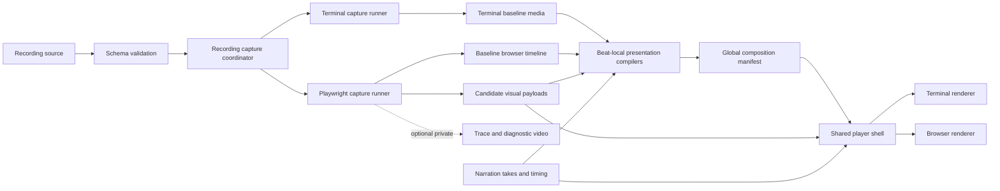

# Browser Recording High-Level Design

## Status

Accepted and implemented through the constrained browser-recording MVP. The
semantic interfaces, Phase 0 visual policies, mixed capture pipeline, shared
player shell, and publishing path are implemented. Physical iOS/Android device
validation remains a later release-stage gate.

## Summary

OmegaFlow should add browser demos as a second recording medium alongside
terminal demos. Browser demos should reuse OmegaFlow's authoring, narration,
synchronization, build, and publishing concepts while using a browser-specific
capture pipeline and renderer.

The recorded medium has a stable semantic layer and a provisional visual
payload layer:

- Playwright actions are the rebuildable source and correctness layer.
- A baseline browser timeline records semantic actions, resolved target
  geometry, execution boundaries, and stable visual states.
- A presentation compiler retimes those facts around narration anchors and
  waits.
- The semantic presentation timeline is the durable browser media contract.
- Screenshots, Playwright screencast frames, and short clips are candidate
  visual payloads. A technical spike will select the initial combination.
- A browser renderer presents the selected payload together with cursor,
  click, typing, and other presentation events.
- Playwright traces are private diagnostic artifacts, not published media.

This is intentionally not a DOM-recording and DOM-replay system. The DOM is
used during capture to locate, validate, and describe targets, but captured
pixels are the authoritative playback state.

## Motivation

OmegaFlow turns rebuildable terminal and browser scripts into a versioned
presentation bundle with optional generated narration. Every medium needs the
same core properties:

- source-controlled and rebuildable scripts
- checks that prove the demonstrated outcome
- generated narration with explicit synchronization points
- presentation timing that is independent of execution speed
- deterministic, portable playback after the source application is gone
- publishable artifacts that do not require a live authenticated session

A raw browser video preserves pixels but loses most of the semantic and timing
control that makes OmegaFlow valuable. Conversely, replaying arbitrary captured
DOM state would make OmegaFlow responsible for web archiving, layout fidelity,
and safe reconstruction of active content. A semantic timeline with visual
payloads preserves the useful middle ground.

## Goals

- Support scripted navigation, clicks, text entry, keyboard shortcuts, waits,
  and checks through Playwright.
- Preserve the existing `@anchor@`, `after`, and `@wait:action_id@` mental
  model.
- Separate fast browser execution from viewer-friendly presentation timing.
- Produce deterministic browser media that can play without the source
  application or its authentication state.
- Render deliberate, repeatable mouse and keyboard motion rather than exposing
  automation-speed actions.
- Share narration, player controls, build freshness, and publish surfaces with
  terminal demos where their contracts are media-independent.
- Prevent credentials, tokens, private traces, and secret form values from
  entering published artifacts.

## Non-goals for the first version

- General-purpose DOM archival or executable DOM replay.
- Pixel-perfect capture of every class of website.
- User-driven interaction with the captured application during playback.
- Mobile capture profiles, touch gestures, drag-and-drop, multiple simultaneous
  pages, captured native browser or operating-system chrome, extension UI,
  camera or microphone input, WebXR, or native file pickers. Mobile playback
  and player-generated presentation frames are in scope.
- Capturing, mixing, or publishing webpage audio. Pages are muted during
  capture; narration is the only Phase 1 audio source.
- Automatic conversion of arbitrary Playwright test suites into polished
  demos.
- Replacing Playwright's trace viewer as a debugging tool.
- Providing an OmegaFlow network-mocking, HAR-replay, or website-archiving
  system. Projects may use Playwright's APIs in their own setup code.
- Making live, externally changing websites fully reproducible without an
  explicit network and data strategy.

## Current and proposed media models

Terminal recording is compact because timestamped terminal output is enough for
a terminal emulator to reconstruct screen cells. Timestamped browser actions
are not enough to reconstruct a rendered page: the result also depends on DOM,
CSS, JavaScript, assets, fonts, network data, browser behavior, and runtime
state.

| Layer | Terminal demo | Browser demo |
| --- | --- | --- |
| Rebuildable source | Recording Markdown/YAML and shell actions | Recording Markdown/YAML and Playwright actions |
| Baseline record | Timed terminal output in `.cast` plus timeline sidecar | Semantic capture timeline plus visual states |
| Presentation record | Retimed `.cast` | Retimed browser presentation timeline |
| Visual reconstruction | Terminal emulator | Browser-specific visual renderer |
| Correctness | Command expectations and checks | Playwright waits and checks |
| Narration | Audio and timestamp metadata | Same contract |
| Diagnostics | Run logs and baseline artifacts | Run logs and optional private Playwright trace/video |

The browser presentation timeline is the conceptual counterpart of the retimed
cast. Unlike a cast, it references visual payloads because semantic browser
events alone cannot reconstruct the screen.

## Accepted design decisions

- The semantic timeline is architecture; the initial visual payload strategy
  remains provisional.
- Each visual beat has one modality and a local timeline starting at zero.
- The recording compiler assigns each beat an offset on the global presentation
  timeline. Adjacent beats may be captured or stored together as an internal
  optimization, but that grouping is not an authoring boundary.
- The shared player owns global presentation time and maps it to beat-local
  time with `local_time = global_time - beat_offset`.
- Narration remains authored beside beats. Adjacent beats may share a narration
  take so TTS receives one natural spoken passage.
- A `wait_for` step may produce an invisible synchronization milestone.
  Capture-only checks do not produce presentation events.
- Terminal and browser beats share the `actions` field. The beat modality
  selects the valid action schema; one action list cannot mix modalities.
- One recording-level capture coordinator executes beats in source order.
  Persistent terminal and browser sessions operate inside the same capture
  environment and retain state across modality boundaries.
- Browser content has a fixed capture viewport. The player may place it inside
  scalable, synthetic browser and operating-system window frames.
- Browser chrome, display URLs, window-manager chrome, and scene transitions
  are presentation metadata and can change without recapturing page content.
- The baseline capture timeline is a private build artifact. Publication emits
  only the allowlisted presentation manifest and its referenced media.
- Manifest and renderer payload versions are header-level declarations. Beats
  select a renderer but cannot choose or override its version.
- Browser guided presentation is explanatory only: browser beats may use
  authored guide text, but not terminal-style guide commands or a link that
  operates a live application.
- Phase 1 playback targets current desktop Chromium-based browsers, Firefox,
  and Safari, plus iOS Safari and Android Chrome. Capture remains a desktop
  Chromium profile; mobile capture and touch actions are later work.
- Webpage audio is muted during capture and excluded from published media.
  Dynamic fragments are video-only; webpage audio can be reconsidered when a
  concrete use case justifies mixing and retiming it with narration.
- The first release permits live local and external sites. OmegaFlow records
  that capture used live network and emits only a non-blocking reproducibility
  warning for external dependencies; built-in mocking is out of scope.

## Capture-layer decision

### Options considered

| Capture layer | Strengths | Limitations | Proposed role |
| --- | --- | --- | --- |
| Playwright video | Faithful continuous pixels; handles arbitrary motion | Timing is coupled to execution; opaque; hard to restyle, retime, or inspect; written when its browser context closes | Diagnostic/reference capture and possible source for exceptional clips |
| Playwright screencast | Precise start/stop, timestamped frame callbacks, video output, and optional action decorations | Still records execution-time pixels; requires selection and retiming for presentation | Candidate source for state frames and action-local clips |
| Playwright trace | Actions, network activity, screenshots, and DOM snapshots are excellent debugging evidence | Debug-oriented format and viewer; potentially sensitive; expensive; not an OmegaFlow presentation contract | Optional private diagnostic artifact |
| Screenshots | Stable, portable playback pixels; easy to diff and cache | Do not describe transitions or continuous motion | Candidate stable-state payload |
| DOM snapshots | Inspectable structure and text | Faithful replay requires CSS, fonts, assets, frames, shadow DOM, browser behavior, and active runtime state; increases security exposure | Optional private/debug metadata, not authoritative media |
| Custom event timeline | Semantic, retimeable, narration-aware, and renderer-independent | Requires an OmegaFlow schema and browser renderer | Canonical browser recording and presentation contract |

Playwright currently records context-scoped video and writes it when the page
or context closes. Its traces can include screenshots, DOM snapshots, browser
operations, and network activity. These properties make both useful evidence,
but not a stable presentation abstraction. See Playwright's official
[video](https://playwright.dev/docs/videos),
[screencast](https://playwright.dev/python/docs/api/class-screencast),
[tracing](https://playwright.dev/docs/api/class-tracing), and
[Trace Viewer](https://playwright.dev/docs/trace-viewer) documentation.

### Decision

Use a custom semantic timeline. It contains beat-local, narration-aware events
and is independent of the selected visual payload format.

The leading visual-payload hypothesis is a hybrid:

1. Capture stable states as WebP screenshots.
2. Generate pointer, click, keystroke, focus, and simple scroll presentation
   inside the player.
3. Use screencast frames, a short WebM fragment, or a frame sequence for a
   dynamic transition that the player cannot reproduce convincingly.
4. Keep a Playwright trace and continuous video off by default and private when
   enabled.

The technical spike selects the visual payload strategy by comparing fidelity,
artifact size, retiming, and seeking. It does not reopen the semantic timeline
decision.

## High-level architecture



The coordinator owns one recording-scoped capture environment: working
directory, environment variables, filesystem and temporary workspace, local
network namespace, setup-created services, and cleanup. It dispatches beats in
source order while terminal and browser runners remain alive. Only the active
beat's modality produces visual media; inactive runners retain state for later
beats. Setup runs once before either runner is used. Project-authored cleanup
runs once through the still-live terminal runner, including after capture
failure when possible. The runners then close, followed by teardown of the
coordinator-owned environment.

### Shared OmegaFlow layers

The following concepts should remain media-independent:

- recording identity, beats, headings, captions, and narration
- narration-take planning and caching, audio generation, anchors, waits, and
  timestamp metadata
- source dependency fingerprinting and build freshness
- build/check/clean orchestration
- playback controls, narration display, beat markers, and explanatory guided
  annotations
- Docusaurus and standalone HTML publish surfaces

### Browser-specific layers

- Playwright runtime and browser dependency management
- browser configuration, context creation, and network policy
- action execution, wait, and check adapters
- target resolution and geometry capture
- visual state and optional transition capture
- browser baseline timeline and presentation compiler
- cursor, typing, scrolling, state-transition, and clip renderer
- browser artifact validation and secret scanning

The existing cast player should evolve toward a media-neutral player shell with
terminal and browser renderer adapters. Existing cast URLs and embeds must
continue to work.

## Authoring model

A recording is an ordered composition of beats. Each beat selects one modality
and has a local presentation timeline starting at zero. A modality change is a
beat boundary; one beat cannot mix terminal and browser actions. The exact
field names remain provisional until detailed design.

```yaml
---
id: create-project
title: Create a project
browser:
  base_url: http://127.0.0.1:3000
  engine: chromium
  viewport:
    width: 1440
    height: 900
    device_scale_factor: 2
  auth:
    storage_state_env: OMEGAFLOW_BROWSER_AUTH_STATE
presentation:
  window:
    theme: kde-breeze
    title: OmegaFlow
    opening_transition: window-open
  browser_chrome:
    mode: full
  transitions:
    default: fade
---
```

```yaml
beat:
  id: create
  medium: browser
  heading: Create a project
  narration_take: project-creation
  narration: >-
    Open the project menu and @choose_new@ select New project.
    @wait:dialog_ready+300ms@ Enter a project name and submit it.
  guide:
    success_hint: The dialog opens after selecting New project.
  actions:
  - id: open_app
    open_page:
      url: /projects
      display_url: https://app.example.com/projects
      ready:
        visible:
          role: main
      loading: hide
  - id: open_menu
    click:
      role: button
      name: Project menu
  - id: choose_new
    click:
      role: menuitem
      name: New project
    after: "@choose_new@"
  - id: dialog_ready
    wait_for:
      visible:
        role: dialog
        name: Create project
  - id: enter_name
    fill:
      target:
        label: Project name
      text: Example project
  - id: submit
    press:
      key: Enter
  checks:
  - name: project was created
    url: /projects/example-project
```

### Beat-local and global time

Beat events are stored relative to the start of their beat. The global
composition manifest assigns offsets:

```text
global_time = beat_offset + beat_local_time
```

Moving or concatenating independently timed beats changes composition offsets,
not their event timestamps. The model does not promise that stateful beats can
be reordered safely; terminal or browser state may still depend on preceding
beats.

Runners retain their session state across the entire recording, including
across non-adjacent beats of the same modality. Adjacent same-modality beats may
also share a physical media payload for storage efficiency, but that grouping
remains an implementation detail.

### Narration takes

Narration stays beside the beat it explains. By default, each narrated beat is
its own TTS generation and cache unit. Adjacent beats may opt into one take:

```yaml
beats:
- id: install
  narration_take: setup
  narration: Start by @install@ installing OmegaFlow.
- id: bootstrap
  narration_take: setup
  narration: >-
    @wait:install_command+200ms@ Once it is ready, go to your repository root
    and @bootstrap@ run bootstrap.
```

The compiler concatenates take members in beat order before TTS generation and
retains the text span belonging to each beat. This preserves anchors, waits,
word highlighting, and beat-local visual timing while allowing continuous
prosody across the boundary.

Before validation, OmegaFlow resolves a take ID for every narrated beat. An
explicit `narration_take` supplies that ID; otherwise OmegaFlow assigns a
unique implicit ID derived from the beat. Contiguity validation then runs over
the complete resolved sequence, including implicit singleton takes.

Take rules:

- members must be contiguous
- members must resolve to the same voice, model, format, and relevant settings
- the cache key includes ordered beat IDs, concatenated text, and TTS settings
- changing or reordering a member invalidates that take but not other takes
- reordering remains allowed; when prior generated metadata shows a different
  member order, the build emits a non-blocking narration-review warning
- omitting `narration_take` produces an implicit singleton take and preserves
  the current one-take-per-beat behavior

### Initial action vocabulary

Each action has a unique `id`, exactly one action kind, and optional common
presentation fields such as `after`, `hold_after`, or a pacing override.

| Kind | Purpose | Important source fields |
| --- | --- | --- |
| `open_page` | Open a URL and wait for its readiness boundary | Capture URL, optional public display URL, readiness condition, loading presentation |
| `click` | Resolve a target and activate it | Semantic target, button, click position |
| `fill` | Default text entry; set a field value directly during capture | Target, literal text or secret reference |
| `type_keys` | Send real sequential key events when a site rejects direct fill or reacts per keystroke | Target, text, capture pacing |
| `press` | Send one key or a keyboard shortcut | Key or normalized chord |
| `scroll` | Move a container or target into view | Container/target, direction or destination |
| `wait_for` | Await asynchronous runtime state and optionally expose an invisible synchronization milestone | URL, target state, or response |

Checks are capture-time validation rather than actions. They may verify URL,
visibility, text, value, count, response, or other state and fail the build,
but they do not appear in the presentation timeline.

`fill` and `type_keys` differ only in how Playwright drives the live page.
Both compile to the same semantic text-entry presentation event. The retiming
renderer owns visible character pacing, so capture speed and method do not
change the viewer animation. OmegaFlow should not silently fall back from
`fill` to `type_keys`; a failed fill should identify the explicit alternative
because the two methods can exercise different application behavior.

`open_page` always waits for a readiness boundary before the next action. Its
default boundary is `DOMContentLoaded`; an authored `ready` condition may name
application-specific visible or URL state. `loading: hide` discards loading
visuals from the presentation, while `loading: show` retains them without
changing synchronization. `display_url` is presentation-only and must be safe
to publish; the player must not reveal the capture URL when an override is
provided.

### Target model

Targets should prefer user-facing Playwright locators:

- role and accessible name
- label
- placeholder
- visible text
- test id

CSS or XPath selectors are escape hatches and should produce a portability
warning. Coordinates are presentation results, not authoring targets. During
capture, OmegaFlow records the resolved element's bounding box and a stable
interaction point in viewport coordinates.

## Narration synchronization

Browser actions reuse the terminal synchronization model:

- `after: "@anchor@"` means the action begins in the presentation when
  narration reaches that anchor.
- `@wait:step_id@` means narration pauses until that action or `wait_for`
  milestone completes in the presentation.
- `@wait:step_id+300ms@` adds a minimum visual settling gap before narration
  resumes.

Capture does not run in lockstep with generated audio. The capture coordinator
dispatches terminal and browser actions in source order as quickly as their
readiness conditions allow. The modality-specific capture timelines record
action boundaries, invisible readiness milestones, target geometry, and state
boundaries. The presentation compiler then schedules those facts around
narration.

A click's completion covers the click presentation; it does not implicitly
mean that an asynchronous result is ready. When narration or a later step must
synchronize with that result, the author adds a condition-based `wait_for`
step. During capture, Playwright evaluates the condition against the live page.
OmegaFlow records its completion time and corresponding visual state. Playback
keeps only the milestone needed by `@wait`; it does not evaluate the DOM again.

Capture-only checks are discarded from presentation output. They prove that
the recording is correct but do not create visual events or synchronization
targets.

Synchronization validation must reject:

- duplicate action IDs
- missing anchor references
- waits that reference unknown or non-completing actions
- waits that reference capture-only checks rather than actions or `wait_for`
  milestones
- dependency cycles between narration anchors and action waits
- secrets used as narration or visible synchronization labels

## Baseline capture timeline

The baseline timeline records observations rather than presentation choices.
The exact JSON schema and filenames are detailed-design work, but the logical
record for an action resembles:

```json
{
  "id": "open_menu",
  "kind": "click",
  "source_order": 2,
  "execution": {"start": 1.142, "end": 1.231},
  "target": {
    "locator": {"role": "button", "name": "Project menu"},
    "bounds": {"x": 1310, "y": 24, "width": 48, "height": 36},
    "point": {"x": 1334, "y": 42}
  },
  "before_state": "states/0002.webp",
  "after_state": "states/0003.webp",
  "completion": {"kind": "stable_state", "policy": "stable-v1"}
}
```

`stable-v1` is illustrative: the Phase 0 spike selects and documents the
policy and evidence represented by this field.

The capture timeline should contain only data required for compilation,
validation, diagnostics, and rebuilding the presentation record. It should not
be a copy of Playwright's trace format. It remains private because it may
contain source locators, captured URLs, execution diagnostics, and other data
that the player does not need.

## Presentation timeline and media bundle

The presentation compiler produces media-relative events such as:

- show a stable state
- move the pointer
- show hover and click feedback
- focus a target
- reveal typed characters or a masked secret
- show a keyboard shortcut
- animate a supported scroll
- transition to another stable state
- play a dynamic fragment
- mark an action or beat complete

A provisional generated bundle is:

```text
<asset-dir>/
  recording.browser.presentation.json
  recording.recording.json
  states/
    0001.webp
    0002.webp
  clips/
    0001.webm
  audio/
    <take-id>-<sha256>.mp3
  audio.json
  timestamps/
    <take-id>.json
```

Optional diagnostics remain outside published assets:

```text
<run-dir>/
  recording.browser.capture.jsonl
  trace.zip
  diagnostic.webm
  console.jsonl
  network.jsonl
```

The presentation manifest must be self-contained relative to its asset
directory, versioned, content-addressable or fingerprinted, and safe to serve
as static files. It must not require network access to the captured
application.

The generated manifest header declares one shared format version and the
payload version of every renderer used by the recording. These fields are
internal compiler/player concerns and do not appear in authoring files. For
example:

```yaml
manifest_version: 1
renderers:
  terminal:
    payload_version: 1
  browser:
    payload_version: 1
beats:
  - id: install
    renderer: terminal
    payload: ...
  - id: homepage
    renderer: browser
    payload: ...
```

Versions are integers incremented for breaking changes. Additive optional
fields do not require a version increment and may be ignored. The player
validates header versions before playback and strictly rejects unknown event
kinds rather than silently degrading the recording. Feature negotiation is
deferred until a concrete extension case requires it. Exact names are
detailed-design work.

## Visual presentation

### Viewport, framing, and scaling

The capture viewport is part of the recording profile and remains fixed during
playback. Browser content does not reflow when the player is resized. Rebuilding
with another viewport produces another recording variant.

The renderer composes the fixed viewport inside optional player-generated
frames:

```text
operating-system window frame
  optional browser chrome
    captured browser viewport
```

Window profiles may represent Windows, KDE, macOS, or a neutral OmegaFlow
style. Frames are scalable HTML/SVG presentation assets rather than captured
native chrome, so their theme, title, URL treatment, border, and shadow can
change without recapturing page content.

Browser chrome may be hidden, minimal, or full. When it includes an address
bar, the renderer uses explicit public display-URL metadata rather than
assuming the captured URL is suitable to publish. Operating-system window
chrome is independently optional.

The base visual payload, cursor, click feedback, and other overlays share the
viewport's logical coordinate system. The composed window scales uniformly to
fit its player container:

```text
scale = min(player_width / scene_width, player_height / scene_height)
```

Unused space is letterboxed. Scaling does not change layout or recorded target
coordinates. High-device-scale capture or separately published viewport
variants may be used when enlarging one raster recording would lose quality.

### Pointer movement

Do not record or imitate raw automation movement. The renderer should generate
a deterministic path from the previous pointer position to the captured target
point:

- duration derived from distance with minimum and maximum bounds
- a gentle curved path rather than perfect linear motion
- a short, deterministic hover settle before activation
- visible mouse-down and mouse-up feedback
- stable output for the same timeline version and seed

The source action remains semantic even though playback uses recorded geometry.
If capture cannot resolve a visible bounding box, the action must either use an
explicit non-pointer presentation or fail validation.

### Keyboard pacing

Keyboard presentation should be deterministic and based on character classes:

- short base intervals for letters and digits
- shorter continuation inside a word
- longer intervals after whitespace or punctuation
- brief pauses around shortcuts and submission keys
- optional grouping or acceleration for long values
- a fixed seed and timing-algorithm version in the presentation manifest

Playwright execution uses `fill` by default and `type_keys` when real keyboard
events are required. The player owns viewer pacing for both capture methods.
Secret values use a dedicated masked or omitted presentation and are never
emitted character by character into the timeline.

### State transitions

Presentation metadata may select entry, exit, and between-state transitions.
An entry transition can simulate a browser window opening; cuts and fades are
the initial general-purpose transitions. These are player-generated scene
effects and do not require another browser capture. Action-level overrides may
replace recording defaults when the story needs a specific transition.

The renderer chooses the least complex faithful presentation supported by a
captured action:

1. Player-generated pointer, click, focus, or text overlay against stable
   screenshots.
2. Player-generated scroll when the captured states prove it is safe.
3. A crossfade or direct state replacement for navigation and discrete layout
   changes.
4. An explicit short clip or frame sequence for continuous animation, canvas,
   video, complex fixed-position scrolling, or otherwise unsupported motion.

The capture runner must not silently invent an interpolation when it cannot
show the real result. Unsupported transitions should fail, request an explicit
clip policy, or be marked for review.

## Deterministic capture contract

Playwright browser contexts provide isolation and controls for viewport,
device characteristics, locale, timezone, color scheme, permissions, and other
emulation settings. OmegaFlow should resolve these into an explicit capture
profile rather than inherit developer-machine defaults. See Playwright's
[browser context](https://playwright.dev/docs/browser-contexts) and
[emulation](https://playwright.dev/docs/emulation) documentation.

### Browser and viewport

The recording fingerprint should include:

- OmegaFlow browser schema and renderer versions
- Playwright package version
- browser engine and exact browser build/revision
- operating-system/container capture profile where it affects rendering
- viewport, screen size, device scale factor, user agent, and touch/mobile mode
- locale, timezone, color scheme, reduced-motion preference, and permissions
- webpage-audio mute policy
- font manifest and relevant rendering configuration

The first version should support one pinned Chromium profile. Other engines and
mobile/touch profiles should be added only after the media contract is proven.

### Network and application state

The first release captures against live networking. Both local applications
and external sites are allowed. Capture metadata records that the result is
live-network-dependent, and external origins produce a non-blocking warning
that a later rebuild may differ.

OmegaFlow does not provide declarative request mocking, HAR recording/replay,
or a website mirror. A project that already uses Playwright routing or fixtures
may install them through project-owned setup code, but OmegaFlow treats that
code as an input rather than defining another mocking system. See Playwright's
official [network](https://playwright.dev/python/docs/network) documentation.

When seeded server data is required, project-owned setup and cleanup must
manage it. Browser-context isolation alone does not reset server-side state,
and OmegaFlow cannot make external content reproducible.

### Assets, fonts, and motion

Before capturing a stable state, the runner should require:

- the action's default or explicitly declared readiness milestone
- any network response explicitly named by `ready` or `wait_for` to be complete
- fonts loaded
- images needed in the viewport decoded
- the spike-selected visual stability policy to pass

Animations should be disabled, reduced, or advanced under a controlled clock
for stable-state capture. Motion that is part of the demonstration must use an
explicit dynamic-fragment policy rather than relying on incidental screenshot
timing.

## Authentication and secrets

Playwright storage state can contain cookies and headers capable of
impersonating the recorded user, and Playwright explicitly warns against
committing it. OmegaFlow must treat authentication state, HAR files, traces,
videos, screenshots, console logs, and network logs as potentially sensitive.
See Playwright's [authentication guidance](https://playwright.dev/docs/auth).

Required controls:

- Auth state is supplied through an ignored local path or environment-backed
  reference and is never copied to the published bundle.
- Recording source stores secret references, never literal secret values.
- Secret input actions declare their presentation: masked, placeholder, or
  omitted.
- Capture masks configured sensitive elements before every screenshot and
  dynamic fragment.
- Published timelines omit secret values, request headers, cookies, DOM
  snapshots, and private locator text.
- Traces and diagnostic videos are off by default, remain under the private run
  directory, and receive prominent retention warnings when enabled.
- Project-owned network fixtures remain the project's security responsibility.
- A pre-publish validator scans manifests and textual diagnostics for known
  secret values and rejects absolute private paths.
- The build fails closed when a declared mask cannot be located or when a secret
  field's safe presentation cannot be proven.

Pixel scanning cannot prove that an unknown secret is absent. Authors remain
responsible for choosing non-production accounts and sanitized fixture data.

## Player and publishing direction

Use shared player and publish surfaces with a dedicated browser rendering path.

The shared shell owns:

- title and narration
- the global presentation clock, transport, seeking, duration, and playback
  rate
- beat markers, explanatory text, and optional guided pauses
- audio synchronization
- responsive framing and fullscreen behavior
- loading, compatibility, and error states

Renderer adapters own:

- terminal cast decoding and terminal screen state
- browser screenshots, pointer, focus, typing, scrolling, and clips

For browser beats, `guide.success_hint` may display explanatory text at an
authored pause. The browser schema rejects terminal-style `guide.commands` and
does not attempt to drive or link the viewer into a live application.

For a global time, the shell selects the active beat, subtracts its composition
offset, and asks the renderer for that beat's local state. Narration takes and
visual beats are both mapped onto the global clock even though their cache and
event times remain local.

Publish surfaces point at a versioned media manifest rather than inferring a
medium from a file extension. `VideoPlayer` accepts that manifest for terminal,
browser, and mixed recordings.

A separate end-to-end browser player would duplicate narration, controls,
markers, embedding, and publishing behavior. Forcing browser visuals into a
cast would distort both media models. A shared shell with dedicated renderers is
the intended boundary.

## Build and failure behavior

The browser pipeline should fit the existing build lifecycle:

1. Resolve and validate recording configuration.
2. Create the shared capture environment and run application setup and
   readiness checks.
3. Launch persistent terminal and browser runners on demand inside that
   environment.
4. Dispatch beats in source order while capturing modality-specific baseline
   facts and visual states.
5. Close both runners and materialize optional diagnostics.
6. Generate or reuse narration.
7. Compile the browser presentation timeline.
8. Validate references, durations, synchronization, freshness, and publish
   safety.
9. Publish through the selected existing surface.
10. Run cleanup even after capture failure.

Capture failures should preserve private diagnostic evidence without publishing
partial media. Publishing should be atomic at the asset-directory level so a
failed rebuild does not replace the last known-good demo.

## Validation

`omegaflow check` for a browser recording should validate:

- all actions and targets conform to the browser schema
- browser beats do not use terminal-only `guide.commands`
- action IDs, anchors, waits, and dependency ordering are valid
- narration-take members are contiguous and have compatible TTS settings
- narration-take cache identity includes the ordered beat membership
- a changed take-member order emits a non-blocking narration-review warning
- every capture-only check passed during the referenced capture
- every presentation event refers to an existing action and visual asset
- all visual assets match the declared viewport and supported codecs
- presentation timestamps are monotonic and within the declared duration
- capture and presentation fingerprints are fresh
- no private diagnostic artifact is reachable from the publish manifest
- renderer payload versions appear only in the generated manifest header
- address-bar content comes from publish-safe display-URL metadata
- no configured secret, auth-state path, absolute private path, or unsanitized
  network fixture appears in published textual artifacts
- the player can load the manifest and seek across every beat boundary on the
  Phase 1 desktop and mobile playback matrix

Pixel-level visual review is still required for the initial implementation and
for actions that use dynamic fragments or fallback transitions.

Narration-take tests must cover adjacent membership, rejection of fragmented
membership such as `setup, build, setup`, implicit per-beat takes, one TTS
request per explicit take, take-local cache
invalidation, cross-beat anchor and wait offsets, and the non-blocking reorder
warning.

## Rollout

### Phase 0: technical spike

Build an isolated prototype, not production schema. It must preserve semantic
action IDs and narration `after`/`@wait` scheduling while running these five
experiments:

1. **Stable-state detection.** Compare navigation lifecycle events, explicit
   `ready`/`wait_for` conditions, fixed settling delays, and rendered-frame
   convergence on a static page, a finite CSS transition, a blinking or
   polling page, and an asynchronously populated dialog. Across ten repeated
   captures, ordinary cases must select the same final state without authored
   sleeps. Continuous motion must time out or select a dynamic fallback rather
   than be silently declared stable. The result must specify the evidence,
   thresholds, timeout, and diagnostic behavior used by detailed design.
2. **Text-entry presentation.** Compare a player-generated text/caret overlay
   with captured per-character states for `input`, `textarea`, controlled
   inputs, formatted values, and `contenteditable`. Use both `fill` and
   `type_keys` during capture and verify that they produce the same presentation
   contract. Select the overlay only for cases whose font, clipping, wrapping,
   selection, caret, and formatting remain faithful; define an explicit state
   or clip fallback for the rest.
3. **Scroll classification.** Compare synthesized scroll against captured
   checkpoints or frames for document scroll, nested containers, sticky and
   fixed elements, virtualized content, and scroll-linked animation. Define a
   conservative classifier for cases that can be synthesized without inventing
   motion or layout. Every unclassified case must use captured motion or fail
   with an actionable diagnostic.
4. **Dynamic-fragment source.** Compare clips cut from Playwright video with
   Playwright screencast frames on a CSS animation, canvas motion, embedded
   video, and a complex scroll. Measure capture overhead, timestamp alignment,
   trimming, frame loss, artifact size, playback smoothness, and seeking in the
   pinned desktop Chromium environment. Select one canonical first-release
   path and specify its codec, timing map, trimming rules, and encoded size
   budget;
   retain the other only if it provides a demonstrated distinct role.
5. **Dynamic redaction.** Exercise a static secret, a moving or resizing
   sensitive element, and sensitive content created after an action in both
   stable states and dynamic fragments. Compare capture-time overlays,
   per-frame masks, and post-processing. A publishable result must obscure every
   affected frame and fail closed when the target disappears or cannot be
   tracked. If no tested method meets that bar, Phase 1 must prohibit dynamic
   fragments for beats requiring redaction.

Each experiment report must include raw measurements, ten-run rebuild results,
representative output artifacts, known unsupported cases, and the selected
policy. The spike passes only if it identifies a constrained Phase 1 path for
all five; otherwise the affected interaction remains out of scope rather than
becoming an implicit detailed-design assumption.

The prototype must also demonstrate the accepted composition contract end to
end: a terminal beat that creates state consumed by a browser beat; persistent
terminal and browser sessions across modality boundaries; cleanup of both
runners after an injected capture failure; beat-local time mapped to global
offsets and seeking; a narration take spanning adjacent beats; `open_page` with
hidden and retained loading; hidden and full browser chrome with a public
display URL; optional window-manager framing; entry and fade transitions;
uniform scaling; and a published bundle that cannot reach the private capture
timeline or diagnostics. The local player demonstration must also cover touch
controls and responsive portrait and landscape layouts.

Phase 0 does not stand in for real-device playback validation. Codec support,
fullscreen behavior, orientation changes, suspend/resume, and decoded-asset
memory limits must be validated on iOS Safari and Android Chrome at the later
Phase 1 release gate. That gate may reduce the provisional memory budget,
encoded media limits, or supported interaction scope and blocks marking Phase
1 stable, but it does not block capture and renderer implementation.

### Phase 1: constrained browser MVP

- pinned headless Chromium desktop profile
- playback on current desktop Chromium-based browsers, Firefox, and Safari,
  plus iOS Safari and Android Chrome
- muted webpage audio and video-only dynamic fragments
- one active page
- live local or external network
- semantic targets
- the visual payload combination selected by the technical spike
- the spike-selected captured-motion fallback for unsupported transitions,
  subject to its redaction restrictions
- checks, narration synchronization, standalone HTML, and Docusaurus
- no published DOM snapshots or traces

### Phase 2: hardening

- improved scroll and focus rendering
- author-facing capture diagnostics and visual review tooling
- artifact deduplication and delta optimization
- optional additional browser profiles based on demonstrated demand

## Risks

| Risk | Consequence | Mitigation |
| --- | --- | --- |
| Screenshot transitions look artificial | Browser demos feel less credible than video | Validate representative interactions in Phase 0; use the selected captured-motion fallback where needed |
| Visual payloads become large | Slow builds and page loads | WebP, content-addressed deduplication, action-local crops where safe, and measured clip budgets |
| Layout differs across machines | Rebuild churn and incorrect target geometry | Pinned browser/runtime profile, fonts, viewport, and deterministic app fixtures |
| External content changes | A rebuild differs from the previous capture | Record live-network use and emit a non-blocking warning; use controlled project environments when reproducibility matters |
| Secrets leak through pixels or diagnostics | Security incident | Non-production data, masks, private diagnostics, fail-closed validation, and explicit retention policy |
| Timeline schema becomes coupled to Playwright internals | Fragile upgrades | Store OmegaFlow semantic events and normalized geometry, not trace internals |
| Player complexity expands sharply | Maintenance burden | Constrained action vocabulary and explicit unsupported-transition fallback |
| Browser renderer refactor breaks terminal playback | Regression in current product | One manifest contract plus terminal conformance tests |
| Mobile playback exhausts memory or mishandles controls | Failed or awkward playback on phones | Test touch controls, orientation, fullscreen, and media-size budgets in Phase 0 |

## Detailed-design readiness

This HLD is ready to hand off for detailed design because:

- the semantic-timeline decision and visual-payload spike boundary remain
  accepted
- the shared-shell/dedicated-renderer boundary is accepted
- the initial action vocabulary and target strategy are agreed
- synchronization completion semantics are unambiguous
- the deterministic capture and security contracts have owners and no known
  high-level gaps
- the Phase 0 interaction matrix and success metrics are specific enough to
  produce a go/no-go recommendation
- the remaining implementation choices have explicit Phase 0 experiments,
  decision criteria, and fail-closed Phase 1 fallbacks

The spike results are required inputs to the production capture and renderer
detailed design. They are not unresolved product-architecture decisions.

## Backlog acceptance coverage

| Acceptance check | HLD section |
| --- | --- |
| Evaluate video, trace, screenshots, and custom timeline | Capture-layer decision |
| Sketch navigation, clicks, typing, shortcuts, waits, and assertions | Authoring model |
| Define narration anchors and waits | Narration synchronization |
| Explore realistic mouse movement and keyboard pacing | Visual presentation |
| Deterministic viewport, network, assets, auth, and secrets | Deterministic capture contract; Authentication and secrets |
| Recommend shared or dedicated player/publish path | Player and publishing direction |
