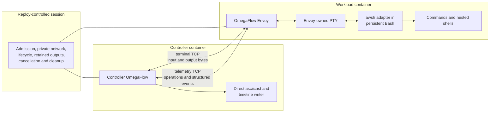
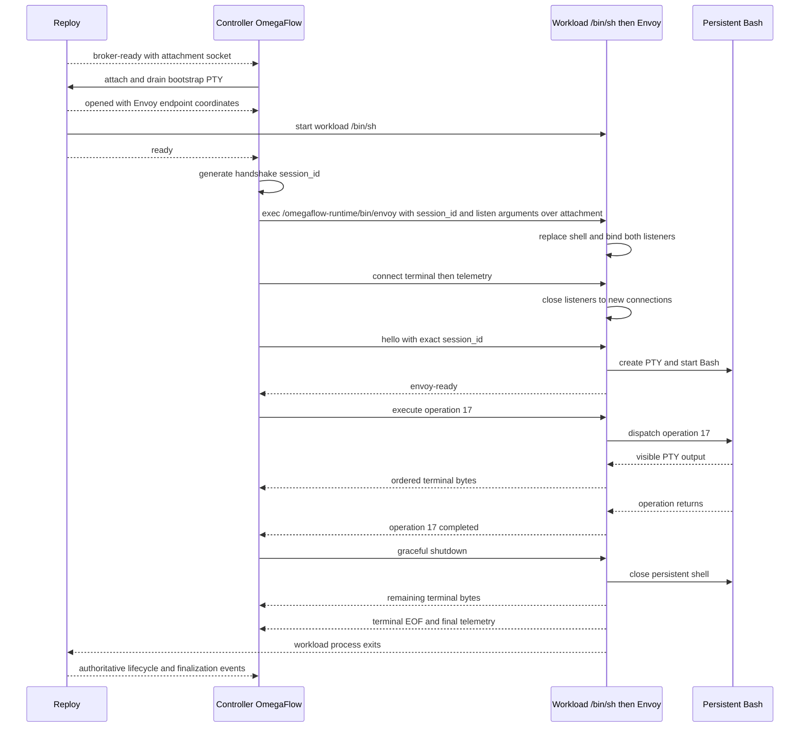

# OmegaFlow Workload Envoy Design

## Status

- Owner-approved direction through the protocol and Awsh Bash prototype. Exact
  local-review status belongs only to a hash-bound `.review` sidecar when one is
  present; the amended protocol and rebuilt delivery plan require a fresh remote
  review cycle. Production Envoy, runtime, controller, terminal-runner, and
  browser changes in the former PR 9–13 stack are raw material, not accepted
  implementation evidence.
- Updated: 2026-08-20
- Initial scope: one persistent Bash backend for terminal execution and
  structured telemetry in Reploy-backed OmegaFlow recordings

This document is authoritative for the terminal-control, PTY-ownership, and
terminal-to-browser coordination portions of
[Reploy Recording Environments Design](reploy-environments-design.md). It
supersedes that document's Reploy-PTY marker design, but retains its broader
environment, blueprint, lifecycle, artifact, packaging, and migration direction.
It does not replace Reploy controlled sessions or their host-owned lifecycle,
isolation, output-retention, and cleanup guarantees.

The first implementation supports Bash only. Additional top-level shell
backends and a generalized backend plugin framework are deferred. An operation
may still start another shell or interactive program, but OmegaFlow treats that
child as opaque until control returns to the persistent Bash.

The controller and isolated-workload blueprint contract is specified in
[Reploy Recording Environments Design](reploy-environments-design.md). General
project discovery, source transfer, cache policy, default-image selection, and
public bootstrap UX remain separate product work; they do not block the bounded
Envoy integration slices.

### Recording toolchain and workload placement

`studio.recording_backend` and `studio.workload_backend` use the same typed
`host | reploy` value domain. Recording defaults to `reploy`, and the recording
controller runs in the OmegaFlow-owned Reploy toolchain environment. The `host`
recording value is schema-valid but fails capability validation before
preparation with a targeted unsupported-controller error. It carries no
maintained bare-metal implementation or fallback. A supported container runtime
is required for recording; OmegaFlow does not retain a separate bare-metal
browser, media, or publication toolchain.

`studio.workload_backend` selects only workload placement. It defaults to
`host`, where the packaged Envoy and `awsh` run against the host project
environment and connect to the Reploy controller. Explicit `reploy` selection
uses the isolated controlled-session workload specified by this design and
requires a complete workload blueprint. Reploy failures never fall back to the
host after explicit selection.

The current FIFO-backed local capture runner is migration scaffolding until the
host-Envoy path proves parity. Portable, bounded controller access to host Envoy
and application endpoints across supported container runtimes is the remaining
host-workload design boundary.

## Problem

OmegaFlow is not only a terminal recorder. It must coordinate planned terminal
operations with browser actions, checks, output ranges, diagnostics, and media
production.

A PTY carries terminal bytes, not shell semantics. From a generic PTY stream a
controller cannot reliably determine that a planned command completed, what its
status was, or what directory the persistent shell subsequently uses. Prompt
parsing is fragile, and an in-band completion marker can be produced
accidentally or intentionally by workload output.

Asciinema avoids this problem by observing only the lifetime of its direct
child, normally one persistent shell. It records that shell faithfully but does
not claim to observe individual commands inside it. OmegaFlow needs an
additional semantic boundary for the top-level operations in its recording
plan.

## Architecture

OmegaFlow supplies a small workload-side process named the **OmegaFlow Envoy**.
The Envoy owns the workload PTY and a persistent Bash child. It exposes two
lease-private TCP channels to controller OmegaFlow:

1. A **terminal channel** carries interactive input and exact ordered terminal
   output. Ctrl-C is ordinary terminal input. Resize is requested through the
   telemetry protocol and applied to the Envoy-owned PTY.
2. A **telemetry channel** carries versioned structured operation requests,
   completion events, status, cwd, action gates, and diagnostics.

Terminal bytes are never parsed as telemetry. Reploy transports neither
OmegaFlow protocol and does not interpret shell operations. It supplies the
controller/workload network and the declared endpoint coordinates.



## Why the Envoy Owns the PTY

Making the Envoy the PTY owner gives it one place to:

- stream child output without waiting for command completion;
- relay interactive input without prompt interception;
- apply window-size changes and preserve normal `SIGWINCH` behavior;
- deliver terminal control characters such as Ctrl-C;
- observe persistent-shell exit and drain remaining PTY bytes; and
- keep terminal data separate from structured telemetry.

The first implementation must not add another PTY between the Envoy and Bash.
Bash uses the single Envoy-owned slave PTY as its controlling terminal, and
interactive operations attach their standard streams to that slave. To
preserve the existing non-interactive assertion contract, a split-stream
operation instead gives its evaluated command separate stdout and stderr pipes
owned by the Envoy; this is the same non-TTY shape exposed by the current
presentation-timed runner. The Envoy forwards those pipe bytes to the terminal
channel in observed order while retaining their stream identity as private
assertion evidence. The Envoy otherwise occupies the role that a recorder such
as asciinema normally occupies at the PTY master, with the additional telemetry
channel required by OmegaFlow.

Controller OmegaFlow writes the asciicast and action timeline directly, merging
two ordered sources without another PTY: controller-synthesized presentation
events for the planned prompt and displayed command, and the exact bytes
received on the terminal channel. The prompt and displayed command are not
shell output and the operation source is not typed into Bash. Before sending an
`execute` request, the controller commits the planned prompt, typing-start,
character-timed display, newline, and typing-end events to the cast and
timeline. Only then may the Envoy start the operation and emit terminal output.
After completion, the controller waits for the protocol's output-through
barrier and commits any buffered output or replacement at its compiled
publication point before synthesizing a following prompt. This preserves typing
behavior and makes presentation ordering independent of prompt parsing or PTY
echo.

The controller records raw output arrival times at its boundary and records
applied resize events from telemetry. Each accepted resize carries the
output-pump frontier closed across the PTY master and every active operation's
split stdout/stderr pipe immediately before the Envoy applies it. The controller
waits for the private raw log through that frontier before publishing the
resize, so output the pump already ordered ahead of it cannot arrive later on
the independent terminal connection. A resize accepted after `execute` is sent
while the controller remains in `Starting` belongs to the closing seam of the
preceding prompt-and-typing span. The controller buffers it through
`operation_started` or the pre-start failure, cancellation, or drain that
replaces that boundary, then publishes a matching applied resize at the final
typing frontier so input barrier and transport delay do not enter the cast. A
drain that instead resolves the still-outstanding request publishes no resize
event. From `operation_started` through the terminal event, a resize for a
presentation-timed operation belongs to that operation's authored span even
when the writer sees it before compiled publication starts. The controller
buffers it until the schedule is known. `output_through` defines a covered
prefix for each logical stream, and the writer places the resize after the
latest authored event derived from any covered prefix. A frontier covering no
authored byte places the resize at the pre-span time. In a split stream's
stdout-then-stderr authored order, covered stderr places every stdout event
before the resize, including stdout observed later in raw order, while
uncovered stderr remains after it. Thus authored order wins where it cannot
also preserve both sides of the raw frontier, without ever placing the resize
before covered output. This prevents command wall time from entering the cast
while preserving the Envoy's output ordering. If a shell-ended drain wins a
race with an
outstanding resize, receipt of `draining` resolves the request and the
controller publishes no resize event; a resize applied first is resolved by its
preceding `resize_applied` normally. Failure to apply a resize is instead a
fatal session failure in every accepted state: the Envoy emits best-effort
`resize-failed`, no resize event or terminal operation result, closes its
channels, and exits nonzero; the controller retains partial artifacts, explains
the failure, and asks Reploy to terminate the environment. Arrival times drive
only a live view. The
recorded timeline is sender-assigned: realtime publication takes each range's
time from the Envoy's covering output mark, and presentation-timed publication
uses its compiled schedule instead. Whenever the timeline returns from an
authored schedule to sender time — after synthesized prompt and typing
presentation as well as after a presentation-timed operation — a signed session
offset is re-anchored at the Envoy-stamped boundary that ends the span, the
operation's start in the first case — or the terminal event that replaces it
when the operation fails or is cancelled before starting — and the mark closing
its range in the second. Anchoring there rather than on the next event to arrive keeps controller
scheduling and discarded command duration out of the recording without also
erasing a slow command's own startup delay, which falls after the anchor.
Transport delay and controller backpressure therefore cannot deform the
recording. The controller does not place an `asciinema record` process or
another PTY between the controller and the Envoy. Both workload backends use
this direct Envoy capture path and no host recording toolchain. The controller
also retains a private raw terminal-output byte log as the lossless source for
workload-output byte ranges and diagnostics. It is bounded per session, and
reaching that bound fails the capture rather than truncating the log, since a
truncated log would no longer be the thing the rest of the contract relies on.
Synthesized prompt and command events carry distinct timeline provenance and
never enter that raw log or its byte offsets. Because asciicast events are UTF-8
JSON text, the frozen protocol specifies the decoding and invalid-byte policy
used for the presentation cast; that conversion never weakens the raw transport
or byte-log contract.

The operation's timing, execution shape, and output mode are fixed before
`execute`. The existing streaming path maps `realtime` plus `real` to a
PTY-attached operation; the existing non-streaming paths use split streams.
Observed bytes always continue into the private raw log, but the cast writer
applies the compiled publication schedule:

- `realtime` plus `real` incrementally publishes decoded PTY events as they
  arrive for a responsive live view, timestamped in the recording by the
  Envoy's covering output mark;
- presentation-timed `real` retains split stdout and stderr while the operation
  runs, then, only after completion, the output-through barrier, and the
  configured logical post-enter pause, publishes logical stdout followed by
  logical stderr without admitting command wall-clock duration or raw arrival
  timestamps into the presentation timeline;
- `suppress` publishes none of the observed range; and
- `replace` publishes none of the observed range and, at the corresponding
  buffered-output publication point after the output-through barrier, commits
  the configured replacement as a controller-presentation event.

The raw range is temporal transport evidence, not general process provenance:
PTY echo and output from background work are indistinguishable from the
foreground command's bytes while an operation is running. Output assertions
therefore run only in an exclusive-observation operation selected before
`execute`. Such an operation has an output-through drain barrier. All bytes
read from a PTY master, including terminal echo of controller-authored input,
remain ordinary PTY output. The workload owns its terminal modes, and Linux
does not expose a reliable boundary proving that line-discipline processing and
delivery of resulting echo are complete, so the Envoy does not try to infer
echo provenance.

OmegaFlow instead rejects `output_contains` and `output_regex` when an
interactive operation or any continuation sends bytes through `text`, `key`,
or `control`. `wait_for` and `pause` send no bytes and remain compatible with
output assertions. `wait_for` matches visible terminal text, including echo,
and serves only as a sequencing mechanism; authors must not use a just-typed
string as evidence that the application responded. Exit status, `file_exists`,
and produced-output inspections remain available after authored input, and a
later non-interactive operation can verify output or file content. Failure
cancellation and user cancellation invalidate assertions instead of evaluating
partial input and output. Operation source may also end the shell,
and the recording keeps the shell's own behaviour. `exit 7`, an `errexit`
failure, an `exec` that replaces the image, and a crash are one outcome rather
than four: the Envoy is the shell's parent, so it reaps the status in every case
and the operation completes carrying it, marked as having ended the shell so the
controller does not draw a prompt for a shell that is gone, exactly as that
terminal would have shown. Taking the status from the reap rather than from a
shell trap also keeps it out of reach of operation source, which can install an
`EXIT` trap of its own without costing the operation its status. The Envoy
still terminates and reaps every remaining operation-created process and drains
its output before reporting that status, regardless of presentation or
assertion mode. An operation that declared inspections fails rather than
finishing with them unevaluated. Any later beat then fails,
since no operation can run without a control descriptor. If that shell-ended
drain crosses the later beat's unstarted `execute` and a deadline-derived
`cancel`, receipt of the drain resolves both controller requests; the Envoy
accepts and discards any late copies, emits no terminal operation result, and
the beat still fails as unrunnable. Planned recording-end
finalization is a distinct typed lifetime result: the Envoy terminates and
drains the intentionally open operation, closes its output range, and permits
the authored non-exit assertions to run over that complete range. Its synthetic
termination status never satisfies or fails an authored exit-code assertion,
because the operation did not exit naturally. Failure to complete the same
mandatory operation cleanup used after natural return and cancellation fails
closed. Telemetry `continue` messages and resize requests are not terminal data
input. A `continue` does carry the cumulative terminal-input watermark, so the
Envoy waits for independently transported input before releasing its gate. If
that watermark is not reached within five seconds, the blocked gate cannot
produce an ordinary driver result: the Envoy emits fatal
`input-barrier-timeout`, returns no terminal operation result, closes the
session, and asks Reploy to terminate it rather than adding a gate-abort path.

A controller deadline remains cancellable throughout the finalization driver
grace period, cleanup, and inspection. Cancellation moves the controller from
finalizing to cancelling. During the original driver grace period it sends no
second signal and does not reset the timer: driver return takes cleanup and
`operation_cancelled`, while expiry takes `cancel-timeout` with
`shell_ended: true`. During mandatory cleanup it finishes the existing
non-resetting cleanup deadline, skips inspection after successful cleanup, and
returns cancellation without inspection results; cleanup failure remains fatal
with no terminal operation result. Once inspection is running, the existing
supervised-worker race applies: a worker result accepted first commits planned
finalization, while cancellation accepted first stops and reaps the worker and
returns cancellation without inspection results. Failure to reap within five
seconds remains fatal `inspection-cancel-timeout`. A finalization result
committed before cancellation acceptance wins and discards the crossed cancel.

If the persistent driver does not return within the cancellation grace period,
whether cancellation or planned finalization initiated it, the Envoy terminates
persistent Bash, completes mandatory descendant cleanup and output drain, emits
`operation_failed` with `cancel-timeout` or `finalize-timeout` and
`shell_ended: true`, and enters its `shell_ended` drain. The controller neither
synthesizes another prompt nor dispatches another operation to the dead shell.

Output assertions preserve the current `stdout + stderr` compatibility view;
they do not reinterpret the temporal presentation stream as that view. For a
split-stream operation, the Envoy forwards both streams to the terminal channel
and marks which offsets belong to which stream, and the controller slices its
raw log by that attribution and concatenates logical stdout followed by logical
stderr for `output_contains`/`output_regex`. Assertion evidence is therefore
the complete retained output rather than a bounded excerpt. For a PTY-attached
operation, stdout and stderr intentionally share the slave exactly as in the
current realtime runner, so its exact post-line-discipline PTY range is logical
stdout and logical stderr is empty. Stream identity is never guessed from
merged PTY bytes, and pre-line-discipline bytes are never reconstructed from
polled termios state. A PTY-attached assertion is permitted only when the
operation and its continuations send no authored terminal bytes; it then
matches the same CRLF conversion and other terminal transformations visible to
the current realtime runner. The raw log and published cast always retain the
exact PTY bytes. Split-stream evidence bypasses the terminal line discipline
and preserves newline-sensitive stdout-then-stderr checks.

`suppress` and `replace` always use exclusive observation. A checked `real`
operation uses it as well, and so does any presentation-timed operation. That
choice controls evidence and publication; it does not control process lifetime.
Protocol v1 has one lifetime rule for every operation. When the submitted Bash
source returns to Awsh, Awsh reports its status, cwd, and resolved inspection
plan, and the Linux Envoy terminates and reaps every remaining process created
by that operation before reporting its terminal result. The Bash job table is
not the authority because `disown`, `nohup`, `setsid`, and daemonization can
hide descendants. The Envoy acts as a subreaper, retains pidfd identities, and
repeats `/proc` census, termination, reap, EOF, and drain until only the
persistent Bash remains. Cancellation and planned finalization use the same
cleanup. One five-second monotonic deadline covers the complete cleanup sequence
and does not reset on progress. Inability to prove the operation process set
empty before it expires fails the session without a terminal operation result;
the controller then asks Reploy to terminate the environment.
This census is correctness evidence within the documented same-identity threat
boundary, not security evidence.

Long-lived services belong in environment setup, outside the controlled
Envoy/Awsh process tree. V1 does not preserve a process across operations;
session-lifetime subprocess support may be added later if a compelling use case
cannot be handled by setup. Because no earlier operation process can remain,
every non-shell process adopted by the Envoy at the boundary belongs to the
current operation; a separate per-operation cgroup is not required for this v1
contract.

Filesystem expectations do not use terminal output or controller filesystem
access. The controller includes bounded `file_exists` and `produces` inspection
specifications in the operation request. After the command returns and before
the terminal result is committed, `awsh` resolves their configured paths in the
persistent Bash's resulting cwd and exported environment, then sends the
resolved inspection plan to the Envoy over its private descriptor. The Envoy
first performs the mandatory operation cleanup, proves that only the persistent
Bash remains, and drains output through the closing operation offset. It then
performs bounded workload-side existence and file-type checks and computes
the specified file or deterministic directory SHA-256 without sending file
contents over telemetry. It returns typed inspection results containing the
producer and output IDs, resolved path, kind, and digest. Cleanup or drain
failure takes the no-terminal-result session-failure path; resolution,
inspection, or hash failure produces a typed operation failure. None produces
inspection results. Controller OmegaFlow records these results as private
run evidence and never launches probe commands, reads workload paths, parses PTY
bytes as filesystem evidence, or publishes absolute workload paths and digests
without a separate sanitizing publication contract.

The Envoy and `awsh` are separate roles even though OmegaFlow distributes them
together. The Envoy owns networking, framing, the PTY master, byte ordering,
resize, cancellation, draining, and process supervision. `awsh` runs in the
persistent Bash and supplies the shell-semantic boundary: sequential operation
execution, status, resulting cwd, and preservation of Bash-local state. Removing
the Envoy would require `awsh` to assume those network and PTY-supervision
responsibilities, which would make it the Envoy under another name.

## Envoy and Persistent Bash

The Envoy starts one Bash process and keeps it for the recording. Top-level
operations therefore share the shell's directory, environment, functions,
aliases, and options.

The controller submits planned operations through the telemetry channel. The
Envoy's Bash adapter executes them sequentially and reports their structured
result through an internal control path that is distinct from the PTY.
PTY-attached operations write both visible streams through the slave;
split-stream operations write to separate Envoy pipes whose bytes are forwarded
to the terminal channel in observed order.

The initial contract covers only operations submitted by OmegaFlow. If an
operation starts Fish, Zsh, Python, a TUI, or another interactive program, that
program is one opaque operation. The terminal remains fully interactive, but
OmegaFlow does not claim command-level telemetry from inside the nested
program. The outer operation completes when control returns to Bash.

The design does not require prompt parsing. Prompts are presentation output,
not protocol boundaries.

### Initial Bash adapter (`awsh`)

A special-purpose shell layer does not need to be a shell implementation or a
fork of Bash. The initial adapter is a small driver running inside one normal
persistent Bash:

- the Envoy gives Bash the PTY slave as its controlling terminal and standard
  input; PTY-attached operations also use it for output and error, while
  split-stream operations use separate Envoy-owned output pipes;
- a POSIX `sh` entrypoint replaces itself with one Bash running a fixed
  OmegaFlow driver;
- that Bash-resident driver reads framed top-level operations from a private
  request file descriptor;
- the driver evaluates each operation in that same Bash process, so directory,
  environment, functions, aliases, options, and jobs remain shell-local state;
- commands and nested interactive programs continue to use the PTY; and
- the driver reports operation state, status, resulting directory, and
  completion through a separate result file descriptor.

An external wrapper that starts a new Bash for every operation cannot preserve
shell-local state. A wrapper that treats a persistent Bash as an opaque PTY
cannot reliably determine operation completion. Some cooperation inside Bash is
therefore necessary unless OmegaFlow adopts a modified shell with native hooks.

The thin driver is an orchestration mechanism for cooperative workloads, not a
security boundary. Operation text can alter Bash state and may interfere with
the driver or its descriptors. The production contract must bound framing,
protect control-plane behavior where practical, and define what happens when an
operation exits or replaces Bash; it cannot turn same-identity shell telemetry
into security evidence.

The adapter is named **`awsh`** (the "awful shell"). Its production home is
`runtime/internal/awsh`, which the Awsh boundary slice creates; the reviewed
feasibility prototype it derives from is delivered separately under
`docs/future/prototype/awsh`. Neither path is linked here, because one does not
exist yet and the other is added by a later commit in this stack. Its portable
entrypoint is POSIX `sh` and replaces itself with an explicitly selected Bash;
the stateful driver necessarily runs inside that Bash. Its tests establish
persistent state and supported background-job state, streaming PTY output,
interactive PTY input, structured status and cwd, action gates and gated
cancellation, terminal/telemetry separation, Ctrl-C survival, resize and
`SIGWINCH`, curses and nested interactive Bash behavior, ordinary child
descriptor non-inheritance, partial `exit`/`exec` results, and clean shutdown.
The launcher and driver are production runtime inputs; the colocated
split-screen demo remains testing-only.

The POSIX entrypoint is a portable bootstrap, not a promise that arbitrary
operations have POSIX-shell semantics. Initial operation source is Bash source.
Supporting Zsh, Fish, or another top-level shell later requires a separately
tested resident adapter and is not part of this plan.

## Trust Boundary

The Envoy design is intended for OmegaFlow recording workloads that cooperate
with OmegaFlow's operation protocol. Its separation of terminal and telemetry
traffic prevents accidental output collisions and prevents terminal text from
being accepted as a protocol message.

The initial Envoy and Bash run under the same non-root Reploy workload identity.
The Envoy binds and accepts the controller connections before starting workload
code, closes its listeners after accepting the single controller, and retains
the connected TCP sockets itself. It creates a distinct internal request/result
pair for `awsh` and passes only those dedicated descriptors into Bash. The TCP
sockets and other Envoy-private descriptors are close-on-exec. The production
adapter must also prevent ordinary commands from accidentally inheriting the
internal driver descriptors. These measures prevent accidental inheritance;
they do not isolate the Envoy from hostile processes running under the same
identity.

Workload inspection has the same boundary. Closing every tracked
operation-created descendant prevents cooperative background mutation during
hashing, but a different same-identity workload process can still interfere.
Inspection results are reproducibility and correctness evidence, not
tamper-proof security evidence.

The production Envoy starts a fixed Bash executable with a controlled launch
environment. It must neutralize shell startup, input-binding, and option
injection such as `BASH_ENV`, `ENV`, `HISTFILE`, `INPUTRC`, `SHELLOPTS`, and
`BASHOPTS`, and it must not honor the prototype-only `AWSH_BASH` override.
Application environment required by planned operations is delegated explicitly,
then the Envoy installs an empty `HISTFILE` as the final launch value so
neither an application path nor the default under `HOME` is opened before Bash
accepts driver input. The frozen protocol specifies the exact filtering and
delegation contract.

All OmegaFlow-supplied workload executables, scripts, helpers, and their manifest
are mounted read-only and executable at `/omegaflow-runtime`. This prevents the
workload from replacing their on-disk bytes but does not protect the live Bash
state, the Envoy process, or same-identity IPC from deliberate interference.

A future privilege-separated mode may run the Envoy as root and Bash as a
configured non-root workload identity. Current Reploy application containers
provide one runtime identity with empty capability sets and
`no-new-privileges`, so that mode requires a new Reploy contract and is deferred.
The same missing supervisor/workload identity boundary also affects Flux.

Neither the initial same-identity model nor a future privilege-separated model
makes shell-originated telemetry security evidence. OmegaFlow telemetry controls
recording sequencing; it cannot grant Reploy capabilities, select host
resources, establish successful Reploy termination, or override Reploy's
authoritative lifecycle result.

For generic or more adversarial workloads, Reploy's existing host-owned PTY is
the stronger model: the controller drives the workload without relying on an
in-container terminal proxy. That capability remains useful independently of
OmegaFlow's richer Envoy protocol.

## Reploy Boundary

OmegaFlow continues to use `reploy controlled-session run` for:

- exact controller and workload generation admission;
- private controller/workload networking and declared endpoint coordinates;
- container isolation and fixed capabilities;
- controller output retention;
- cancellation, lifecycle observation, cleanup, and crash recovery; and
- the authoritative final host result.

Runtime integration requires a prepared workload blueprint that adds two
private Envoy endpoints and the read-only `/omegaflow-runtime` mount.
Controller OmegaFlow obtains their lease-local coordinates from
`opened.endpoints` and connects with a bounded startup deadline. The Envoy does
not accept an arbitrary destination or expose its listener outside the
lease-private network. The frozen Hydra blueprint contract below defines the
exact Reploy representation used by this integration.

Reploy controlled-session v1 starts `/bin/sh` as the workload and requires the
controller to attach to its host-owned PTY. After Reploy reports `ready`,
controller OmegaFlow uses that attachment to execute
`/omegaflow-runtime/bin/envoy`, replacing the bootstrap shell without adding a
Reploy command or transport contract.

That bootstrap shell runs before any OmegaFlow code does, so the blueprint never
sees any exact name or prefixed family in the normative launch-control
enumeration owned by the Reploy environment design. That includes `ENV`,
`BASH_ENV`, `HISTFILE`, and `INPUTRC`, every `BASH_FUNC_`, `LD_`, and `AWSH_`
name, and interactive Bash controls such as `PROMPT_COMMAND` and `TMOUT`.
OmegaFlow's Envoy-requirement validation rejects a selected application
blueprint whose environment contains any of them. Reserved composition then
adds an empty `HISTFILE`, and final validation requires that exact value.
Those pre-deployment checks are the only mechanism that can reach this shell:
Reploy launches it with the blueprint environment before any OmegaFlow code
runs, and the later controlled-Bash filtering happens after the Envoy is already
running.
Left in place, an application startup file, Readline binding, prompt command,
timeout, or loader variable could consume or rewrite input, execute application
code, alter shell behaviour, or exit before the controller types the Envoy
command, and the Envoy would never start. It keeps draining the Reploy PTY for
bootstrap and Envoy diagnostics while treating the Envoy terminal channel as
the recording stream.

A blueprint command could express Envoy startup in a future design, but the
initial implementation deliberately uses the lower-level controlled-session shell
bootstrap. Making the Reploy terminal capability optional would be a later
simplification, not a prerequisite for implementation.

## Session Sequence



Controller OmegaFlow does not begin recording actions until both Reploy and the
Envoy are ready. On normal shutdown it waits for the Envoy's final telemetry
and terminal EOF before finalizing the cast. Reploy's
`workload-outputs-finalized` event remains authoritative for Reploy-owned output
surfaces; it does not attest delivery of the application-level TCP streams.

If the Envoy crashes or either TCP channel fails, OmegaFlow fails the capture,
retains partial artifacts and diagnostics, and asks Reploy to terminate the
session. A telemetry success can never replace a failed Reploy lifecycle or
cleanup result.

## Protocol Shape

Both protocols are versioned, bounded, and fail closed on malformed or
out-of-state messages.

The terminal channel is binary-safe and preserves byte order. It carries
controller input in one direction and the observed workload output in the
other: PTY bytes for an attached operation, or Envoy-ordered stdout/stderr pipe
bytes for a split-stream operation. It does not carry JSON, lifecycle state,
stream-origin labels, or presentation markers.

The telemetry channel carries typed messages for at least:

- Envoy readiness and negotiated protocol version;
- execute, continue, cancel, and finalize operation requests;
- operation started, ready, continued, completed, cancelled, finalized, and
  failed events;
- operation status and resulting cwd;
- the selected PTY-attached or split-stream execution shape and compiled
  execution policy, with authored schedules and replacement text staying
  controller-private;
- sender-stamped output marks attributing stream identity and timing to the
  retained raw output;
- bounded workload filesystem inspection plans and typed `file_exists` and
  produced-output results;
- generic action gates used to pause an operation for planned controller work;
- resize requests and applied dimensions;
- bounded diagnostics; and
- graceful shutdown and final-drain confirmation.

Exact schemas, limits, ordering rules, timeout values, the Go build contract,
and golden fixtures are frozen by
[OmegaFlow Envoy Protocol v1](../design/envoy-protocol-v1.md). Later slices
implement that contract rather than reopening it.

The Envoy-to-`awsh` protocol is private to the mounted runtime and is not a
third network service. The Envoy translates validated telemetry requests into
bounded operations on the dedicated request descriptor and translates driver
results back into typed telemetry. `awsh` does not parse TCP, authenticate the
controller, own the PTY master, or interpret Reploy lifecycle messages.

### Browser ownership, readiness, and action gates

Browser automation belongs entirely to controller OmegaFlow. The compiled
recording plan selects each browser action and application endpoint ID.
Browser destinations and readiness conditions are compiled controller inputs.
The controller resolves the selected endpoint ID only through trusted
`opened.endpoints`; workload output cannot replace its scheme, host, port, path,
or readiness policy.

Ordinary terminal-to-browser sequencing waits for structured operation
completion. For a planned browser handoff whose workload operation remains
running, the controller instead:

1. verifies the plan-selected granted endpoint is unready before `execute`, so
   a listener already serving fails as stale;
2. starts the operation and waits for `operation_started` and its output
   barrier;
3. waits for the exact operation-scoped `operation_ready` gate compiled for the
   handoff, while racing it against operation completion, cancellation, and
   failure;
4. while that operation remains gated, probes the endpoint until the configured
   health condition succeeds or its deadline expires, under the same race;
5. runs the already-planned browser actions while the operation remains gated;
   and
6. sends any authored terminal input, then continues with the cumulative input
   watermark so the Envoy does not release the gate before those bytes arrive,
   or ends or retains the operation according to its compiled lifetime policy
   using the normal typed rules.

The trusted operation source calls the named gate in the intended service's
launch path only after obtaining that operation's application-specific
readiness evidence. The matching `operation_ready`, not the endpoint's temporal
transition, is the causal evidence that the current operation reached the
handoff. The controller's post-gate endpoint probe establishes current health;
the pre-start failed probe only rejects an already-serving stale listener. A
terminal result observed before the gate, during probing, or at handoff fails
closed. If the application cannot expose the operation-scoped gate in its
authored launch path, this running-operation handoff is unsupported and normal
sequencing waits for structured completion.

This handoff does not consume controller-local files, OSC markers, terminal
text, or workload-originated navigation telemetry. The required `awsh` gate is
generic planned-controller-work machinery: when the operation reaches it,
controller OmegaFlow may perform only the action already associated with that
gate and then follow the compiled lifetime policy. Envoy protocol v1 has no
browser-specific message and does not carry workload-originated navigation
intent. Dynamic workload-selected browser navigation is deferred.

## Runtime Mount and Injection

The Envoy and its helpers are OmegaFlow runtime components, not application
dependencies and not part of the project's source tree. Host OmegaFlow stages
the artifacts shipped with its installed release, validates them against a
versioned manifest, and asks Reploy to mount that directory read-only and
executable at `/omegaflow-runtime` in the workload:

```text
/omegaflow-runtime/
├── manifest.json
├── bin/
│   ├── envoy
│   └── awsh
└── libexec/
    └── awsh-driver.bash
```

The mount contains every OmegaFlow-supplied workload executable and script.
The production `awsh` launcher resolves its driver relative to this fixed
`bin`/`libexec` layout rather than relying on a host or project path.
Writable ephemeral state, if needed, belongs under `/run/omegaflow`; project
source, the application working copy, caches, and controller capture outputs use
separate declared locations. Blueprint validation rejects an application mount
whose target equals, contains, or is contained by `/omegaflow-runtime`,
`/run/omegaflow`, or another reserved OmegaFlow path.

Runtime integration requires the selected application blueprint to provide
Bash and the configured non-root workload identity. The Envoy is a standalone
executable so the workload does not need Python or an OmegaFlow installation.
The frozen protocol contract selects a dependency-free Go executable, Linux
`amd64` and `arm64`, and its reproducible build settings. The design no longer
treats the language as open.
Distribution and identity materialization remain environment-construction
concerns, not additions to Reploy's controlled-session protocol.

### Runtime artifact manifest

The installed OmegaFlow distribution carries one manifest for each supported
workload platform. Its schema is `omegaflow-runtime-manifest-v1` and it records:

- the OmegaFlow version and source revision;
- the Envoy telemetry and private `awsh` protocol schemas;
- the target operating system and architecture;
- the pinned Go toolchain version used for the Envoy binary; and
- every runtime-relative regular file with its byte size, executable mode, and
  lowercase SHA-256 digest.

Paths are unique, normalized relative POSIX paths and may name only the fixed
`bin` and `libexec` layout. The manifest itself is not listed as a payload file.
Staging rejects missing or additional payload files, symlinks, special files,
escaping paths, duplicate paths, invalid modes, and any size or digest mismatch.
Host OmegaFlow copies verified installed artifacts into a fresh private
directory, writes the manifest last, makes the staged tree non-writable, and
uses that exact directory as the read-only bind source. A staged runtime is
never assembled from a project checkout.

### Workload-blueprint requirements

The frozen Hydra blueprint contract provides all of the following:

- a Linux workload for the selected supported architecture;
- `/bin/sh` for Reploy's bootstrap and `/bin/bash` for the fixed `awsh` backend;
- one configured non-root workload identity;
- the verified runtime directory mounted read-only and executable at
  `/omegaflow-runtime`;
- writable ephemeral state, when required, outside that mount, provisionally at
  `/run/omegaflow`;
- two private TCP endpoint declarations reserved for the Envoy terminal and
  telemetry listeners;
- ordinary application and browser-service endpoints declared independently of
  those Envoy endpoints; and
- no application mount that equals, contains, or is contained by
  `/omegaflow-runtime`, `/run/omegaflow`, or another reserved OmegaFlow path.

Hydra produces the final typed controller and workload blueprint objects.
OmegaFlow's built-in Envoy defaults compose before the selected `reploy/app`
configuration, and application configuration may override normal Reploy fields;
the Envoy-reserved entries compose after it instead and are not overridable.
OmegaFlow serializes the final objects without a post-composition merge or
injection step. The complete composition, materialization, and retained-
evidence contract lives in the Reploy environment design linked above.

### Envoy invocation contract

The production command is `/omegaflow-runtime/bin/envoy`. Its local integration
surface accepts the controller-generated handshake `session_id`, explicit
terminal and telemetry listen coordinates, and initial columns and rows. The
listen hosts and ports must be values frozen into the prepared workload
blueprint; they are not accepted from terminal content or an untrusted runtime
destination. The runtime root, `awsh` path, driver path, and `/bin/bash`
executable are fixed and have no workload-controlled override. The exact flags
are required `--session-id`, `--terminal-listen`, `--telemetry-listen`,
`--columns`, and `--rows`. Controller OmegaFlow always supplies all five;
`session_id` has no default. Local developer invocations may use the built-in
blueprint coordinates and an 80-by-24 terminal only by supplying them
explicitly.

The Envoy exits zero only after structured shutdown, final PTY drain, terminal
EOF, final telemetry, and process-group cleanup succeed. Startup, channel,
protocol, PTY, shell, cancellation, resize, drain, and cleanup failures exit
nonzero and retain a stable failure class. When possible, the Envoy emits a
bounded diagnostic before closing and writes an outer diagnostic to the
Reploy-owned bootstrap PTY; neither delivery path converts failure to success.

## Controller Run Input

Per-run recording input is not placed in Reploy's controller output directory,
which must start empty. Host OmegaFlow prepares a versioned regular JSON file
and mounts it read-only and only into the trusted controller deployment at:

```text
/omegaflow-input/run-manifest.json
```

The schema is `omegaflow-controller-run-v1`. It contains the recording identity,
the compiled recording plan, initial terminal dimensions, the two reserved
Envoy endpoint IDs, selected application endpoint IDs, artifact policy, and the
relative names of any separately declared controller input assets. It contains
no secrets, host output path, Reploy session socket, endpoint coordinates, or
Docker information. Referenced controller assets are mounted read-only below
`/omegaflow-input/assets`, carry expected size and SHA-256 evidence in the
manifest, and cannot escape that directory.

The complete manifest is bounded to 8 MiB. Controller OmegaFlow validates the
schema, paths, bounds, hashes, and recording-plan model before starting the
Reploy session client. `/omegaflow-input` and `REPLOY_OUTPUT_DIR` are distinct,
non-overlapping mounts. The input mount is a public prepared-blueprint grant,
not a Reploy-private channel or a workload mount.

## Delivery Plan

The former eight-slice plan combined independent protocol, process supervision,
runtime, controller, terminal, browser, artifact, and migration work into
review units that were too large. It is superseded by the temporary
[Reploy Integration Implementation Plan](reploy-integration-implementation-plan.md).

Delivery now proceeds through five gated phases:

1. amend and re-review the protocol and plan;
2. complete local Envoy/Awsh conformance in bounded slices;
3. integrate the controller, Reploy boundary, runtime, blueprint, and terminal
   runner without browser scope;
4. prove a terminal-only isolated Reploy recording; and
5. plan browser, publication, host-workload parity, and FIFO retirement as
   later, separately approved stacks.

The cross-slice acceptance requirements below remain product requirements. The
temporary plan owns their implementation order and evidence status.

## Cross-slice Acceptance Validation

The terminal-only isolated Reploy milestone must prove:

1. persistent Bash state across multiple operations;
2. continuous byte-for-byte terminal transport and private raw-output
   retention while a command runs, with synthesized prompt and command events
   ordered separately in the presentation timeline;
3. `real`, `suppress`, and `replace` presentation over retained private output,
   including incremental realtime publication, buffered stdout-then-stderr
   presentation publication after the logical post-enter pause, compressed
   command wall time, and output-through ordering for replacement events;
4. compile-time rejection of output assertions on an interactive operation
   chain that sends authored terminal bytes, plus fail-closed cleanup after
   every operation, including ordinary background jobs, `disown`, `nohup`,
   `setsid`, and rapid double-fork daemonization, while a setup-launched service
   outside the controlled process tree remains unaffected;
5. typed workload-side `file_exists` and produced-output path, kind, and digest
   results with no controller filesystem access or PTY-parsed probes;
6. newline-sensitive `stdout + stderr` assertions for split-stream operations,
   plus PTY-attached assertions without authored input over the exact
   post-line-discipline CRLF and other terminal bytes treated as logical stdout;
7. interactive input, Ctrl-C, resize, and `SIGWINCH` behavior;
8. curses applications and one nested interactive shell;
9. separation of terminal output from telemetry messages;
10. documentation that same-identity workload processes can deliberately
   interfere and that telemetry is not security evidence, plus a mechanical
   conformance test proving that ordinary exec'd descendants inherit neither
   Envoy TCP sockets nor private `awsh` request/result descriptors;
11. ordered terminal drain and EOF during graceful shutdown;
12. useful partial diagnostics after Envoy, shell, channel, and controller
   failures; and
13. planned recording-end finalization that drains an intentionally open
    operation and validates its non-exit assertions, while failure/user
    cancellation invalidates assertions, including cancellation and
    finalization timeouts that report `shell_ended` and drain the session; and
14. end-to-end Reploy termination, acknowledgement, retained output, and
    cleanup.

Before retiring the native FIFO runner, a separately approved host-Envoy stack
must repeat every applicable terminal and inspection check above through the
host-workload connectivity boundary and prove recording-plan, artifact,
diagnostic, cancellation, and failure parity with the isolated workload path.

The implementation must also record the deferred Reploy capability needed for a
future privileged Envoy/non-root workload split. These checks and the frozen
Hydra blueprint conformance do not by themselves authorize replacement of the
local FIFO-backed `PersistentTerminalRunner`. A host-Envoy prototype must first
prove applicable parity, and replacement remains a separately approved change.

## Decisions and Deferrals

1. The Envoy owns the recording PTY and the two application-level TCP channels;
   Reploy continues to own admission, isolation, lifecycle truth, retained
   controller outputs, cancellation, and cleanup.
2. `awsh` is the Bash-resident semantic adapter, not the network or PTY
   supervisor.
3. The first implementation supports Bash only. Other top-level shells and a
   generalized backend framework are deferred.
4. Both workload backends use the same version-matched, manifest-validated
   runtime. Reploy workloads receive it through the read-only executable
   `/omegaflow-runtime` mount; host workloads stage it directly on the host.
5. The initial Envoy and Bash use the same non-root workload identity. A
   privileged Envoy/non-root workload split waits for a Reploy identity
   contract.
6. Terminal bytes never carry telemetry, and shell-originated telemetry never
   overrides Reploy lifecycle or security decisions.
7. The exact protocol schemas, limits, timeout values, output-ordering barrier,
   direct-cast rules, controlled Bash launch environment, and Envoy
   implementation language are explicit protocol contracts rather than details
   left implicit in the terminal adapter.
8. Controller OmegaFlow writes Envoy captures directly in asciicast format; the
   Envoy path merges provenance-marked controller presentation events with
   terminal output, retains the exact private raw workload output separately,
   and does not add an `asciinema record` process or controller-side PTY.
9. Browser actions, navigation intent, checks, and endpoint selection are
   controller-owned. Envoy action gates provide only generic planned
   synchronization; protocol v1 carries no browser-specific messages.
10. Per-run controller input is a bounded, versioned, read-only prepared
    deployment mount at `/omegaflow-input`; Reploy's initially empty controller
    output directory is never repurposed as input.
11. Hydra produces complete typed `reploy.controller` and `reploy.workload`
    blueprint objects. The controller is OmegaFlow-owned and read-only after
    composition; Envoy defaults compose before the user-owned `reploy/app`
    workload config. No post-composition injection or repair step exists.
12. OmegaFlow packages only its own runtime. Reploy remains a separately
    released Python dependency.
13. The recording toolchain always runs in Reploy. Workloads default to the
    host and use Reploy only when explicitly selected with a complete blueprint.
    A bare-metal recording controller is deferred until justified by a concrete
    requirement.
