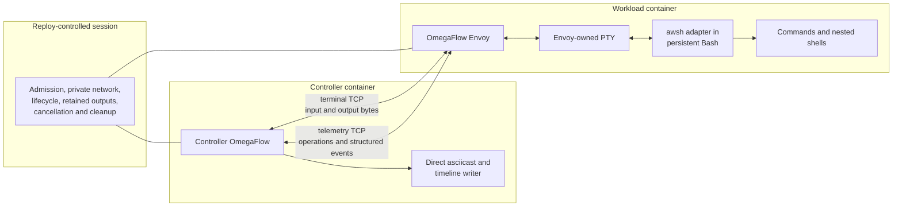
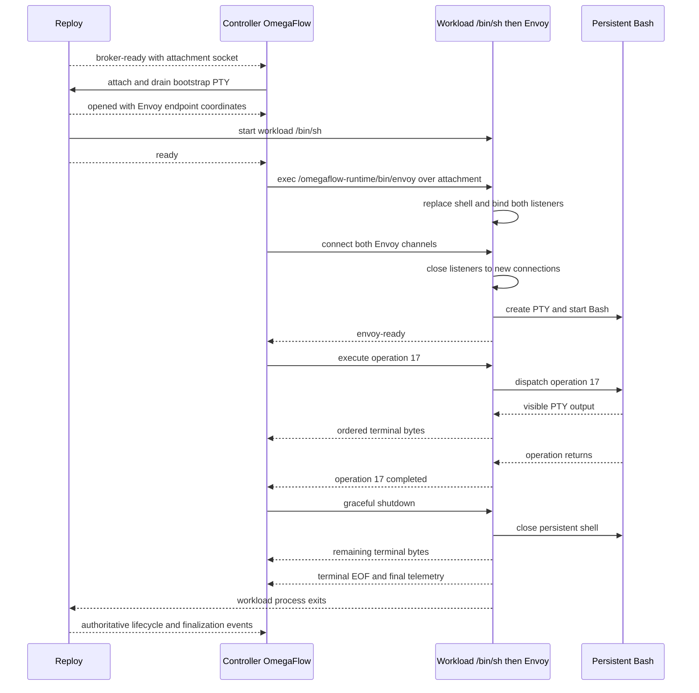

# OmegaFlow Workload Envoy Design

## Status

- Approved direction with an implementation plan; the protocol implementation
  and Bash adapter prototype are complete, and the production Envoy is not
  started
- Updated: 2026-08-16
- Initial scope: one persistent Bash backend for terminal execution and
  structured telemetry in Reploy-backed OmegaFlow recordings

This document is authoritative for the terminal-control, PTY-ownership, and
terminal-to-browser coordination portions of
[Reploy Recording Environments Design](reploy-environments-design.md). It
supersedes that document's Reploy-PTY marker design, but retains its broader
environment, blueprint, lifecycle, artifact, packaging, and migration direction.
It does not replace Reploy controlled sessions or their host-owned lifecycle,
isolation, output-retention, and cleanup guarantees.

The first implementation supports Bash only. Additional top-level shell
backends and a generalized backend plugin framework are deferred. An operation
may still start another shell or interactive program, but OmegaFlow treats that
child as opaque until control returns to the persistent Bash.

### Host recording retention

OmegaFlow retains a host-recording backend for now. It is needed for recordings
that exercise Reploy itself, including Reploy-backed Arbiter flows, until a
complete and appropriately isolated Reploy-nesting model exists. Reploy-backed
workloads remain the intended standard path for ordinary isolated recordings;
delivering that path does not authorize removal of host recording.

The recording-backend UX, names, and defaults require a separate design. A
future host backend may launch the packaged Envoy and `awsh` on the host and
reuse the same terminal and telemetry contracts as the Reploy workload path.
The current FIFO-backed host runner remains supported until such a prototype
proves behavioral parity and a separate migration is approved.

A later topology may run the capture controller in a Reploy-managed environment
while connecting to a thin host Envoy, keeping capture and media dependencies
off the host. Secure launch, endpoint access, lifecycle ownership, and Reploy
nesting for that topology are intentionally left for future design.

## Problem

OmegaFlow is not only a terminal recorder. It must coordinate planned terminal
operations with browser actions, checks, output ranges, diagnostics, and media
production.

A PTY carries terminal bytes, not shell semantics. From a generic PTY stream a
controller cannot reliably determine that a planned command completed, what its
status was, or what directory the persistent shell subsequently uses. Prompt
parsing is fragile, and an in-band completion marker can be produced
accidentally or intentionally by workload output.

Asciinema avoids this problem by observing only the lifetime of its direct
child, normally one persistent shell. It records that shell faithfully but does
not claim to observe individual commands inside it. OmegaFlow needs an
additional semantic boundary for the top-level operations in its recording
plan.

## Architecture

OmegaFlow supplies a small workload-side process named the **OmegaFlow Envoy**.
The Envoy owns the workload PTY and a persistent Bash child. It exposes two
lease-private TCP channels to controller OmegaFlow:

1. A **terminal channel** carries interactive input and exact ordered terminal
   output. Ctrl-C is ordinary terminal input. Resize is requested through the
   telemetry protocol and applied to the Envoy-owned PTY.
2. A **telemetry channel** carries versioned structured operation requests,
   completion events, status, cwd, action gates, and diagnostics.

Terminal bytes are never parsed as telemetry. Reploy transports neither
OmegaFlow protocol and does not interpret shell operations. It supplies the
controller/workload network and the declared endpoint coordinates.



## Why the Envoy Owns the PTY

Making the Envoy the PTY owner gives it one place to:

- stream child output without waiting for command completion;
- relay interactive input without prompt interception;
- apply window-size changes and preserve normal `SIGWINCH` behavior;
- deliver terminal control characters such as Ctrl-C;
- observe persistent-shell exit and drain remaining PTY bytes; and
- keep terminal data separate from structured telemetry.

The first implementation must not add another PTY between the Envoy and Bash.
Bash uses the single Envoy-owned slave PTY as its controlling terminal, and
interactive operations attach their standard streams to that slave. To
preserve the existing non-interactive assertion contract, a split-stream
operation instead gives its evaluated command separate stdout and stderr pipes
owned by the Envoy; this is the same non-TTY shape exposed by the current
presentation-timed runner. The Envoy forwards those pipe bytes to the terminal
channel in observed order while retaining their stream identity as private
assertion evidence. The Envoy otherwise occupies the role that a recorder such
as asciinema normally occupies at the PTY master, with the additional telemetry
channel required by OmegaFlow.

Controller OmegaFlow writes the asciicast and action timeline directly, merging
two ordered sources without another PTY: controller-synthesized presentation
events for the planned prompt and displayed command, and the exact bytes
received on the terminal channel. The prompt and displayed command are not
shell output and the operation source is not typed into Bash. Before sending an
`execute` request, the controller commits the planned prompt, typing-start,
character-timed display, newline, and typing-end events to the cast and
timeline. Only then may the Envoy start the operation and emit terminal output.
After completion, the controller waits for the protocol's output-through
barrier before synthesizing a following prompt. This preserves typing behavior
and makes presentation ordering independent of prompt parsing or PTY echo.

The controller timestamps terminal output at its boundary and records applied
resize events from telemetry. It does not place an `asciinema record` process
or another PTY between the controller and the Envoy. The existing host path may
continue using the bundled asciinema executable while host recording remains
supported, but it is not part of Envoy capture. The controller also retains a
private raw terminal-output byte log as the lossless source for workload-output
byte ranges and diagnostics. Synthesized prompt and command events carry
distinct timeline provenance and never enter that raw log or its byte offsets.
Because asciicast events are UTF-8 JSON text, slice 1 must freeze the incremental
decoding and invalid-byte policy used for the presentation cast; that conversion
never weakens the raw transport or byte-log contract.

The operation's output mode is fixed before `execute`. Terminal bytes always
continue into the private raw log, but the cast writer does not automatically
publish every received byte. It applies the mode to the operation's bounded raw
output range:

- `real` incrementally publishes the decoded terminal events;
- `suppress` publishes none of the raw range; and
- `replace` publishes none of the raw range and, only after the operation's
  `output-through` barrier, commits the configured replacement as a
  controller-presentation event.

The raw range is temporal transport evidence, not general process provenance:
PTY echo and output from preserved background jobs are indistinguishable from
the foreground command's bytes. Output assertions therefore run only in an
exclusive-observation operation selected before `execute`. Such an operation
starts with no surviving writer from an earlier operation and an output-through
drain barrier. It may accept authored controller input only while the Envoy's
slave-termios observation proves kernel echo, including newline echo, is
disabled; inability to prove the echo state fails closed before the input is
written. Echo-free interactive input therefore remains compatible with output
assertions, while terminal-rendered application output remains ordinary
workload output. Failure cancellation and user cancellation invalidate
assertions instead of evaluating partial input and output. Planned recording-end
finalization is a distinct typed lifetime result: the Envoy terminates and
drains the intentionally open operation, closes its output range, and permits
the authored non-exit assertions to run over that complete range. Its synthetic
termination status never satisfies or fails an authored exit-code assertion,
because the operation did not exit naturally. The operation tree terminated by
that compiled lifetime policy is not a surviving-writer violation; any writer
that remains afterward still fails closed. Telemetry `continue` messages and
resize requests are not terminal data input.

Output assertions preserve the current `stdout + stderr` compatibility view;
they do not reinterpret the temporal presentation stream as that view. For a
split-stream operation, the Envoy retains bounded stdout and stderr evidence
separately while forwarding both to the terminal channel, and the controller
concatenates logical stdout followed by logical stderr for
`output_contains`/`output_regex`. For a PTY-attached interactive operation,
stdout and stderr intentionally share the slave exactly as in the current
realtime runner, so its exact post-line-discipline PTY range is logical stdout
and logical stderr is empty. Stream identity is never guessed from merged PTY
bytes, and pre-line-discipline bytes are never reconstructed from polled termios
state. A PTY-attached assertion therefore matches the same CRLF conversion and
other terminal transformations visible to the current realtime runner. The raw
log, assertion input, and published cast retain those exact bytes. Split-stream
evidence bypasses the terminal line discipline and preserves newline-sensitive
stdout-then-stderr checks.

`suppress` and `replace` always use exclusive observation. A checked `real`
operation uses it as well. The Bash job table is not the authority for this
boundary because `disown` and daemonization can hide surviving descendants.
The Linux Envoy supervises operation-created processes as a subreaper, retains
pidfd identities, and performs a `/proc` census for descendants that remain in
the PTY session or retain the PTY slave. If an exclusive operation leaves any
such potential writer, the Envoy terminates it, drains its remaining bytes
under the same private output policy, and fails the operation before accepting
another `execute`; inability to prove the writer set empty or to terminate and
drain it fails the session. This census is correctness evidence within the
documented same-identity threat boundary, not security evidence.

Unchecked `real` operations may preserve supervised background writers, but
their raw ranges are explicitly shared and cannot satisfy operation-level
output assertions. A later exclusive operation is rejected until the supervised
writer set is empty and the Envoy has crossed a fresh output-through drain
barrier, so late real output cannot enter its checked range. Produced-output
metadata, diagnostics, and private failure evidence may retain shared ranges
only with that provenance limitation. None of these consumers reclassifies
suppressed workload bytes as cast or timeline events.

Filesystem expectations do not use terminal output or controller filesystem
access. The controller includes bounded `file_exists` and `produces` inspection
specifications in the operation request. After the command returns and before
the terminal result is committed, `awsh` resolves their configured paths in the
persistent Bash's resulting cwd and exported environment, then sends the
resolved inspection plan to the Envoy over its private descriptor. The Envoy
performs bounded workload-side existence and file-type checks and computes the
specified file or deterministic directory SHA-256 without sending file contents
over telemetry. It returns typed inspection results containing the producer and
output IDs, resolved path, kind, and digest. A resolution, inspection, or hash
failure produces a typed operation failure. Controller OmegaFlow records these
results and never launches probe commands, reads workload paths, or parses PTY
bytes as filesystem evidence.

The Envoy and `awsh` are separate roles even though OmegaFlow distributes them
together. The Envoy owns networking, framing, the PTY master, byte ordering,
resize, cancellation, draining, and process supervision. `awsh` runs in the
persistent Bash and supplies the shell-semantic boundary: sequential operation
execution, status, resulting cwd, and preservation of Bash-local state. Removing
the Envoy would require `awsh` to assume those network and PTY-supervision
responsibilities, which would make it the Envoy under another name.

## Envoy and Persistent Bash

The Envoy starts one Bash process and keeps it for the recording. Top-level
operations therefore share the shell's directory, environment, functions,
aliases, and options.

The controller submits planned operations through the telemetry channel. The
Envoy's Bash adapter executes them sequentially and reports their structured
result through an internal control path that is distinct from the PTY.
PTY-attached operations write both visible streams through the slave;
split-stream operations write to separate Envoy pipes whose bytes are forwarded
to the terminal channel in observed order.

The initial contract covers only operations submitted by OmegaFlow. If an
operation starts Fish, Zsh, Python, a TUI, or another interactive program, that
program is one opaque operation. The terminal remains fully interactive, but
OmegaFlow does not claim command-level telemetry from inside the nested
program. The outer operation completes when control returns to Bash.

The design does not require prompt parsing. Prompts are presentation output,
not protocol boundaries.

### Initial Bash adapter (`awsh`)

A special-purpose shell layer does not need to be a shell implementation or a
fork of Bash. The initial adapter is a small driver running inside one normal
persistent Bash:

- the Envoy gives Bash the PTY slave as its controlling terminal and standard
  input; PTY-attached operations also use it for output and error, while
  split-stream operations use separate Envoy-owned output pipes;
- a POSIX `sh` entrypoint replaces itself with one Bash running a fixed
  OmegaFlow driver;
- that Bash-resident driver reads framed top-level operations from a private
  request file descriptor;
- the driver evaluates each operation in that same Bash process, so directory,
  environment, functions, aliases, options, and jobs remain shell-local state;
- commands and nested interactive programs continue to use the PTY; and
- the driver reports operation state, status, resulting directory, and
  completion through a separate result file descriptor.

An external wrapper that starts a new Bash for every operation cannot preserve
shell-local state. A wrapper that treats a persistent Bash as an opaque PTY
cannot reliably determine operation completion. Some cooperation inside Bash is
therefore necessary unless OmegaFlow adopts a modified shell with native hooks.

The thin driver is an orchestration mechanism for cooperative workloads, not a
security boundary. Operation text can alter Bash state and may interfere with
the driver or its descriptors. The production contract must bound framing,
protect control-plane behavior where practical, and define what happens when an
operation exits or replaces Bash; it cannot turn same-identity shell telemetry
into security evidence.

The bounded experiment for this adapter is named **`awsh`** (the "awful
shell") and lives in [`prototype/awsh`](prototype/awsh/README.md). Its portable
entrypoint is POSIX `sh` and replaces itself with an explicitly selected Bash;
the stateful driver necessarily runs inside that Bash. The prototype establishes
persistent state and supported background-job state, streaming PTY output,
interactive PTY input, structured status and cwd, action gates and gated
cancellation, terminal/telemetry separation, Ctrl-C survival, resize and
`SIGWINCH`, curses and nested interactive Bash behavior, ordinary child
descriptor non-inheritance, partial `exit`/`exec` results, and clean shutdown.
It remains outside the production package until the Envoy, runtime, controller,
failure, and Reploy integration slices pass.

The POSIX entrypoint is a portable bootstrap, not a promise that arbitrary
operations have POSIX-shell semantics. Initial operation source is Bash source.
Supporting Zsh, Fish, or another top-level shell later requires a separately
tested resident adapter and is not part of this plan.

## Trust Boundary

The Envoy design is intended for OmegaFlow recording workloads that cooperate
with OmegaFlow's operation protocol. Its separation of terminal and telemetry
traffic prevents accidental output collisions and prevents terminal text from
being accepted as a protocol message.

The initial Envoy and Bash run under the same non-root Reploy workload identity.
The Envoy binds and accepts the controller connections before starting workload
code, closes its listeners after accepting the single controller, and retains
the connected TCP sockets itself. It creates a distinct internal request/result
pair for `awsh` and passes only those dedicated descriptors into Bash. The TCP
sockets and other Envoy-private descriptors are close-on-exec. The production
adapter must also prevent ordinary commands from accidentally inheriting the
internal driver descriptors. These measures prevent accidental inheritance;
they do not isolate the Envoy from hostile processes running under the same
identity.

The production Envoy starts a fixed Bash executable with a controlled launch
environment. It must neutralize shell startup and option injection such as
`BASH_ENV`, `ENV`, `SHELLOPTS`, and `BASHOPTS`, and it must not honor the
prototype-only `AWSH_BASH` override. Application environment required by
planned operations is delegated explicitly after this control-plane baseline is
established. Slice 1 freezes the exact filtering and delegation contract.

All OmegaFlow-supplied workload executables, scripts, helpers, and their manifest
are mounted read-only and executable at `/omegaflow-runtime`. This prevents the
workload from replacing their on-disk bytes but does not protect the live Bash
state, the Envoy process, or same-identity IPC from deliberate interference.

A future privilege-separated mode may run the Envoy as root and Bash as a
configured non-root workload identity. Current Reploy application containers
provide one runtime identity with empty capability sets and
`no-new-privileges`, so that mode requires a new Reploy contract and is deferred.
The same missing supervisor/workload identity boundary also affects Flux.

Neither the initial same-identity model nor a future privilege-separated model
makes shell-originated telemetry security evidence. OmegaFlow telemetry controls
recording sequencing; it cannot grant Reploy capabilities, select host
resources, establish successful Reploy termination, or override Reploy's
authoritative lifecycle result.

For generic or more adversarial workloads, Reploy's existing host-owned PTY is
the stronger model: the controller drives the workload without relying on an
in-container terminal proxy. That capability remains useful independently of
OmegaFlow's richer Envoy protocol.

## Reploy Boundary

OmegaFlow continues to use `reploy controlled-session run` for:

- exact controller and workload generation admission;
- private controller/workload networking and declared endpoint coordinates;
- container isolation and fixed capabilities;
- controller output retention;
- cancellation, lifecycle observation, cleanup, and crash recovery; and
- the authoritative final host result.

The prepared workload blueprint adds two private Envoy endpoints and the
read-only `/omegaflow-runtime` mount. Controller OmegaFlow obtains their
lease-local coordinates from `opened.endpoints` and connects with a bounded
startup deadline. The Envoy does not accept an arbitrary destination or expose
its listener outside the lease-private network.

Reploy controlled-session v1 starts `/bin/sh` as the workload and requires the
controller to attach to its host-owned PTY. After Reploy reports `ready`,
controller OmegaFlow uses that attachment to execute
`/omegaflow-runtime/bin/envoy`, replacing the bootstrap shell without adding a
Reploy command or transport contract. It keeps draining the Reploy PTY for
bootstrap and Envoy diagnostics while treating the Envoy terminal channel as
the recording stream.

A blueprint command could express Envoy startup in a future design, but the
initial implementation deliberately uses the lower-level controlled-session shell
bootstrap. Making the Reploy terminal capability optional would be a later
simplification, not a prerequisite for implementation.

## Session Sequence



Controller OmegaFlow does not begin recording actions until both Reploy and the
Envoy are ready. On normal shutdown it waits for the Envoy's final telemetry
and terminal EOF before finalizing the cast. Reploy's
`workload-outputs-finalized` event remains authoritative for Reploy-owned output
surfaces; it does not attest delivery of the application-level TCP streams.

If the Envoy crashes or either TCP channel fails, OmegaFlow fails the capture,
retains partial artifacts and diagnostics, and asks Reploy to terminate the
session. A telemetry success can never replace a failed Reploy lifecycle or
cleanup result.

## Protocol Shape

Both protocols are versioned, bounded, and fail closed on malformed or
out-of-state messages.

The terminal channel is binary-safe and preserves byte order. It carries
controller input in one direction and the observed workload output in the
other: PTY bytes for an attached operation, or Envoy-ordered stdout/stderr pipe
bytes for a split-stream operation. It does not carry JSON, lifecycle state,
stream-origin labels, or presentation markers.

The telemetry channel carries typed messages for at least:

- Envoy readiness and negotiated protocol version;
- execute, continue, and cancel operation requests;
- operation started, ready, completed, and failed events;
- operation status and resulting cwd;
- the selected PTY-attached or split-stream execution shape and bounded logical
  stdout/stderr assertion evidence;
- bounded workload filesystem inspection plans and typed `file_exists` and
  produced-output results;
- action gates used to coordinate terminal and browser work;
- resize requests and applied dimensions;
- bounded diagnostics; and
- graceful shutdown and final-drain confirmation.

Exact schemas, limits, ordering rules, and timeout values belong in the first
protocol implementation slice. They must be frozen with golden fixtures before
the full terminal adapter is built.

The Envoy-to-`awsh` protocol is private to the mounted runtime and is not a
third network service. The Envoy translates validated telemetry requests into
bounded operations on the dedicated request descriptor and translates driver
results back into typed telemetry. `awsh` does not parse TCP, authenticate the
controller, own the PTY master, or interpret Reploy lifecycle messages.

### Browser readiness and long-running operations

Browser destinations and readiness conditions are compiled controller inputs.
The controller resolves the selected endpoint ID only through trusted
`opened.endpoints`; workload output cannot replace its scheme, host, port, path,
or readiness policy.

Ordinary terminal-to-browser sequencing waits for structured operation
completion. For a planned browser handoff whose workload operation remains
running, the controller instead:

1. starts the operation and waits for `operation_started` and its output
   barrier;
2. probes the plan-selected granted endpoint until the configured readiness
   condition succeeds or its deadline expires, while racing every probe against
   operation completion, cancellation, and failure;
3. runs the already-planned browser actions while the operation remains alive;
   and
4. ends or retains the operation according to its compiled lifetime policy,
   using normal typed cancellation and output-finalization rules.

Readiness wins only if the successful probe is observed while the same
operation is still active. Any terminal operation result observed first, or at
the success handoff check, fails the handoff; the controller never records
browser actions merely because a stale process already serves the endpoint.

This handoff does not consume controller-local files, OSC markers, terminal
text, or workload-originated navigation telemetry. Generic `awsh` gates remain
available only when the authored operation explicitly calls one for planned
controller work. Dynamic workload-selected navigation is deferred.

## Runtime Mount and Injection

The Envoy and its helpers are OmegaFlow runtime components, not application
dependencies and not part of the project's source tree. Host OmegaFlow stages
the artifacts shipped with its installed release, validates them against a
versioned manifest, and asks Reploy to mount that directory read-only and
executable at `/omegaflow-runtime` in the workload:

```text
/omegaflow-runtime/
├── manifest.json
├── bin/
│   ├── envoy
│   └── awsh
└── libexec/
    └── awsh-driver.bash
```

The mount contains every OmegaFlow-supplied workload executable and script.
The production `awsh` launcher resolves its driver relative to this fixed
`bin`/`libexec` layout rather than relying on a host or project path.
Writable ephemeral state, if needed, belongs under `/run/omegaflow`; project
source, the application working copy, caches, and controller capture outputs use
separate declared locations. Blueprint validation rejects an application mount
that conflicts with `/omegaflow-runtime`.

The selected application blueprint must provide Bash and the configured
non-root workload identity. The Envoy should be a standalone executable so the
workload does not need Python or an OmegaFlow installation. Selecting its
implementation language and reproducible build is part of the first
implementation slice; Go is the leading option, not yet a locked contract.
Distribution and identity materialization remain environment-construction
concerns, not additions to Reploy's controlled-session protocol.

## Implementation Plan

Implementation proceeds through reviewable slices. The existing native runner
remains available for host recording while the backend UX and Reploy nesting
model are unresolved. These slices must keep recording-plan, artifact, and
diagnostic semantics aligned rather than establish divergent capture models.

### 1. Freeze protocols and implementation constraints

- Select the Envoy implementation language and reproducible standalone build.
- Specify bounded, versioned controller-to-Envoy terminal and telemetry
  protocols, including state machines, limits, timeouts, cancellation, resize,
  diagnostics, shutdown, final drain, and output-range ordering.
- Freeze direct asciicast encoding, controller timestamping, resize-event
  recording, raw terminal-byte retention, synthesized prompt/display event
  provenance and ordering, incremental UTF-8 decoding and invalid-byte
  handling, and the rule that Envoy capture introduces no controller-side PTY.
- Specify the private Envoy-to-`awsh` request/result contract and descriptor
  lifecycle, including the fixed Bash executable and sanitized launch
  environment.
- Freeze typed models and golden fixtures before integrating with the terminal
  runner.

Completion gate: protocol fixtures cover valid, fragmented, malformed,
out-of-state, oversized, cancelled, and prematurely closed exchanges, and the
standalone Envoy build choice is recorded.

### 2. Complete the Bash adapter prototype

- Keep one Bash process and preserve directory, environment, functions,
  aliases, options, and supported job state across operations.
- Add resize and `SIGWINCH`, curses, one nested interactive program, cancellation,
  driver-descriptor non-inheritance, shell exit/`exec`, and partial-result tests.
- Define the supported cooperative boundary for operation code that changes
  traps, descriptors, or shell control state.

Completion gate: the backend-neutral Bash conformance suite passes without
prompt parsing, controller-local FIFOs, or in-band telemetry markers.

### 3. Implement the Envoy

- Accept one lease-private terminal connection and one telemetry connection,
  then close both listeners to additional clients.
- Create one PTY, start `/omegaflow-runtime/bin/awsh`, and supervise the
  persistent Bash and its process group.
- Relay exact terminal input/output, apply resize, coordinate Ctrl-C and
  cancellation, translate typed operations/results, and preserve bounded
  diagnostics.
- For split-stream operations, supervise separate stdout/stderr pipes, forward
  their chunks to the terminal channel in observed order, and retain their
  bounded logical streams without guessing origin from presentation bytes.
- Order operation completion against PTY output, drain remaining bytes at
  shutdown, and report shell, channel, and Envoy failures distinctly.

Completion gate: local Envoy/`awsh` integration passes streaming, interactive,
resize, interruption, output-range, orderly shutdown, and injected-failure
tests.

### 4. Materialize the workload runtime

- Package every workload-side artifact and its hashes with OmegaFlow.
- Stage the exact installed release into a fresh runtime directory and mount it
  read-only and executable at `/omegaflow-runtime`.
- Require Bash, reserve the mount point, declare the two Envoy endpoints, and
  keep writable state outside the runtime mount.
- Support a task-specific application blueprint; multi-shell and all-shell
  blueprint generation are deferred.

Completion gate: a clean prepared workload starts only the validated mounted
artifacts, cannot modify them, and needs no Python or OmegaFlow installation.

### 5. Integrate the controller and terminal runner

- Add strict OmegaFlow-owned models for the Envoy protocols and reuse Reploy's
  public controlled-session host, client, endpoint, attachment, output, and
  diagnostic contracts.
- Start and drain the Reploy bootstrap attachment, execute the mounted Envoy,
  connect both declared endpoints, and enforce readiness deadlines.
- Implement an Envoy-backed `PersistentTerminalRunner` boundary preserving
  typing timing, Ctrl-C, resize, setup, cleanup, checks, expectations,
  replacement output, status, cwd, action gates, output ranges, and diagnostics.
- Preserve the current assertion input contract: split non-interactive output
  into bounded logical stdout/stderr evidence, treat exact merged
  post-line-discipline interactive PTY output as logical stdout with empty
  stderr, and evaluate patterns against logical `stdout + stderr` rather than
  temporal presentation order.
- Resolve `file_exists` and `produces` paths in persistent Bash state, perform
  bounded existence/type/hash inspection in the Envoy, and return typed results
  without workload-path access or PTY probing from the controller.
- Retain the exact private terminal-output byte log and write asciicast and
  timeline artifacts by merging separately identified controller presentation
  events with terminal and telemetry events, without starting `asciinema
  record` or another controller-side PTY.
- Apply `real`, `suppress`, and `replace` to the bounded operation output range;
  prove that suppressed bytes remain private and replacement presentation is
  committed only after the output-through barrier.
- Keep split-stream logical evidence and PTY-attached raw assertion ranges
  private; do not normalize the raw log or cast or infer pre-line-discipline
  bytes from termios observations.
- Distinguish planned recording-end finalization from failure/user cancellation:
  terminate and drain the open operation, then evaluate its non-exit assertions
  over the closed range without interpreting the synthetic termination status
  as a natural exit code.
- Carry exclusive-versus-shared observation in the controller/Envoy/`awsh`
  execution boundary. Run output assertions only in exclusive observation,
  accept controller input there only with Envoy-observed terminal echo disabled,
  and require an empty supervised PTY-writer set plus a fresh output-through
  drain barrier before its checked range starts.
- Make `suppress`, `replace`, and checked `real` operations fail closed after
  terminating and draining any surviving PTY writer they create, including
  disowned or daemonized descendants. Permit supervised writers only for
  unchecked `real` operations, whose shared ranges cannot satisfy later
  assertions.

Completion gate: applicable single-pane terminal contract tests pass through
the Envoy adapter, including forged terminal content, fragmentation, early
exit, cancellation, and partial output.

### 6. Integrate browser coordination and artifacts

- Resolve browser and Envoy destinations only from trusted `opened.endpoints`.
- Preserve terminal/browser joins, readiness gates, screenshots, pointer state,
  and presentation ordering. For a long-running workload operation, determine
  readiness by probing the plan-selected granted endpoint from the controller,
  not from workload files, OSC markers, terminal parsing, or new browser-specific
  telemetry.
- Race endpoint readiness against the typed operation result and proceed only
  when readiness wins while that operation is still active.
- Finalize casts, timelines, browser media, narration, diagnostics, and the
  publication candidate before sending Reploy `complete`.
- Retain partial artifacts and structured causes on recorder, media, channel,
  controller, or workload failure.

Completion gate: one terminal pane and one browser pane complete a real ordered
recording, while endpoint substitution and forced artifact failures fail closed
with retained evidence.

### 7. Prove the Reploy lifecycle end to end

- Run through the public `reploy controlled-session run` command and controller
  client without a private Reploy bridge.
- Retain `terminated` before acknowledgement, preserve the exact host result and
  stderr, and never let Envoy telemetry override Reploy lifecycle truth.
- Exercise startup failure, workload and Envoy crashes, channel loss,
  cancellation, output-finalization failure, acknowledgement failure, cleanup
  failure, and recovery reporting.
- Repeat nominal runs to expose attachment, drain, and teardown races.

Completion gate: the Linux conformance run retains correct artifacts and
diagnostics across the success and failure matrix, and all Reploy resources are
accounted for after teardown.

### 8. Package, document, and establish cutover readiness

- Verify that installing OmegaFlow installs compatible Reploy support and that
  Docker is the only normal external host dependency.
- Document the runtime mount, Bash requirement, blueprint endpoints, trust
  boundary, diagnostics, and failure recovery.
- Compare representative recordings through the native and Envoy paths and
  produce cutover evidence. Do not remove the native host path in this slice.

Completion gate: release packaging and documented examples pass from a clean
host, representative comparison evidence is retained, and the standard Reploy
path is ready for ordinary recordings. Host recording remains supported until
Reploy nesting covers recordings of Reploy and Reploy-backed tools; any later
native-path replacement or removal is a separate approved change.

## Cross-slice Acceptance Validation

Before replacing the native terminal runner, a bounded prototype must prove:

1. persistent Bash state across multiple operations;
2. continuous byte-for-byte terminal transport and private raw-output
   retention while a command runs, with synthesized prompt and command events
   ordered separately in the presentation timeline;
3. `real`, `suppress`, and `replace` presentation over the same retained raw
   output range, including output-through ordering for replacement events;
4. exclusive checked ranges that accept echo-disabled interactive input but
   exclude kernel echo and late output from supervised PTY writers, plus
   fail-closed cleanup of writers created by `suppress`, `replace`, or checked
   `real` operations, including disowned and daemonized descendants;
5. typed workload-side `file_exists` and produced-output path, kind, and digest
   results with no controller filesystem access or PTY-parsed probes;
6. newline-sensitive `stdout + stderr` assertions for split-stream operations,
   plus PTY-attached assertions over the exact post-line-discipline CRLF and
   other terminal bytes treated as logical stdout;
7. interactive input, Ctrl-C, resize, and `SIGWINCH` behavior;
8. curses applications and one nested interactive shell;
9. separation of terminal output from telemetry messages;
10. the same-identity threat boundary and non-inheritance of Envoy sockets and
   private descriptors;
11. ordered terminal drain and EOF during graceful shutdown;
12. useful partial diagnostics after Envoy, shell, channel, and controller
   failures; and
13. planned recording-end finalization that drains an intentionally open
    operation and validates its non-exit assertions, while failure/user
    cancellation invalidates assertions; and
14. end-to-end Reploy termination, acknowledgement, retained output, and
    cleanup.

The implementation must also record the deferred Reploy capability needed for a
future privileged Envoy/non-root workload split. These checks do not by
themselves authorize replacement of the local FIFO-backed
`PersistentTerminalRunner`. A host-Envoy prototype must first prove applicable
parity, and replacement remains a separately approved change.

## Decisions and Deferrals

1. The Envoy owns the recording PTY and the two application-level TCP channels;
   Reploy continues to own admission, isolation, lifecycle truth, retained
   controller outputs, cancellation, and cleanup.
2. `awsh` is the Bash-resident semantic adapter, not the network or PTY
   supervisor.
3. The first implementation supports Bash only. Other top-level shells and a
   generalized backend framework are deferred.
4. All OmegaFlow-supplied workload artifacts enter through the version-matched,
   read-only, executable `/omegaflow-runtime` mount.
5. The initial Envoy and Bash use the same non-root workload identity. A
   privileged Envoy/non-root workload split waits for a Reploy identity
   contract.
6. Terminal bytes never carry telemetry, and shell-originated telemetry never
   overrides Reploy lifecycle or security decisions.
7. The exact protocol schemas, limits, timeout values, output-ordering barrier,
   direct-cast rules, controlled Bash launch environment, and Envoy
   implementation language are resolved and frozen in slice 1 rather than left
   implicit in the terminal adapter.
8. Controller OmegaFlow writes Envoy captures directly in asciicast format; the
   Envoy path merges provenance-marked controller presentation events with
   terminal output, retains the exact private raw workload output separately,
   and does not add an `asciinema record` process or controller-side PTY.
9. Host recording remains supported pending a Reploy-nesting solution and
   explicit backend migration approval.
