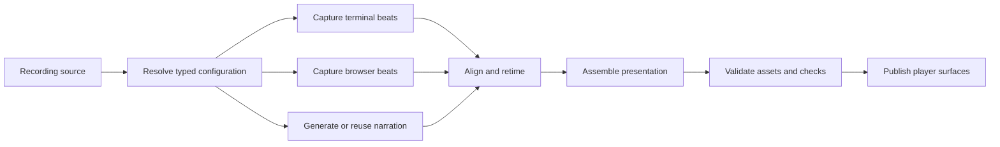

# How OmegaFlow Works

OmegaFlow is a workflow-to-video build system. It does not record an arbitrary
desktop screen. Instead, a recording source describes semantic terminal and
browser work that OmegaFlow can capture, check, synchronize, and rebuild.

## The authoring model

- A **project** contains OmegaFlow settings and one recording workspace.
- A **video** is the published result of one recording source.
- A **scene** gives the video its overall visual context.
- A **beat** is a recorded unit in the video. A beat can use a terminal or
  browser medium and does not have to contain narration.
- An **action** causes something to happen. A **check** proves that the
  expected result actually occurred.

Narration takes can span multiple beats. Multi-pane beats can coordinate
several terminal or browser streams on one global presentation timeline.

## Build, reuse, and publish

Like a compiler, OmegaFlow resolves the authored source into intermediate
captures, narration, timing, and presentation assets. Unchanged intermediates
can be reused while changed inputs are rebuilt.

`build` produces requested output, `watch` serves a stable successful build
while source changes trigger new builds, and `check` verifies generated output
without mutating it. A collection is a shortcut for building and reviewing
several related videos; it is not one combined video.

## Presentation time and realtime

**Presentation time** represents scriptable events that OmegaFlow may schedule
around narration. **Realtime** preserves an interval's internal motion and
audio. OmegaFlow can place a realtime interval on the presentation timeline,
but cannot stretch, compress, or reorder the activity inside it.

Narration anchors name spoken moments. Action joins wait for events in another
stream; authored narration waits pause speech for asynchronous work. These are
coordination tools, not substitutes for reliable completion checks.

## Source and generated state

Commit recording sources, support files, and intentionally published website
assets. Keep runs, caches, browser profiles, and secrets out of version
control. The [recording-file reference](/reference/recording-files/) and
[output reference](/reference/output/) define those boundaries precisely.
