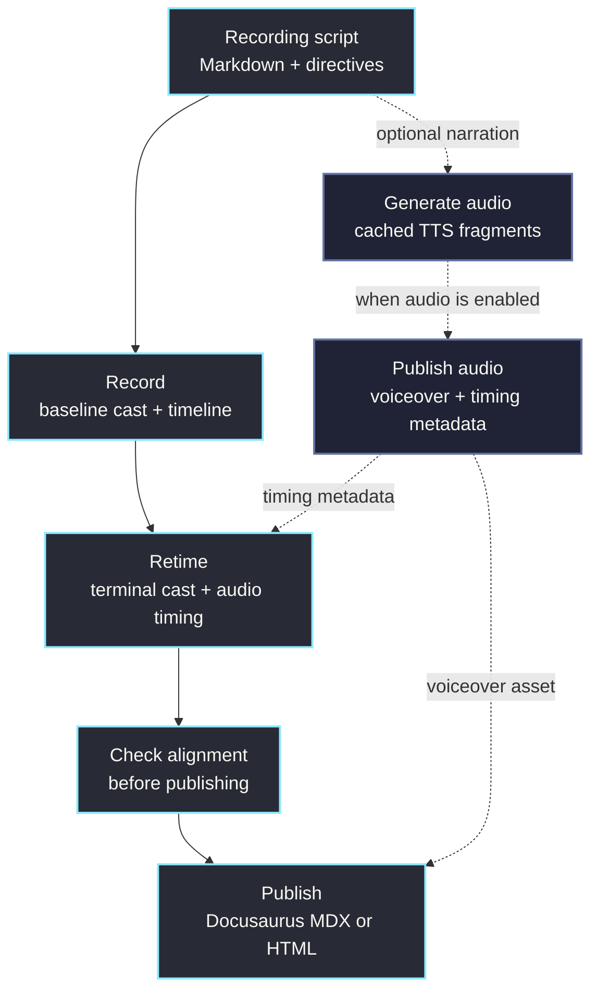

# OmegaFlow Studio

OmegaFlow Studio is the authoring tool and CLI for scripted terminal and video
flows.

The current package is `omegaflow-studio`, and it installs a `studio` command.
The CLI composes recording configuration with Hydra, runs scripted terminal
actions, stores per-run artifacts, retimes casts for human playback, manages
optional narration audio, and publishes website-ready outputs.

## Recording scripts

Recording scripts are Markdown files with `studio-directive` YAML blocks. The
Markdown keeps the human-readable walkthrough close to the machine-readable
instructions that build it.

A recording can define:

- capture settings such as terminal size and headless mode
- beats with captions, narration, commands, and guide text
- output paths for casts, audio, and metadata
- publish surfaces such as Docusaurus MDX or standalone HTML
- retiming rules for typing speed and pauses
- environment variables used while recording

## Build pipeline

Audio steps are skipped when `audio.enabled: false`. Build reuses fresh
artifacts when it can; use `action=check` separately to validate recording,
audio, retiming, and alignment freshness.

## Repository

The source lives at [github.com/omry/omegaflow](https://github.com/omry/omegaflow).
