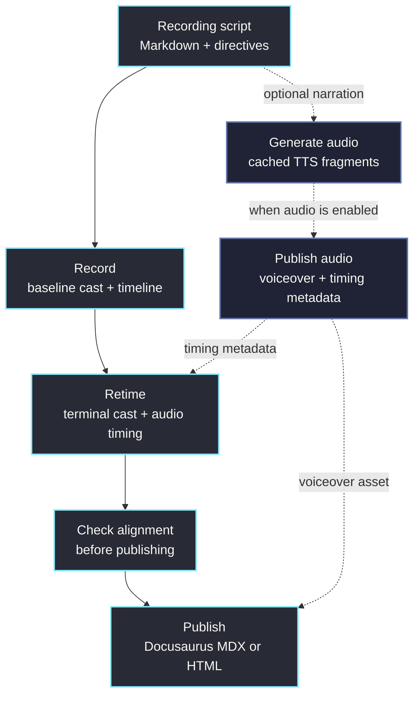

# OmegaFlow CLI

OmegaFlow is the authoring tool and CLI for scripted terminal and video
flows.

The current package is `omegaflow`, and it installs an `omegaflow` command.
The CLI composes recording configuration with [Hydra](https://hydra.cc/), runs
scripted terminal actions, stores per-run artifacts, retimes casts for human
playback, manages optional narration audio, and publishes website-ready outputs.

## Command shape

Most commands select a recording and an action:

```bash
omegaflow recording=quickstart-demo
omegaflow recording=quickstart-demo action=watch
omegaflow recording=quickstart-demo rec.capture.headless=false
```

When `action` is omitted, OmegaFlow builds the selected recording.

## Tool functions

| Action | Use it for |
| --- | --- |
| `bootstrap` | Create `.omegaflow/config.yaml`, a recording workspace, shared recording defaults, and a small quickstart recording. |
| `list` | Show available recording ids. |
| `build` | Record, generate audio when enabled, retime, check alignment, and publish configured surfaces. |
| `check` | Validate whether the current recording inputs and generated outputs are fresh. |
| `clean` | Remove generated artifacts for a recording. |
| `watch` | Start a local browser player for the generated recording. |
| `play` | Replay the terminal cast in the terminal. |
| `runs` | List preserved runs for a recording. |
| `inspect` | Open a postmortem shell for troubleshooting a preserved run. |
| `output` | Show captured failure output for troubleshooting. |

Use `dry_run=true` to preview build work without running commands. For
bootstrap, `dry_run=true` lists generated files and `dry_run=diff` shows the
generated output as a diff.

## Tool config

OmegaFlow has tool config and recording config. Tool config controls the CLI:
which recording directory to use, where generated run state lives, how `.env`
is loaded, and which one-off recording overrides are applied.

### Local config

Project-local tool config lives here:

```text
.omegaflow/
  config.yaml
```

Typical project config:

```yaml
studio:
  recording_dir: recordings
  data_dir: recordings/.omegaflow
```

Use the file for project defaults that should be shared by everyone working in
the repository. Use CLI overrides for one-off changes:

```bash
omegaflow action=list studio.recording_dir=demos
omegaflow recording=hello rec.capture.headless=false
```

Most installations use OmegaFlow's bundled recorder, falling back to
`asciinema` on `PATH`. Set `studio.asciinema_path` only when a project needs a
specific asciinema 3.x binary:

```yaml
studio:
  asciinema_path: /opt/asciinema/bin/asciinema
```

### Config fields

Common tool fields:

| Field | Purpose |
| --- | --- |
| `recording` | Selected recording id, such as `quickstart-demo` or `tutorial/install`. |
| `action` | Tool function to run. Defaults to `build`. |
| `studio.recording_dir` | Workspace containing `config.yaml` and one directory per recording. |
| `studio.data_dir` | Generated run state, caches, and local outputs. |
| `studio.asciinema_path` | Optional explicit asciinema 3.x binary path. OmegaFlow otherwise uses its bundled recorder when present, then `PATH`. |
| `load_env_file` / `env_file` | Load process-level environment values before running actions. |
| `rec` | Temporary recording config overrides merged after recording frontmatter. |
| `script_params` | Values for parameters declared by a recording. |

See [OmegaFlow Configuration](./configuration.md) for tool config details and
[Recording Configuration](./recording-files/config.md) for recording
frontmatter, workspace defaults, and `rec.*` overrides.

## Recording scripts

Recording scripts are Markdown files with `studio-directive` YAML blocks. The
Markdown keeps the human-readable walkthrough close to the machine-readable
instructions that build it.

See [Recording Files](./recording-files/overview.md) for the frontmatter and
`studio-directive` schema.

A recording can define:

- capture settings such as terminal size and headless mode
- beats with captions, narration, commands, and guide text
- output paths for casts, audio, and metadata
- publish surfaces such as Docusaurus MDX or standalone HTML
- retiming rules for typing speed and pauses
- environment variables used while recording

## Build pipeline



Audio steps are skipped when `audio.enabled: false`. Build reuses fresh
artifacts when it can; use `action=check` separately to validate recording,
audio, retiming, and alignment freshness.

## Repository

The source lives at [github.com/omry/omegaflow](https://github.com/omry/omegaflow).
