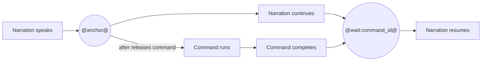

# Beat

A beat is one narrated section of a recording. It can describe what the viewer
is seeing, operate either a terminal or browser, run checks, and provide guide
text.

```yaml
beat:
  id: install
  heading: Install OmegaFlow
  narration: Install the package and confirm the omegaflow command is available.
```

## Fields

| Field | Type | Notes |
| --- | --- | --- |
| `id` | string | Unique beat id. |
| `medium` | `terminal` or `browser` | Renderer and action vocabulary for this beat. Defaults to `terminal`. |
| `heading` | string | Section heading and narration label. |
| `narration` | string | Spoken narration text. Supports markers such as `@anchor@` and `@wait:command_id+1s@`. |
| `narration_take` | string | Optional take id shared by adjacent beats. When omitted, this beat receives an implicit singleton take. |
| `marker` | string | Optional UI marker id. |
| `caption` | string | Text printed visibly in the terminal recording. |
| `viewer_hold` | number | Extra viewer pause after the beat. |
| `pointer` | mapping | Browser-beat override for pointer visibility. Use `visible: false` to hide the cursor for the whole beat. |
| `actions` | list | Commands to record. |
| `checks` | list | Commands that validate the result. |
| `effects` | list | Narration-synchronized terminal presentation effects. |
| `guide` | mapping | Guided-mode summary, commands, and success hint. |

## Synchronizing Narration And Commands

The mental model is:

- **`after: "@anchor@"`: the command waits for narration.** The command starts
  when narration reaches the named anchor.
- **`@wait:command_id@`: narration waits for the command.** Narration resumes
  after the command with that `id` finishes.

This synchronization is applied during the processing stage. OmegaFlow first
captures the command session and obtains the narration timing, then uses the
markers to construct the final presentation timeline. The recorded shell does
not wait for live narration while commands are being captured.

Think of narration and commands as two concurrent timelines with two
synchronization points:



Use both directions when narration introduces a command, the command runs for
an unpredictable amount of time, and narration should discuss the result only
after it is ready.

### The Command Waits For Narration: Anchors And `after`

An anchor such as `@install@` identifies a point in the processed narration
timeline. A command with `after: "@install@"` appears to start when playback
reaches that anchor:

```yaml
narration: First, @install@ install the package.
actions:
- commands:
  - id: install_command
    run: python -m pip install omegaflow
    after: "@install@"
```

The anchor name is local timing vocabulary chosen by the recording author. The
command `id` is separate: it identifies the command in the presentation so
other timing directives can refer to its completion.

Quote anchor values used in YAML. `after: "@install@"` is valid, while the
unquoted `after: @install@` is not a valid YAML scalar.

### Narration Waits For The Command: `@wait:...@`

A wait marker points in the opposite direction. It pauses the narration
timeline at the marker until the command with the referenced `id` has finished:

```yaml
narration: >-
  First, @install@ install the package.
  @wait:install_command@ Now inspect the result.
```

Here, `@wait:install_command@` prevents “Now inspect the result” from being
spoken while `install_command` is still running. This is completion-based
synchronization, so it remains correct when command duration varies between
recordings or machines.

Add an optional gap when the result needs a little time to settle visually:

```text
@wait:build+250ms@
@wait:build+1s@
@wait:build+1.5s@
```

The gap guarantees a minimum pause between command completion and narration
continuing. Supported units are milliseconds (`ms`) and seconds (`s`). Without
a gap, narration may resume as soon as the command completes.

### Complete Example

This beat starts the command from narration, then waits for that same command
before continuing:

```yaml
beat:
  id: install
  heading: Install OmegaFlow
  narration: >-
    First, @install@ install the package.
    @wait:install_command+300ms@ Now the command is ready.
  actions:
  - commands:
    - id: install_command
      run: python -m pip install omegaflow
      after: "@install@"
```

Anchor and wait markers are timing instructions, not spoken content. OmegaFlow
removes them before generating narration audio. Timing markers require
`audio.enabled: true`.

## Actions And Checks

### Terminal beats

Actions and checks can run a single inline command:

```yaml
actions:
- run: printf 'hello\n'
  display: printf 'hello\n'
```

Or a script file, resolved relative to the video directory:

```yaml
actions:
- run_file: scripts/hello.sh
  display: bash scripts/hello.sh
```

For multi-command actions, use `commands`:

```yaml
actions:
- commands:
  - id: prepare_output
    run: mkdir -p build
  - id: write_output
    run: printf 'hello\n' > build/message.txt
  expect:
    file_exists:
    - build/message.txt
```

Step fields:

| Field | Type | Notes |
| --- | --- | --- |
| `run` | string | Inline shell command. |
| `run_file` | string | Shell script file to read and execute. |
| `display` | string | Command text shown in the terminal. |
| `name` | string | Check/setup/cleanup label. |
| `after` | string | Anchor syntax such as `@server@`. |
| `progress` | list | Progress labels for visible command chunks. |
| `output` | string or mapping | Show real output, suppress it, or replace it with configured text. |
| `expect` | mapping | Exit code, output, regex, or file-existence expectations. |
| `commands` | list | Command entries for one action. |

Command entries also accept `id`, `show_prompt_after`, `timing`, and pre/post
command pause fields.

Command output is buffered until the command finishes by default. Set
`timing: realtime` to run the command in a pseudo-terminal and preserve its live
output timing and terminal-state updates. Use realtime timing for progress bars
and terminal interfaces that redraw in place. Output replacement and suppression
remain non-streaming.

#### Hand a browser URL to the next beat

Use `browser_handoff: true` when a real, blocking OmegaFlow command opens its
managed browser and the immediately following browser beat should take control.
OmegaFlow keeps the command running, captures its real output, opens the
reported URL in the recorder-owned browser, and releases the command after that
browser beat ends. The current handoff integration is supported by OmegaFlow's
managed `action=watch` browser launch; it does not intercept arbitrary system
browser commands.

```yaml
- id: watch
  actions:
  - commands:
    - id: watch_command
      run: omegaflow recording=demo action=watch
      browser_handoff: true
      timing: realtime
      show_prompt_after: false
- id: inspect-player
  medium: browser
  actions:
  - id: open-player
    open_page:
      handoff: watch_command
      display_url: https://app.example.com/player
```

The handoff command must have an explicit `id`, use real output, and be the
last command in its terminal beat. Its browser consumer must be the next beat,
with a matching `open_page.handoff` as the first action.

Set `display_url: $handoff` only when the exact captured URL is safe to publish.
For authentication and other token-bearing URLs, use a static, sanitized
`display_url` as shown above. The display URL changes only the browser chrome;
the recorder still navigates to the handed-off URL.

### Highlight terminal text during narration

Use a terminal highlight effect to draw attention to an exact piece of text
already visible in the terminal. Its `start` and `end` values reference local
narration anchors, so the highlight follows the spoken words when narration is
regenerated or retimed.

```yaml
narration: >-
  The command creates the @settings_start@ project settings,
  @settings_end@ then continues.
effects:
- highlight:
    text: .omegaflow/config.yaml
    start: "@settings_start@"
    end: "@settings_end@"
```

`text` is matched literally against complete terminal lines. Set the optional,
one-based `occurrence` when the same text appears more than once. Highlights
are valid only on terminal beats and require `audio.enabled: true` because
their timing comes from narration timestamps.

### Browser beats

Browser actions operate one persistent Playwright page shared by every browser
beat in the recording. Terminal and browser beats also share the same process
environment, so a terminal beat can start a local server that a later browser
beat visits.

Hide the mouse cursor in a browser beat that does not demonstrate a pointer
action. The override applies for the whole beat; later beats return to their own
override or the recording-wide `presentation.browser.pointer.visible` default.

```yaml
- id: inspect-result
  medium: browser
  pointer:
    visible: false
```

Browser beats inherit their window and browser chrome from the recording's
`presentation.browser` defaults. Override either mode on a beat when its
captured viewport should appear without one or both decorations:

```yaml
- id: full-application-view
  medium: browser
  window:
    mode: none
  chrome:
    mode: hidden
```

Window mode is `none` or `framed`. Chrome mode is `hidden`, `minimal`, or
`full`. The recording-level window theme and title continue to apply when a
beat changes only the window mode.

```yaml
- id: create-project
  medium: browser
  heading: Create a project
  narration: >-
    @open@ Open the application, then @name@ enter a project name.
    @wait:project_ready+300ms@ The project is ready.
  guide:
    success_hint: The new project appears in the project list.
  actions:
  - id: open
    open_page:
      url: /projects
      display_url: https://app.example.com/projects
      ready:
        visible: {role: heading, name: Projects}
  - id: new-project
    click:
      target: {role: button, name: New project}
  - id: name
    fill:
      target: {label: Project name}
      text: OmegaFlow demo
  - id: submit
    press:
      key: Enter
      target: {label: Project name}
  - id: project_ready
    wait_for:
      visible: {text: OmegaFlow demo}
  checks:
  - name: project was created
    visible: {text: OmegaFlow demo}
```

Each action has an `id` and exactly one operation:

| Operation | Purpose |
| --- | --- |
| `open_page` | Navigate, optionally show loading, and wait for a readiness boundary. |
| `click` | Click a semantic target. |
| `move_pointer` | Move the pointer to viewport-relative coordinates or a normalized position within a semantic target. |
| `set_pointer` | Show or hide the recorded pointer without moving it. |
| `fill` | Set a field efficiently; this is the default for text entry. |
| `type_keys` | Fall back to physical key events when a site rejects fill or paste. |
| `press` | Send a key or shortcut, optionally to a target. |
| `scroll` | Scroll the page, a target, or a container. |
| `wait_for` | Synchronize with a visible, hidden, URL, or network-response condition. |

`fill` and `type_keys` produce the same terminal typing visualization. Their
difference affects capture semantics, not playback pacing.

Use `move_pointer.viewport` for a stable location relative to the browser
viewport. Both coordinates are normalized from `0` to `1`:

```yaml
- id: point-near-top
  move_pointer:
    viewport: {x: 0.4, y: 0.12}
```

Use `move_pointer.target` to resolve one visible DOM element. It moves to the
center by default:

```yaml
- id: point-at-submit
  move_pointer:
    target: {role: button, name: Submit}
```

Add normalized `position` coordinates to choose a point within that element;
`{x: 0, y: 0}` is its top-left and `{x: 1, y: 1}` is its bottom-right:

```yaml
- id: point-inside-timeline-section
  move_pointer:
    target: {test_id: timeline-section}
    position: {x: 0.5, y: 0.5}
```

Pointer moves use the same deterministic motion as the movement before a
click. The common action fields `after`, `hold_before_ms`, and `hold_after_ms`
can synchronize the move with narration, pause before it starts, and keep the
pointer at its destination.

Use `set_pointer` when the pointer should appear only for a specific part of a
browser beat:

```yaml
- id: show-pointer
  set_pointer: {visible: true}
- id: point-at-submit
  move_pointer:
    target: {role: button, name: Submit}
- id: hide-pointer
  set_pointer: {visible: false}
```

`hold_before_ms` and `hold_after_ms` are presentation timing: they do not slow
down browser capture or require recapturing the page. A changed hold recompiles
the presentation from the existing capture.

Prefer targets based on `role` and `name`, `label`, `placeholder`, `text`, or
`test_id`. CSS and XPath are available as best-effort escape hatches and emit a
non-blocking portability warning. Checks validate the real browser state during
capture but are not published as presentation events.

`open_page` waits for `DOMContentLoaded` by default. Use `ready` when the page
has an application-specific readiness condition. `loading: show` includes the
loading stage in the presentation; the default `hide` starts the visible action
at the ready state. `display_url` changes only the safe URL shown in browser
chrome and never changes navigation.

Actions use short automatic transitions by default. Set
`transition: captured` when the recorded browser motion itself should remain in
the video. On a `wait_for` action, the captured segment continues until the
authored condition succeeds. Automatic dynamic segments retain a three-second
safety limit, including any final-frame alignment. Explicit captured segments
use the action's timeout for the authored condition, then may retain additional
video through the rendered frame where that condition completed.
All captured segments remain subject to the encoded-size limit.

### Narration takes across beats

Omitting `narration_take` keeps the common case local to one beat. Give adjacent
beats the same explicit id when a sentence or paragraph should flow naturally
across their boundary:

```yaml
- id: introduce
  narration_take: project-creation
  narration: First, open the project list,
- id: create
  medium: browser
  narration_take: project-creation
  narration: then create a new project.
```

OmegaFlow derives all implicit singleton takes before checking that each take
is contiguous. Reordering beats covered by a multi-beat take is allowed but
emits a non-blocking review warning because the narration may need rewriting.

## Controlling Visible Command Output

Real command output is the default and should be preferred. Use `output` when
the raw terminal output would distract from the recording:

- `real` shows the command's actual stdout and stderr.
- `suppress` runs the command without showing its output.
- `output.replace` runs the command but replaces its visible output with the
  configured text.

Replacement output is useful for uncommon cases where real output is noisy,
unstable, or contains irrelevant machine-specific detail. Use it sparingly: the
replacement must not claim a result that OmegaFlow did not actually verify.
Pair it with an expectation that validates the real result, and explain the
substitution in a nearby source comment.

```yaml
actions:
- run: ./scripts/build-package.sh
  display: ./scripts/build-package.sh
  output:
    replace: |
      Built dist/example.whl
  expect:
    file_exists:
    - dist/example.whl
```

Here the real build runs and the file expectation proves that it produced the
artifact. Only the verbose build log is replaced with a concise line for the
viewer.

## Guide

`guide` adds prompts to the player. Use `summary` to author the checkpoint's
main instruction and `success_hint` to describe the expected result or next
step. Terminal beats can also provide commands to copy; browser beats cannot.

```yaml
guide:
  summary: Build the recording before continuing.
  commands:
  - omegaflow recording=hello
  success_hint: The build writes video assets and publish surfaces.
```

Set `presentation.guided: true` in recording configuration to start the player
in guided mode. The player pauses at each guided checkpoint before the next
beat is rendered. Viewers can turn guided mode off for later checkpoints; the
checkpoint already on screen remains until they continue or restart it.

### Highlight a player control

Use `player.highlight` to draw attention to one toolbar control while its beat
is playing. `start` and optional `end` reference narration anchors, so the cue
stays synchronized if the narration is regenerated. Without `end`, the cue
lasts through the end of the beat.

```yaml
narration: >-
  This video runs in @guided_start@ guided mode. @guided_end@
player:
  highlight:
    control: guided
    start: "@guided_start@"
    end: "@guided_end@"
```

Supported controls are `previous`, `play`, `restart`, `next`, `guided`, `speed`,
and `mute`. Clicking the highlighted control dismisses its cue, and moving to
the next beat clears it. Player highlights require `audio.enabled: true`
because their timing comes from narration timestamps.

## Schema

This schema block is generated from `src/omegaflow/studio_config.py`
during the website build.

<details>
<summary>Beat schema</summary>

<!-- recording-beat-schema:start -->

```python
@dataclass
class RecordingExpectationConfig:
    exit_code: int = 0
    output_contains: list[str] = field(default_factory=list)
    output_regex: list[str] = field(default_factory=list)
    file_exists: list[str] = field(default_factory=list)


@dataclass
class RecordingInvocationConfig:
    run: str | None = None
    run_file: str | None = None
    display: str | None = None
    after: str | None = None
    output: str | dict[str, str] | None = None
    expect: RecordingExpectationConfig = field(
        default_factory=RecordingExpectationConfig
    )


@dataclass
class RecordingCommandConfig(RecordingInvocationConfig):
    id: str | None = None
    browser_handoff: bool = False
    show_prompt_after: bool = True
    timing: str = "presentation"
    pre_command_pause: float | None = None
    pre_enter_pause: float | None = None
    post_enter_pause: float | None = None
    post_command_pause: float | None = None


@dataclass
class RecordingStepConfig(RecordingInvocationConfig):
    name: str | None = None
    progress: list[str] = field(default_factory=list)
    commands: list[RecordingCommandConfig] | None = None


@dataclass
class BrowserTargetConfig:
    role: str | None = None
    name: str | None = None
    label: str | None = None
    placeholder: str | None = None
    text: str | None = None
    test_id: str | None = None
    css: str | None = None
    xpath: str | None = None
    exact: bool = False


@dataclass
class BrowserUrlMatcherConfig:
    equals: str | None = None
    contains: str | None = None
    matches: str | None = None


@dataclass
class BrowserResponseMatcherConfig(BrowserUrlMatcherConfig):
    method: str | None = None
    status: int | None = None


@dataclass
class BrowserStateMatcherConfig:
    visible: BrowserTargetConfig | None = None
    hidden: BrowserTargetConfig | None = None
    url: BrowserUrlMatcherConfig | None = None
    response: BrowserResponseMatcherConfig | None = None


@dataclass
class BrowserConditionConfig(BrowserStateMatcherConfig):
    timeout_ms: int | None = None


@dataclass
class BrowserOpenPageConfig:
    url: str | None = None
    handoff: str | None = None
    display_url: str | None = None
    lifecycle: str = "domcontentloaded"
    ready: BrowserConditionConfig | None = None
    loading: str = "hide"
    timeout_ms: int | None = None


@dataclass
class BrowserClickConfig:
    target: BrowserTargetConfig = field(default_factory=BrowserTargetConfig)
    button: str = "left"
    position: str | dict[str, float] = "center"


@dataclass
class BrowserViewportPointConfig:
    x: float = 0.5
    y: float = 0.5


@dataclass
class BrowserMovePointerConfig:
    viewport: BrowserViewportPointConfig | None = None
    target: BrowserTargetConfig | None = None
    position: BrowserViewportPointConfig | None = None


@dataclass
class BrowserSecretConfig:
    env: str = ""
    presentation: str = "masked"
    placeholder: str | None = None


@dataclass
class BrowserFillConfig:
    target: BrowserTargetConfig = field(default_factory=BrowserTargetConfig)
    text: str | None = None
    secret: BrowserSecretConfig | None = None


@dataclass
class BrowserTypeKeysConfig(BrowserFillConfig):
    capture_delay_ms: int | None = None


@dataclass
class BrowserPressConfig:
    key: str = ""
    target: BrowserTargetConfig | None = None


@dataclass
class BrowserScrollOffsetConfig:
    x: int = 0
    y: int = 0


@dataclass
class BrowserScrollConfig:
    target: BrowserTargetConfig | None = None
    by: BrowserScrollOffsetConfig | None = None
    to: BrowserScrollOffsetConfig | None = None
    container: BrowserTargetConfig | None = None


@dataclass
class BrowserWaitForConfig(BrowserConditionConfig):
    pass


@dataclass
class BrowserActionConfig:
    id: str = ""
    open_page: BrowserOpenPageConfig | None = None
    click: BrowserClickConfig | None = None
    move_pointer: BrowserMovePointerConfig | None = None
    set_pointer: BrowserSetPointerConfig | None = None
    fill: BrowserFillConfig | None = None
    type_keys: BrowserTypeKeysConfig | None = None
    press: BrowserPressConfig | None = None
    scroll: BrowserScrollConfig | None = None
    wait_for: BrowserWaitForConfig | None = None
    after: str | None = None
    hold_before_ms: int | None = None
    hold_after_ms: int | None = None
    transition: str | None = None
    display_url_after: str | None = None


@dataclass
class BrowserTextCheckConfig(BrowserUrlMatcherConfig):
    target: BrowserTargetConfig = field(default_factory=BrowserTargetConfig)


@dataclass
class BrowserCountCheckConfig:
    target: BrowserTargetConfig = field(default_factory=BrowserTargetConfig)
    equals: int | None = None


@dataclass
class BrowserCheckConfig(BrowserStateMatcherConfig):
    name: str = ""
    text: BrowserTextCheckConfig | None = None
    value: BrowserTextCheckConfig | None = None
    count: BrowserCountCheckConfig | None = None


@dataclass
class RecordingActionConfig(RecordingStepConfig):
    """Structured YAML envelope for terminal and browser actions."""

    id: str = ""
    open_page: BrowserOpenPageConfig | None = None
    click: BrowserClickConfig | None = None
    move_pointer: BrowserMovePointerConfig | None = None
    set_pointer: BrowserSetPointerConfig | None = None
    fill: BrowserFillConfig | None = None
    type_keys: BrowserTypeKeysConfig | None = None
    press: BrowserPressConfig | None = None
    scroll: BrowserScrollConfig | None = None
    wait_for: BrowserWaitForConfig | None = None
    hold_before_ms: int | None = None
    hold_after_ms: int | None = None
    transition: str | None = None
    display_url_after: str | None = None


@dataclass
class RecordingCheckConfig(RecordingStepConfig):
    """Structured YAML envelope for terminal and browser checks."""

    url: BrowserUrlMatcherConfig | None = None
    visible: BrowserTargetConfig | None = None
    hidden: BrowserTargetConfig | None = None
    text: BrowserTextCheckConfig | None = None
    value: BrowserTextCheckConfig | None = None
    count: BrowserCountCheckConfig | None = None
    response: BrowserResponseMatcherConfig | None = None


@dataclass
class RecordingGuideConfig:
    commands: list[str] = field(default_factory=list)
    summary: str | None = None
    success_hint: str | None = None


@dataclass
class TerminalTextHighlightConfig:
    text: str = ""
    start: str = ""
    end: str = ""
    occurrence: int = 1


@dataclass
class TerminalEffectConfig:
    """Typed envelope for presentation effects on terminal beats."""

    highlight: TerminalTextHighlightConfig | None = None


@dataclass
class RecordingBeatConfig:
    id: str = ""
    medium: RecordingMedium = RecordingMedium.terminal
    heading: str = ""
    narration: str = ""
    narration_take: str | None = None
    marker: str | None = None
    caption: str | None = None
    viewer_hold: float | None = None
    pointer: BrowserPointerPresentationConfig | None = None
    window: BrowserWindowModeConfig | None = None
    chrome: BrowserChromePresentationConfig | None = None
    player: BeatPlayerConfig | None = None
    actions: list[RecordingActionConfig] = field(default_factory=list)
    checks: list[RecordingCheckConfig] = field(default_factory=list)
    effects: list[TerminalEffectConfig] = field(default_factory=list)
    guide: RecordingGuideConfig | None = None
```

<!-- recording-beat-schema:end -->

</details>
