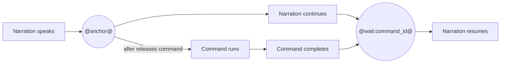

# Beat

A beat is one narrated section of a recording. It can describe what the viewer
is seeing, run terminal actions, run checks, and provide guided-mode prompts.

```yaml
beat:
  id: install
  heading: Install OmegaFlow
  narration: Install the package and confirm the omegaflow command is available.
```

## Fields

| Field | Type | Notes |
| --- | --- | --- |
| `id` | string | Unique beat id. |
| `heading` | string | Section heading and narration label. |
| `narration` | string | Spoken narration text. Supports markers such as `@anchor@` and `@wait:command_id+1s@`. |
| `marker` | string | Optional UI marker id. |
| `caption` | string | Text printed visibly in the terminal recording. |
| `viewer_hold` | number | Extra viewer pause after the beat. |
| `actions` | list | Commands to record. |
| `checks` | list | Commands that validate the result. |
| `guide` | mapping | Guided-mode commands and success hint. |

## Synchronizing Narration And Commands

The mental model is:

- **`after: "@anchor@"`: the command waits for narration.** The command starts
  when narration reaches the named anchor.
- **`@wait:command_id@`: narration waits for the command.** Narration resumes
  after the command with that `id` finishes.

This synchronization is applied during the processing stage. OmegaFlow first
captures the command session and obtains the narration timing, then uses the
markers to construct the final presentation timeline. The recorded shell does
not wait for live narration while commands are being captured.

Think of narration and commands as two concurrent timelines with two
synchronization points:



Use both directions when narration introduces a command, the command runs for
an unpredictable amount of time, and narration should discuss the result only
after it is ready.

### The Command Waits For Narration: Anchors And `after`

An anchor such as `@install@` identifies a point in the processed narration
timeline. A command with `after: "@install@"` appears to start when playback
reaches that anchor:

```yaml
narration: First, @install@ install the package.
actions:
- commands:
  - id: install_command
    run: python -m pip install omegaflow
    after: "@install@"
```

The anchor name is local timing vocabulary chosen by the recording author. The
command `id` is separate: it identifies the command in the presentation so
other timing directives can refer to its completion.

Quote anchor values used in YAML. `after: "@install@"` is valid, while the
unquoted `after: @install@` is not a valid YAML scalar.

### Narration Waits For The Command: `@wait:...@`

A wait marker points in the opposite direction. It pauses the narration
timeline at the marker until the command with the referenced `id` has finished:

```yaml
narration: >-
  First, @install@ install the package.
  @wait:install_command@ Now inspect the result.
```

Here, `@wait:install_command@` prevents “Now inspect the result” from being
spoken while `install_command` is still running. This is completion-based
synchronization, so it remains correct when command duration varies between
recordings or machines.

Add an optional gap when the result needs a little time to settle visually:

```text
@wait:build+250ms@
@wait:build+1s@
@wait:build+1.5s@
```

The gap guarantees a minimum pause between command completion and narration
continuing. Supported units are milliseconds (`ms`) and seconds (`s`). Without
a gap, narration may resume as soon as the command completes.

### Complete Example

This beat starts the command from narration, then waits for that same command
before continuing:

```yaml
beat:
  id: install
  heading: Install OmegaFlow
  narration: >-
    First, @install@ install the package.
    @wait:install_command+300ms@ Now the command is ready.
  actions:
  - commands:
    - id: install_command
      run: python -m pip install omegaflow
      after: "@install@"
```

Anchor and wait markers are timing instructions, not spoken content. OmegaFlow
removes them before generating narration audio. Timing markers require
`audio.enabled: true`.

## Actions And Checks

Actions and checks can run a single inline command:

```yaml
actions:
- run: printf 'hello\n'
  display: printf 'hello\n'
```

Or a script file, resolved relative to the video directory:

```yaml
actions:
- run_file: scripts/hello.sh
  display: bash scripts/hello.sh
```

For multi-command actions, use `commands`:

```yaml
actions:
- commands:
  - id: prepare_output
    run: mkdir -p build
  - id: write_output
    run: printf 'hello\n' > build/message.txt
  expect:
    file_exists:
    - build/message.txt
```

Step fields:

| Field | Type | Notes |
| --- | --- | --- |
| `run` | string | Inline shell command. |
| `run_file` | string | Shell script file to read and execute. |
| `display` | string | Command text shown in the terminal. |
| `name` | string | Check/setup/cleanup label. |
| `after` | string | Anchor syntax such as `@server@`. |
| `progress` | list | Progress labels for visible command chunks. |
| `output` | string or mapping | Show real output, suppress it, or replace it with configured text. |
| `expect` | mapping | Exit code, output, regex, or file-existence expectations. |
| `commands` | list | Command entries for one action. |

Command entries also accept `id`, `follow_along`, `show_prompt_after`,
`timing`, and pre/post command pause fields.

## Controlling Visible Command Output

Real command output is the default and should be preferred. Use `output` when
the raw terminal output would distract from the recording:

- `real` shows the command's actual stdout and stderr.
- `suppress` runs the command without showing its output.
- `output.replace` runs the command but replaces its visible output with the
  configured text.

Replacement output is useful for uncommon cases where real output is noisy,
unstable, or contains irrelevant machine-specific detail. Use it sparingly: the
replacement must not claim a result that OmegaFlow did not actually verify.
Pair it with an expectation that validates the real result, and explain the
substitution in a nearby source comment.

```yaml
actions:
- run: ./scripts/build-package.sh
  display: ./scripts/build-package.sh
  output:
    replace: |
      Built dist/example.whl
  expect:
    file_exists:
    - dist/example.whl
```

Here the real build runs and the file expectation proves that it produced the
artifact. Only the verbose build log is replaced with a concise line for the
viewer.

## Guide

`guide` adds guided-mode prompts to the player:

```yaml
guide:
  commands:
  - omegaflow recording=hello
  success_hint: The build writes video assets and publish surfaces.
```

## Schema

This schema block is generated from `src/omegaflow/studio_config.py`
during the website build.

<details>
<summary>Beat schema</summary>

<!-- recording-beat-schema:start -->

```python
@dataclass
class RecordingCommandConfig:
    id: str | None = None
    run: str | None = None
    run_file: str | None = None
    display: str | None = None
    after: str | None = None
    follow_along: bool = False
    show_prompt_after: bool = True
    output: Any = None
    expect: dict[str, Any] = field(default_factory=dict)
    timing: str = "presentation"
    pre_command_pause: float | None = None
    pre_enter_pause: float | None = None
    post_enter_pause: float | None = None
    post_command_pause: float | None = None


@dataclass
class RecordingStepConfig:
    run: str | None = None
    run_file: str | None = None
    display: str | None = None
    name: str | None = None
    after: str | None = None
    progress: list[str] = field(default_factory=list)
    output: Any = None
    expect: dict[str, Any] = field(default_factory=dict)
    commands: list[RecordingCommandConfig] | None = None


@dataclass
class BrowserTargetConfig:
    role: str | None = None
    name: str | None = None
    label: str | None = None
    placeholder: str | None = None
    text: str | None = None
    test_id: str | None = None
    css: str | None = None
    xpath: str | None = None
    exact: bool = False


@dataclass
class BrowserUrlMatcherConfig:
    equals: str | None = None
    contains: str | None = None
    matches: str | None = None


@dataclass
class BrowserResponseMatcherConfig(BrowserUrlMatcherConfig):
    method: str | None = None
    status: int | None = None


@dataclass
class BrowserConditionConfig:
    visible: BrowserTargetConfig | None = None
    hidden: BrowserTargetConfig | None = None
    url: BrowserUrlMatcherConfig | None = None
    response: BrowserResponseMatcherConfig | None = None
    timeout_ms: int | None = None


@dataclass
class BrowserOpenPageConfig:
    url: str = ""
    display_url: str | None = None
    lifecycle: str = "domcontentloaded"
    ready: BrowserConditionConfig | None = None
    loading: str = "hide"
    timeout_ms: int | None = None


@dataclass
class BrowserClickConfig:
    target: BrowserTargetConfig = field(default_factory=BrowserTargetConfig)
    button: str = "left"
    position: str | dict[str, float] = "center"


@dataclass
class BrowserSecretConfig:
    env: str = ""
    presentation: str = "masked"
    placeholder: str | None = None


@dataclass
class BrowserFillConfig:
    target: BrowserTargetConfig = field(default_factory=BrowserTargetConfig)
    text: str | None = None
    secret: BrowserSecretConfig | None = None


@dataclass
class BrowserTypeKeysConfig(BrowserFillConfig):
    capture_delay_ms: int | None = None


@dataclass
class BrowserPressConfig:
    key: str = ""
    target: BrowserTargetConfig | None = None


@dataclass
class BrowserScrollOffsetConfig:
    x: int = 0
    y: int = 0


@dataclass
class BrowserScrollConfig:
    target: BrowserTargetConfig | None = None
    by: BrowserScrollOffsetConfig | None = None
    to: BrowserScrollOffsetConfig | None = None
    container: BrowserTargetConfig | None = None


@dataclass
class BrowserWaitForConfig(BrowserConditionConfig):
    pass


@dataclass
class BrowserActionConfig:
    id: str = ""
    open_page: BrowserOpenPageConfig | None = None
    click: BrowserClickConfig | None = None
    fill: BrowserFillConfig | None = None
    type_keys: BrowserTypeKeysConfig | None = None
    press: BrowserPressConfig | None = None
    scroll: BrowserScrollConfig | None = None
    wait_for: BrowserWaitForConfig | None = None
    after: str | None = None
    hold_after_ms: int | None = None
    transition: str | None = None
    display_url_after: str | None = None


@dataclass
class BrowserTextCheckConfig(BrowserUrlMatcherConfig):
    target: BrowserTargetConfig = field(default_factory=BrowserTargetConfig)


@dataclass
class BrowserCountCheckConfig:
    target: BrowserTargetConfig = field(default_factory=BrowserTargetConfig)
    equals: int | None = None


@dataclass
class BrowserCheckConfig:
    name: str = ""
    url: BrowserUrlMatcherConfig | None = None
    visible: BrowserTargetConfig | None = None
    hidden: BrowserTargetConfig | None = None
    text: BrowserTextCheckConfig | None = None
    value: BrowserTextCheckConfig | None = None
    count: BrowserCountCheckConfig | None = None
    response: BrowserResponseMatcherConfig | None = None


@dataclass
class RecordingGuideConfig:
    commands: list[str] = field(default_factory=list)
    success_hint: str | None = None


@dataclass
class RecordingBeatConfig:
    id: str = ""
    medium: RecordingMedium = RecordingMedium.terminal
    heading: str = ""
    narration: str = ""
    narration_take: str | None = None
    marker: str | None = None
    caption: str | None = None
    viewer_hold: float | None = None
    actions: list[Any] = field(default_factory=list)
    checks: list[Any] = field(default_factory=list)
    guide: RecordingGuideConfig | None = None
```

<!-- recording-beat-schema:end -->

</details>
